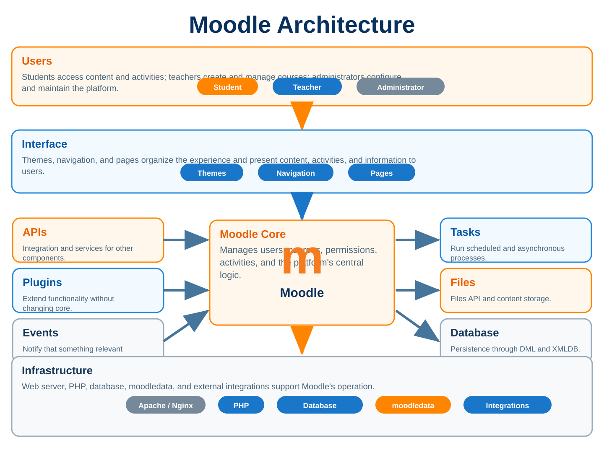

# 1 MOODLE ARCHITECTURE



Before creating a plugin, changing a page, or trying to understand why something works on your Moodle and breaks on a client's Moodle, it is worth understanding the path the system follows before it delivers a finished page to the browser. It may sound basic, after all we are talking about a PHP application, but this is exactly where many strange solutions begin, such as including a file manually because a class "did not load", querying a table directly because it seemed faster, placing arbitrary configuration inside `$CFG`, or creating an endpoint that works without a context and without checking who is accessing it.

Let's start with a common URL such as `https://lms.example.com/mod/forum/view.php?id=42`. When you type that into the browser, Moodle has not received anything yet, `$DB` does not exist, `$USER` has not been loaded, and there is not even a guarantee that PHP will be executed, because a web server first has to decide what to do with that request. From that point onward we will follow execution all the way to the final HTML and, along the way, understand where `config.php`, `lib/setup.php`, `$CFG`, the globals, contexts, Moodledata, the component system, autoloading, and the Routing Engine in modern Moodle versions fit in.

The goal of this chapter is not to memorize a directory tree, because you can solve that with `find`, an IDE search, or by looking at the code. The goal is to understand why each thing exists where it does. Once that map becomes clear, reading core stops feeling like twenty years of PHP archaeology and starts making a great deal of sense, including the older parts that still coexist with modern APIs.

## 1.1 How a request reaches Moodle

Open `https://lms.example.com/mod/forum/view.php?id=42` in a browser. The first reaction of someone who is just getting started is often to imagine that Moodle receives that URL, finds forum id 42, and builds the page, but there is an important step before that, because Apache, Nginx, or another web server configured for that domain is what receives the connection.

The server examines the requested host, the path `/mod/forum/view.php`, URL rewriting rules, the PHP configuration, and the directory configured as the public root. If the path points to an executable PHP file, the request normally goes to PHP-FPM or an equivalent handler, and only then does the script begin to run. This explains a fair number of problems that look like Moodle problems but are not, such as a `404` before any code executes, a PHP file being downloaded instead of executed, a server-generated `403`, a wrong `DocumentRoot`, or `rewrite` rules that send the request to the wrong place.

When PHP finally starts executing `mod/forum/view.php`, we still only have plain PHP. The script needs to load the Moodle environment, which is why practically every traditional endpoint begins by reaching `config.php`. That file starts the sequence that prepares the database, cache, session, user, components, autoloading, and the structures Moodle APIs expect to find ready.

An important practical rule already appears here. If a page in your plugin uses `$DB`, `get_string()`, `require_login()`, `moodle_url`, or any core class before including `config.php`, the page is reversing the natural order of things. You may be able to invent a workaround that works in a particular scenario, but you will be trying to use Moodle before initializing Moodle, and that usually ends in code that is difficult to maintain.

Modern versions also include the Routing Engine, so not every URL has to point directly to an existing PHP file. A route may be resolved by the routing mechanism and end in a controller class, while traditional endpoints continue to work for compatibility and because a very large part of core still uses that model. For quite some time you will find both styles in the same Moodle and need to know how to read both without assuming that one has completely replaced the other.

## 1.2 `config.php` and environment initialization

If you copy the Moodle code to two different machines, the set of files can be exactly the same while each installation still points to a different database, domain, and Moodledata. The file that connects generic application code to a concrete installation is `config.php`.

It contains information Moodle needs too early to retrieve from its own database, such as the DBMS type, host, database name, username, password, table prefix, `$CFG->wwwroot`, and `$CFG->dataroot`. It may also contain infrastructure settings, proxy configuration, specific paths, cache configuration, and other options that must be available before the application can load the rest of its persisted configuration.

This is different from normal administrative settings. When you change something in Site administration, many of those options go to the `config` or `config_plugins` tables and are then loaded by the bootstrap, while `config.php` remains reserved primarily for what must exist before that database access or for settings an administrator wants to pin at the infrastructure level. Putting every functional setting there because "it is easier" works against Moodle's architecture and makes maintenance, migration, and even support across different environments harder.

Near the end of the file is the point that really puts Moodle in motion, because `config.php` leads into the central setup. You should not copy that process into your plugin or manually include ten core libraries to build a "smaller bootstrap", because Moodle has an initialization order and several APIs assume that order has been respected.

Starting with Moodle 5.1 there is also an important physical difference between the installation root and the part published by the web server. `config.php` can live outside the `public/` directory while the `DocumentRoot` points to `public/`. This improves the separation between internal code and web-accessible content, but it also breaks a huge amount of old tutorial material that simply told people to drop the entire Moodle directory into `public_html` and call it a day.

## 1.3 Understanding `$CFG`

Once Moodle is initialized, you start finding `$CFG` everywhere in the code, and it is easy to conclude that it is merely the object created by `config.php`. Not quite. `config.php` begins populating `$CFG`, but the initialization process adds calculated information and loads persisted global configuration, so the object you use during a page request already represents a much more complete view of the environment.

It is common to access properties such as `$CFG->wwwroot`, `$CFG->dirroot`, `$CFG->dataroot`, `$CFG->libdir`, and many global options. Older code also contains many direct accesses to properties configured in the database because that was the standard pattern for years, but in modern plugin code you should prefer `get_config()` when dealing with your own component's configuration. That makes the origin of the value explicit and avoids turning `$CFG` into a bag where everyone throws something.

That bag is a frequent temptation. You have global `$CFG` almost everywhere, need to share a value between two pieces of code, and think "I'll put `$CFG->myvalue` here". Don't. The object belongs to core, names may gain meaning in the future, and whoever later finds that property will assume it came from official Moodle configuration when it was actually created by some plugin in the middle of a request.

Another point that deserves attention after the reorganization that started in Moodle 5.1 is the difference between the installation root and the public directory. There is a new reference to the real installation root, while `$CFG->dirroot` continues to represent the Moodle code root relevant to traditional execution. Do not reconstruct these paths using `dirname(dirname(...))` because "it always worked". When core exposes the correct path, use the correct path and allow the physical structure to evolve without forcing your plugin to guess where Moodle was installed.

## 1.4 What happens in `lib/setup.php`

If you open `lib/setup.php` for the first time and try to read it top to bottom as if it were a small controller, you will probably give up early, and reasonably so, because that file is part of the heart of the bootstrap and carries decisions accumulated over many years of Moodle development. At first, the important thing is not to memorize every line but to understand what you receive after it finishes.

During this process Moodle prepares essential libraries, configures error handling, registers autoloaders, initializes the database layer, prepares cache, session, and user state, loads the required configuration, and creates the environment in which the rest of the APIs become reliable. In other words, before the bootstrap you are in PHP, and after it you are inside Moodle.

The difference is easy to see with a simple test. Create an empty PHP script outside the normal flow and try to execute `$DB->get_record(...)`. There is no `$DB`. Try calling `get_string()`. The function may not even be available. Include `config.php` correctly and the situation changes because setup built the environment in which those structures make sense.

Versions with the new directory organization also include a compatibility layer to preserve old paths during the transition. That is an internal core detail and precisely why it should not become a plugin responsibility. Your code should enter through `config.php` or through the APIs intended for that type of execution and let Moodle take care of its own initialization.

A tip that saves time when investigating bootstrap problems is to use the IDE to follow the `require` starting from `config.php` and observe the point at which a particular global or constant begins to exist. This is much more productive than adding `require_once` calls until an error disappears, because making the error go away does not mean the application was initialized correctly.

## 1.5 The `$DB`, `$PAGE`, `$OUTPUT`, `$USER`, and `$COURSE` globals

Modern Moodle uses classes, namespaces, dependency injection in some areas, and an increasing number of services, but it still lives with several very important globals, and pretending they do not exist simply because "globals are ugly" does not help. The better approach is to understand the role of each one and avoid using them as though they were interchangeable.

```php
$DB is the main gateway to the DML API, so queries, inserts, updates, and deletes go through it rather than through a PDO connection created by the plugin. $USER represents the current user already loaded for that execution, while $COURSE represents the current course known by the page and is not necessarily the course you imagined merely because you received a courseid parameter.
$PAGE stores the state of the page being prepared. It contains the canonical URL, context, layout, title, heading, course module, course, JavaScript requirements, and other information the renderer and theme need in order to build the response correctly. $OUTPUT, in turn, is the main renderer associated with the current page and theme, so this is where you find header(), footer(), notifications, and core output methods.
```

A classic mistake is to treat these globals as generic storage. You load a course and overwrite `$COURSE` just to make something easier three lines later, modify a property on `$USER` without persisting it correctly, or use `$OUTPUT` before preparing `$PAGE`. That kind of shortcut works until it meets a more complex page, a different theme, or an AJAX call that does not follow exactly the same flow.

Use globals for what they represent and, when writing domain classes, services, or testable code, prefer to receive dependencies and data explicitly whenever possible. The fact that a global is accessible does not mean every class should depend on it.

## 1.6 The lifecycle of a Moodle page

A traditional Moodle page normally follows a sequence you will recognize after looking at half a dozen core files. First comes `config.php`, then parameters are read, required records are loaded, access is validated, `$PAGE` is configured, and only then does output begin.

Imagine a page in the `local_example` plugin that genuinely belongs to a course. A reasonable flow would be to load the environment, obtain `courseid` with `required_param()`, load the course through the appropriate API, execute `require_login($course)`, set the URL, title, and heading, and only then call `$OUTPUT->header()`. Notice that when it receives the course, `require_login()` does more than authenticate: it also prepares `$PAGE` to work with that course. For that reason we do not need to immediately repeat `$PAGE->set_context(context_course::instance(...))` merely to arrive at the same context that the flow itself already established.

If you call the header before deciding that the user does not have access, for example, you may end up trying to redirect or throw an exception after part of the response has already been sent. If you configure the wrong URL, pagination, navigation, redirects, and forms may carry an incorrect reference to the page. If you forget the context, capabilities and other components may operate on a different assumption from yours.

A minimal structure often looks like this:

```php
require_once(__DIR__ . '/../../config.php');

$courseid = required_param('courseid', PARAM_INT);
$course = get_course($courseid);

require_login($course);

$context = context_course::instance($course->id);
$PAGE->set_url(new moodle_url('/local/example/index.php', ['courseid' => $course->id]));
$PAGE->set_title(get_string('pluginname', 'local_example'));
$PAGE->set_heading($course->fullname);

echo $OUTPUT->header();
// Page content.
echo $OUTPUT->footer();
```

This example does not solve every problem and should not become a template copied without thought, but it demonstrates something important: the page is prepared before it is rendered. Once you understand that sequence, it becomes much easier to see why certain errors appear only after the theme comes into play or why a capability must be checked after the correct context has been established.

## 1.7 `require_once(__DIR__ . '/../../config.php')`

This `require_once` appears so often in Moodle plugins that many people copy it without thinking about what it does. It is worth thinking about, because it defines the boundary between an isolated PHP script and an initialized Moodle application.

Using `__DIR__` is important because it points to the directory of the executing file itself, not to the process's current working directory. If you use something like `require '../../config.php'`, the path may depend on how the script was invoked and on environment changes, while `__DIR__` makes the reference predictable from the file's actual location.

The number of `../` segments depends on the plugin type and the location of the file. A traditional `local/example/index.php` uses a different path from a script under `admin/tool/example/cli/`, so there is no universal value to copy. In CLI scripts you will see the same principle, but the file may be several levels deeper and has to climb back to the expected root.

It is also not a good idea to include `config.php` inside every class merely to guarantee that Moodle is loaded. Autoloaded classes should be used inside an already initialized flow and should not initialize Moodle themselves, because doing so creates a hidden dependency and complicates tests, CLI scripts, tasks, and other execution modes.

Think of `config.php` as an application entry point, not as a utility library. Web endpoints and some executable scripts need to initialize the environment; service classes do not.

## 1.8 `require_login()`

```php
require_login() may look like nothing more than a function that checks whether the user is authenticated, but it participates in a broader decision because it can work with a course, a course module, and rules related to access. For that reason, using require_login() without thinking about the page context may leave the code apparently protected while still failing to validate exactly what you needed.
```

On a page tied to a course, it normally makes sense to pass the course. On an activity page you will often also have the course module, which lets Moodle apply rules related to that activity's availability and access. A global administrative page is different: you may require site login and then validate a capability in `context_system`.

Another common mistake is to use `require_login()` as though it replaced authorization. An authenticated user is not necessarily an authorized user. A student may be logged in and enrolled in the course, but that does not mean they can edit a setting, read another student's report, or delete a record. After establishing that there is a valid session, you still need to apply capabilities and ownership rules in the appropriate context.

It is also dangerous to perform the check manually using only `$USER->id`. Something like `if ($USER->id)` ignores session-specific details, does not express the page's real intent, and does not apply Moodle's expected login flow. Use the existing API and reserve authentication exceptions for cases where there is a genuine technical reason.

### 1.8.1 `require_login()` without a course does not turn the page into a course page

When you call `require_login()` without arguments, the main goal is to guarantee an authenticated session and run Moodle's general login flow, including checks related to session state, policies, and user preparation. Along that path core uses the site as a reference for several checks, but it deliberately does not call `$PAGE->set_course()` merely because login occurred. The comment in `moodlelib.php` itself makes this clear, because `require_login()` can be called at different points in the request and must not change the global course when no course was supplied.

This explains why a global tool commonly starts with `require_login()` and then sets `context_system::instance()` on `$PAGE` or uses an appropriate administrative helper. The page remains a global plugin page rather than becoming a page that belongs to some course simply because the user is authenticated.

```php
require_once(__DIR__ . '/../../config.php');

require_login();

$context = context_system::instance();
$PAGE->set_context($context);
$PAGE->set_url(new moodle_url('/local/example/index.php'));
```

### 1.8.2 What changes when we use `require_login($course)`

The difference starts with the argument itself. `require_login($course)` does not receive the course only to check enrolment and decide whether the user may enter. After the access checks succeed, the current core implementation calls `$PAGE->set_course($course)`. This is where the page changes identity inside Moodle, because `set_course()` stores the course in `$PAGE->course`, updates the global `$COURSE`, adjusts the locale, sets `context_course` when the context has not already been established, and notifies the course format so it can prepare the page.

This is why a page in a local plugin can appear to "become a course page" simply because you changed `require_login()` to `require_login($course)`. PHP is not changing a cosmetic detail, and the theme is not guessing based on the `courseid` parameter; you asked Moodle to declare that the page belongs to the course, and the Page API carries that information into everything that comes afterward.

```php
// The page requires only site authentication.
require_login();

// The page now belongs to the supplied course.
require_login($course);
```

### 1.8.3 Why navigation and appearance change

`$OUTPUT->header()` is built from the state accumulated in `$PAGE`. When `$PAGE->course` and `$PAGE->context` point to a course, navigation can build paths and elements related to that course, the course format has already received `page_set_course()`, body classes related to the format may be added, and theme selection and other presentation decisions begin to take the current course into account. The visual difference therefore appears in the header, navigation, regions, and elements that are not even present in your plugin's PHP file.

There is an important distinction here. Passing only `$course` does not mean `require_login()` called `$PAGE->set_pagelayout("incourse")`. What it does is `set_course()`, and that is already enough to change much of the page environment. When we also pass a `$cm`, the flow calls `$PAGE->set_cm($cm, $course)` and `require_login()` itself sets the layout to `incourse`. In other words, with a course module, the visual association with the course is even more explicit.

### 1.8.4 `require_login($course, false)` and the often misunderstood second parameter

The second parameter does not mean "do not use the course for rendering", nor does it disable changes to `$PAGE`. It is called `$autologinguest` and controls whether Moodle may automatically log in as guest when that setting is enabled on the site. Therefore `require_login($course, false)` is still a course-bound call, still validates access to the course, and still prepares `$PAGE` with that course when access is allowed.

```php
// Course with the default guest auto-login behavior.
require_login($course);

// Course, but without automatic guest auto-login.
require_login($course, false);
```

This difference is especially useful on screens where guest access makes no sense, but do not use `false` in an attempt to keep the page visually "neutral", because that parameter is not for that purpose.

### 1.8.5 When there is also a `$cm`

On a page tied to an activity, supplying the course module lets core validate the relationship between the module and the course, turn the record into `cm_info` when necessary, apply visibility and availability rules, and prepare `$PAGE` with `$PAGE->set_cm()`. `set_cm()` ensures the correct course is in `$PAGE`, switches the context to `context_module` in the normal case, and notifies the course format through `page_set_cm()`. After that, `require_login()` uses the `incourse` layout unless the page deliberately changes the layout before output.

```php
$cm = get_coursemodule_from_id('example', $id, 0, false, MUST_EXIST);
$course = get_course($cm->course);

require_login($course, false, $cm);

$context = context_module::instance($cm->id);
```

This also shows why passing a `$cm` from one course and a `$course` from another makes no sense. Core treats that inconsistency as a programming error because the course module is not merely decoration for building a breadcrumb; it is part of the identity and access rule of that resource.

### 1.8.6 Do not remove the course from `require_login()` merely to "fix" the layout

Once people realize that `require_login($course)` changes the page, the temptation is to replace it with `require_login()` and leave everything else unchanged. That can be correct in a genuinely global tool, but it can be a serious mistake on a page whose access depends on the user's ability to enter that course, because you also remove enrolment checks, temporary guest access, hidden-course rules, and other decisions that belong to the access flow.

If the page belongs to the course, it is normally coherent for `$PAGE` to know that. If you need a different layout, choose it explicitly with `$PAGE->set_pagelayout()` before the header and understand that navigation, context, and current course will still be those of the course. If the page does not belong to the course and merely uses a course as a report filter, then the correct design may instead be global `require_login()`, a capability in the appropriate context, and specific validation of the courses being queried. The question is not "which call makes the screen look better?" but "which resource does this page really represent and which access rule should apply?"

```php
1.9 $PAGE->set_context()
```

If there is one decision many plugin pages leave for Moodle to guess because "it worked without it", it is the `$PAGE` context. There is, however, an important nuance: when you call `require_login($course)` on a page whose context has not yet been set, Moodle itself calls `$PAGE->set_course($course)`, and `set_course()` sets `context_course` automatically. Therefore immediately repeating `$PAGE->set_context(context_course::instance($course->id))` is usually redundant. The problem appears on pages where there is no course, pages that operate at another context level, or when code has already established a context; in those cases you must consciously decide which context represents the page.

A page that administers a course normally uses `context_course::instance($courseid)`, while a page for a specific activity uses `context_module`. A site configuration page may work in `context_system`, and a feature directly related to a user's profile may use `context_user`, always depending on what is actually being protected rather than simply whichever parameter was easiest to obtain from the URL.

When Moodle can infer some of this information, as it can after `require_login($course)` or `require_login($course, false, $cm)`, that is intended API behavior and can be relied on. The mistake is to depend on inference where it does not exist, or to change context after other APIs have already begun using it. A global page, a user page, a block, or a screen representing another entity may need an explicit `$PAGE->set_context()`, and the chosen context must correspond to what the page truly represents.

Set context deliberately. We will study capabilities in more depth later, but remember this relationship now: a permission without a context is practically an incomplete question. "Can the user edit?" Edit what, and where? The context answers that "where".

```php
1.10 $PAGE->set_url()
$PAGE->set_url() is not merely used to tell Moodle which URL appeared in the browser. It defines the canonical URL that the page considers to be its own, with the parameters needed to represent that state, and this information may be used by navigation, pagination, form return paths, and other parts of the interface.
```

A frequent mistake is to pass only the path and forget an essential parameter such as `courseid`, `id`, or a filter that defines the current page state. The screen opens normally, but when the user paginates a table, returns from a form, or triggers something that reuses `$PAGE->url`, part of the state disappears.

It also makes no sense to include temporary or sensitive parameters simply because they were present in the request. The URL should represent the page, not blindly copy `$_GET`. In addition, use `moodle_url` to construct URLs rather than concatenating strings, because the class understands encoding, parameters, and the conventions used by core.

A simple way to evaluate whether your URL is correct is to imagine copying that address and opening it in another tab to reach the same page state. If essential information is missing or transient junk is included, revise it.

```php
1.11 $PAGE->set_title() and $PAGE->set_heading()
```

Title and heading may seem like the same thing when a theme displays both with similar text, but they have different roles. `set_title()` defines the page title, including what normally appears in the browser tab and metadata, while `set_heading()` defines the main heading used by the layout and theme.

On a course page, for example, the heading may be the course name while the title represents the current feature. In an administrative tool the two may end up identical, and there is nothing wrong with that, but it should be a choice rather than the result of copying two lines without thinking.

Use language strings with `get_string()` and avoid hard-coding English or any other language directly into the code, even if the plugin is initially used in only one country. We will return to this subject in the plugin structure chapter, but it is worth introducing here because the page title is one of the first places where hard-coded text appears.

Another useful habit is to look at similar core pages. If you are building an administrative screen, see how an official administrative tool sets its title and heading; if you are building something inside a course, find a page with the same type of navigation. Copying good architecture from core is much better than inventing a private convention and later fighting the theme.

```php
1.12 $OUTPUT->header() and $OUTPUT->footer()
```

When you call `echo $OUTPUT->header()`, Moodle does not merely print a `<header>` tag. At that moment the output system comes into play, along with the current theme, the layout selected in `$PAGE`, navigation, page requirements, and a significant amount of structure surrounding your content.

That is why you need to finish preparing the page before calling the header. Once the response has started to go out, some decisions are too late, and a redirect, HTTP-header change, or layout configuration may no longer work as expected.

At the other end is `$OUTPUT->footer()`, which closes the layout and lets the theme complete the page correctly. Forgetting the footer is not merely leaving a `</div>` unclosed, because scripts, final elements, and theme behavior may depend on that step.

Another bad practice is to use the space between header and footer as an excuse to dump hundreds of `echo '<div...'` calls into PHP. The fact that it works does not make it the recommended architecture. In the chapters on the Output API and Mustache we will see how to separate data preparation from presentation, but for now remember that `$OUTPUT` is the entry point into the rendering system, not an invitation to mix HTML with business rules.

## 1.13 Moodle directory structure

When you open the Moodle root for the first time, you find `admin`, `course`, `lib`, `mod`, `blocks`, `local`, `theme`, `user`, `question`, `grade`, and many other directories, and the initial impression can be that little effort was made to hide the project's age. There certainly are historical areas, but there is quite a lot of logic in this organization once you start looking at responsibilities and component types.

Directories such as `mod`, `blocks`, `local`, `theme`, `auth`, and `enrol` group plugin types, while others such as `course`, `user`, `grade`, and `question` belong to core subsystems. `lib` contains central libraries and historical shared structures, while `admin` contains administration functionality and tools that belong either to core itself or to the `tool` plugin type.

The mistake I would avoid is memorizing paths as eternal rules. The Moodle 5.1 reorganization already showed why that is a poor strategy, because much of the web code moved under `public/`. Your plugin should use discovery APIs and variables such as `$CFG->dirroot` when it needs to locate something known, rather than assuming a complete topology constructed with `dirname()`.

It is also important not to confuse physical organization with a public API. Just because you found a useful function in some file under `lib/` does not mean that file is a stable interface intended to be included directly, and just because a class is public in PHP does not necessarily mean Moodle promises eternal compatibility for it. Read the documentation, PHPDoc, and `upgrade.txt` before depending on internal details.

## 1.14 The move to the `public/` directory starting with Moodle 5.1 and why hosting became more complex for beginners

For many years the typical installation was easy to explain. You downloaded Moodle, pointed the domain to that directory, put Moodledata outside it, and moved on. Moodle 5.1 began changing that organization by placing most web-accessible content under `public/`, and the recommended configuration started pointing the `DocumentRoot` at that directory.

Architecturally the change is good because it makes it possible to keep `config.php`, dependencies, and tooling outside the area the web server can deliver directly. This reduces the risk of exposure caused by bad configuration and gives the project more freedom to organize dependencies that do not need to be public. The problem is that security done properly does not always fit neatly with cheap shared hosting, and this is where beginners feel the change.

On a VPS with Nginx you change the configuration to `root /var/www/moodle/public;`, adjust the rest, and you are done. In many hosting control panels a domain is permanently tied to a directory such as `public_html`, and the user may not even be allowed to point it to a subdirectory outside that structure. Installation therefore starts requiring an understanding of the document root, real filesystem paths, and the separation between application root and public root, concepts Moodle used to be able to hide from many users.

There is another detail that commonly causes mistakes. The fact that a physical `public/` directory exists does not mean the URL should become `https://lms.example.com/public`. If the server is configured correctly, the browser continues to access `https://lms.example.com`, and the mapping to `public/` happens internally in the web server. Putting `/public` in `$CFG->wwwroot` is a sign that the public root was probably configured incorrectly.

This change also affects deployment scripts, backups, automation, and old documentation that assumed plugins and the installation root were always at the same level. Do not treat it as a Moodle 5.1 curiosity, because it is a change that prepares Moodle to continue reorganizing its code in the future.

## 1.15 Web root and why internal files must not be directly exposed

The web root is the directory from which the web server resolves public paths. If the web root points to `/var/www/site/public`, a file such as `/var/www/site/public/test.txt` can potentially be accessed at `/test.txt`, while `/var/www/site/config.php` is outside that tree and should not be served directly by the web server.

This separation may look overly cautious until the day someone leaves `backup.zip`, `.env`, an old configuration file, or an internal dependency inside the public directory and a scanner finds it. Security cannot depend on "nobody will guess that name". If the browser does not need direct access to a file, there is good reason to keep it outside the published area or protect it behind a layer that performs authorization.

Moodledata is the most important example. A PDF uploaded by a student, a submitted assignment, a private image, or any other file controlled by Moodle should not become a public physical path such as `/uploads/student123/assignment.pdf`. Access needs to go through Moodle, which knows the user, context, component, and access rules before transmitting the content.

That is exactly why the File API exists and why manipulating `filedir` directly is a terrible idea, a subject we will explore in another chapter. For now the architectural point is simple: the web server delivers what is public, Moodle decides access to what is protected, and mixing those two responsibilities creates failures that are difficult to fix later.

## 1.16 Frankenstyle

You will find names such as `mod_forum`, `local_myplugin`, `block_html`, and `tool_task` throughout Moodle. This convention is called Frankenstyle and combines the component type with the plugin name, normally separated by an underscore.

Its usefulness becomes obvious when a project has hundreds of components. `forum` by itself might mean a directory, table, class, or anything else, while `mod_forum` makes it clear that we are talking about the activity-module component named `forum`. The same name reappears in namespaces, `@package`, templates, configuration, events, strings, and several APIs, creating a unique identity for that component.

If you created `local/reports`, the component is `local_reports`. Do not invent `reports`, `local\reports`, or some company prefix just because it looks more organized. Moodle uses conventions to discover code, and validation tools expect those conventions as well.

Capabilities look visually different because they use a slash, as in `mod/forum:replypost`, but they still express the same component. In the database and across several APIs you will see the full Frankenstyle name with an underscore, and the namespace root also corresponds to the component, such as `namespace local_reports;`.

After a while you begin reading the name and immediately know where to look. See `qtype_multichoice`, think question type; see `tool_task`, think administrative tool; see `core_message`, think message subsystem. It sounds like a naming detail, but it helps enormously when navigating a codebase the size of Moodle.

## 1.17 Components and subsystems

In Moodle, plugin is not synonymous with component, because the component concept is also used to identify parts of core itself. An installed plugin is a component, but subsystems such as `core_message`, `core_cache`, `core_question`, and `core_user` also have their own identities for classes, strings, documentation, and discovery.

This matters because core should not scan directories randomly every time it needs to discover plugins. There is a component API that knows plugin types, subsystems, paths, and caches related to discovery. When your code needs to know which plugins of a particular type exist, look for the corresponding API rather than implementing a `glob()` and hoping the structure never changes.

It also helps greatly when reading code. If you encounter a class under `\core_message\...`, you know it belongs to the messaging subsystem, while `\mod_forum\...` belongs to the forum plugin. When an event, template, or string uses that component, its origin becomes predictable.

The practical recommendation is to start thinking about Moodle in terms of components and APIs, not only directories. A directory may change, compatibility may create intermediate paths, and a subsystem may occupy more than one directory, but the component remains the logical identity Moodle recognizes.

## 1.18 `core`, `mod`, `local`, `block`, `tool`, and other components

`core` identifies the platform core and its subsystems, while prefixes such as `mod`, `local`, `block`, and `tool` identify plugin types. The list does not come close to ending with those four, and understanding this early avoids the habit of creating a `local` plugin for every problem simply because it is the easiest type to start with.

`mod` represents activities, `block` represents blocks, `tool` represents administrative tools, and `local` exists for functionality that truly does not fit better into a more specific plugin type. Beyond those, there are `auth`, `enrol`, `theme`, `report`, `format`, `filter`, `repository`, `availability`, `qtype`, `qbank`, `qbehaviour`, `gradereport`, and many other extension points.

The type does not merely change the directory. It defines architectural expectations. A `mod` participates in courses, can have instances, completion, gradebook integration, backup, and a range of its own callbacks; an `auth` participates in authentication; an `enrol` plugin works with enrolment; a `qtype` integrates with the Question Engine. Creating a `local` plugin that manually reimplements all of that is like buying a screwdriver and deciding that every screw in the workshop now has to use the same head.

In the next chapter we will examine plugin types carefully, but start asking yourself this whenever a requirement appears. Before asking "how do I do this in a local plugin?", ask "which part of Moodle is responsible for this problem?" The answer usually leads to the correct type.

## 1.19 Namespaces

Namespaces solve name collisions in PHP and, in Moodle, also participate directly in autoloading. If your component is `local_reports`, the natural root namespace for new classes is `local_reports`, so a service class could be `\local_reports\service\report_builder`.

The relationship with the path is predictable. A file at `local/reports/classes/service/report_builder.php` contains the `report_builder` class in the `local_reports\service` namespace. When PHP encounters that class and it has not yet been loaded, Moodle's autoloader can turn the name into a path and locate the file.

This eliminates the old pattern of filling the top of every page with `require_once($CFG->dirroot . '/local/reports/classes/...')`. If the class is in the correct location and namespace, reference the class and let the autoloader work.

Use `use` to import long names when that improves readability, but remember that `use` does not itself execute an include; it merely creates an alias inside the file. Loading occurs when the class needs to be resolved.

Do not create a namespace tree eight levels deep merely because another framework does so. Moodle has directories and namespaces with special meaning, such as `event`, `task`, `external`, `output`, and `privacy`, so good organization here means respecting the platform and making a class's responsibility obvious, not producing the most sophisticated-looking path.

## 1.20 Autoloading

Autoloading is one of those things you only realize you were missing after you get used to it. In older PHP code it was normal to start each file with a small collection of `require_once` calls: one for class A, another for B, another for a library that in turn included three more, and whenever a directory moved the game became finding who still pointed to the old path.

In modern Moodle, classes placed in the expected locations can be loaded automatically. When PHP encounters `new \local_reports\service\report_builder()` and the class does not yet exist in memory, the autoloader registered during bootstrap examines the name, identifies the `local_reports` component, converts the rest of the namespace into a path under `classes/`, and includes the corresponding file.

This depends on convention. If the file is named `ReportBuilder.php`, lives in an invented directory such as `class/Services/`, and declares a different namespace, do not blame the autoloader. Moodle does not search for classes by trying every possible combination; predictability is exactly what makes the mechanism fast and reliable.

It is also worth separating autoloading from discovery of legacy files. There are still libraries that need to be included explicitly because they predate the current model or belong to APIs with specific loading behavior, but that is not a reason to write new classes in the same way. New code should use modern infrastructure whenever the API permits it.

When a class does not load, make three checks before adding a desperate `require_once`. Verify the component's Frankenstyle name, verify the declared namespace, and verify that the path under `classes/` exactly matches the rest of the name. Most of the time the problem is one of those three things, not the autoloader.

## 1.21 The `classes/` directory

The `classes/` directory is where a component's autoloaded object-oriented code should live. That sounds simple, but taking the rule seriously changes plugin organization considerably because you stop scattering classes through `lib.php`, `locallib.php`, `helpers.php`, `functions.php`, and other creative filenames that appear when a project grows without a defined architecture.

Inside `classes/` you can create subdirectories that represent real responsibilities. `classes/service/`, `classes/output/`, `classes/task/`, `classes/event/`, and `classes/external/` are common examples, and some of them have special meaning for Moodle APIs. The path must match the namespace, while the filename follows the class name according to coding-style rules.

A class named `\local_example\service\sync_manager`, for example, will normally live in `local/example/classes/service/sync_manager.php`. There is no need to register that file in a manual map or include it before use, because the name already contains enough information for Moodle to locate it.

This organization also improves testing and maintenance. When business logic lives in small, predictable classes, you can reuse it from a web page, task, CLI script, or external function without copying code. When everything lives in `index.php`, every new execution mode forces you either to duplicate parts of the logic or to load a file that was written with HTML, sessions, and redirects in mind.

Do not turn `classes/` into an unorganized dump merely because autoloading works there. If you start seeing a `utils.php` with fifty unrelated static methods, you have simply moved the mess. Convention solves location; responsibility is still an architectural decision.

## 1.22 Moodle contexts

Context is one of the concepts that most confuses developers arriving at Moodle from ordinary PHP applications, because it is not enough to ask whether a user has a permission; you also need to say where that permission is being evaluated. A teacher may be able to edit activities in course A and be only a student in course B, while an administrator may have powers across the entire site. The capability name may even be the same, but the result depends on context.

Moodle organizes contexts in a hierarchy. At the top is the system, beneath it are categories, courses, modules, and other levels, and this tree allows role assignments and permissions to be inherited or overridden at specific points. That is why a role assigned at a category can affect courses below it without requiring a separate permission row in every course.

When you call `has_capability()` or `require_capability()`, you must provide a context object. If you choose the wrong context, you are asking a different question. Checking `moodle/course:update` in `context_system` is not the same as checking it in the `context_course` for a specific course, even though the capability name is identical.

This detail is a source of real security vulnerabilities. A plugin receives `courseid=10`, but validates the capability at system context because `context_system::instance()` was easier to obtain. The developer believes the page is protected, but they protected a different action from the one the page actually performs. We will revisit this more forcefully in the security chapter, but architecture and security already meet here.

A good rule is to first identify which object or area is being protected and only then choose the context. Do not begin with whichever context is most convenient.

## 1.23 `context_system`

`context_system` represents the highest level in the context tree. It makes sense when the action is genuinely global, such as administering a setting that affects the entire site, accessing a particular administrative tool, or performing an operation that does not belong to any specific course, user, or activity.

You obtain the instance with `context_system::instance()`, and because there is only one context of this type in the installation, there is no course or module id to provide. That is exactly why it is so tempting. When a developer does not know which context to use, they call the system context because it is always available and the page stops complaining.

But that can make the access rule wrong. If you create a page that changes information inside a course, requiring a global capability may block teachers who should have access or, in a different permissions design, grant access based on a capability that is broader than necessary. The context must reflect the action rather than serve as a wildcard.

There are cases in `local` plugins where `context_system` is entirely correct, especially for global administrative configuration. The problem is not using that context, but using it without being able to explain why the operation is global.

## 1.24 `context_coursecat`

Course categories also have their own context. This makes it possible to manage permissions and responsibilities at an intermediate level between system and course, which is very useful in large institutions where someone manages a faculty, campus, department, or area without receiving powers over the entire Moodle site.

The instance can be obtained from the category id and belongs in actions that genuinely relate to that category. If a plugin creates a dashboard for coordinators to manage courses in a particular category, for example, evaluating a capability in `context_coursecat` may be more correct than requiring global permission or repeating the same role assignment in every course.

Because categories can be nested, the context tree follows that organization, and permissions assigned at a parent category can influence descendants. This is where Moodle's model shows an important advantage, because you can represent organizational structures without hard-coding lists of course ids into your plugin.

Therefore avoid private tables such as `myplugin_category_coordinators` merely to reinvent something roles and contexts already solve, unless your business rule is genuinely different from Moodle's standard authorization model.

## 1.25 `context_course`

`context_course` is probably one of the contexts you will use most often in teaching-related plugins. It represents a specific course and is the natural place to validate actions that affect the course as a whole, its participants, or data whose ownership belongs to that educational space.

The instance normally comes from `context_course::instance($courseid)`. From there you can check capabilities, work with files in course-related areas, and pass the context to APIs that need to understand where an operation is happening.

Imagine a participation report available to teachers. Receiving `courseid` in the URL does not prove the user can view that course, much less that they can access the report. The flow should load the course, establish login, and then check the capability in the corresponding `context_course`.

Also do not confuse the course id with the context id. They are different records even though a relationship exists between them. Storing `courseid` in a field named `contextid`, or using one where the other is expected, can work by coincidence in a test database and fail in a very unpleasant way later.

When an action moves down to a specific activity, however, course context may already be too broad, and that is where `context_module` enters.

## 1.26 `context_module`

Every activity or resource inserted into a course has a course module, commonly called `cm` in code, and there is a context associated with that instance. `context_module` represents exactly that level.

If you are protecting an action on a specific activity, such as editing an attempt, viewing private data for that activity, or executing an operation defined by the plugin, the capability should normally be evaluated in module context rather than only at course context. This allows restrictions and role assignments specific to that activity to be respected.

You can obtain the context using `context_module::instance($cmid)`, although you will often already have `$cm` loaded by core functions. The important thing is not to confuse the activity instance id with the `cmid`. In a `mod_quiz`, for example, the quiz id in its own table and the id in `course_modules` are different things.

This confusion appears frequently in URLs and is a good reason to use APIs such as `get_coursemodule_from_id()` or module-specific functions rather than improvising queries. Once you understand the difference between instance, course module, course, and context, much of the code in a `view.php` becomes much less mysterious.

## 1.27 `context_user`

`context_user` represents a specific user and appears in operations tied directly to that user's space or data. The important detail is that user context does not automatically mean "the user themselves", because a capability can be evaluated in that context to decide whether somebody else has permission to perform a particular action on them.

This requires care with ownership rules. Sometimes the correct authorization is a combination of capability and identity. A user may edit certain data if they own it or if they have an appropriate administrative capability. Checking only `$USER->id == $userid` may ignore legitimate administrators, while checking only a capability may allow someone to view another person's data when the rule intended access only to one's own content.

Do not use `context_user` as a generic substitute for every page that has `userid` in the URL either. If the data belongs to a course and is only filtered by user, the primary context may still be the course. Context should represent the protected area, not necessarily every request parameter.

## 1.28 Relationship between context, capability, and access

A capability answers what can be done, a context answers where that ability is being evaluated, and a role participates in how that permission reaches the user. The three concepts intersect, but they are not synonyms.

A secure page often combines additional rules as well. You may require `local/report:view` in course context and, after that, verify that the record actually belongs to the supplied course. A capability does not replace object validation, and context does not fix an `id` manipulated by the client.

Imagine a URL such as `view.php?id=500&courseid=10`. The plugin checks that the user can view reports in course 10, but loads record 500 without checking which course it belongs to. If record 500 belongs to course 11, you have created an IDOR even though you called `require_capability()`. The capability check was correct, but the validated object was not the object being accessed.

This is why security in Moodle is not just a matter of scattering `require_login()` and `require_capability()` throughout a file. You need to connect user, context, capability, and data ownership coherently.

When in doubt, state the rule in plain language before writing the code. Something like: "the user must be authenticated, must have permission to view this report in this course, and the requested report must belong to this same course." Then implement each part. That simple sentence prevents a surprising amount of incomplete authorization.

## 1.29 `$CFG->dirroot`

```php
$CFG->dirroot points to the Moodle code root relevant to the application and is used when you genuinely need to build an absolute path to a known file. In versions with the reorganization that began in Moodle 5.1, this concept must be read together with the separation between the installation root and the public directory.
```

You will encounter code such as:

```php
require_once($CFG->dirroot . '/course/lib.php');
```

This pattern still exists because not every historical API has been converted into autoloaded classes. The mistake is to turn it into the standard for every new class in your plugin. If the class lives under `classes/`, reference the class and let autoloading do the work.

Also avoid calculating the root with chains of `dirname(__DIR__)`. That ties the plugin to its current location in the tree and begins to break when you move a script into another subdirectory or when Moodle's structure evolves. `$CFG->dirroot` exists precisely so core can provide this knowledge.

In short, use `dirroot` when you need a filesystem path and the API really expects you to include something manually. For URLs there are `$CFG->wwwroot` and `moodle_url`; mixing physical filesystem paths with URLs is another classic mistake that usually appears when code is moved to a different server.

## 1.30 `$CFG->dataroot`

```php
$CFG->dataroot points to Moodledata, the installation's non-public data area. This includes managed-file storage, cache, sessions depending on configuration, temporary files, and other structures Moodle needs to write during operation.
```

The first rule is that `dataroot` must not point to a directory served directly by the web server. If you can open `https://lms.example.com/moodledata/...`, the installation is conceptually wrong even if some `.htaccess` rule attempts to patch the problem.

The second rule is that knowing `$CFG->dataroot` does not authorize your plugin to start creating paths inside `filedir` or reading files by content hash. Managed files belong to the File API, which deliberately abstracts physical storage so your code continues to work with alternative filesystems, object storage, and other strategies.

There are legitimate cases for temporary directories or plugin-owned files, but even then look for appropriate APIs and locations before creating a new directory directly at the Moodledata root. Being writable does not turn that directory into a private `/tmp` for every plugin.

## 1.31 Moodledata

Moodledata is one of the most important parts of an installation and, interestingly, many developers use Moodle for years without understanding exactly what lives there. It is not merely the directory where "uploads" are stored. Moodle uses this space for persistent and transient data, files managed by the File API, caches, temporary files, sessions in some configurations, the file trash area, and other runtime data.

When a teacher uploads a PDF, the file normally does not sit in a directory named after the course with its original filename waiting to be accessed by path. The File API records metadata in the database and stores the physical content using a hash-based structure. This enables deduplication and separates the file's logical identity from its physical location.

That abstraction matters because the same content can appear in different areas without duplicating the bytes, and because the application can replace the storage implementation without forcing every plugin to learn a new topology. If your code depends on finding `/moodledata/filedir/ab/cd/hash`, it has already started from the wrong place.

Moodledata also needs suitable write permissions for the operating-system user running PHP, but do not take the shortcut of applying `777` everywhere and calling that a solution. Operating-system permissions are part of installation security and should be configured according to the user, group, and deployment model.

When a file problem occurs, first determine whether you are dealing with the File API, temporary storage, cache, sessions, or another subsystem. "It is in Moodledata" is still too generic to diagnose anything.

## 1.32 `filedir`, `temp`, `cache`, `localcache`, `sessions`, and `trashdir`

Inside Moodledata there are directories with very different roles, and treating them all as generic storage is a good way to build a plugin that works until the first cache purge.

`filedir` stores the physical contents of files managed by the File API. It is persistent storage and must not be manipulated manually. `temp` contains temporary data used by operations that can later be discarded, such as backup stages, imports, and intermediate processing.

`cache` and `localcache` store cache data with different sharing and persistence characteristics, and Moodle can recreate them. If your plugin stores an important document there and loses it when an administrator purges caches, the administrator was not the problem. The plugin was.

`sessions` may be used when the installation stores sessions in files, although larger environments commonly use other handlers such as Redis. Do not assume a user's session will exist in a local file, because that decision belongs to the infrastructure.

`trashdir` participates in file cleanup and allows removed content to wait for disposal before final physical deletion. Again, there is no reason for a plugin to browse around there looking for a file that "disappeared". The File API knows the logical state and should be the interface you use.

The difference between these directories illustrates an idea that appears repeatedly in Moodle: you program against APIs and contracts, while physical details remain the responsibility of core and infrastructure.

## 1.33 Why Moodledata must not be served directly by the web server

Imagine that a student uploads an assignment called `final-assignment.pdf`. If that file could be accessed through a direct physical URL into Moodledata, anyone who discovered or predicted the path could bypass login, enrolment, group restrictions, availability dates, and any capability Moodle intended to check.

That is why protected files are served through Moodle endpoints, traditionally with URLs related to `pluginfile.php`. The request reaches Moodle, the system identifies the context, component, file area, item, and file, invokes the appropriate callback when necessary, and only then decides whether the user may receive the content.

When Moodledata is inside the web root, this layer can be bypassed. Apache or Nginx can deliver the file before PHP has a chance to ask who is accessing it. A blocking rule may reduce risk, but the correct architecture is to keep the directory outside the public tree and avoid relying on extra configuration to protect something that should never have been exposed.

This separation also protects temporary files, caches, session data, and other content that may contain sensitive information. It is not merely an installation recommendation; it is part of the platform's security model.

## 1.34 The Routing Engine in modern Moodle versions

For many years it was easy to recognize a Moodle page by looking at the URL because almost everything ended in `.php`. You wanted to view a forum and went to `mod/forum/view.php`; you wanted to open a course and found `course/view.php`; and that model still exists across much of the system.

Starting with Moodle 4.5, a Routing Engine based on modern routing infrastructure appeared, and Moodle 5.1 gave that layer even more importance by reorganizing the code and preparing URLs that do not need to correspond directly to PHP files. Routes can be declared in classes, with attributes describing paths, parameters, HTTP methods, and other information.

This changes how you think about an endpoint. Instead of the file being the URL, the URL represents a route and a class receives the request through the router. The benefit is not merely aesthetic. The mechanism can apply middleware, validation, parameter resolution, and documentation in a more structured way.

Do not interpret this as permission to convert every `view.php` in your plugin tomorrow. Moodle preserves compatibility, and the available integration points depend on the version and supported route group. Before adopting a route, check the documentation for the branch your plugin supports and look at real examples in core for that version.

That last part matters. Copying code from the `main` branch and trying to install it on Moodle 4.5 or 5.0 can produce a plugin that is technically modern and practically unusable for your users.

## 1.35 Traditional URLs versus routes

A traditional URL normally points to a real script, for example `/local/example/index.php?id=10`. The server finds the file, executes PHP, the script loads `config.php`, validates access, prepares `$PAGE`, and produces a response.

With a route, the path may not exist as a file. The web server and routing configuration forward the request to the central mechanism, which identifies the matching route definition and then invokes the associated controller or method.

From the user's point of view, a URL such as `/api/rest/v2/mod_example/example` may merely look cleaner. For the developer, however, it represents a different architecture, and you need to locate the route class, attributes, parameters, and middleware rather than searching for an `example.php` file at that physical path.

The two models will coexist for quite some time. Therefore, when you receive a URL and want to discover where it originates, first see whether it ends in a known PHP endpoint. If it does not, inspect the routing system and search for the path or route attributes in the code.

Do not force an ideological preference. A traditional PHP file did not automatically become bad code, and a route does not magically make an implementation good. Use the mechanism supported by and appropriate to the API you are building.

## 1.36 How to locate an API in Moodle code

One of the skills that most accelerates Moodle development is not knowing every API, because nobody does, but knowing how to find them. When a question appears such as "what is the correct way to send a message?", "how do I create an event?", or "how do I find the groups for this activity?", starting with Google may help, but Moodle's own source code often gives better answers that are compatible with your version.

I would normally start with the API documentation and then search for usages in core. If you found `message_send()`, for example, search for real calls and see how the object is constructed in official plugins. This shows not only the signature but which fields are actually required in situations similar to yours.

The IDE is an essential tool here. Use "Go to definition", "Find usages", search by namespace, and search by capability name. If an API uses an interface, look for implementations. If you find an abstract class, look for classes that extend it. If there is a method that seems interesting, see who calls it before deciding it was designed for external code.

Another strategy is to find a core plugin that solves a similar problem. Building a task? Look at plugins that already have `classes/task/`. Working with output? Find a modern component with `classes/output/` and templates. Building a management page? See how recent administrative tools organize access and navigation.

What I would avoid is copying a Stack Overflow snippet from 2014 without checking whether the API still exists. Moodle preserves compatibility for a long time, so old code often continues to work, which is even more dangerous because "working" can hide an API that has been deprecated for years.

## 1.37 How to read `upgrade.txt`

When a Moodle upgrade breaks a plugin, many people start searching forums only after the error has occurred. There is a file that should be consulted before that: `upgrade.txt`, along with the developer update notes for the version.

These files record changes relevant to developers, deprecated APIs, behavioral changes, removals, and migration instructions. They are not novels and do not always explain the full context, but they serve as a map of the things that deserve review when moving to a newer branch.

The practical way to use them is to compare the minimum version your plugin supported with the version you are moving to and read the intermediate notes, paying particular attention to the subsystems your code uses. If you work heavily with Quiz, read changes to the Question Engine and Quiz; if you have JavaScript, look for module and frontend changes; if you work with renderers and themes, pay attention to output and Bootstrap.

Then search your code for the symbols mentioned. If a function was deprecated, see how many calls exist and which replacement core recommends. Do not perform a blind search-and-replace, because many deprecations happen precisely because the new API uses a different model.

It is also worth opening the related commit or issue when a note is too terse. Often the discussion and core tests make the motivating use case clear and prevent a half-finished migration.

## 1.38 How to use core PHPDoc documentation

Moodle's PHPDoc documentation is one of the best ways to understand specific classes and methods once you roughly know what you are looking for. It shows namespaces, inheritance, signatures, parameters, return values, deprecations, and, in many cases, points to the source file where the structure was defined.

Do not search only by name and stop at the first similar-looking class. Check the component, documentation version, and inheritance. Similar names exist in different plugins, and documentation for the `main` branch may contain something that does not yet exist in the version your client uses.

When you find a method, also read the parent class and interfaces. Sometimes the interesting method is inherited and the important rule is documented in the original contract. In other cases PHPDoc is brief, but the link to source lets you inspect the implementation and discover validations or side effects that would not fit in a two-line description.

The documentation becomes even more useful when combined with "find usages" in the source. PHPDoc says what the API promises, while core usages show how Moodle's own developers apply that promise in real situations. Together they are much better than copying an isolated blog example without knowing which version it was written for.

Over time you will notice that Moodle development requires less memorization than method. You do not need to memorize hundreds of functions, but you do need to recognize a component, identify the correct context, locate the API, verify the documentation for your version, and confirm how core uses it. That is the foundation for the following chapters, because every file, class, database table, form, event, or web service we create will exist inside this architecture, not beside it.

## Technical references consulted

* MOODLE. Moodle 5.1 release notes. Available at https://moodledev.io/general/releases/5.1. Accessed Sep. 23, 2026.
* MOODLE. Code Restructure. Available at https://moodledev.io/docs/5.3/guides/restructure. Accessed Sep. 23, 2026.
* MOODLE. Routing. Available at https://moodledev.io/docs/5.0/apis/subsystems/routing. Accessed Sep. 23, 2026.
* MOODLE. Frankenstyle component names. Available at https://moodledev.io/general/development/policies/codingstyle/frankenstyle. Accessed Sep. 23, 2026.
* MOODLE. File API. Available at https://moodledev.io/docs/5.1/apis/subsystems/files. Accessed Sep. 23, 2026.
* MOODLE. Core APIs. Available at https://moodledev.io/docs/5.1/apis/core. Accessed Sep. 23, 2026.
* MOODLE. Moodle PHP Documentation. Available at https://phpdoc.moodledev.io/main/. Accessed Sep. 23, 2026.
* MOODLE. Implementation of `require_login()` in `public/lib/moodlelib.php`. Available at https://github.com/moodle/moodle/blob/main/public/lib/moodlelib.php. Accessed Sep. 23, 2026.
* MOODLE. `moodle_page::set_course()` and `moodle_page::set_cm()` in `public/lib/pagelib.php`. Available at https://github.com/moodle/moodle/blob/main/public/lib/pagelib.php. Accessed Sep. 23, 2026.
