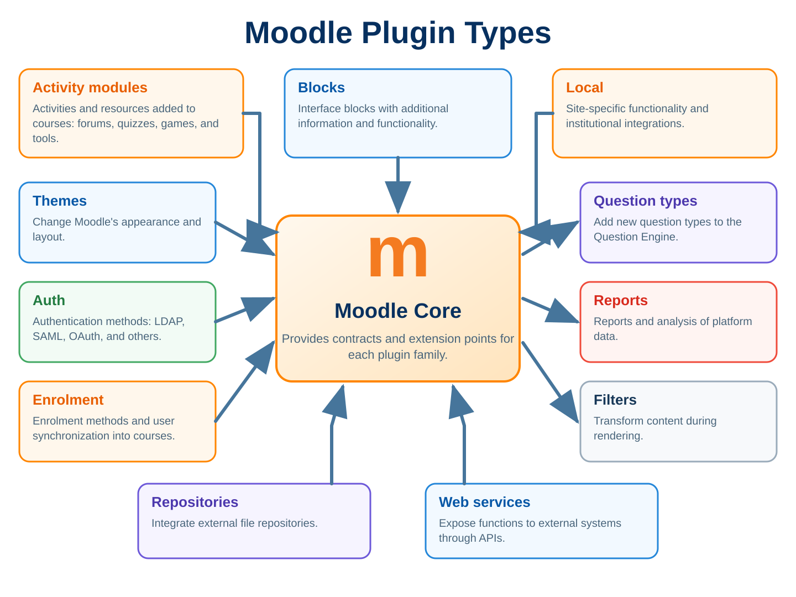

# 2 MOODLE PLUGIN TYPES

Before writing your first `version.php`, there is a decision that often determines whether a plugin will age well or whether, two years from now, someone will open the code and ask why everything was placed under `local/`. That decision is choosing the correct plugin type. From the outside this can look like an organizational detail because all plugins eventually become directories containing PHP, classes, language strings, database structures, and some interface, but in Moodle the plugin type tells core what role that component plays, when it should be loaded, which callbacks or APIs make sense, where it appears in administration, and which specific contracts it must satisfy.

It is very tempting to start with `local` because it accepts practically anything and lets you add custom pages, tables, tasks, web services, events, and integrations without Moodle complaining. That is precisely the problem. When a tool accepts anything, it also makes it easier to use the wrong tool. If you want to create an activity that a teacher adds to a course, a `local` plugin does not become an activity merely because you created a table with `courseid`; if you want to change how a course is presented, a `local` plugin does not become a `format`; if you want to authenticate users against an external system, a login page inside `local` does not replace an `auth` plugin; and if you want to control enrolment, reinventing `user_enrolments` makes little sense when Moodle has an entire plugin type whose responsibility is exactly that.

In this chapter we will look at plugin types as architectural extension points. The question will not merely be "where do I put the files?" but "which part of Moodle am I actually extending?" That difference sounds theoretical until the first backup fails to include your data, the first permissions screen becomes impossible to organize, the first upgrade depends on workarounds, or the first administrator installs your plugin expecting behavior that its chosen type never promised to provide.

## 2.1 What is a plugin type?

A plugin type is a category recognized by Moodle that defines where a set of components must live and what function those components perform within the platform. `mod`, `block`, `local`, `tool`, `auth`, `enrol`, `qtype`, and `theme` are not merely prefixes used to create a nice Frankenstyle name; they represent different contracts between a plugin and core.

When you create `mod_example`, Moodle understands that it is dealing with a course activity or resource, so there is a whole set of expectations related to course modules, instance creation, deletion, feature support, backup, restore, visibility, and course integration. When you create `auth_example`, Moodle does not expect an activity but an authentication mechanism that participates in user identification. With `enrol_example`, the expectation changes again because the plugin works with enrolment instances and the relationship between users and courses. The directory may still contain `classes/`, `lang/`, `db/`, and `version.php`, but its architectural role has changed completely.

This is why copying the structure of an arbitrary plugin and changing its name is almost never a good way to learn. You can copy a `local` plugin, make it install, and conclude that you understand Moodle development, but you still have not learned which problem each plugin type solves. It is a bit like learning object-oriented programming by creating a class called `Utils` and putting everything inside it. It works for a while; that does not make the architecture correct.

The type also participates in the component's full name. A plugin called `supervideo` inside `mod/` is `mod_supervideo`, while a plugin with the same name inside `local/` is `local_supervideo`. This affects namespaces, language strings, capabilities, settings, events, templates, cache definitions, and practically every API that identifies a component by Frankenstyle, so changing the plugin type after it is already in production is not merely a matter of moving a directory.

## 2.2 How Moodle discovers plugin types

Moodle does not scan the entire filesystem trying to guess which directories look like plugins. Core has a known map describing valid plugin types and where each type should be found, and from that map `core_component` can discover installed plugins, resolve paths, build component caches, and answer questions such as "which plugins of type `auth` exist on this site?"

This matters when you are debugging a plugin that simply does not appear. If you created `/anything/myplugin`, added a perfect `version.php`, and Moodle ignores the directory, the problem is not necessarily in `version.php`; that directory may simply not correspond to any recognized plugin type. Moodle does not consider a directory a plugin merely because it contains files resembling another plugin.

Two classes appear frequently when investigating this. `core_component` deals with component discovery and location, while `core_plugin_manager` adds a management-oriented layer around plugins, versions, dependencies, installation, and information specific to each type. In a real investigation I would start with the second when trying to answer "did Moodle recognize my plugin?" and go to the first when I need to understand paths, types, subplugins, and component resolution.

It is also worth separating two concepts that look similar at first. Moodle knows top-level plugin types such as `mod`, `local`, and `theme`, but some plugins can define their own subplugin types. Assignment, Quiz, editors, and administrative tools are good examples of components that can host extensions beneath themselves, so the final component tree does not come only from a central file; it is complemented by declarations from components that support subplugins.

## 2.3 `lib/components.json`

If you want to know where the list of plugin types comes from without trusting a documentation table, open `lib/components.json` from the Moodle version you are using. This file acts as a metadata source for `core_component` and describes plugin types, core subsystems, and, in modern versions, types that are in the process of being deprecated or removed.

In current versions you will find entries associating a type identifier with a path. Conceptually, this is something like `mod` pointing to the modules directory, `auth` to authentication, `enrol` to enrolment, and `availability` to availability conditions. Since Moodle reorganized its tree around `public/`, these paths reflect the current code structure, which is another reason to consult the file from the correct branch rather than copy paths from an old article.

The important point is that `components.json` is not there for plugin developers to edit and register their own top-level plugin types. Creating a new top-level type is a core decision, not configuration for a third-party plugin. Your plugin chooses an existing type or, for types that are allowed to host subplugins, declares subtypes inside its own component using `db/subplugins.json`.

This file also helps resolve questions such as "does this plugin type still exist?" Starting with Moodle 5.0, types can appear in deprecation and removal structures, making the process explicit. Instead of discovering during an upgrade that an entire family disappeared, you can inspect core metadata itself and see whether the type is active, deprecated, or marked for removal.

When working on compatibility across versions, I prefer to trust this source and the `core_plugin_manager` API rather than maintain a fixed list inside my own code. Copied lists age, and Moodle gains or reorganizes types over time, as happened with AI providers, AI placements, new gateways, communication mechanisms, and other extension points that did not exist in older branches.

## 2.4 How to choose the correct plugin type

A simple way to choose correctly is to stop asking "which type lets me do this?" and ask "which part of Moodle owns this behavior?" If the behavior belongs to the course as an activity added by the teacher, start by investigating `mod`; if it belongs to authentication, `auth`; if it controls who enters a course, `enrol`; if it defines how a course is visually and structurally organized, `format`; if it transforms text during rendering, `filter`; if it adds a condition such as "only after a certain date" or "only if the grade is greater than X", `availability`.

Another useful question is where an administrator or teacher would expect to find the feature without having read your documentation. If you deliver an institutional report, it makes sense for it to appear in the reporting area and follow the `report` model; if you deliver a maintenance tool that changes site data, reprocesses records, or exposes administrative routines, `tool` communicates the intent better; if you deliver a presentation component that can be added to page regions, `block` is much more natural than injecting HTML through global callbacks.

Also look at the lifecycle. An activity has instances inside courses, an enrolment method has enrolment instances per course, a block can have instances in different contexts, and a theme has configuration and visual inheritance but not instances of the same kind. Choosing the wrong type usually means you will have to recreate manually the lifecycle that the correct type already provides.

Sometimes more than one type looks plausible. An administrative dashboard might be a `report`, `tool`, or `local` depending on what it actually does. If it only queries and presents data, `report` is often the most natural fit; if it performs maintenance and administrative operations, `tool`; if it is a larger institutional application with pages for different roles, integrations, and responsibilities that do not fit a more specific contract, `local` may be appropriate. The screen name does not determine the type; responsibility does.

## 2.5 When NOT to create a `local` plugin

Moodle documentation makes it clear that you should use a standard plugin type when one exists and fall back to `local` when the functionality does not fit the other types appropriately. That sentence should be stuck to the monitor of anyone beginning Moodle development because `local` is probably the most abused plugin type in the ecosystem.

Imagine that you need to create an activity where the teacher publishes a question and students submit answers. You can do everything in `local`: create tables, a `view.php` page, a form, capability, navigation, and even a `courseid` column. Moodle will still not see it as an activity. You will not have a natural `course_module`, it will not appear correctly in the activity chooser, and it will not inherit the standard duplication, completion, groups, availability, activity backup, and other integrations that `mod` already understands.

The same applies to authentication. You can create an endpoint in `local_mylogin`, call an external API, and use functions to create the user, but if the intent is to participate in the authentication flow, `auth` exists specifically for that. Once you bypass the correct type, you start accumulating exceptions, redirects, parallel pages, and special cases, and eventually you have written more code to implement an incomplete version of an API that already existed.

I use `local` when I am building something genuinely cross-cutting or institutional that does not have a more specific extension point, such as an integration that consumes Moodle events and sends data to an ERP, a custom administrative application, a set of institutional web services, or a coordination layer across different components. Even then it is worth asking whether part of the problem should be split into other plugins, because a fifty-thousand-line `local` plugin that authenticates, enrols, displays blocks, creates reports, and changes courses is not versatile; it is simply monolithic.

## 2.6 But Kraus, you create `local` plugins for almost everything

Anyone who follows my plugins has probably reached this point thinking exactly that. "But Kraus, you just spent several pages saying `local` is not the answer to everything, and when I look at your projects there is `local` everywhere." Yes, there is, and the difference is why the type was chosen, because using `local` frequently when your work is mostly integrations and cross-cutting functionality is one thing; using `local` because it is the only plugin type you know is something completely different.

A large part of the solutions I build do not belong to a single activity, are not only enrolment, are not only authentication, and are not just a report. They are institutional integrations, administrative hubs, automation, synchronization, event-driven services, and components that need to follow several parts of Moodle at the same time, so in those cases `local` is not a shortcut; it may be exactly the component that best represents a cross-cutting responsibility.

An example helps. When I create a `mod`, there is a concrete activity inside the course. The teacher adds that activity, Moodle creates the instance and its corresponding `course_module`, and the plugin's main experience revolves around those instances. When a student enters `mod/myplugin/view.php`, I am inside my activity; I have the `cm`, the course, the instance, and the context, so I can execute that resource's own logic with all the information Moodle already prepared for me.

That is what I mean when I say that with a `mod` I "have the plugin" when the student opens that activity. It does not mean a module's PHP is incapable of executing at any other time, because an installed activity module can also register event observers, tasks, hooks, and other integration points. It means the natural flow and primary responsibility of that type are tied to its own module instances.

Now imagine the requirement is different. I need to execute certain logic whenever a student accesses any Moodle activity, whether Quiz, Assignment, Forum, SCORM, Page, or a third-party module. In that scenario I cannot depend on the student opening my own `view.php`, because they may complete the entire course without entering any instance of my module and my code still needs to know that another activity was accessed.

Technically a `mod` can also listen to events from other components. An installed plugin can register observers in `db/events.php` and, when a compatible event is triggered, receive the event object and work with the available information such as `contextid`, `courseid`, `userid`, `objectid`, `relateduserid`, and data in `other`, remembering that the exact set depends on the event that fired. So if the only question were "can I do this inside a `mod`?", the answer would be yes.

Those values also give you enough information to control a great deal. I can see which course generated the event, which user was involved, which context triggered the action, and which object was accessed, then combine that with my own configuration to decide whether I should run any logic or simply return. If I need to activate the feature only for certain courses, roles, or activity types, I have enough data to build that decision without inserting code into every existing Moodle module.

But here the difference between being able to do something and choosing the correct type appears again. If I created `mod_myplugin` only because I needed somewhere to register an observer that watches Quiz, Assignment, Forum, and every other activity, then I am using a type that represents an activity to implement functionality that is not an activity. The code may work perfectly while the architecture tells the wrong story to the next person who opens the project.

When this monitoring is genuinely cross-cutting, a `local` plugin usually expresses the intent better. It can listen to the same events, use Hooks when an appropriate point exists, keep settings, run tasks, expose Web Services, and store its own rules without pretending that a pedagogical activity exists merely to justify the directory where the code lives.

Change the problem again. The teacher needs to add an activity called "Confidence level" to the course, configure a question, allow students to respond, and then monitor the results. I could create `local_confidence`, store `courseid` in the table, build a custom page, and add a link in the course. It would work, but it would be the wrong solution because that is clearly an activity and I want Moodle to treat it as one, with `course_modules`, the activity chooser, groups, availability, completion, backup, restore, and duplication.

In that case I would create `mod_confidence`, even if it would be faster to start from the structure of some `local` plugin I already have. This is exactly where experience can become habit: after creating many `local` plugins, you already have classes, CI, settings, database structures, and patterns you know by heart, so a new problem appears and the first reaction is to start from the type you know best.

It is the old problem of having a hammer and suddenly discovering a surprising number of nails in the world. The fact that I can solve practically any problem with a `local` plugin does not mean I should, just as I could open a PDO connection and query Moodle tables directly and that still would not make it a good decision.

Nor do we need to fall into the opposite extreme. If I am building a large institutional application that combines integrations, administrative processes, reports, automation, and rules crossing several subsystems, artificially splitting every screen into a different plugin type merely so I can say I used many plugin types may increase complexity without producing any real benefit. Architecture is not a contest to see who can use the most plugin types.

The question remains the same. Which Moodle component really owns this behavior? If a specific type represents the problem well and offers a lifecycle that I would otherwise need to rebuild manually, use that type. If the functionality is genuinely cross-cutting and does not belong to those subsystems, `local` remains a perfectly valid choice.

So yes, I create many `local` plugins and probably will continue doing so, but there is an enormous difference between "I used `local` because I analyzed the problem and it is cross-cutting" and "I used `local` because it is the only plugin type I know how to create." The first is an architectural decision; the second is a technical limitation disguised as an architectural decision.

## 2.7 Activity modules `mod`

Activity modules are plugins that participate directly in the course experience as activities or resources added by the teacher. Forum, Quiz, Assignment, Page, and many other course components live in this family.

When the teacher adds a module, Moodle creates a module instance together with a record in `course_modules`, connecting the activity to the course and its pedagogical structure. From there, features such as visibility, groups, completion, access restrictions, dates, calendar events, backup, restore, and integration with different course screens fit naturally into the lifecycle.

A common mistake is choosing `mod` merely because the plugin needs to appear in a course. Not everything visible inside a course needs to be an activity. A side panel may be a `block`, a change to the overall course organization may be a `format`, an access condition may be `availability`, and a report about the course may be a `report`. `mod` makes sense when there is an activity or resource entity that must be created, configured, and managed by the course.

Another important detail is that modules have specific contracts in `lib.php` and other files that do not apply to generic plugins. Functions for creation, update, deletion, and declaration of supported features remain part of this integration, so you should not treat a `mod` as a `local` plugin that happens to live under `/mod`. Chapter 17 goes deeply into this architecture; here the point is simply to understand why the type exists.

## 2.8 Blocks `block`

Blocks are interface components that can be added to compatible page regions, normally to display contextual information, shortcuts, indicators, or small tools. They have their own instances and can appear in different contexts such as courses, dashboards, or other pages according to what the plugin declares it supports.

If you need to show "Latest tickets", "Course progress", "Teacher shortcuts", or a small contextual view that follows certain pages, a block can be much more natural than globally injecting HTML. The administrator or user, depending on configuration, can add, move, hide, and configure the instance using mechanisms Moodle already provides.

The classic mistake here is turning a block into an entire application. A block should be a relatively small piece of interface. If it needs to load a table with twenty filters, five tabs, file import, and bulk editing, the block should probably be only an entry point into a dedicated page in another component or a more appropriate part of the architecture.

Do not confuse a block with a dashboard either. A complex dashboard may contain blocks, but the `block` type does not exist to replace any visual page. The lifecycle, per-instance configuration, and dependence on block regions are precisely what distinguish this type.

## 2.9 Local plugins `local`

`local` is the generic plugin type for customizations that do not have a better extension point, which makes it extremely useful when used with discipline. A local plugin can have custom pages, database tables, events, hooks, tasks, web services, settings, capabilities, caches, classes, templates, and practically all of the cross-cutting APIs we will study in later chapters.

There are historical and architectural characteristics that make `local` attractive for institutional customization. These plugins are processed late in some installation and upgrade flows, can add administrative settings flexibly, and are natural candidates for event consumers that integrate Moodle with external systems.

A good example is an academic integration that receives enrolment, completion, and user-update events, transforms the data, and sends them to a corporate system. That is not an activity, is not itself an enrolment method, and is not a report, so a `local` plugin can work well as the integration layer. Another example is an internal support application that brings together data from different areas of Moodle and communicates with external APIs without pretending to replace a more specific plugin type.

The practical rule remains the same. Use `local` when it best represents the problem, not because you are too lazy to learn the specific API. That may sound provocative, but it is a real problem. Many plugins start in `local` because "it is easier" and spend years carrying limitations that would have disappeared if the correct type had been chosen on day one.

## 2.10 Admin tools `tool`

`tool` plugins exist for administrative and maintenance tools, normally accessible through the Site administration tree and executed in system context. They were designed precisely to prevent administrative utilities from being scattered through generic directories or disguised as reports.

The distinction between `tool` and `report` becomes clearer when you think in terms of action versus observation. A report normally reads and presents information and may export, filter, and aggregate data. An administrative tool tends to perform operations, correct records, migrate data, check consistency, configure processes, reprocess queues, or provide a maintenance interface.

Imagine a screen that finds inconsistent courses and displays a list. If it only reports them, it may be a report. If it allows you to select records, fix references, rebuild data, and run administrative tasks, `tool` better represents the behavior. The distinction also helps when reading code, because when someone sees `tool_myfixer` they immediately understand there is a strong administrative intent.

`tool` is also one of the plugin types that can host subplugins, which is important for extensible architectures and will be covered in Chapter 20. That does not mean every admin tool needs subplugins, but it shows the type was designed for administrative solutions that may grow modularly.

## 2.11 Reports `report`

`report` plugins exist to present views of Moodle data, normally for administrators or authorized users. A report may include filters, pagination, tables, charts, and exports, but its essence is to turn existing data into useful information rather than create a parallel business subsystem.

Reports are frequently implemented as `local` plugins because the developer started from the URL rather than the component's role. If the plugin is fundamentally a query screen with filters by course, user, period, status, and export, `report` communicates the intent more clearly and fits Moodle's reporting areas.

This does not mean a `report` cannot have configuration, capabilities, or complex classes; it simply means the type helps organize a specific responsibility. Likewise, if the screen started as a report but now changes hundreds of records, reprocesses states, and performs maintenance routines, you may have crossed the line into `tool` territory and should reconsider the architecture.

There are also specialized report families in other domains, such as `gradereport`, which we will see later. The point is not to put everything containing an HTML table under `report`; choose the type based on the functional area being extended.

## 2.12 Course formats `format`

Course formats control how the main content of a course is organized and presented. Topics, weeks, and other formats determine the visual and behavioral structure of `/course/view.php`, participate in navigation, and can add their own course options.

Use `format` when the idea is not to add an activity but to change how the whole set of activities and sections is structured. A format may create tabbed navigation, organize sections differently, change the editing experience, define presentation rules, or provide its own interface around course content.

A common mistake is to try to implement this using a theme or global JavaScript. The theme can change appearance and part of rendering, but the semantics of course organization belong to the course format. If your logic needs to know which section is active, how sections are displayed, how the course index behaves, and how the teacher edits that structure, `format` is probably closer to the problem.

Course formats are powerful and, precisely because they touch a central part of the user experience, require careful compatibility across versions. Changes in the course-format subsystem can affect rendering, output classes, and APIs related to the course index, so a well-maintained format follows Moodle developer updates closely.

## 2.13 Themes `theme`

Themes control Moodle's visual layer and part of its presentation structure. They work with SCSS, templates, renderers, layouts, visual settings, inheritance from other themes, and several mechanisms that let you adapt the interface without changing core.

The most dangerous mistake is using a theme as a storage area for business logic. Because the theme is available on many pages, it can seem convenient to put database queries, API integration, access rules, and institutional behavior there, but that creates dependency between presentation and business logic. Changing the theme should alter appearance and perhaps experience components; it should not disable the institution's academic integration.

Another problem appears when a developer overrides a template or renderer unnecessarily and then carries a full copy of core markup. In the next version core fixes accessibility, changes classes, or adds elements, while the override remains frozen. A theme is the correct type for visual customization, but that does not mean every visual problem requires copying an entire page.

When functionality belongs to the business domain and must work regardless of the active theme, implement it in the appropriate component and let the theme decide only how it is presented when a suitable extension point exists.

## 2.14 Authentication `auth`

`auth` plugins participate in authentication, meaning the way Moodle verifies a user's identity and relates the local account to a credential source. LDAP and other authentication mechanisms help illustrate the idea, although every implementation has its own rules.

If your institution has an external service that validates usernames and passwords, or another mechanism that must participate in login, `auth` is the first plugin family to investigate. This lets you work inside Moodle's expected flow instead of creating a parallel page that authenticates externally and then tries to manufacture a session.

Authentication is not enrolment. A user may be authenticated in Moodle and still not be enrolled in any course. Mixing these concepts creates systems that are difficult to maintain, especially when developers use successful login as a signal to enrol the user in dozens of courses. If the rule concerns course access, the enrolment API exists and an `enrol` plugin may need to work alongside authentication.

It is also important to understand that MFA is not simply another traditional `auth` plugin. Modern versions have a specific subsystem for multifactor authentication, and you should use the corresponding extension point rather than forcing that logic into an ordinary authentication plugin.

## 2.15 Enrolment `enrol`

`enrol` plugins control course enrolment methods. They work with instances associated with courses and can create, update, suspend, or remove enrolment relationships according to a specific rule such as self enrolment, cohort membership, an external source, payment, or institutional synchronization.

The distinction between enrolment and role assignment is fundamental. Being enrolled means having a participation relationship with the course, while having a role means receiving a set of permissions in a particular context. In practice the two processes often happen together, but architecturally they are different, and Moodle stores them separately.

If you receive data from an ERP saying student 123 is enrolled in subject X until a given date, an `enrol` plugin can represent that rule very well because the central problem is keeping enrolment relationships synchronized. Creating a `local` plugin that manipulates `user_enrolments` directly may work, but you lose part of the semantics and mechanisms associated with an enrolment-method instance.

Chapter 18 will cover `enrol_user()`, suspension, dates, and roles in detail, but for now remember the main question. If your feature answers "who participates in this course, and why?", investigate `enrol` before reaching for a generic solution.

## 2.16 Filters `filter`

Filters transform content before presentation, normally when text passes through Moodle formatting APIs. The classic example is converting a textual pattern into other content, turning references into links, rendering formulas, or recognizing specific markup.

Use `filter` when the behavior needs to happen over formatted content and relatively transparently to the person who wrote the text. If teachers type something like `[product:123]` and you want to transform it into a visual component during rendering, a filter may be appropriate, provided the transformation genuinely belongs to the filtering stage.

Filters need careful performance treatment because they may run over many pieces of text on a single page. A database query or HTTP call performed naively for every fragment can destroy response time. This is one of those places where apparently small code can become expensive very quickly.

Do not use a filter as a universal HTML-manipulation mechanism either. If the requirement is to alter one specific page or render your own component, another API is probably better. A filter makes sense when there is a reusable textual transformation rule inside the formatting pipeline.

## 2.17 Repository `repository`

Repository plugins connect Moodle's file picker to external sources or alternative ways of obtaining content. The goal is to let users browse, search, or select files from a repository without forcing every activity to implement its own integration.

Imagine that the institution has a corporate library of documents or media. If several areas of Moodle need to select files from that library, implementing a `repository` may be more coherent than adding a custom button to every form. The repository participates in the standard file-selection experience and gives Moodle the information needed to bring in or reference the content.

It is important to distinguish a repository from internal storage. The Files API remains responsible for how Moodle manages its files, while a repository is a source from which users can choose content. Likewise, Alternative File Systems deal with the physical storage backend for files already managed by Moodle, which is a completely different problem.

This distinction avoids a common confusion. Google Drive as a source for selecting documents is a repository problem; S3 or object storage as the `filedir` backend is a File System API problem; and a link to an external video might involve media, a filter, or a specific plugin depending on the desired behavior.

## 2.18 Availability conditions `availability`

Availability conditions allow you to create additional access-restriction rules for activities and sections. Moodle already has conditions such as date, grade, group, and completion, and this plugin type exists so you can add new conditions teachers can combine with the existing ones.

If you want to allow access only when a student has a particular attribute, satisfies an institutional rule, or meets some condition not available in core, an `availability` plugin is usually far more appropriate than manually hiding elements in a theme or blocking access inside every `view.php`.

The advantage is that the condition participates in the official availability mechanism. The teacher configures the rule in the expected interface, Moodle evaluates it consistently, and other parts of the system can understand why an item is or is not available.

This also helps with consistency and security, although availability does not replace capabilities when the issue is authorization. An availability condition controls a pedagogical or operational access rule, while a capability answers whether the user has permission to perform an action. Mixing the two often creates pages that disappear visually while remaining accessible by URL.

## 2.19 Question types `qtype`

`qtype` defines question types that the Question Engine can use. Multiple choice, true/false, short answer, and many other types follow this model, with each type responsible for its question structure, responses, grading, editing, and whatever behavior the engine needs in order to process it.

Create a `qtype` when the unit you are inventing really is a new kind of question. This means teachers will be able to create questions of that type in the question bank and those questions can be used in contexts compatible with the Question Engine, such as Quiz and other components that work with question usages.

A common mistake is creating an activity module simply because there is a question on the screen. If the problem is "I need a new kind of question that must work inside Quiz", the extension point is `qtype`, not `mod`. An activity module would force you to rebuild attempts, states, responses, and grading that the Question Engine already provides.

Likewise, not every extension to the question bank needs to be a qtype. If you want to change the interface or add functionality to the question bank, there is `qbank`; if you want to change how a question behaves during an attempt, there is `qbehaviour`; if you want to import or export questions in another format, there is `qformat`.

## 2.20 Question bank plugins `qbank`

`qbank` plugins extend the question-bank experience and capabilities. They add features related to managing questions without defining a new question type itself.

Think about actions, columns, filters, statistics, or other tools that belong to the question bank. If you are looking at the question-bank screen and saying "I need to add something here", investigate `qbank` before creating a `local` plugin that injects JavaScript or modifies navigation.

This family became more important as the question bank was modularized and features that were once part of a monolithic implementation moved into their own plugins. This is a good example of why studying plugin types is not about memorizing a fixed table. Moodle evolves by creating new extension points when an area needs to become modular.

Chapter 22 will examine the Question Engine and Quiz in depth, so for now the rule is simply to separate responsibilities. `qtype` defines what a question is, `qbank` extends how it is administered, and `qbehaviour` controls how it behaves during an attempt.

## 2.21 Question behaviours `qbehaviour`

Question behaviours control the interaction between a question and an attempt. They determine how responses are submitted, when feedback appears, how attempts are processed, and how the question's state evolves as the student interacts.

This is different from the question type. The same question can be answered under different behaviours depending on Quiz configuration or the activity using the Question Engine. If you want to create a new interaction rule, such as a particular validation or submission flow, the extension point is closer to `qbehaviour` than to `qtype`.

The distinction matters because putting attempt behavior inside a qtype creates coupling. The qtype should define the logic intrinsic to that kind of question, while the behaviour organizes attempt dynamics in a reusable way.

This is an advanced area and is rarely anyone's first plugin, but knowing it exists prevents huge solutions to problems the Question Engine already separated architecturally.

## 2.22 Question formats `qformat`

Question formats are plugins for importing and exporting questions. They translate between Moodle's representation and external formats, such as files used by other tools or structures specific to an institution.

If you need to receive a file, parse questions, and create them in the question bank, that does not automatically mean creating a `local` plugin with an upload form. Uploading may be part of the interface, but the logic for translating a question format naturally belongs to `qformat`, especially when you want the feature to appear alongside Moodle's official import and export mechanisms.

A well-implemented qformat needs to handle more than text and a correct answer. Depending on the question types involved, there may be feedback, categories, images, embedded files, specific settings, and information that must survive a round trip.

The advantage of using the correct type is integrating the feature into a flow teachers already know rather than creating a second import screen that does almost the same thing and needs to maintain its own navigation, permissions, and error handling.

## 2.23 Custom fields `customfield`

Custom-field plugins define types of custom fields used by the custom-fields subsystem. Core provides common field types and other parts of Moodle may declare support for custom fields, while plugins of this type add new ways to store and edit values.

If you need a special field with its own behavior, such as an advanced selector, a specific data structure, or a value with custom validation, `customfield` may be the correct extension. This is very different from simply adding a column to the course or user table.

The major advantage is working with the custom-fields framework, preserving definitions, instances, categories, rendering, and integration with areas that support custom fields. Inventing a parallel field system inside a `local` plugin may seem faster on day one, but soon starts duplicating UI, database structures, permissions, and data export.

Always confirm that the object you want to extend actually supports custom fields. The plugin type defines the field type, but each area still needs to integrate the subsystem in order to accept those fields.

## 2.24 Content types

Content-bank content types use the Frankenstyle `contenttype` and extend the content bank, allowing you to create, upload, or edit content types that can later be reused across different Moodle areas. H5P is the best-known reference when talking about interactive content, but the architectural point here is that the Content Bank is its own area.

If your idea is to create reusable content that lives in the content bank, do not treat it as an activity merely because it will later be displayed in a course. An activity may be one of its consumers, while the primary entity still belongs to the content bank.

This type also shows how Moodle continues to gain extension points beyond the old familiar ones. Developers who learned plugins only through `mod`, `block`, and `local` tend to solve modern problems with old tools, which usually produces more fragile integrations.

Before using `contenttype`, evaluate where the content will be created, how it will be edited, how it will be referenced, and whether it really needs to exist independently in the content bank. If it is only a resource specific to one activity, the activity's own data model may still be simpler.

## 2.25 Data formats

`dataformat` plugins define output formats for exporting and downloading data. CSV, Excel, and other representations can be provided through this layer so tables and reports can use a common API instead of every plugin reinventing file generation.

If you are building a report and need to export the same data in different formats, use the Dataformat API rather than manually writing HTTP headers, CSV delimiters, and spreadsheet libraries on every page. The gain is not only less code but integration with the formats installed on the site.

This type is particularly interesting for large result sets because the API was designed for streamed data and export formats. Building one enormous string in memory and only then sending it to the browser may work in development and collapse when a report reaches hundreds of thousands of rows.

Chapter 13 will cover Dataformat as a cross-cutting API; here it is enough to recognize that the formats themselves are plugins and can be extended.

## 2.26 Message outputs

Message-output plugins, with Frankenstyle `message`, represent destinations or processors through which notifications and messages can be delivered. Email is the most obvious example, but the architecture allows other channels.

If you want to integrate a new delivery channel into Moodle's messaging system, such as a particular corporate service, the first question should be whether it belongs as a message output. That way users and administrators continue working with Moodle message preferences and providers while your plugin focuses on delivering the notification to the destination.

This is better than scattering HTTP calls through every plugin that needs to notify somebody. When each component talks directly to WhatsApp, SMS, Teams, or some other external service, you lose centralization, user preferences, consistency, and the ability to change the channel later.

Do not confuse a message output with a message provider. The provider is declared by the component that produces a category of message, while the output is the channel that delivers it. We will examine this distinction more deeply when studying the Message API.

## 2.27 Log stores

Log stores are subplugins tied to the logging infrastructure and define where events recorded by the system are stored. The standard log is the best-known implementation, but the architecture supports other backends.

Creating a log store only makes sense when you need to replace or add a storage destination for Moodle's logging mechanism. It is not the appropriate type for creating an audit table specific to your plugin merely because you want to preserve a history of some operation.

In fact, before creating your own log table, ask whether the action should be an Event. Moodle events already feed the logging subsystem and let other parts of the system observe important actions. Domain-specific audit tables may still be appropriate, especially when they preserve business state rather than merely a log, but starting from the Events API often avoids unnecessary duplication.

Because `logstore` is a subplugin of a core administrative tool, it also illustrates plugin types that do not live directly at the installation root and only make sense inside a parent component.

## 2.28 Calendar types

`calendartype` plugins control calendar systems used to represent dates in Moodle. They are not calendar events and do not exist to add appointments; they define how dates are converted and displayed according to a particular calendar.

This is a good example of a type many developers will never need to create but still benefit from knowing exists. If you are implementing a non-Gregorian calendar requirement, you should not start changing `userdate()` or formatting dates manually in templates because there is a specific extension layer for this.

When working with dates, also remember that timestamp storage, timezone, and presentation are separate concerns. The calendar type participates in calendar representation, but it does not replace timezone APIs or the Calendar API used to create course, user, and activity events.

Knowing these less famous plugin types prevents the habit of solving everything with utility functions inside your own plugin while ignoring subsystems already designed for extension.

## 2.29 Grade reports

`gradereport` plugins extend the ways grades can be viewed and worked with in the Gradebook. Grader report, user report, and other views belong to this family.

If you need to create a new view of the gradebook with its own organization and interaction, `gradereport` is far more appropriate than a generic `report` or a page inside `local`. The difference is that the plugin lives inside the Gradebook domain and uses its structures, navigation, and expectations.

This does not mean every report containing grades needs to be a gradereport. An institutional report that combines grades with financial data, dropout information, and indicators from multiple areas may still be a `report` or another application, while a new way of operating and visualizing the gradebook naturally belongs to the Gradebook.

Chapter 21 will cover grading and completion APIs, but here it is worth noticing how Moodle has specialized plugin types inside large subsystems instead of pushing every screen into a generic plugin.

## 2.30 Grade import

`gradeimport` plugins add formats or mechanisms for importing grades into the Gradebook. They work on the input side and must transform an external source into updates that respect Moodle's grade items and grade structures.

If an institution has a particular grade file exported by another system, a grade-import plugin can integrate that format into the normal import experience. Uploading the file through a `local` plugin and updating `grade_grades` directly would be technically possible and architecturally terrible, because Gradebook tables should not be treated like an ordinary spreadsheet.

The grading API has rules around source, recalculation, items, and state that need to be respected. The correct plugin type does not remove the need to understand those APIs, but it places the feature where administrators and teachers expect to find it.

## 2.31 Grade export

`gradeexport` plugins perform the opposite flow and provide formats for exporting grades. They integrate new representations into the Gradebook export flow and can serve external systems that require a specific layout or structure.

The choice between `gradeexport` and `dataformat` depends on the problem. `dataformat` is general infrastructure for data formats, while `gradeexport` participates in the specific domain of grade export with its own Gradebook context and flow.

If you simply need CSV and XLSX exports for an administrative table, Dataformat probably solves the problem. If you need a specific academic export of grades integrated into Gradebook screens and rules, investigate `gradeexport`.

This distinction between a "generic format" and a "specific functional flow" appears repeatedly in Moodle architecture and is a useful way to choose between plugin types that seem to overlap.

## 2.32 Advanced grading methods

Advanced grading methods use the `gradingform` type and define interfaces and logic for structured assessment methods such as rubrics and marking guides. They are not generic grade plugins but methods used by activities that support advanced grading.

If you want to create a new assessment model with criteria, levels, weights, or another structured mechanism that can be used by compatible activities, `gradingform` is the family to study. Building that interface directly inside a `mod` can tie the solution to one activity and duplicate infrastructure that already exists.

The grading method participates in defining the assessment form and in its use by the grader, while the Gradebook remains responsible for the final grade result. Separating those responsibilities allows the same assessment logic to be reused in more than one context when supported.

## 2.33 User profile fields

`profilefield` plugins define new types of custom user-profile fields. Moodle already provides common types, but this extension point lets you create fields with their own editing, validation, and presentation behavior.

If the institution needs to store an additional user value with special behavior, such as an identifier validated by an algorithm, a selection tied to an external source, or a composite value, a profile field may be better than creating a parallel table and custom editing screen.

This does not mean every piece of information related to a user should become a profile field. Operational data, histories, and complex relationships probably deserve tables in your plugin's own domain. Profile fields work best for attributes that conceptually belong to the profile and should participate in the normal profile editing and viewing experience.

The useful question is: "is this a characteristic of the user, or a business record related to the user?" The first may be a profile field; the second usually calls for another model.

## 2.34 Plagiarism plugins

Plagiarism plugins integrate similarity-analysis services or mechanisms for submitted content into activities that support the API. They receive specific integration points for processing files or text and presenting results related to checking.

If your solution talks to an anti-plagiarism service, the `plagiarism` type avoids implementing separate integrations in Assignment, Forum, and every other compatible component. The plugin works at the plagiarism-API level, while each activity decides how to expose support.

One important caution is not to confuse plagiarism with generic AI detection or any automated content analysis. The fit depends on the real API contract and the meaning of the result. Forcing a tool with another purpose into the plagiarism framework merely because there is a place to analyze text can produce a misleading experience and architecture that is difficult to explain.

## 2.35 Portfolio plugins

Portfolio plugins allow content to be sent from Moodle to external portfolio services or personal-storage destinations supported by the API. This is an older family and less visible in many current projects, but it remains useful for understanding the idea of user-oriented export destinations.

If the requirement is to let a student export specific content to a compatible portfolio service, this type may make sense. If the goal is to institutionally synchronize files to external storage, you may actually be looking at repository, filesystem, web service, or a custom integration rather than portfolio.

Again, two plugins can talk to the same external service and still belong to different types because the type is not defined by the vendor's name but by the function the integration performs inside Moodle.

## 2.36 Antivirus plugins

`antivirus` plugins provide mechanisms for scanning files uploaded to Moodle through the antivirus API. ClamAV is the best-known reference, but the type lets other scanners be integrated.

If the institution uses a particular security service to inspect uploads, the plugin should participate in this flow rather than making every file form call the scanner independently. This centralizes policy and ensures components that use Moodle's standard upload infrastructure can benefit from the check.

Antivirus is also a good example of cross-cutting functionality where a small plugin can affect the entire site. Slow external calls, badly configured timeouts, or incorrect failure handling can affect every area that accepts files, so implementation must consider availability and performance in addition to simply calling the scanner API.

## 2.37 TinyMCE plugins and subplugins

The TinyMCE editor is itself an editor plugin, `editor_tiny`, and it offers subplugins with Frankenstyle `tiny_name`. This architecture lets you add buttons, menus, commands, and behaviors to the editor without changing the main plugin.

If you need an institutional button in the editor that opens a modal, lets the user select an educational object, and inserts the selected resource into the edited content, a TinyMCE subplugin is usually the correct extension point. Doing this through global JavaScript loaded on every page may work, but creates dependencies on DOM structure, loading order, and pages where the editor does not even exist.

It is important to understand that `tiny` is not a top-level type equivalent to `mod` in the same sense. It is a subplugin type belonging to the TinyMCE editor, so its existence depends on the parent component. That relationship affects paths, discovery, and dependencies, and is exactly the kind of architecture we will examine in more depth in Chapter 20.

Moodle has also had other editors and editor subplugins historically, such as Atto, so when maintaining compatibility with older branches you may encounter types that no longer represent the platform's current direction. Do not copy the architecture of an old plugin without confirming that the target editor is still supported in the Moodle version you intend to maintain.

## 2.38 Plugin types that are subplugins of another component

A subplugin is a plugin whose type is defined and hosted by another plugin or component rather than being an independent global type. Assignment submission `assignsubmission`, Assignment feedback `assignfeedback`, Quiz reports, Quiz access rules, TinyMCE plugins, and log stores are examples that make this relationship easier to visualize.

The major difference is dependency on the parent. A subplugin can assume that the component defining its type exists because without the parent that subtype would have no meaning. For other plugins on the site, however, the normal rules still apply and dependencies need to be declared when required.

Not every plugin can invent subplugins. Core controls which top-level types support this architecture and, in modern versions, subtype declarations live in `db/subplugins.json`. Modules, editors, admin tools, and local plugins are currently among the families that can host subplugins, although that does not mean every plugin of those types should build its own extension platform.

Subplugins make sense when there is an architecture that genuinely needs to be extended by third parties or independent modules. Creating five subplugins merely to split an application that will always ship as one package can add installation, versioning, and dependency complexity without providing real extensibility. Modularizing code into classes is different from creating new plugin types.

## 2.39 Deprecated plugin types

Plugin types age too. APIs change, subsystems are replaced, and certain extension points stop making sense, so Moodle has a formal process for marking types as deprecated and later deleted before final removal from metadata.

Since Moodle 5.0 this process appears explicitly in `components.json` for top-level types and in `subplugins.json` for subtypes. In the first phase the type is considered end-of-life and stops participating in several forms of normal communication between core and plugins, although parts of the infrastructure, such as autoloading and string resolution, remain available to support migration. In the next phase, the presence of plugins of that type can block an upgrade until they are removed or migrated.

A known example is `mnetservice`, related to the old MNet ecosystem, which appears as a deprecated type in current versions. You can still find historical plugins and documentation, but that does not mean it is a recommended choice for new development.

The practical consequence is simple. Finding a directory in core or an old plugin on GitHub is not enough to conclude that the type is still recommended. Always check the relevant Moodle branch, the documentation for that version, and current metadata before starting new development.

## 2.40 How to check whether a plugin type is still recommended

The first source is the developer documentation for the version you intend to support. This sounds obvious, but many people search Google, open a page for Moodle 3.9 or 4.1 without noticing, and start programming against an API that has already changed. Moodle documentation lets you switch versions, so use that consciously.

The second source is `lib/components.json`. If the type appears in `plugintypes`, it is registered as an active type on that branch; if it appears in `deprecatedplugintypes` or `deletedplugintypes`, the situation is different and you need to investigate migration or replacement. For subplugins, perform the same check in the parent component's `db/subplugins.json`.

The third source is the code itself. Use `core_plugin_manager::instance()->get_plugin_types()` when you want to see programmatically which types the installation recognizes, and inspect `core_component` when you need to investigate component and path resolution. This is particularly useful in diagnostic tools because it avoids depending on a manually hard-coded list.

Then look at developer updates, `upgrade.txt`, and related issues when dealing with a type that seems old or poorly documented. An API can remain technically present while no longer being the recommended direction for new projects. TinyMCE versus older editors is an easy example, but the same reasoning applies to integrations, web services, communication mechanisms, and other evolving areas.

Also look at core. Not to copy blindly, but to observe how current Moodle solves similar problems. If every new feature in that area uses a modern API and the plugin you found as a reference has not changed in eight years, that should already raise a yellow flag.

## 2.41 Other plugin types you will find in the code

Even after all the types above, you will continue to encounter Frankenstyle names not mentioned here. Current Moodle has extension points for cache stores and locks, search engines, media players, web service protocols, payment gateways, file converters, communication providers, SMS gateways, and, in modern versions, AI providers and AI placements, among others.

There is no need to turn this chapter into a telephone directory because several of these types belong to subsystems that deserve their own study, but you do need to lose the impression that there are five plugin types and everything else is `local`. The exact list depends on the Moodle version and may grow, change, or enter deprecation, so the correct habit is to consult the actual core version.

This also changes how you search for a solution. Before starting a plugin, search the documentation by problem domain rather than only by the plugin type you already know. If you need AI integration, look at the AI subsystem; if you need payments, the Payment API; if you need search, the Search API; if you need cache, MUC. Often the correct plugin type becomes obvious once you understand the subsystem.

## 2.42 Exercise - given a problem, choose the correct plugin type

The goal of this exercise is not to write code. I prefer to do this before the first plugin because it forces you to separate the functional requirement from the architectural decision, and that habit saves a great deal of rework later.

Consider the following scenarios and choose the primary plugin type that best represents each problem, explaining why you discarded the most obvious alternatives.

1. The teacher needs to add an activity to the course in which they publish a problem scenario, students submit a response, and the activity has its own completion, groups, dates, and backup together with the course.

2. The institution has an ERP that reports enrolments and cancellations every hour, and Moodle must reflect those relationships in courses without requiring the administrator to run manual imports.

3. The administrator needs a tool that finds inconsistent records, lets them select the problems, and runs a correction routine with confirmation and execution logging.

4. The teacher wants to restrict an activity to students who have a particular academic attribute calculated by an institutional plugin.

5. The site needs a new way to organize course sections, with side navigation, visual grouping, and its own editing behavior, while the activities remain ordinary Moodle activities.

6. An external service provides institutional authentication and users should be able to enter Moodle using the same credentials without creating a parallel login page.

7. The institution wants to add a button to TinyMCE that opens a learning-object selector and inserts the chosen resource into the edited content.

8. The academic department needs a filterable view of historical data with export, but the screen does not change records or perform maintenance.

9. A new file format must be accepted in the official question-import flow and must create questions in the question bank while preserving answers and feedback.

10. A corporate system must receive Moodle notifications through a new channel while respecting Message subsystem preferences and providers.

Now comes the important part. Do not answer only `mod`, `enrol`, `tool`, and so on. For each case write two or three sentences explaining the main entity, the lifecycle Moodle already provides for that type, and what problem would arise if the solution were implemented as `local`. That justification is where it becomes clear whether you really understood the architecture or merely memorized prefixes.

To check the reasoning, the first scenario points to `mod` because there is an activity instance belonging to the course; the second points to `enrol` because the main responsibility is maintaining enrolment; the third fits `tool` because it performs administrative maintenance; the fourth asks for `availability`; the fifth belongs to `format`; the sixth to `auth`; the seventh to a `tiny` subplugin; the eighth tends toward `report`; the ninth is `qformat`; and the tenth works with a message output. In a real project there would still be details that could change the decision, but the exercise already eliminates the lazy choice of placing everything in `local`.

By the end of the chapter, you do not need to memorize every plugin type Moodle has. What needs to change is the question you ask before creating a directory. Instead of "which plugin do I know how to build?", ask "which subsystem owns this behavior and which extension point does it provide?" That small shift in reasoning makes your code work with Moodle's architecture rather than merely work despite it.

## Technical references consulted

* MOODLE. Moodle Developer Resources. Plugin types. Available at: https://moodledev.io/docs/5.2/apis/plugintypes. Accessed: Sep. 23, 2026.
* MOODLE. Moodle Developer Resources. Local plugins. Available at: https://moodledev.io/docs/5.2/apis/plugintypes/local. Accessed: Sep. 23, 2026.
* MOODLE. Moodle Developer Resources. Activity modules. Available at: https://moodledev.io/docs/5.2/apis/plugintypes/mod. Accessed: Sep. 23, 2026.
* MOODLE. Moodle Developer Resources. Filter plugins. Available at: https://moodledev.io/docs/5.2/apis/plugintypes/filter. Accessed: Sep. 23, 2026.
* MOODLE. Moodle Developer Resources. Course format. Available at: https://moodledev.io/docs/5.0/apis/plugintypes/format. Accessed: Sep. 23, 2026.
* MOODLE. Moodle Developer Resources. Metadata. Available at: https://moodledev.io/general/development/tools/metadata. Accessed: Sep. 23, 2026.
* MOODLE. Moodle source code. `lib/components.json`. Available at: https://github.com/moodle/moodle/blob/main/lib/components.json. Accessed: Sep. 23, 2026.
