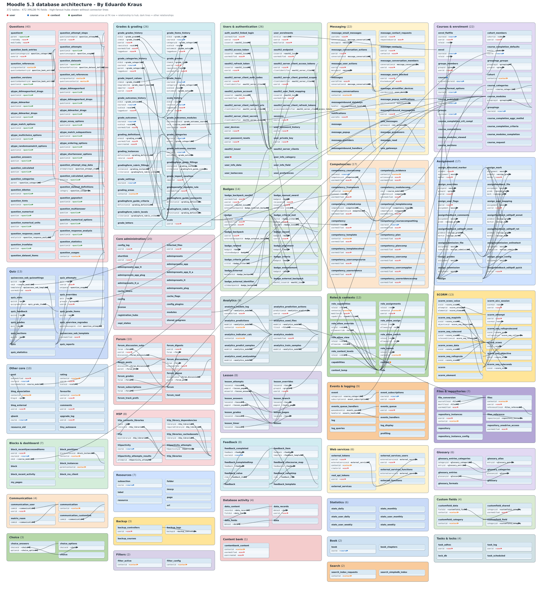
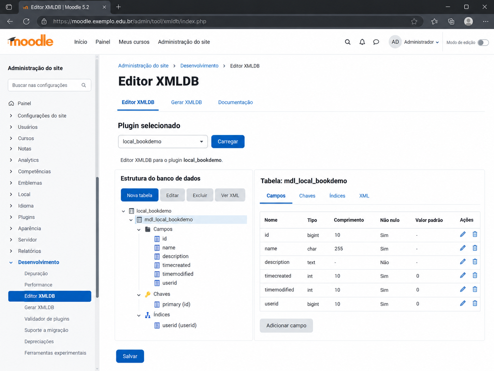

# 5 DATABASE AND XMLDB


The database is one of the areas where a Moodle plugin can look correct for months while still being built on poor decisions. You open the screen, save one record, query another, everything responds quickly in the development installation, and it feels finished. Then the plugin reaches an environment with millions of records, PostgreSQL instead of MariaDB, two concurrent tasks, and an upgrade coming from an old version, and suddenly you get duplicates, deadlocks, slow queries, and that classic support sentence: "it always worked here."

Moodle has already solved much of this at the database layer, but taking advantage of it requires accepting a simple rule. Moodle's database is not "MySQL with tables named `mdl_*`." It is an abstraction that needs to work across different databases, survive upgrades, respect schema conventions, and remain predictable as volume grows. If you write directly for MySQL, before long you are fighting the platform instead of using it.

In this chapter we work with two layers. The first is DML, used to query and modify data, while the second is DDL, used to change structure. Then comes XMLDB, which describes the schema independently of the database engine, and finally upgrades, transactions, the Persistent API, and the scaling problems that appear when a query that looked small stops being small.

### Moodle 5.3 database architecture

Before entering the APIs, it is worth looking at the database as a system rather than a collection of isolated tables. The [Moodle 5.3 database architecture](../../image/moodle-5.3-db-architecture.svg) diagram provides a consolidated view of Moodle 5.3 database architecture, organized by functional areas such as questions, grades, users and authentication, messaging, courses and enrolments, assignment, competencies, quiz, SCORM, files, H5P, web services, and other core areas.

[](../../image/moodle-5.3-db-architecture.svg)

The file represents **372 tables** and **472 relationship fields identified in XMLDB definitions**. Inside each table you can see fields that point to other entities, making it possible to quickly understand where each component connects to the rest of Moodle. Dark lines represent relationships among ordinary tables, while relationships involving a few extremely reused tables are represented differently so hundreds of lines do not make the diagram unreadable.

The four main hubs are identified by color: **`user` in red, `course` in blue, `context` in orange, and `question` in green**. Instead of drawing a line across the diagram for every reference to one of these tables, the field containing the reference receives an arrow in the corresponding color. This makes it visible, for example, that a particular `userid` references `user` or a `courseid` references `course`, without hiding the rest of the architecture under a web of connectors.

It is important to interpret this diagram primarily as a view of **relationships declared in XMLDB**, not as a promise that every one of them physically exists in the DBMS as a foreign-key constraint. In Moodle, many relationships are part of the logical model and XMLDB definitions, while data integrity, cleanup, and evolution also depend on APIs and application code. The diagram is particularly useful for understanding dependencies before writing joins, investigating orphaned data, analyzing the impact of a change, or simply discovering which tables belong to a subsystem.

## 5.1 Moodle DML API

DML means Data Manipulation Language and, in Moodle, refers to the API used to read, insert, update, and delete data. In practice it is the layer you use almost every day, because any plugin that persists state eventually calls `$DB->get_record()`, `$DB->insert_record()`, or a similar method.

Moodle documentation recommends using the DML API exclusively to manipulate the installation's own database, and the reason goes far beyond style. The API knows the configured driver, converts parameters as required by the database, applies table prefixes, standardizes return values, supports pagination, and provides helper functions for SQL fragments that vary between PostgreSQL, MySQL, MariaDB, and SQL Server. When you bypass it and open your own connection, you lose precisely the layer that makes a plugin portable.

It is important to understand the abstraction's boundary. DML does not mean you will never write SQL. Simple queries are handled by table methods, but reports, aggregations, and joins often require `get_records_sql()` or SQL recordsets. The goal is not to hide SQL but to write SQL compatible with Moodle's database layer, parameterized, and without tying the plugin to one engine.

## 5.2 Moodle DDL API

DDL means Data Definition Language and deals with database structure, so we are talking about creating a table, adding a field, removing an index, renaming a column, and other schema changes. In Moodle you should not issue `ALTER TABLE` manually inside a plugin because the DDL API exists precisely to translate a neutral definition into the correct statement for the current database.

The difference between DML and DDL needs to be very clear. DML modifies existing data and appears in pages, tasks, services, and business rules, while DDL modifies structure and should be restricted to installation and upgrade. If a user-facing page checks whether a column exists and creates it on demand, the problem is not only performance. You have placed schema evolution inside an application request where concurrency and database permissions can produce rather unpleasant results.

In upgrade code, DDL is normally accessed through `$DB->get_manager()`, which returns the database manager for the current driver. It receives XMLDB objects such as `xmldb_table`, `xmldb_field`, `xmldb_key`, and `xmldb_index` and performs the change portably.

## 5.3 The global `$DB`

```php
$DB is one of the globals you will encounter most often in Moodle development. It is created during bootstrap and contains a moodle_database instance appropriate for the driver configured in config.php. This means the same plugin code can call $DB->get_record() in a PostgreSQL installation and in another running MariaDB without knowing which concrete implementation is underneath.
```

When you need the global inside a function or method that does not receive it as a dependency, declare it explicitly.

```php
global $DB;

$course = $DB->get_record('course', ['id' => $courseid], '*', MUST_EXIST);
```

Do not treat that as permission to access `$DB` everywhere without thinking. Domain classes and services become easier to test when database access is concentrated in predictable places, especially in larger projects. Moodle historically exposes `$DB` as a global and that is normal, but we can still organize responsibility rather than scatter queries across templates, forms, callbacks, and event observers.

Another important detail is that table names passed to DML methods do not include `mdl_`. You use `course`, `user`, `local_myplugin_item`, and let Moodle handle whatever prefix the installation uses.

## 5.4 Why not use `mysqli`, your own PDO, or a separate connection to Moodle's database

The first answer is usually "because Moodle already has `$DB`", but that is still incomplete. If you open your own `mysqli_connect()` using values from `config.php`, you create a second connection, tie the code to the MySQL ecosystem, and bypass prefix handling, drivers, logging, and conventions Moodle applies at its database layer. The code may work perfectly on your server and fail for the first client using PostgreSQL.

Your own PDO connection has a similar problem. PDO is a good technology, but it is not Moodle's internal database API. The discussion is not whether PDO is better or worse; it is whether a plugin should bypass infrastructure the application already provides. Accessing an external database that belongs to another system may justify a separate connection or dedicated API, but that is a different integration. For Moodle's own database, use `$DB`.

There is also a transaction issue. A separate connection opened by the plugin does not automatically participate in delegated transactions controlled by Moodle on the primary connection. You may believe two changes are atomic, throw an exception, and discover that half was rolled back while the other half remained committed because they were on different connections.

```php
5.5 $DB->get_record()
```

`get_record()` is the natural choice when you expect one record and can describe it using simple equality conditions. A typical case is loading your own record by `id`, by `userid` and `courseid`, or by another combination that should identify at most one row.

```php
$record = $DB->get_record(
    'local_catalogsync_item',
    ['id' => $itemid],
    'id, courseid, externalid, status',
    MUST_EXIST,
);
```

Notice that I did not request `*` unnecessarily. In many cases it makes no measurable difference, but selecting only the fields you use makes intent clear and can reduce transfer and memory when there are large columns. We do not need to turn this into an obsession, but there is no reason to load a multi-megabyte `payload` field on a screen that only needs `id` and `status`.

The fourth argument defines strictness. If absence is normal behavior, `IGNORE_MISSING` may be enough; if the record must exist for the operation to continue, `MUST_EXIST` avoids the pattern where you receive `false`, forget to check it, and discover the problem three lines later by accessing a property on a non-object.

```php
5.6 $DB->get_records()
```

`get_records()` returns multiple records from a single table and works well when conditions are simple. You can filter, sort, select fields, and apply limits without writing full SQL.

```php
$items = $DB->get_records(
    'local_catalogsync_item',
    ['courseid' => $courseid, 'status' => 'pending'],
    'timecreated ASC',
    'id, externalid, timecreated',
    0,
    100,
);
```

One detail that often goes unnoticed is that the returned array normally uses the first selected field as its key, and that field must be unique if you do not want result rows to overwrite one another. That is why `id` is commonly selected first. If you write a query where the first field repeats, the result may contain fewer elements than SQL returned, and the bug looks inexplicable until you remember how DML indexes records.

Do not use `get_records()` to load "everything" from a large table and then filter it in PHP. If the condition can be resolved by the database, let the database resolve it. Network transfer, PHP memory, and CPU are terrible places to imitate a `WHERE` clause the DBMS can execute better.

```php
5.7 $DB->get_record_sql()
```

When you need a join, aggregate function, or another construct that does not fit simple methods, `get_record_sql()` lets you write SQL while still keeping Moodle parameters and abstractions. The contract remains the same: you expect one row.

```php
$sql = "SELECT c.id, c.fullname, COUNT(ue.id) AS enrolments
          FROM {course} c
          JOIN {enrol} e ON e.courseid = c.id
          JOIN {user_enrolments} ue ON ue.enrolid = e.id
         WHERE c.id = :courseid
      GROUP BY c.id, c.fullname";

$record = $DB->get_record_sql($sql, ['courseid' => $courseid], MUST_EXIST);
```

Free-form SQL does not mean SQL free from Moodle rules. Tables still use braces, values remain parameterized, and database-specific functions should be avoided or replaced with DML helpers. This is where many developers say "I needed SQL, so now I can write it like I would in phpMyAdmin." You cannot if your intention is to remain portable.

If the query can return several rows, do not use `get_record_sql()` expecting it to simply choose the first. Adjust the SQL or use the correct API, because multiple rows where the code expected uniqueness normally reveal a modeling problem or incomplete condition.

```php
5.8 $DB->get_records_sql()
```

`get_records_sql()` is one of the most commonly used methods in reports and more elaborate queries. It returns a set of records loaded into memory and accepts `limitfrom` and `limitnum`, so it can be used for pagination.

```php
$sql = "SELECT i.id, i.courseid, i.status, i.timemodified
          FROM {local_catalogsync_item} i
         WHERE i.status = :status
      ORDER BY i.timemodified DESC, i.id DESC";

$records = $DB->get_records_sql(
    $sql,
    ['status' => 'pending'],
    $offset,
    $pagesize,
);
```

Notice the secondary stable sort. If `timemodified` is equal for several records and you paginate only by it, consecutive pages can move items around depending on the execution plan. Adding a unique field such as `id` makes the result deterministic.

The trap is using this method for enormous queries merely because it is convenient. If the result can reach hundreds of thousands of rows, loading it all into an array creates unnecessary memory pressure. That is where recordsets come in.

```php
5.9 $DB->get_recordset()
```

`get_recordset()` works with simple table conditions like `get_records()`, but it does not load the entire result into an array at once. It returns a `moodle_recordset` that you iterate progressively, keeping memory use much lower.

```php
$rs = $DB->get_recordset(
    'local_catalogsync_item',
    ['status' => 'pending'],
    'id ASC',
    'id, courseid, externalid',
);

foreach ($rs as $record) {
    // Process one record at a time.
}

$rs->close();
```

The difference looks small in code and can be enormous in production. Ten thousand `stdClass` objects in memory may be acceptable in a task, while several million probably are not. A recordset lets the driver stream reads and lets PHP work with smaller logical batches.

Close the recordset when you finish, especially if you leave the loop before reaching the end. Do not rely on the destructor to release resources in a long-running cron process.

```php
5.10 $DB->get_recordset_sql()
```

`get_recordset_sql()` combines free-form SQL with incremental reads. It is the right tool when the query needs joins or aggregations but the returned set may be too large for an array.

```php
$sql = "SELECT i.id, i.courseid, c.fullname
          FROM {local_catalogsync_item} i
          JOIN {course} c ON c.id = i.courseid
         WHERE i.status = :status
      ORDER BY i.id";

$rs = $DB->get_recordset_sql($sql, ['status' => 'pending']);

try {
    foreach ($rs as $record) {
        // Process the record.
    }
} finally {
    $rs->close();
}
```

The `finally` is useful in larger routines because it guarantees cleanup even if processing throws an exception. It is not always necessary in small scripts, but it makes intent explicit in tasks that may run for several minutes.

Recordsets reduce memory use but do not turn a bad query into a good one. If SQL performs a full scan of an enormous table because an index is missing, you will simply suffer with lower PHP memory usage. Performance starts with the execution plan and schema, not with the PHP return type.

## 5.11 When to use a recordset

Use a recordset when the data set may grow substantially and each row can be processed without keeping all rows in memory at once. CSV export, synchronization, recalculating records, data cleanup, and maintenance tasks are classic cases.

Do not use a recordset when the operation needs to revisit the same set repeatedly, sort it again in PHP, or correlate every record with all previous records. In those situations you may end up issuing repeated queries or creating auxiliary structures that cancel the benefit. Sometimes explicit pagination, a temporary table through an appropriate supported API, or a reformulated query is better.

Also be careful with slow processing while the same cursor remains open. Some databases and drivers retain resources associated with the result, so a loop that makes a thirty-second HTTP call for each record may hold a recordset open for hours. For external integrations it is usually better to fetch IDs in batches, close the reader, and delegate heavy work to smaller tasks.

```php
5.12 $DB->insert_record()
```

`insert_record()` receives an object or equivalent structure containing the fields to insert and normally returns the new `id`. You do not provide the auto-increment field when you want the database to generate it.

```php
$record = (object) [
    'courseid' => $courseid,
    'externalid' => $externalid,
    'status' => 'pending',
    'timecreated' => time(),
    'timemodified' => time(),
];

$record->id = $DB->insert_record('local_catalogsync_item', $record);
```

Do not treat the return value as though every insert in the system must have a numeric ID because there are special tables and bulk-insert operations where the contract may differ. For ordinary plugin tables with an auto-increment integer primary `id`, this is the expected pattern.

Business-rule validation must happen before persistence. The database enforces declared types and constraints, but it does not know that an `externalid` should belong to the same course as the current user or that a particular status must not move from `completed` back to `pending`.

```php
5.13 $DB->update_record()
```

`update_record()` updates a record using the `id` field as identity. The object must contain `id` and the fields to be written.

```php
$record = (object) [
    'id' => $itemid,
    'status' => 'completed',
    'timemodified' => time(),
];

$DB->update_record('local_catalogsync_item', $record);
```

This allows partial updates and avoids loading the whole row merely to change two fields. Even so, when the update depends on previous state, you may need to read first and validate the transition. Do not turn `update_record()` into a way to bypass domain rules.

Under concurrency, the pattern "read, change, save" can suffer a lost update when two executions work on the same record. Depending on the case, use locks, a transaction, or a conditional update designed around the expected state. The Tasks chapter goes deeper into concurrency, but the database is where concurrency becomes concrete.

```php
5.14 $DB->delete_records()
```

`delete_records()` removes rows matching simple conditions. It is straightforward and dangerous for exactly the same reason.

```php
$DB->delete_records('local_catalogsync_item', ['courseid' => $courseid]);
```

Before performing broad deletion, think about dependencies. Moodle does not recommend relying on cascading foreign keys as a substitute for application logic, and File API files, calendar events, grades, and other related data often need cleanup through their corresponding APIs. Deleting a primary row without cleaning the rest can leave logical garbage the database itself cannot see.

When the condition requires more complex SQL, methods such as `delete_records_select()` are available. The same care applies: parameterize values and make the universe of data being deleted explicit. An unconditional delete in plugin code should receive attention in any code review.

```php
5.15 $DB->set_field()
```

`set_field()` is useful when you need to change one field for records matching simple conditions. Instead of creating an object and calling `update_record()`, you express the intent directly.

```php
$DB->set_field(
    'local_catalogsync_item',
    'status',
    'cancelled',
    ['courseid' => $courseid, 'status' => 'pending'],
);
```

The advantage is particularly clear in mass updates. It makes no sense to load one thousand records into PHP merely to change `status` on all of them. The database can do this in one operation.

The caution is the same as for every bulk update: external side effects do not happen automatically. If a status change should dispatch an event, recalculate a cache, or call another API, `set_field()` does not know that. The function is about persistence, not business rules.

```php
5.16 $DB->count_records()
```

`count_records()` counts rows matching simple conditions and is better than fetching the rows and then calling `count()` in PHP.

```php
$total = $DB->count_records(
    'local_catalogsync_item',
    ['courseid' => $courseid, 'status' => 'pending'],
);
```

It sounds obvious, but this mistake appears frequently in reporting screens. The developer needs to display ten rows and a total, loads every row to discover the count, then slices the array with `array_slice()`. It works with two hundred rows and becomes wasteful with two hundred thousand.

For complex conditions there are variants such as `count_records_sql()` and `count_records_select()`. Again, send the database exactly the work it was designed to perform.

```php
5.17 $DB->record_exists()
```

When you only need to know whether at least one record exists, use `record_exists()` instead of loading an entire row.

```php
$exists = $DB->record_exists('local_catalogsync_item', [
    'courseid' => $courseid,
    'externalid' => $externalid,
]);
```

The difference may seem small, but it communicates intent and allows the driver to perform an appropriate existence check. It also avoids the common pattern of using `get_record()` only to convert its return value to boolean.

Do not use `record_exists()` as a uniqueness guarantee under concurrency. Doing "if it does not exist, insert it" in two simultaneous requests can create duplicates unless the rule is protected by a unique index or a lock. A rule that must be impossible to violate needs to exist in the schema as well.

## 5.18 Parameterized SQL

Parameterization separates query structure from values. Instead of concatenating data into SQL, you write placeholders and provide the values in an array.

```php
$sql = "SELECT id, courseid, status
          FROM {local_catalogsync_item}
         WHERE courseid = :courseid
           AND status = :status";

$params = [
    'courseid' => $courseid,
    'status' => $status,
];

$records = $DB->get_records_sql($sql, $params);
```

Used correctly, this protects against SQL injection and delegates quoting and type details to the driver. It is not only a security issue. Dates, strings, integers, Unicode, and special values no longer depend on an improvised attempt to build valid SQL syntax manually.

A parameter represents a value, not a SQL identifier. You cannot parameterize a table name, column name, or `ASC` and `DESC` direction in the same way. When those pieces need to be dynamic, choose them from a server-controlled allowlist.

## 5.19 Named parameters

Named parameters use identifiers such as `:courseid` and make large queries much easier to read. The parameter array uses the same keys without the colon.

```php
$sql = "SELECT id
          FROM {local_catalogsync_item}
         WHERE courseid = :courseid
           AND timemodified >= :since";

$params = [
    'courseid' => $courseid,
    'since' => $since,
];
```

Use descriptive names. `:p1`, `:p2`, and `:p3` work but throw away much of the benefit. In queries that use semantically the same value in more than one place, do not assume every driver lets you reuse the same placeholder indefinitely. In complex SQL the safest form is to use distinct names when the placeholder appears in different positions.

Named parameters also work well with `get_in_or_equal()` when you request `SQL_PARAMS_NAMED`, because Moodle generates unique names for the list.

## 5.20 Question marks

The DML API also supports positional parameters with `?`. They are convenient in short queries, although readability declines as their number grows.

```php
$sql = "SELECT id
          FROM {local_catalogsync_item}
         WHERE courseid = ?
           AND status = ?";

$records = $DB->get_records_sql($sql, [$courseid, $status]);
```

Do not mix named parameters and question marks in the same query. Choose one style per SQL statement. In plugin code I normally prefer named parameters because the query remains understandable as filters are added, but there are simple cases where positional parameters are perfectly fine.

If you change the SQL order when using `?`, review the array order too. This is exactly the kind of mistake named parameters avoid.

## 5.21 Why concatenating values into SQL is wrong

Consider this:

```php
$sql = "SELECT *
          FROM {user}
         WHERE email = '" . $email . "'";
```

The most serious problem is SQL injection, but it is not the only one. Quoting, encoding, and types become dependent on manual concatenation, so even a legitimate value containing an apostrophe can break the query. If somebody tries to "fix" it with `addslashes()`, they have simply created a homemade and incomplete version of a problem the driver already knows how to solve.

Do not concatenate after `clean_param()` either, believing that sanitization replaces parameterization. Input cleaning and SQL binding solve different problems. `PARAM_TEXT` is not SQL escaping and must not be used as though it were.

The legitimate exception is a structural SQL fragment controlled by the application, such as a column name selected from a fixed list. Even then, a client-provided value must never be concatenated directly.

## 5.22 The `{table}` prefix syntax

In manually written SQL, use braces to reference Moodle tables.

```sql
SELECT u.id, u.firstname, u.lastname
  FROM {user} u
 WHERE u.deleted = 0
```

The driver replaces `{user}` with the physical name using the configured prefix, which might be `mdl_user`, `moodle_user`, or something else. If you hard-code `mdl_user`, the plugin stops working on any installation using another prefix.

In methods such as `get_record('user', ...)`, braces are not used because the table name is passed separately. Braces belong to textual SQL.

Do not use a prefix as a trick to access another Moodle installation that happens to share the same database server. If you need to integrate two Moodles, treat it as system integration, not a shortcut through tables.

## 5.23 Cross-database SQL

Moodle code must assume the database may differ from your development environment. That affects everything from concatenation syntax to text-comparison behavior, date functions, and `GROUP BY` requirements.

The strategy is simple. Write ANSI SQL where possible and use DML helpers when an operation differs among engines. If you need a function that only exists in MySQL, stop before placing it into the plugin and check whether `$DB` provides an equivalent.

Test against more than one database when a plugin has complex queries or will be distributed widely. A CI matrix with MariaDB and PostgreSQL catches an entire category of failures early rather than at the most inconvenient client possible.

## 5.24 Relevant differences between PostgreSQL and MySQL/MariaDB

MySQL has historically tolerated constructs PostgreSQL rejects, particularly around grouping and implicit conversions. A query with an incomplete `GROUP BY` may appear to work under a particular MySQL mode and fail in PostgreSQL because selected columns are neither aggregated nor properly grouped.

Text comparison also deserves attention. Collation, case sensitivity, and accent sensitivity can produce different results, which is why Moodle provides helpers such as `sql_like()` and `sql_equal()` for cases where behavior needs to be controlled.

Implicit conversion is another concern. Do not write SQL that depends on a numeric string being treated as an integer or on booleans being represented exactly as you imagine. Pass values with coherent types and let the database layer perform the expected conversions.

This does not mean writing the most limited SQL possible. PostgreSQL and MySQL both have excellent features, but a general Moodle plugin needs to decide whether it values portability or has an explicit justification for restricting supported databases, which rarely makes sense for distributed plugins.

```php
5.25 $DB->sql_like()
```

`sql_like()` generates the appropriate `LIKE` expression while accounting for database differences and sensitivity options.

```php
$likesql = $DB->sql_like('u.email', ':email', false);

$sql = "SELECT u.id, u.email
          FROM {user} u
         WHERE {$likesql}";

$params = ['email' => '%' . $search . '%'];
```

If the search text comes from a user, remember that `%` and `_` have meaning inside `LIKE`. DML provides escaping mechanisms that should be used according to the operation rather than naively building a pattern and allowing wildcards when they were not intended.

Case sensitivity also deserves a deliberate decision. Do not choose `false` merely because "search feels better" without knowing whether the domain genuinely wants case-insensitive comparison.

```php
5.26 $DB->sql_concat()
```

Concatenating text columns differs among databases. MySQL uses `CONCAT()`, PostgreSQL supports the `||` operator, and other engines have their own details, so `$DB->sql_concat()` exists to generate the correct expression.

```php
$fullname = $DB->sql_concat('u.firstname', "' '", 'u.lastname');

$sql = "SELECT u.id, {$fullname} AS fullname
          FROM {user} u";
```

Before concatenating a user's name manually, remember that Moodle already has APIs for full names and display preferences. The example illustrates the helper; it is not a suggestion to reinvent an existing API.

The same principle applies to several SQL helpers. Knowing a function exists does not mean you should always use it; first look for a higher-level API that already represents the concept.

```php
5.27 $DB->sql_compare_text()
```

Some databases treat long text fields differently when they are used in comparison, ordering, or grouping. `sql_compare_text()` lets you obtain a portable comparable expression when you genuinely need to operate on such a field.

The best advice here is not to turn TEXT into a relationship key or frequent filter. If a column participates constantly in exact lookup, the model may need a separate short, indexable field. Helpers solve compatibility, but not poor modeling.

Think about cost as well. Comparing large text fields at scale can prevent efficient index use and force the database to do much more work than a short key would require.

```php
5.28 $DB->get_in_or_equal()
```

Building `IN (...)` dynamically looks easy until the list has variable length, becomes empty, or needs correct placeholders. `get_in_or_equal()` handles this construction.

```php
$courseids = [10, 20, 30];
[$insql, $params] = $DB->get_in_or_equal(
    $courseids,
    SQL_PARAMS_NAMED,
    'courseid',
);

$sql = "SELECT id, fullname
          FROM {course}
         WHERE id {$insql}";

$courses = $DB->get_records_sql($sql, $params);
```

The function can also generate a not-equal condition when required. Pay attention to empty-list behavior and explicitly decide what should happen because "no IDs selected" might mean return nothing or do not apply a filter, and those are completely different decisions.

For enormous lists, `IN` is not automatically the best option either. You may need to work in batches or reconsider the strategy.

## 5.29 Handling `NULL` correctly

`NULL` in SQL means absence of value and does not behave like an empty string, zero, or false. In textual SQL, the correct comparison is `IS NULL` or `IS NOT NULL`, not `= NULL`.

```sql
SELECT id
  FROM {local_catalogsync_item}
 WHERE lasterror IS NULL
```

When designing the schema, decide whether absence is genuinely part of the domain. Fields that should always contain a value do not need to accept NULL "just in case." The more invalid states the database accepts, the more validation gets spread through PHP.

Also avoid using `NULL`, an empty string, and zero as three accidental representations of the same thing. Choose a semantic meaning and keep it consistent between schema and code.

## 5.30 Ordering

SQL results without `ORDER BY` have no guaranteed order. They may appear to arrive by `id` for years and then change after a new index or execution plan. If order matters to behavior or UI, declare it.

For pagination, use deterministic sorting with a tie-breaker. `ORDER BY timemodified DESC, id DESC` is much safer than relying only on a timestamp shared by many rows.

Do not construct a column name directly from `$_GET['sort']`. Build a map of allowed options.

```php
$allowed = [
    'name' => 'c.fullname',
    'time' => 'c.timemodified',
];

$sortfield = $allowed[$requested] ?? 'c.fullname';
$sql .= " ORDER BY {$sortfield} ASC";
```

SQL parameters do not replace identifiers, so an allowlist is the appropriate protection here.

## 5.31 Pagination

Pagination is not loading everything and slicing an array. Use `limitfrom` and `limitnum` in DML methods or components such as tablelib that already handle the UI flow.

```php
$records = $DB->get_records_sql($sql, $params, $page * $pagesize, $pagesize);
```

To display a total page count, there will normally be a second count query. That is preferable to loading every row merely to find out how many there are.

At very high offsets, some databases may spend substantial work discarding earlier rows. In extremely large reports, cursor- or key-based pagination can be more efficient, even though traditional Moodle interfaces often use offsets. The important thing is to measure when the volume stops being trivial.

## 5.32 `IGNORE_MISSING`

`IGNORE_MISSING` indicates that absence of a record is acceptable and normally causes single-record methods to return `false` when no row is found.

```php
$record = $DB->get_record(
    'local_catalogsync_item',
    ['id' => $itemid],
    '*',
    IGNORE_MISSING,
);

if (!$record) {
    // Absence is expected here.
}
```

Use it when there is genuinely a normal "may not exist" path, such as checking for optional configuration before creating it. If absence indicates an integrity error, using `IGNORE_MISSING` and spreading checks throughout the code can hide the origin of the problem.

Choosing strictness is one way to document a contract. Do it deliberately.

## 5.33 `MUST_EXIST`

`MUST_EXIST` is appropriate when continuing without the record makes no sense. DML throws an exception and the failure happens where the assumption is violated.

```php
$user = $DB->get_record('user', ['id' => $userid], '*', MUST_EXIST);
```

This is better than loading with `IGNORE_MISSING`, forgetting to check, and receiving a generic error when accessing `$user->id`. The stack trace points to the query and clearly shows that the expected entity did not exist.

Do not use `MUST_EXIST` for user-controlled input when absence should become a functional message. In that case you may want to detect and handle it. The point is to distinguish expected errors from system invariants.

## 5.34 XMLDB

XMLDB is the layer Moodle uses to describe database structure without writing DBMS-specific DDL. A plugin's `install.xml` declares tables, fields, keys, and indexes in a format the installer can translate for PostgreSQL, MariaDB, MySQL, and the other supported databases.

The name XMLDB sometimes makes people imagine Moodle uses XML as a database, which has nothing to do with it. XML is simply a representation of the schema. At runtime, the data remain in the configured relational database.

This neutral definition is also why you should not edit `install.xml` as if it were arbitrary XML. Moodle provides the XMLDB Editor to maintain the file with expected structure and ordering and to generate portable PHP upgrade code.

## 5.35 XMLDB Editor



The XMLDB Editor is available among administration's development tools and lets you create or load a component's `install.xml`, edit tables, and generate upgrade snippets.

The correct practice for changing schema is to open the editor, modify the definition, save the updated `install.xml`, and use the option to generate PHP code for the corresponding change. This greatly reduces the chance of manually writing an `xmldb_field` whose attributes differ from the final schema.

There is a strong temptation to open `install.xml` in a text editor, duplicate a tag, and adjust names. It may work, but you are taking responsibility for details the tool already understands. In a book on Moodle development, teaching XMLDB without teaching the Editor would be teaching only half the process.

## 5.36 `install.xml`

`db/install.xml` represents the complete current state of the plugin schema for a fresh installation. It is not a history of changes.

If the current version has a table with five fields, `install.xml` must describe all five even if two were added through upgrades years later. A fresh installation does not replay every historical upgrade to build the table step by step; it creates the current schema directly from XML.

This detail causes one of the classic plugin mistakes. A developer adds a field in `upgrade.php`, tests the upgrade, and forgets to update `install.xml`. Old sites upgrade correctly, but a fresh installation receives a different schema. The reverse also occurs: the field is added to `install.xml` but no upgrade exists, so new installs work while old ones break.

The rule is simple. The final result of applying every upgrade to an old version must be equivalent to the current `install.xml`.

## 5.37 Fields

Every XMLDB field needs a name, type, size or precision where applicable, nullability, sequence behavior, and default value as appropriate. A field name should be stable because renaming it later requires a schema migration and may affect external APIs or reports.

Do not repeat the whole plugin name in every column merely because the table prefix is already long. Inside `local_catalogsync_item`, fields such as `courseid`, `externalid`, `status`, `timecreated`, and `timemodified` are already clear. Repeating `catalogsync_externalid` in every column only adds noise.

Fields that reference core entities commonly end in `id`, but that does not automatically create a foreign key. It is a semantic convention that helps code and schema stay readable.

## 5.38 Types

XMLDB provides abstract types that are converted to real database types. Identifiers and integers use integer definitions, short text uses CHAR, large text uses TEXT, and numeric values with decimal places need precision appropriate to the domain.

Avoid choosing the largest available type by default. If `status` has half a dozen small values, it does not need to be TEXT. Smaller fields can be indexed and compared more efficiently and communicate the domain more clearly.

Monetary values deserve particular attention. Do not use `float` for money merely because it is convenient when floating-point errors are unacceptable. Model values using appropriate decimal precision or smaller integer units according to the system's needs.

Dates in Moodle normally appear as Unix timestamps in integer fields such as `timecreated`, `timemodified`, `timestart`, and `timeend`. Follow conventions of the API you integrate with rather than inventing a textual date format inside each plugin.

## 5.39 Keys

Keys describe important structural relationships. A typical table has a primary key on `id`, and XMLDB also lets you declare unique and foreign keys.

The primary key identifies each row unambiguously. In Moodle plugins the dominant pattern is an auto-increment integer `id`. Even when the domain has a natural key such as `externalid`, it is generally useful to keep `id` as the primary key and create a unique index for the natural rule when needed.

This simplifies internal references and follows Moodle API conventions, which make extensive use of numeric IDs.

## 5.40 Foreign keys

A foreign key declares that a field references a key in another table. In XMLDB this helps document relationships and allows tools to understand the structure even when physical behavior may vary according to Moodle and database policies.

Do not use a foreign key as an excuse to leave deletion logic to the database. Moodle has high-level APIs to remove courses, users, activities, and files because deleting the central row involves much more than removing related records. SQL cascade does not know how to dispatch an event, purge a cache, or remove a File API file.

For your own tables, a foreign key remains valuable for documentation and integrity, but lifecycle design still belongs in application code.

## 5.41 Indexes

An index is an auxiliary structure that lets the database locate rows without scanning an entire table. It can dramatically improve filters, joins, and ordering, but it is not free. Every insert and update affecting indexed columns must also maintain the index, and the index consumes storage.

A beginner tends to fall into one of two extremes: no indexes beyond the primary key, or indexes on almost every field. The correct approach is to inspect real queries. If the application frequently searches `WHERE courseid = ? AND status = ?`, an index matching that pattern may make sense. If a field only appears on an administrative screen used twice a year, it may not deserve permanent write cost.

An index also cannot rescue a query that wraps the column in a function that prevents the database from using the structure efficiently. Performance must be verified with execution plans.

## 5.42 Unique indexes

A unique index is not only a performance tool; it expresses a rule that must not be violated. If a user can have only one configuration per course, a unique index on `(userid, courseid)` turns that rule into a database guarantee.

This matters especially under concurrency. Code can call `record_exists()` and, before inserting, another request may insert the same combination. Without a constraint both pass. With a unique index one fails and you can handle the conflict correctly.

Do not use a unique index on fields that accept multiple forms of absence without understanding how each database handles NULL in unique indexes. Model the rule so the intent remains portable.

## 5.43 Composite indexes

A composite index contains more than one column, and order matters. An index on `(courseid, status)` may work well for queries filtering only `courseid` and for `courseid + status`, but not necessarily for a query filtering only `status`.

That happens because the database organizes the structure following the sequence of columns. Choose the order based on actual filters and cardinality, not alphabetical order.

Do not reflexively create two nearly identical composite indexes either. Check whether one already covers the other's query. Redundant indexes increase write and maintenance costs without necessarily improving reads.

## 5.44 How to choose indexes

Start with important queries and volume. Inspect filters, joins, ordering, and cardinality. Then use `EXPLAIN` on the supported database during performance analysis to confirm whether the plan uses the index you expected.

If a table has five hundred rows, debating index micro-optimization may cost more than the query itself. If it has five million, the same detail can separate a 100 ms page from one that blocks a worker for seconds.

Avoid "preventive indexes" on every field because somebody might filter by it someday. Schema is code too and needs motivation. When a new query becomes important, measure and evolve.

In distributed plugins, remember that the plan may differ between PostgreSQL and MariaDB. Test on the databases your matrix promises to support when performance is critical.

## 5.45 `upgrade.php`

`db/upgrade.php` contains the transformations needed to bring an existing installation from older versions to the current version. It is executable history and therefore should not be rewritten as if it were only current code.

```php
function xmldb_local_catalogsync_upgrade(int $oldversion): bool {
    global $DB;

    $dbman = $DB->get_manager();

    if ($oldversion < 2026092301) {
        // Upgrade step.
        upgrade_plugin_savepoint(true, 2026092301, 'local', 'catalogsync');
    }

    return true;
}
```

Each block represents a milestone. When a site coming from an old version upgrades, Moodle executes the steps that have not yet been applied in order. That means deleting an old block because "nobody uses it anymore" can break precisely the client that went two years without upgrading.

Chapter 29 covers compatibility policies and historical cleanup, but for now treat `upgrade.php` as cumulative migration history.

## 5.46 `xmldb_*_upgrade()`

The upgrade function name follows the component. For `local_catalogsync`, we use `xmldb_local_catalogsync_upgrade()`. Other types follow their corresponding Frankenstyle.

The function receives `$oldversion`, which represents the version previously recorded in `config_plugins`. Blocks such as `if ($oldversion < X)` need to be independent rather than `elseif`, because a very old installation may need to pass through several steps in one upgrade.

```php
if ($oldversion < 2026092301) {
    // Step A.
    upgrade_plugin_savepoint(true, 2026092301, 'local', 'catalogsync');
}

if ($oldversion < 2026092302) {
    // Step B.
    upgrade_plugin_savepoint(true, 2026092302, 'local', 'catalogsync');
}
```

If you use `elseif`, the first step may prevent the second from running in the same upgrade. It looks like a tiny detail and is exactly the sort of detail that only appears when somebody skips versions.

## 5.47 Savepoints

A savepoint tells the upgrade mechanism that a step completed successfully and records the new version reached. Plugins use the function appropriate to their type, such as `upgrade_plugin_savepoint()`.

The savepoint number must match the version milestone used by the block. Do not place the savepoint before the change is complete because a later failure would make Moodle believe the step had already succeeded.

Validation tools can find several kinds of savepoint mistakes, and those warnings are worth taking seriously. A broken upgrade is particularly unpleasant because it can leave the site unavailable in the middle of a maintenance window.

Also avoid changing the number of a savepoint after release. Once a release has been distributed, that number is part of the plugin's upgrade history.

## 5.48 Schema changes

To add a field, index, or table to an existing version, first update the model in the XMLDB Editor and generate the DDL code for `upgrade.php`. `install.xml` then represents the new final state, while the upgrade code explains how to get there.

A simplified new-field upgrade would create an `xmldb_table`, then an `xmldb_field`, test whether the field does not already exist, and call `$dbman->add_field()`.

The existence check helps make the step more resilient in recovery scenarios, although it should not be used to hide arbitrary inconsistencies. If the schema reached an unexpected state, we should understand why.

Destructive changes need additional care. Removing a column means losing data, so normally there is an earlier migration and deprecation stage and only later a removal, especially in distributed plugins.

## 5.49 Data migration

Not every upgrade changes structure. Sometimes you need to recalculate values, populate a new column, or convert an old representation into a new one. That is data migration and needs to be written with volume and downtime in mind.

The worst pattern is loading every row with `get_records()`, building huge objects, and updating them one by one on an installation containing millions of records. For simple migrations, a SQL operation or `set_field_select()` may be much more efficient; for complex logic, use a recordset and process carefully.

An upgrade runs during site update and is not a good place for external calls, unpredictable long-running jobs, or dependencies on third-party services. If transformation can be deferred, consider marking records and completing processing in a task after the site returns, provided the schema and code can coexist with that intermediate state.

Compatibility during migration must be planned. New code starts running immediately after upgrade, so do not leave data in a representation it cannot understand.

## 5.50 `install.php`

`db/install.php` runs only on initial installation and allows actions that do not belong to the XML schema. It does not replace `install.xml`.

It can create initial records, configure data that depends on Moodle APIs, or perform preparation that makes sense only on first install. Use it sparingly because the more logic you put there, the more you need to guarantee the same final state is reached by upgrades on older installations.

If a default setting can be declared in `settings.php` or retrieved with an appropriate default, it may not need to become an insert in `install.php`. Do not persist state merely to say something the code already knows by default.

## 5.51 Difference between a fresh installation and an upgrade

A fresh installation uses the current `install.xml` and then executes the relevant install behavior. It does not replay the full history in `upgrade.php`.

An existing installation already has a recorded version and Moodle executes only upgrade steps after that version. This distinction is why both paths need testing.

Imagine we add a `status` column. We put the column into `install.xml` but forget `upgrade.php`. A fresh installation works; an old site never gets the field. If we do the opposite and only add an upgrade, the old site works while a fresh installation is born without the column.

CI and installation tests help detect this asymmetry. The final schema must be the same regardless of the path used to reach the current version.

## 5.52 Delegated transactions

Moodle provides delegated transactions through `$DB->start_delegated_transaction()`. They let you group changes so the database can roll back the set when an exception occurs.

```php
$transaction = $DB->start_delegated_transaction();

try {
    $orderid = $DB->insert_record('local_shop_order', $order);
    $DB->insert_records('local_shop_item', $items);

    $transaction->allow_commit();
} catch (Throwable $e) {
    $transaction->rollback($e);
}
```

Use transactions to protect the consistency of related changes, but not as ordinary flow control. Moodle documentation explicitly treats rollback as emergency protection rather than a sophisticated `if`.

Also avoid keeping a transaction open during HTTP calls, message sending, or any slow external operation. You may hold database locks while waiting for a service that is not part of the rollback.

## 5.53 Rollback

Rollback reverses transaction changes when something fails. In Moodle, the most natural pattern is to let the exception propagate or call `rollback($e)` with the caught exception because the API itself needs to know that the transaction cannot be committed.

Do not catch the exception, roll back, and then continue as if nothing happened when the expected state was not reached. That turns an obvious failure into missing data somewhere later.

Rollback also does not turn the whole world back in time. If you sent an email, called a webhook, or wrote a file outside a compatible transactional operation, that side effect may remain. This is why transactions should mainly wrap database state and why external integrations need idempotent design.

## 5.54 Nested transactions

Moodle delegated transactions allow logical nesting, but final control belongs to the outer level. This means an inner layer can work within a transaction without necessarily owning the physical commit.

If any level marks rollback, the complete operation cannot later be "saved" by an outer layer. Conversely, an inner `allow_commit()` does not force the database to commit immediately if an outer transaction is still open.

This behavior is useful when composed services call smaller operations that also need protection, but do not use nesting to hide confused architecture. If nobody knows who controls atomicity, it becomes very easy to hold locks longer than necessary.

## 5.55 `\core\persistent`

`\core\persistent` provides an object-oriented layer over table records. You define properties, validation, and a table name in a class and receive operations such as `create()`, `read()`, `save()`, and `delete()`.

A simplified class might look like this:

```php
namespace local_catalogsync;

final class item extends \core\persistent {
    public const TABLE = 'local_catalogsync_item';

    protected static function define_properties(): array {
        return [
            'courseid' => [
                'type' => PARAM_INT,
            ],
            'externalid' => [
                'type' => PARAM_ALPHANUMEXT,
            ],
            'status' => [
                'type' => PARAM_ALPHANUMEXT,
                'default' => 'pending',
            ],
        ];
    }
}
```

Persistent can centralize validation and the contract of a simple entity, reducing repetitive CRUD. It does not turn Moodle into a full ORM and does not eliminate the need to understand DML or SQL.

Queries involving joins, aggregation, reports, and bulk operations still belong to DML. Persistent is a modeling tool, not a universal substitute for database access.

## 5.56 When to use the Persistent API and when not to

Use Persistent when you have a relatively well-defined entity tied primarily to one table, with properties and validation rules that benefit from an object-oriented representation. Complex settings, administrative entities, and simple domain objects can become much clearer this way.

Do not use it because "a class is more modern than `$DB`." If your operation updates one hundred thousand rows, instantiating one hundred thousand persistents just to call `save()` probably adds overhead without benefit. If the case is a report with four joins, Persistent will not elegantly replace SQL.

Also avoid hiding important queries in magic getters until nobody can tell when the database is being accessed. Objects should keep costs predictable.

The correct question is not "Persistent or `$DB`?" as though they were competitors. Persistent uses the database layer and solves a different level of the problem. Use it where it improves domain clarity.

## 5.57 Large data volumes

Code that handles large volumes must be designed before the volume becomes large. A table with one thousand records today may contain fifty million in three years if the plugin records events, attempts, progress, or telemetry.

Avoid loading everything, use recordsets or pagination, select only required fields, create indexes guided by queries, and move heavy work into tasks. Also think about retention. If historical data does not have indefinite value, a cleanup policy may do more for performance than any PHP micro-optimization.

Long-running tasks need to be resumable. Processing everything in one transaction or depending on a huge offset makes failures expensive. A robust pattern stores the last processed ID or uses queue status, works in batches, and can run again without duplicating side effects.

Volume also changes how you debug. Do not test only with twenty synthetic records. Generate a reasonable amount of data, run `EXPLAIN`, measure memory, and observe execution time before declaring an implementation scalable.

## 5.58 Avoiding N+1

N+1 happens when you make one query to load N records and then, inside the loop, issue another query for each one. The code looks innocent.

```php
$courses = $DB->get_records('course', null, '', 'id, fullname');

foreach ($courses as $course) {
    $total = $DB->count_records('local_catalogsync_item', [
        'courseid' => $course->id,
    ]);
}
```

With ten courses that is eleven queries. With five thousand courses it is five thousand and one. The database spends more time receiving small queries and making round trips than doing the actual work.

Often this can become one grouped query:

```sql
SELECT courseid, COUNT(*) AS total
  FROM {local_catalogsync_item}
 GROUP BY courseid
```

Then we map totals in memory by `courseid`. In other cases a join is better. The principle is to inspect the loop boundary. If there is a `$DB` call inside a `foreach` over a potentially large set, stop and see whether the query can be pulled forward or aggregated.

Not every database access inside a loop is automatically a problem. If the loop contains three items by definition, it may be irrelevant. N+1 is about cardinality and cost, not a syntactic prohibition.

## 5.59 Exercise - create and evolve a plugin schema

The exercise for this chapter is to build the schema for a catalog-synchronization plugin and then evolve it as would happen in production. The first version has a `local_catalogsync_item` table with `id`, `courseid`, `externalid`, `status`, `timecreated`, and `timemodified`. Create `install.xml` using the XMLDB Editor, define the primary key, a foreign key to the course where appropriate, and a unique index preventing the same `externalid` from appearing twice for the same course.

Then implement read and write operations. Create a service that inserts an item, loads by `id` with `MUST_EXIST`, checks existence through the natural key, lists pending items with pagination, and provides a recordset for bulk processing. No query should concatenate a parameter value, and textual SQL must use `{table}` syntax.

In the second version, add `lasterror` and `attempts`. Update `install.xml` to represent the final state and generate equivalent steps in `upgrade.php`, each with the correct savepoint. Then simulate an old installation without the fields and execute the upgrade. After that, install the plugin from scratch in another database and compare the final schema. Both must be equivalent.

In the third version, create a migration that converts the old `error` status to `failed`, but design it for one million records. Do not load everything into memory if one database operation solves it. If the rule requires more complex logic, use a recordset and assess upgrade time. Document why you chose that strategy.

Finally, create a report page showing courses and item counts by status. First deliberately implement the N+1 version, measure query count and time, then replace it with an aggregation. Add enough data for the difference to become visible. The point is to finish the exercise not only with a working schema but with an understanding of how the same code behaves when it leaves the empty development database and meets a real environment.

Database work in Moodle is not a collection of methods to memorize. DML protects portability and standardizes access, DDL and XMLDB make the schema independent of the DBMS, `upgrade.php` preserves the history of existing installations, and transactions help protect consistency when several changes need to move together. When these pieces are used as an architecture rather than isolated recipes, the plugin stops working only in your environment and gains a realistic chance of surviving different versions, databases, and volumes.

## Technical references consulted

* MOODLE. Data manipulation API. Moodle Developer Resources. Available at https://moodledev.io/docs/5.0/apis/core/dml. Accessed Sep. 23, 2026.
* MOODLE. Data definition API. Moodle Developer Resources. Available at https://moodledev.io/docs/5.2/apis/core/dml/ddl. Accessed Sep. 23, 2026.
* MOODLE. Transactions. Moodle Developer Resources. Available at https://moodledev.io/docs/5.1/apis/core/dml/delegated-transactions. Accessed Sep. 23, 2026.
* MOODLE. Plugin Upgrades. Moodle Developer Resources. Available at https://moodledev.io/docs/5.0/guides/upgrade. Accessed Sep. 23, 2026.
* MOODLE. XMLDB editor. Moodle Developer Resources. Available at https://moodledev.io/general/development/tools/xmldb. Accessed Sep. 23, 2026.
* MOODLE. Common files. Moodle Developer Resources. Available at https://moodledev.io/docs/4.5/apis/commonfiles. Accessed Sep. 23, 2026.
* MOODLE. core\\persistent Class Reference. Moodle PHP Documentation. Available at https://phpdoc.moodledev.io/main/df/d9f/classcore_1_1persistent.html. Accessed Sep. 23, 2026.
* MOODLE. Moodle 5.2. Moodle Developer Resources. Available at https://moodledev.io/general/releases/5.2. Accessed Sep. 23, 2026.
