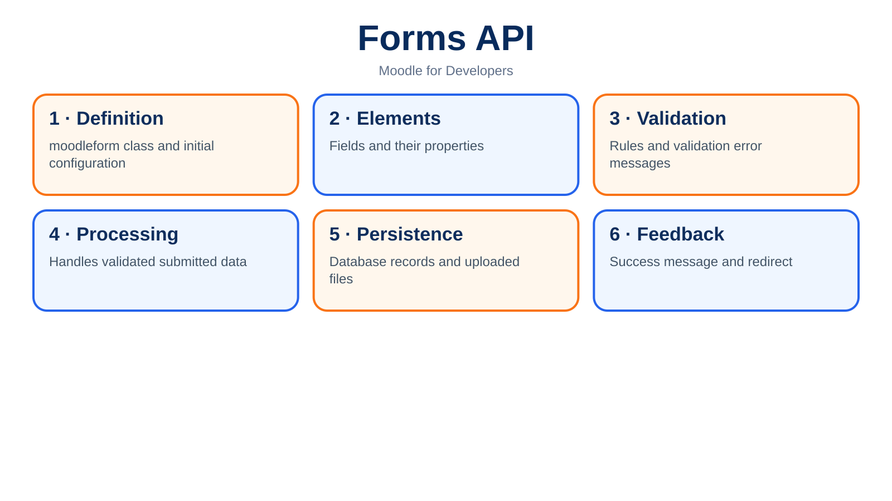
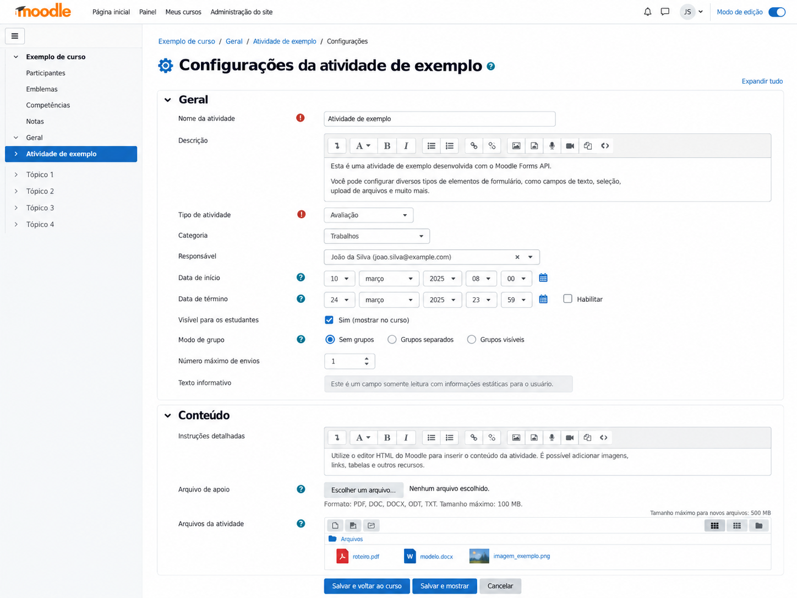



# 7. Forms API



A form can look like one of the simplest parts of a Moodle plugin until you need to edit an existing record, validate a rule that depends on the database, receive files, preserve an HTML editor with embedded images, open the same form inside a modal, and prevent a duplicate submission from doing something harmful. At that point it becomes clear that a `<form>` with a few `<input>` elements does not solve the whole problem, because the difficult part was never drawing the field on the screen; it was making the complete lifecycle behave predictably inside Moodle.

The Forms API exists precisely for that. It standardizes field construction and integrates validation, accessibility, cleaning of submitted values, CSRF protection, the File API, editors, action buttons, and several behaviors that would otherwise be reimplemented manually in every plugin. Underneath it still carries a historical inheritance from PEAR HTML_QuickForm, which explains some names and API choices that may look odd to developers arriving today, but the practical rule is simple: work with `moodleform`, not directly with HTML_QuickForm, and let Moodle handle the repetitive mechanics while your code remains responsible for the business rules.

That does not mean the Forms API solves authorization, persistence, and architecture for you. A form may validate perfectly and still save something the user should not be allowed to change if the page forgot `require_capability()`, just as a correct `setType()` does not replace escaping on output. It is important to understand that boundary from the start, because one of the most common mistakes in plugins is turning the form class into the place where everything happens, with queries, business rules, database updates, message sending, and redirects all mixed into `validation()`. It works until it does not, and it usually stops working when you need to reuse the same rule outside that screen.

## 7.1 What `moodleform` is

`moodleform` is the base class that organizes a traditional Moodle form. You create a class that extends it, implement `definition()`, and describe which elements exist, how submitted values should be cleaned, which simple rules apply, and which buttons will be displayed. A page then instantiates the class, checks whether the user cancelled, attempts to obtain validated data, and, if nothing was submitted, renders the form.

The Forms API still carries its HTML_QuickForm origins, but that detail matters more for understanding some historical design decisions than for guiding new code. A plugin should not instantiate `HTML_QuickForm`, depend on PEAR internal classes, or copy old examples that directly manipulate internal library structures, because Moodle's maintained contract is `moodleform` and its elements. When core needs to adapt accessibility, validation, layout, or JavaScript integration, compatibility is preserved at that layer.

A minimal form looks like this.

```php
<?php

namespace tool_catalog\form;

defined('MOODLE_INTERNAL') || die();

require_once($CFG->libdir . '/formslib.php');

final class edit_item_form extends \moodleform {
    public function definition(): void {
        $mform = $this->_form;

        $mform->addElement('text', 'name', get_string('name', 'tool_catalog'));
        $mform->setType('name', PARAM_TEXT);

        $this->add_action_buttons();
    }
}
```

The class only describes the form. It still does not know which record will be saved, where the user will be redirected, or whether the operation is creation or editing, and that is a good thing because those responsibilities belong to the flow that uses the form and to the plugin's domain classes.

## 7.2 When to use Moodle Forms

If a user needs to enter data on a Moodle page, Moodle Forms should be the first option, especially when the form has validation, conditional fields, an editor, files, or needs to follow the visual and accessibility behavior of the rest of the platform. Hand-written HTML may appear faster when there are only two fields, but the calculation changes as soon as you need to add `sesskey`, consistent error messages, preservation of submitted values after a validation failure, screen-reader support, File API integration, and correct behavior across themes.

There are exceptions. A simple filter inside a dynamic table, an isolated button, a control entirely managed by a JavaScript component, or an interaction that does not represent data submission may not justify a `moodleform` class, but that decision should come from the kind of interaction rather than from reluctance to create a class. A registration form written manually in a Mustache template is still a registration form and still needs to solve the same problems; you have simply taken manual responsibility for things Moodle already solves.

I usually use a very practical question. If tomorrow this form gains a file field, a conditional rule, and needs to appear in a modal, will the current structure still be healthy? If the answer is no, the hand-written HTML probably looked simple only because you considered the first version and ignored the feature's natural evolution.

## 7.3 Creating a form class

In new code, place the class in the component namespace, usually under `classes/form/`. For a `tool_catalog` plugin, for example, `classes/form/edit_item_form.php` naturally maps to `\tool_catalog\form\edit_item_form`. This keeps autoloading, organization, and discovery predictable instead of repeating the old pattern of `edit_form.php` files scattered through the plugin root.

There is an important historical exception in Activity Modules. `moodleform_mod` still has specific conventions and the activity settings form is located through the module editing flow, so Chapter 17 returns to that topic in detail. The important point here is not to take that special case and conclude that every Moodle form must live in a file named `mod_form.php` or use a non-namespaced global class.

The class receives arguments through the inherited constructor, including the action URL and `customdata`. `customdata` is useful when the visual definition depends on external data already resolved by the page, such as a list of allowed categories or a context the class needs in order to build an autocomplete. Use it to provide presentation dependencies, not to turn `_customdata` into a bottomless bag containing half of the application.

```php
$form = new \tool_catalog\form\edit_item_form(
    action: $url,
    customdata: [
        'context' => $context,
        'categories' => $categories,
    ],
);
```

Inside the class these values are available through `$this->_customdata`. Even though this is an old API and the property name begins with an underscore, it is the mechanism provided by `moodleform`.

## 7.4 `definition()`

`definition()` describes the form's initial structure and is called while the instance is being constructed. This is where you add elements, define types, defaults, simple rules, groups, and buttons, but it should not be used to save data, trigger events, update tables, or perform any side effect. The method may be called in situations where the intent is still only to render or validate the structure, so mixing persistence into it creates behavior that is difficult to predict.

It is also worth avoiding expensive queries inside `definition()`. If the page already knows the required list, pass it through `customdata`; if the value depends on a domain API, prefer preparing it before constructing the form or encapsulating the query in an appropriate class. A form that runs fifteen queries merely to discover which options to show is already expensive before the user touches a field.

There are cases where the definition depends on submitted values and Moodle provides mechanisms such as `definition_after_data()`, but use them when the structure genuinely needs to adapt after data have been organized. For showing and hiding fields based on a checkbox, `hideIf()` and `disabledIf()` normally solve the problem with less complexity.

## 7.5 `$this->_form`

The `$this->_form` property contains the `MoodleQuickForm` object that actually receives the elements. The common convention is to assign it to `$mform` at the start of `definition()`, because repeating `$this->_form` twenty times makes the code heavier without adding clarity.

```php
public function definition(): void {
    $mform = $this->_form;

    $mform->addElement('text', 'name', get_string('name', 'tool_catalog'));
    $mform->setType('name', PARAM_TEXT);
}
```

There is a distinction that often catches newcomers. Methods such as `addElement()`, `setType()`, and `setDefault()` belong to `$mform`, while `add_action_buttons()` belongs to the `moodleform` class, so the correct call is `$this->add_action_buttons()` rather than `$mform->add_action_buttons()`. It looks like a small detail, but it is exactly the sort of thing that makes people copy random examples without noticing which object they are manipulating.

## 7.6 Form elements

The Forms API contains common HTML elements and several Moodle-specific elements. The choice should not be based only on appearance because some components carry additional behavior, JavaScript integration, accessibility, File API support, or other internal APIs. An `autocomplete`, for example, is not merely a prettier `<select>`, and an `editor` is not a `<textarea>` with buttons above it.

Also avoid creating custom components for everything. If core already has an element that solves the interaction, using the standard component reduces custom JavaScript, improves theme compatibility, and tends to produce a more consistent interface. A custom component makes sense when the domain genuinely requires something the existing elements cannot represent, not because you want to move a selection by three pixels.

## 7.7 Text

The `text` element is intended for short input and is probably the most frequently used field. Always pair it with `setType()`, because the type tells the Forms API how the submitted value should be cleaned before you use it.

```php
$mform->addElement('text', 'name', get_string('name', 'tool_catalog'));
$mform->setType('name', PARAM_TEXT);
$mform->addRule('name', null, 'required', null, 'client');
```

Do not choose `PARAM_TEXT` by habit without considering the expected content. An identifier, a URL, an integer, and free text have different requirements. Chapter 8 returns to the `PARAM_*` types from the security perspective, but one simple rule is already worth keeping: typing input is part of the field contract, not decoration to satisfy a checker.

## 7.8 Textarea

`textarea` is appropriate for multiline plain text when you do not want rich formatting or embedded files. If the content needs links, images, lists, bold text, and Moodle filter processing, the correct element is normally `editor`, because a textarea does not carry a format or manage associated files.

```php
$mform->addElement(
    'textarea',
    'notes',
    get_string('notes', 'tool_catalog'),
    ['rows' => 8, 'cols' => 60],
);
$mform->setType('notes', PARAM_TEXT);
```

A frequent mistake is using a `textarea` to store HTML with `PARAM_RAW` merely because the field grew beyond one line. If you are storing user-produced HTML, there is a larger discussion about editors, formats, cleaning, and output, so skipping that architecture to save a few lines almost always costs more later.

## 7.9 Select

`select` works well when there is a small and predictable set of options. Array keys are the submitted values and array values are the displayed labels, so think about what actually needs to be persisted and do not use translated text as a business identifier.

```php
$options = [
    'draft' => get_string('statusdraft', 'tool_catalog'),
    'active' => get_string('statusactive', 'tool_catalog'),
    'archived' => get_string('statusarchived', 'tool_catalog'),
];

$mform->addElement('select', 'status', get_string('status', 'tool_catalog'), $options);
$mform->setType('status', PARAM_ALPHA);
```

If the set contains hundreds or thousands of items, a conventional select becomes a wall of options and may also be expensive to build. In that scenario, `autocomplete` normally provides a better experience and can support multiple selection and searching, although truly enormous lists may require a more specific loading strategy so that everything is not sent to the page at once.

## 7.10 Autocomplete

`autocomplete` is one of the best choices when a user needs to locate an option in a larger list. It provides search and can accept multiple values, but do not use that as an excuse to load fifty thousand users into a PHP array simply because the interface can search after everything reaches the browser.

```php
$mform->addElement(
    'autocomplete',
    'reviewers',
    get_string('reviewers', 'tool_catalog'),
    $useroptions,
    ['multiple' => true],
);
```

When the source is large, look for APIs and components that support remote searching or reconsider the flow. A nice interface does not repair a bad query, and an autocomplete backed by a gigantic array is still a gigantic select wearing makeup.

## 7.11 Checkbox

A checkbox represents a boolean condition, but remember that HTML forms treat unchecked fields differently from checked ones, so let the Forms API normalize the behavior and establish defaults where needed.

```php
$mform->addElement('advcheckbox', 'enabled', get_string('enabled', 'tool_catalog'));
$mform->setDefault('enabled', 1);
```

In Moodle you will frequently see `advcheckbox`, which provides behavior better aligned with the ecosystem than a raw checkbox. The value still needs to be interpreted by your domain and should never decide authorization. A user submitting `enabled=1` never means the user has permission to enable something.

## 7.12 Radio

Radio buttons are useful when the user must choose exactly one option from a small set and all alternatives should remain visible at once. If there are ten or twenty alternatives, a select or autocomplete probably communicates the information better and uses less space.

```php
$mform->addElement('radio', 'visibility', '', get_string('public'), 'public');
$mform->addElement('radio', 'visibility', '', get_string('private'), 'private');
$mform->setType('visibility', PARAM_ALPHA);
```

When several radio buttons represent the same decision, grouping the elements can improve organization and accessibility, particularly when the question label needs to be associated correctly with the entire group.

## 7.13 Date selectors

Dates look simple until time zones, optional times, and empty values become involved. Moodle provides its own selectors specifically to remain consistent with platform preferences and conventions. You can use `date_selector`, `date_time_selector`, and related options according to the required precision.

Avoid manually building three selects for day, month, and year or trusting a textual field interpreted on the server. In addition to reinventing the interface, you become responsible for validation, localization, and date behavior already solved by core. When a value represents a timestamp, make it clear in the domain whether the time matters or whether you are modeling only a logical date, because mixing the two often creates one-day differences across time zones.

## 7.14 Hidden

A `hidden` field exists to carry values through the form flow, not to protect those values. Anything in the browser can be modified by the user and must be treated as untrusted input.

```php
$mform->addElement('hidden', 'id');
$mform->setType('id', PARAM_INT);
```

If `id=52` identifies the record to be edited, the backend must load that record and confirm that the user may edit that exact item. Putting the ID in a hidden field does not create authorization, just as hiding a `userid` from the screen does not prevent someone from changing the value in the request. This distinction returns forcefully in Chapter 8 because it is the source of many IDOR vulnerabilities in Moodle plugins.

## 7.15 Static

`static` displays information inside the form without accepting an editable value. It is useful for showing contextual data, descriptions, or values users need to consult while filling in the rest.

```php
$mform->addElement(
    'static',
    'createdby',
    get_string('createdby', 'tool_catalog'),
    fullname($creator),
);
```

Do not confuse `static` with a security value. If the information needs to participate in processing, reload it from the server using a trusted key instead of trusting what appeared on the screen. The field is there for the person to read, not for the backend to learn something it should already know.

## 7.16 Group

Groups help organize related elements into one line or logical block. A common use is grouping buttons, complementary options, or elements that form the same decision.

The benefit is not merely cosmetic. Good grouping makes relationships among fields clearer, reduces visual noise, and can improve form semantics, while using groups to squeeze ten controls onto the same line usually does the opposite. Moodle is used on small screens and with high zoom, so a line that looks perfect on your 27-inch monitor cannot be the only layout reference.

## 7.17 `addRule()`

`addRule()` adds standardized validation rules such as required fields, length, numeric values, or known formats. When the rule is simple and clearly belongs to the field, putting it in the definition makes the contract visible next to the element.

```php
$mform->addRule('name', get_string('required'), 'required', null, 'client');
$mform->addRule('code', null, 'maxlength', 40, 'client');
```

The parameter that enables client-side validation improves the experience, but it must not be confused with protection. Anything that runs in the browser can be bypassed, so rules that really determine whether data are valid must exist on the server. When validation depends on another field, an existing record, or a domain rule, `validation()` is the more appropriate place.

## 7.18 `setType()`

`setType()` tells the form how the received value should be cleaned and normalized using Moodle's `PARAM_*` types. This happens before the value reaches the normal form processing flow and reduces the chance that every page invents its own cleaning strategy.

```php
$mform->setType('id', PARAM_INT);
$mform->setType('name', PARAM_TEXT);
$mform->setType('code', PARAM_ALPHANUMEXT);
```

There is no universal type. Using `PARAM_RAW` everywhere because "I'll validate it later" usually means nobody validated it later, while choosing an excessively restrictive type can damage valid data. Choose according to the real contract of the field, and remember that input cleaning does not replace output escaping. Text accepted with `PARAM_TEXT` must still be presented through the correct API in the correct context.

## 7.19 `setDefault()`

`setDefault()` defines the initial value when no more specific data have been loaded. It is useful for creation defaults, but do not confuse a default value with the current value of an existing record. In edit forms, `set_data()` should normally load the persisted state and take precedence over the default.

```php
$mform->setDefault('enabled', 1);
$mform->setDefault('status', 'draft');
```

Defaults should not hide critical business rules inside the form either. If every new entity begins with status `draft`, that may be a property of the service that creates the entity rather than merely a screen default. The form can suggest the value, but the backend must still preserve the rule when the same entity is created through CLI, a web service, or an import.

## 7.20 `disabledIf()`

`disabledIf()` disables one element according to the value of another field. It is excellent for simple dependencies and avoids custom JavaScript for interactions such as "only ask for an end date when an end date is enabled."

```php
$mform->addElement('advcheckbox', 'hasenddate', get_string('hasenddate', 'tool_catalog'));
$mform->addElement('date_time_selector', 'enddate', get_string('enddate', 'tool_catalog'));
$mform->disabledIf('enddate', 'hasenddate', 'notchecked');
```

The visual state does not replace validation. A user can construct a request with any combination of values, so the server must decide what to do when `hasenddate` is off but `enddate` was still submitted. Normally you ignore the dependent value or normalize it according to the domain rule.

## 7.21 `hideIf()`

`hideIf()` is similar to `disabledIf()`, but hides the element. Use it when displaying the field without its corresponding condition would only clutter the interface or confuse the user.

Hiding a field is not access control either. If a field may only be changed by someone with a capability, the best option is often not to add it at all for users without permission, or at minimum to ensure during processing that a value from those users will never be accepted. `hideIf()` responds to interface state, not authorization.

## 7.22 `freeze()`

`freeze()` turns an element into a read-only value within the form. This is useful when you want to display a value using the same layout but do not want it changed in that operation, for example an immutable identifier during editing.

The same warning is worth repeating because it matters: read-only in the frontend is not security. If a value must not change, the real rule belongs on the backend and processing must ignore any attempt to alter it. An attacker does not need to respect the HTML rendered by Moodle.

## 7.23 `validation()`

`validation()` is where rules that do not fit simple types and validation rules belong. The method receives submitted data and files and returns an array of errors, where each key normally matches the name of the element that should display the message.

```php
public function validation($data, $files): array {
    $errors = parent::validation($data, $files);

    if (!empty($data['hasenddate']) && $data['enddate'] <= time()) {
        $errors['enddate'] = get_string('enddatemustbefuture', 'tool_catalog');
    }

    return $errors;
}
```

It is tempting to place every business rule here because the method already receives the data, but consider what happens when the same operation arrives through REST or a task. If a rule determines whether an entity may exist, that rule should live in a reusable layer and `validation()` should only translate it into messages associated with fields. Otherwise you create two sources of truth, one for the form and another for everything else.

Also avoid side effects in `validation()`. Do not insert a record to test uniqueness, send an email, or "pre-reserve" something. Validation can run more than once and should be safe to repeat.

## 7.24 Client-side versus server-side validation

Client-side validation exists for experience. It quickly tells the user that a required field is empty, avoids an unnecessary round trip to the server, and makes the form more comfortable to use, but anyone can disable JavaScript, alter the DOM, or call the endpoint directly.

Server-side validation exists for integrity. It is the side that must guarantee dates, relationships, uniqueness, limits, and every rule that cannot be violated. In real systems, treat the client as assistance for an honest user and the server as the final authority.

The same rule applies to Dynamic Forms. Submitting through AJAX does not make the browser more trustworthy; it only changes the transport. PHP still has to validate context, capability, parameters, and business rules.

## 7.25 `get_data()`

`get_data()` represents the point at which the form has been submitted and passed validation. When it returns an object, you can proceed with processing the operation.

```php
if ($data = $form->get_data()) {
    $service->save($data);
    redirect($returnurl, get_string('changessaved'));
}
```

Do not treat `get_data()` as automatic persistence. Moodle Forms collects and validates input, but your code decides how that becomes an entity, database record, event, or permanent file. This separation is useful because it lets you test business logic without having to construct an entire form.

Also prefer explicitly copying the fields you need, or passing the data to a layer that knows the contract, instead of sending the entire object straight to `$DB->insert_record()` without thinking. Forms grow over time, and adding a new visual field should not automatically become a new persisted column by accident.

## 7.26 `set_data()`

`set_data()` loads existing values into the form, particularly in edit scenarios. The object or array must use names compatible with the defined elements.

```php
if (!$form->is_submitted()) {
    $form->set_data($record);
}
```

In practice, you normally arrange the flow so that `set_data()` is called only on the display path after cancel handling and submission processing. The important detail is to prepare data first when an editor or filemanager is involved, because those fields work with draft areas and do not simply accept the raw value stored in the database.

Another point is not to call `set_data()` with a huge table record and assume that every extra property will remain harmless forever. The form class should know the fields it receives, especially when property names overlap with hidden elements or internal controls.

## 7.27 `is_cancelled()`

The Cancel button should not be treated as a normal submission that failed validation. `is_cancelled()` exists to identify this path and allow an immediate return to the previous page or another appropriate destination.

```php
if ($form->is_cancelled()) {
    redirect($returnurl);
}
```

Check cancellation before processing `get_data()`. Besides making the intention explicit, this avoids unnecessary preparation for an operation the user explicitly abandoned. And do not invent a "Cancel" button that writes a status, deletes a draft, or updates the database, because then it is no longer cancellation; it is a business action that deserves its own flow.

## 7.28 Submit

The primary button is normally added with `add_action_buttons()`, which creates the standard submit structure and, optionally, a Cancel button.

```php
$this->add_action_buttons(
    cancel: true,
    submitlabel: get_string('savechanges'),
);
```

Modern versions also provide `add_sticky_action_buttons()`, useful for long forms because it keeps actions accessible while scrolling. Do not build your own JavaScript solution for sticky buttons when core already offers the convention.

For different actions, be careful with multiple submit buttons and no-submit buttons. The fact that a form contains three buttons does not mean everything should end up in one function with fifteen `if` statements. When actions have different semantics and authorization rules, separate endpoints can produce clearer code than turning one form into a generic control panel.

## 7.29 Cancel

The standard Cancel action is part of Moodle's navigation contract and should return the user to a predictable place, normally without side effects. If the form opened inside a dynamic modal, cancellation should likewise close the interaction without persisting data.

It sounds obvious, but plugins often contain bugs where cancelling still triggers an update because code processed some value before checking `is_cancelled()`. That kind of bug is caused by flow order rather than by the button itself, and it disappears when the page follows a clear sequence of authorization, construction, cancellation, valid submission, and rendering.

## 7.30 `repeat_elements()`

`repeat_elements()` solves cases where you need a variable number of groups, such as answer options, criteria, or configuration rows. Moodle controls the repetition count and normally rebuilds the structure when the user asks for more fields.

```php
$elements = [
    $mform->createElement('text', 'label', get_string('label', 'tool_catalog')),
    $mform->createElement('text', 'value', get_string('value', 'tool_catalog')),
];

$options = [
    'label' => ['type' => PARAM_TEXT],
    'value' => ['type' => PARAM_TEXT],
];

$this->repeat_elements(
    $elements,
    3,
    $options,
    'rule_repeats',
    'rule_add_fields',
    1,
);
```

The result arrives as indexed data, so persistence must handle the collection, remove empty rows, and validate every item. Do not use `repeat_elements()` to edit a gigantic table of existing records, because beyond a certain size the whole page becomes a heavy and difficult form. In that case, a table with individual editing or a modal usually scales better.

## 7.31 HTML editor

The `editor` element is not merely an enhanced textarea. It works with text, format, and embedded files, so its value normally contains a structure with `text`, `format`, and a draft `itemid`.

```php
$mform->addElement(
    'editor',
    'description_editor',
    get_string('description', 'tool_catalog'),
    null,
    $editoroptions,
);
```

When editing existing content, you prepare a draft area, rewrite links to temporary files, and load that set into the form. On submission, the files need to leave the draft and move into the permanent file area, while text should return to storing `@@PLUGINFILE@@` references where applicable. Chapter 9 goes deeper into this because the File API deserves its own treatment, but here you at least need to understand why simply saving `$data->description_editor['text']` can leave URLs pointing to the user's temporary area.

If the plugin does not need HTML, do not use the editor merely because it looks more complete. The more powerful the field, the larger the formatting, file, and processing surface you must handle.

## 7.32 Filepicker

`filepicker` is appropriate when the user selects a file that will be consumed by the operation, such as a CSV for import or an image that will be processed immediately. It integrates the Repository API and uploads, avoiding a manual `<input type="file">` and all the differences between file sources.

After submission, you can obtain the temporary file or save it through the File API according to the feature's purpose. For transient imports, there is no reason to create a permanent file area merely to keep forever a file that has already been processed unless the product explicitly requires auditing or reprocessing.

Validate the content on the server as well. Extension and MIME type help, but data imports need to check structure, size, and limits because the fact that Filepicker accepted a file does not mean its contents make sense for your business rule.

## 7.33 Filemanager

`filemanager` manages a collection of files attached to a file area. It is the most common element when users can add, remove, and reorganize attachments that must remain associated with an entity.

It works on a draft area while editing. This matters because the user can remove one file and add another without immediately altering the permanent area; only when a valid submission is processed do you synchronize the draft with the final destination.

A typical edit flow conceptually looks like this.

```php
$draftitemid = file_get_submitted_draft_itemid('attachments');

file_prepare_draft_area(
    $draftitemid,
    $context->id,
    'tool_catalog',
    'attachments',
    $record->id,
    $fileoptions,
);

$record->attachments = $draftitemid;
$form->set_data($record);
```

After a valid submission, the area is saved.

```php
file_save_draft_area_files(
    $data->attachments,
    $context->id,
    'tool_catalog',
    'attachments',
    $record->id,
    $fileoptions,
);
```

These functions appear again in Chapter 9 in much more detail, including `contextid`, `component`, `filearea`, `itemid`, virtual directories, and `pluginfile.php`.

## 7.34 Draft files

A draft area is temporary storage associated with a user while editing. It exists because the browser needs to allow upload, removal, and modification of files before you know whether the person will actually save the form. If every click immediately changed permanent files, implementing Cancel correctly would be almost impossible.

This architecture explains behavior that can look strange if you only inspect the database. During editing, a file may exist in the user's draft area, and only after a valid submission is it copied or logically moved to the final combination of context, component, file area, and item ID. That is why you should never try to guess the physical path inside `moodledata` and copy files with `rename()` or `copy()`.

Another important detail is lifecycle. Draft storage is not permanent and Moodle may clean it up. If your code stores a draft item ID in the database expecting to find it weeks later, it is using the wrong area for the job.

## 7.35 Form identifiers

Each form needs to be identifiable on the page for JavaScript, CSS, and internal mechanisms. Current documentation notes that the class name influences the form's HTML `id`, with the `_form` suffix removed, so generic names such as `edit_form` repeated in different contexts can create ambiguity and make customization harder.

Prefer names tied to the responsibility, such as `edit_item_form`, `import_users_form`, or `configure_provider_form`, inside an equally clear namespace. Dynamic Forms also use an identifier for transport and class loading, so collisions and renaming have a larger impact than mere style.

Do not write JavaScript that looks for `form:eq(2)` or assumes this is the third form on the page. If behavior depends on a particular form, identify it in a stable way and use the API that accompanies the component.

## 7.36 CSRF and the Forms API

The Forms API integrates session protection into the standard flow and includes `sesskey` in submissions, removing a great deal of repetition and reducing common mistakes. That does not mean every action performed from a `moodleform` is automatically secure.

CSRF answers the question "was this request submitted within a valid session with the expected token?" A capability answers "may this user perform this action in this context?" Record ownership answers "may this user modify this specific object?" These are different problems, and a correct form must coexist with all three checks where applicable.

Also do not use GET for a destructive action merely because a nice form was displayed beforehand. The operation that changes state must use the appropriate mechanism and validate the session at the endpoint that actually performs the change. Chapter 8 goes deeply into the attacks, but the practical rule here is simple: the Forms API helps a great deal with CSRF, but it does not outsource your authorization.

## 7.37 Dynamic Forms

Dynamic Forms solve a different problem from traditional forms. Instead of loading and submitting the entire page, a class based on `\core_form\dynamic_form` can be loaded and processed through AJAX, normally inside a modal or a container on the page itself.

This API is not simply "`moodleform` with JavaScript magic," and it is worth understanding its specific contract. The class still extends `moodleform`, so it continues to use `definition()`, types, and validation, but it must implement methods to resolve context, check access, prepare initial data, process submission, and provide the page URL required by components that depend on it.

A typical structure looks like this.

```php
namespace tool_catalog\form;

final class edit_item_dynamic_form extends \core_form\dynamic_form {
    public function definition(): void {
        $mform = $this->_form;
        $mform->addElement('text', 'name', get_string('name', 'tool_catalog'));
        $mform->setType('name', PARAM_TEXT);
    }

    protected function get_context_for_dynamic_submission(): \context {
        return \context_system::instance();
    }

    protected function check_access_for_dynamic_submission(): void {
        require_capability('tool/catalog:manage', $this->get_context_for_dynamic_submission());
    }

    public function set_data_for_dynamic_submission(): void {
        $id = $this->optional_param('id', 0, PARAM_INT);
        if ($id) {
            $this->set_data($this->load_record($id));
        }
    }

    public function process_dynamic_submission() {
        $data = $this->get_data();
        return $this->save_record($data);
    }

    protected function get_page_url_for_dynamic_submission(): \moodle_url {
        return new \moodle_url('/admin/tool/catalog/index.php');
    }
}
```

The example simplifies the service layer to emphasize the form contract. In real code, `load_record()` and `save_record()` would probably belong to a domain API or class, especially so that the same operation can be called outside the modal.

## 7.38 Forms inside a modal

A modal is an excellent use case for Dynamic Forms when the operation is short and contextual, such as editing one row of a table without leaving the page. The mistake is putting every form in a modal because it looks modern. A form with forty fields, editors, attachments, and several sections normally deserves its own page because a small modal otherwise becomes a website inside a website.

On the frontend, Moodle provides infrastructure to open the modal and load the dynamic class, handling submission, validation errors, and closing. When server-side validation fails, the form can be rendered again with its errors without reloading the whole page, preserving the traditional form experience inside an AJAX flow.

Even in a modal, do not return arbitrary HTML built by PHP string concatenation. Continue using the Forms API, templates, and core components. The modal changes the container; it does not revoke the architectural decisions from Chapter 6.

## 7.39 AJAX forms

Not every AJAX form needs to appear in a modal. `core_form/dynamicform` can mount the class inside an existing container and control submit and cancel events without destroying the entire page. This is useful in embedded settings, dashboards, and areas where editing is part of the surrounding visual context.

The advantage over writing a manual AJAX endpoint is significant. You reuse the same definition, cleaning, and validation from the Forms API while core infrastructure handles the specific transport of dynamic submission. This avoids the bad architecture in which one PHP form handles initial rendering while a second, parallel JavaScript implementation saves data, each with different rules.

Even so, a Dynamic Form is not a generic Web Service. If the feature must be consumed by an external application, integration, or several clients, the business rule should probably live in a reusable API and an External Function should expose the appropriate contract. The Dynamic Form can then call the same internal layer without accidentally becoming your public API.

## 7.40 `moodleform_mod`



`moodleform_mod` is the specialization used by the create/edit form for Activity Modules. It understands concepts a generic `moodleform` does not, including the course, course module, common activity settings, groups, availability, completion, and the standard elements of a module form.

That is why it makes no sense to extend `moodleform_mod` in a local plugin or admin tool just because it "has more features." The class belongs to the Activity Module lifecycle and carries expectations specific to `modedit.php` and `mod` callbacks.

Chapter 17 covers `mod_form.php`, `standard_intro_elements()`, `standard_coursemodule_elements()`, `add_action_buttons()`, and data preprocessing and postprocessing in much greater depth. For now, keep the separation clear: a normal form extends `moodleform`; an activity settings form extends `moodleform_mod`; a dynamic form extends `core_form\dynamic_form`.

## 7.41 A page flow that does not become spaghetti

A healthy edit page usually follows a predictable order. First bootstrap Moodle and read basic parameters, resolve context and authorization, load the record when one exists, prepare auxiliary data, instantiate the form, handle cancellation, handle valid submission, and only then render.

```php
require_once(__DIR__ . '/../../../config.php');

$id = optional_param('id', 0, PARAM_INT);

$context = context_system::instance();
require_login();
require_capability('tool/catalog:manage', $context);

$url = new moodle_url('/admin/tool/catalog/edit.php', ['id' => $id]);
$returnurl = new moodle_url('/admin/tool/catalog/index.php');

$record = $id ? $repository->get($id) : null;
$form = new \tool_catalog\form\edit_item_form($url);

if ($form->is_cancelled()) {
    redirect($returnurl);
}

if ($data = $form->get_data()) {
    $service->save($data, $record);
    redirect($returnurl, get_string('changessaved'));
}

if ($record) {
    $form->set_data($record);
}

$PAGE->set_context($context);
$PAGE->set_url($url);
$PAGE->set_title(get_string('edititem', 'tool_catalog'));
$PAGE->set_heading(get_string('edititem', 'tool_catalog'));

echo $OUTPUT->header();
$form->display();
echo $OUTPUT->footer();
```

This design looks simple because each stage has a clear responsibility. If saving requires fifty lines in the middle of this file, the problem is not the Forms API; it is the lack of an appropriate layer for the business rule.

## 7.42 Do not turn the form class into a service

There is a temptation to add methods such as `save()`, `delete()`, `send_notification()`, and `calculate_price()` to the form class because "the data are already there." That ties business rules to the interface and makes every second delivery channel harder.

Imagine that tomorrow the same operation must run from CLI. Would you instantiate a fake form inside a task just to reuse `save()`? If that sounds absurd, it is because the rule is in the wrong class. The form class should define, prepare, and validate the interaction, while a service class or plugin API performs the operation.

This separation also improves PHPUnit tests. It is far easier to test `catalog_service::save()` with controlled data than to simulate an entire form lifecycle to verify a rule that does not belong to the interface in the first place.

## 7.43 Validation that queries the database

Querying the database during validation is not forbidden, but it should be deliberate. Checking whether a code already exists may be useful so that an error can be associated with the field before submission, but the definitive guarantee of uniqueness belongs in the database when the rule is structural.

Without a unique index, two concurrent requests can pass the same validation and insert the same value. The Forms API does not solve race conditions. The form improves the user-facing error message, while schema and transactions protect integrity.

The same principle applies to permissions. Do not query the database in `validation()` to discover whether the user may edit the record and then assume authorization is complete. Check capability and ownership in the access flow, and use validation to explain whether the data themselves are coherent.

## 7.44 Conditional fields and server truth

`disabledIf()` and `hideIf()` produce a good interface, but the real rule must always exist in PHP. If selecting "has deadline" enables a date, normalize the data explicitly on the backend.

```php
if (empty($data->hasenddate)) {
    $data->enddate = 0;
}
```

This avoids carrying historical garbage. Otherwise, someone can enable the option, choose a date, disable it again, and save, while the old date remains in the database. Months later another part of the code checks only `enddate` and starts treating a deadline as active even though the interface had it disabled.

The interface and persistence model need to agree on which field determines the state.

## 7.45 Validation errors that actually help

A message such as "Invalid data" is almost useless. Where possible, associate the error with the correct element and explain what needs to be corrected without exposing internal detail. "The end date must be later than the start date" helps; "Exception invalid value" does not.

Also avoid simply repeating the label. A field called "Code" with an error saying "Invalid code" still leaves the user guessing about the expected format. If there is a restriction of 3 to 20 alphanumeric characters, say so in help text or in the error message.

Good validation reduces support requests, but it must not reveal whether a confidential resource exists when the user should not have that information. Security also applies to error messages.

## 7.46 Long forms

When a form extends across two or three screens of scrolling, shrinking the font is rarely the solution. Use headers, advanced elements, coherent groups, and sticky action buttons where appropriate, and ask whether every option really needs to appear at once.

Sometimes the best form is two smaller flows, particularly when one section is only needed after the record exists. Files and settings that depend on an ID are classic examples. Creating the basic record first and opening additional configuration later can simplify draft areas, validation, and the overall experience.

But do not fragment a form merely to look modern. Five steps containing two fields each are also tiring and make review harder. The point is to model the user's real task, not to obey an arbitrary number of fields per page.

## 7.47 Accessibility does not come only from the component

The Forms API gives you a much stronger baseline than improvised HTML, but it is still possible to build a bad form. Vague labels, groups without context, instructions that depend only on color, and illogical element order remain problems even when you use `moodleform`.

Use clear strings, help buttons when the explanation genuinely helps, and do not visually remove labels simply to make the page look "clean" without understanding the impact on screen readers. Moodle already carries a great deal of accessibility work in its components, so work with that infrastructure rather than against it.

Test with the keyboard as well. If a custom field only works with a mouse, the problem does not disappear because the field happens to be inside a Moodle form.

## 7.48 Exercise - a complete CRUD using the Forms API

The exercise for this chapter is to build a small administrative catalog CRUD in the fictional `tool_catalog` plugin. The goal is not to build a product system, but to bring together the decisions studied here without yet depending on APIs covered in later chapters.

Create a `tool_catalog_item` table with `id`, `name`, `code`, `description`, `status`, `enabled`, `timecreated`, and `timemodified`. The listing should display records and provide creation and editing, while deletion must use a protected action and an appropriate confirmation. The edit form should live in `classes/form/edit_item_form.php`, use `text` for name and code, `editor` for description, `select` for status, and `advcheckbox` for enabled state.

The code must validate a required name, code format, and uniqueness, but the table should also have a unique index on the code. During editing, the record itself must not conflict with its own code during the uniqueness check. Description should be stored with its format and prepared correctly if you decide to allow embedded files; in that case, it is already useful to leave the integration ready for the deeper treatment in Chapter 9.

The `edit.php` page must not run direct SQL to save. Create a small service or repository class for persistence and let the page only coordinate context, authorization, the form, and redirects. Cancellation must return without side effects and `set_data()` should be used only on the display path.

After the traditional version works, create a second editing experience using `\core_form\dynamic_form` inside a modal, reusing the same service class. The goal is to notice that the interface can change without duplicating the business rule. If you need to copy the saving logic into the Dynamic Form, the separation is not yet good enough.

Finally, force failures. Submit another record's ID, alter hidden fields, remove JavaScript, try the same duplicate code in two concurrent requests, and send values that client-side validation would normally block. A correct form is not one that works only when the user does exactly what you expect; it is one that remains consistent when the request does not respect the interface.

## 7.49 What you should take away from this chapter

The Forms API is not a collection of methods for drawing fields; it is infrastructure that organizes input, validation, and user experience inside Moodle. Used correctly, it removes a great deal of repetitive code, but it does not replace modeling, authorization, the File API, or the business layer.

If there is one idea worth carrying into the next chapters, it is this: the form class knows the interaction, while your application knows the rule. Mixing the two makes every evolution more expensive, especially once AJAX, web services, CLI, imports, and automated tests appear.

The best sign that a form is well designed is that you can change the interface without rewriting the operation. A normal page, a modal, and an API can all use the same business rule, each one handling only how data enter and how the response returns to the caller.

## 7.50 Technical references consulted

* Moodle Developer Resources. Forms API, version 5.2 and main documentation. Available at `https://moodledev.io/docs/5.2/apis/subsystems/form` and `https://moodledev.io/docs/5.3/apis/subsystems/form`.
* Moodle Developer Resources. Form Usage. Available at `https://moodledev.io/docs/5.2/apis/subsystems/form/usage`.
* Moodle Developer Resources. Repeat elements. Available at `https://moodledev.io/docs/5.2/apis/subsystems/form/advanced/repeat-elements`.
* Moodle Developer Resources. Files in Forms and File API. Available at `https://moodledev.io/docs/5.0/apis/subsystems/form/usage/files` and `https://moodledev.io/docs/5.2/apis/subsystems/files`.

Moodle PHP Documentation. `core_form\dynamic_form` and `moodleform_mod`. Available at `https://phpdoc.moodledev.io/`.

Moodle Developer Documentation. Modal and AJAX forms. The historical documentation remains useful for understanding `core_form\dynamic_form`, its access methods, data loading, and dynamic submission processing.

