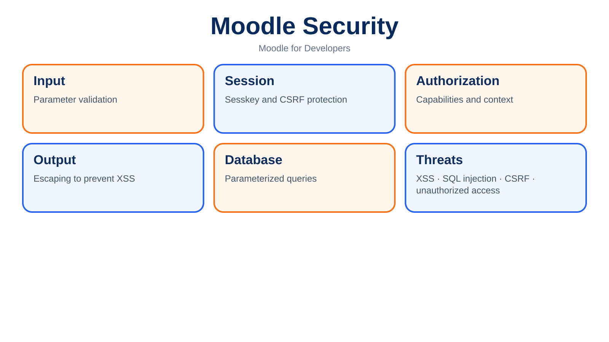
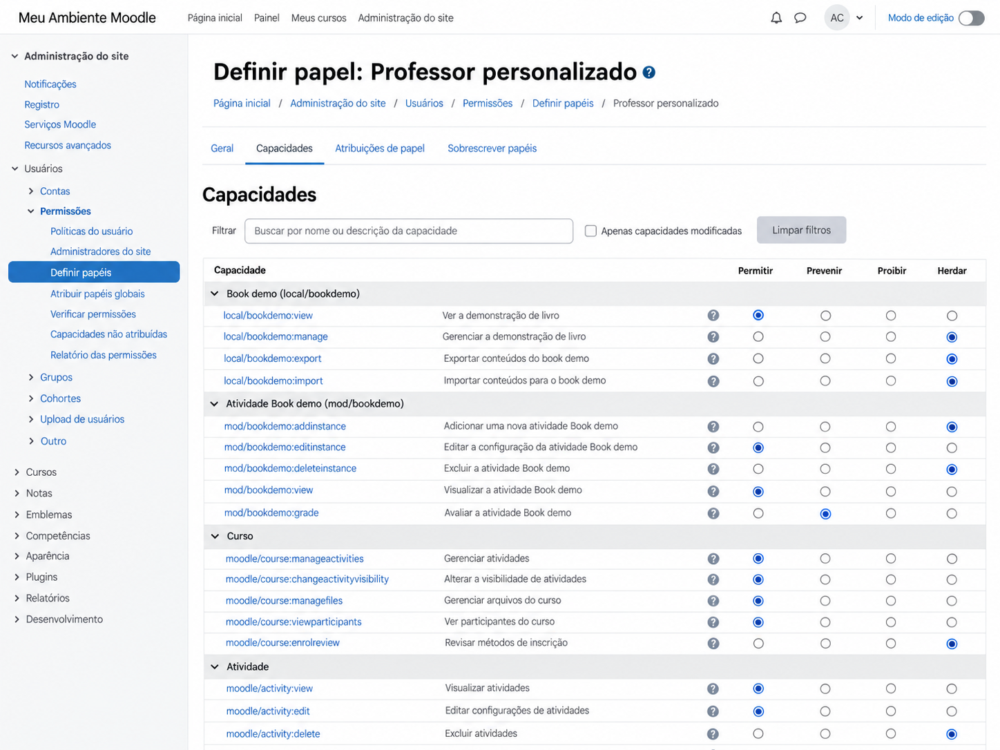



# 8. SECURITY



Security in a Moodle plugin is often taught as a list of functions you need to remember to call: `require_login()`, `require_capability()`, `require_sesskey()`, `required_param()`, and a few more. The problem is that memorizing those functions does not make code secure, because almost every interesting vulnerability appears precisely when the right function was called in the wrong place, in the wrong context, or protecting a decision different from the one that actually needed protection.

Imagine a page that receives `courseid=10`, calls `require_login()`, checks `moodle/course:update` in course 10, and then updates a record whose `id=875` also came from the URL. It looks protected, but one question remains unanswered: does record 875 belong to course 10? If not, the user may have perfectly valid permission in course 10 and still be able to change something in course 22. This is the kind of failure that does not appear when security is treated as a checklist of functions, because the problem is not missing authentication or a missing capability; it is the relationship between the received data and the real resource being manipulated.

That is why I prefer to view Moodle security as a sequence of questions. Who is making the request? In which context does this action happen? Does the user have the required capability in that context? Does the object being read or modified actually belong to that context? Did the request use the expected method and include CSRF protection? Do received parameters have the expected type and format? Will content be rendered safely? Can the code reach files, URLs, or data the user should not control? When these questions are answered in the correct order, `require_login()`, capabilities, `sesskey`, the Parameter API, Output API, and File API stop being independent patches and become parts of the same model.

## 8.1 Moodle's security model

Moodle works with several complementary security layers. The first identifies the user and establishes the session, the second determines what that user can do through contexts, roles, and capabilities, while other layers protect request integrity, input validation, browser output, file access, external calls, and isolation among system objects.

This means there is no magic function called `secure_page()`. A page can be correctly authenticated and still be vulnerable to IDOR; it can check a capability and remain vulnerable to CSRF; it can use `required_param()` and remain vulnerable to SQL Injection if the value is concatenated into a structural part of SQL; and it can render everything in Mustache while still creating XSS if it uses `{{{content}}}` with untrusted HTML.

Moodle also relies on an important idea: each component is responsible for its own attack surface. A single insecure endpoint in a plugin installed on thousands of sites can expose data, files, tokens, or administrative actions, so a mature core does not automatically protect third-party code. The plugin runs in the same process and session and generally has access to the same APIs and database, which means a small flaw can have consequences far larger than the file in which it appears.

## 8.2 Authentication versus authorization

Authentication answers "who are you?" while authorization answers "what may you do here?" The distinction sounds obvious, but a surprising amount of code mixes the two and assumes that `require_login()` already protected the entire operation.

When `require_login()` succeeds, we know there is an authenticated user and, when a course or activity was provided, that Moodle's general access flow for that resource was respected. We still do not know whether that user may edit a setting, view another person's data, delete a record, download a particular file, or perform an administrative operation. Those decisions belong to authorization and are normally expressed through capabilities checked in the correct context, combined with ownership and object-relationship rules where needed.

The classic mistake is writing an administrative page with `require_login()` and considering the work finished. Every authenticated student also passes `require_login()`, so the page is now protected from anonymous users but may remain open to practically everyone on the site. In security terms, reducing the attacker population from "the whole internet" to "all authenticated users" is not much of a victory when the action was intended only for managers.

## 8.3 `require_login()`

In traditional web scripts, `require_login()` should appear early, before any output and before loading data the user should not even know exists. The function can receive a course and a course module, and that matters because Moodle does not treat login merely as the presence of a session. When you provide the course and activity, core can apply enrolment, visibility, access, and other rules related to that resource.

An Activity Module page normally resolves the cm and course and then requires login to that resource. In a local plugin page, however, the plugin type does not determine whether the correct call is `require_login()` or `require_login($course)`; the real scope of the page does. A global tool may require only site login, while another screen in the same local plugin that belongs to a course should provide the course so Moodle can apply the corresponding access flow.

```php
require_once(__DIR__ . '/../../config.php');

$id = required_param('id', PARAM_INT);
$cm = get_coursemodule_from_id('example', $id, 0, false, MUST_EXIST);
$course = get_course($cm->course);

require_login($course, true, $cm);

$context = context_module::instance($cm->id);
require_capability('mod/example:view', $context);
```

Notice the order. First the identifier is normalized, then Moodle resolves the real objects, next it validates access to the course and activity, and only then does it check the capability in the context that represents that exact module. Receiving `courseid` and `contextid` separately from the browser to avoid those lookups may look like an optimization, but it replaces a trustworthy resolution with two client-controlled values.

### 8.3.1 `require_login()` and `require_login($course)` are not equivalent

From a security perspective, `require_login()` without a course confirms authentication and executes the general session flow, but it does not assert that the user may enter any course selected afterward. `require_login($course)` adds the semantics of access to that specific course, including enrolment decisions, guest access, visibility, and other core rules. Switching from one form to the other merely to change how a page looks also changes its access rule, which is exactly the kind of "visual adjustment" that can turn into a vulnerability.

There is also an important architectural effect: when access is granted, `require_login($course)` calls `$PAGE->set_course($course)`. That updates `$PAGE->course` and the global `$COURSE`, establishes `context_course` when the context has not already been set, prepares locale behavior, and integrates the page with the course format. The same call that decides access therefore also changes Page API state, which explains why navigation and rendering begin to behave like part of the course.

### 8.3.2 Passing the course is an access decision, not a breadcrumb technique

I would completely avoid passing `$course` to `require_login()` merely because you want a course breadcrumb. The argument exists first because the page is attached to that course and must respect its access rules; coherent navigation follows as a consequence of `$PAGE` knowing where it is. Likewise, do not remove the course just because the theme made the page look like an internal course page, because the consequence is not only visual.

If a tool is global and merely filters data by `courseid`, you can use site-level `require_login()` and then check capabilities and relationships for each course being queried. If the page represents an operation inside a course, `require_login($course)` is normally the correct flow. In both cases the decision must come from the access model rather than from how the header happens to look.

### 8.3.3 What the second parameter actually controls

The second parameter to `require_login()` is `$autologinguest`. `require_login($course, false)` does not mean "log in to the course without changing `$PAGE`" and it does not mean "do not render this as a course page"; it only means Moodle should not use the guest autologin mechanism for that call. The course is still validated and, when access is granted, it is still set on `$PAGE`.

```php
// Global tool.
require_login();

// Page belonging to the course, allowing the default guest behavior.
require_login($course);

// Page belonging to the course, without guest autologin.
require_login($course, false);
```

### 8.3.4 When we pass the course module

With the third parameter, validation becomes even more specific. `require_login($course, false, $cm)` checks that the course and cm correspond, uses `cm_info` to work with the activity access rules, validates visibility and availability, and, when access is granted, prepares `$PAGE` with `set_cm()`. In this flow the normal context becomes `context_module` and the layout becomes `incourse`, which makes sense because we are no longer merely inside a course but inside a concrete activity.

This is particularly important for security because an activity can be hidden, restricted by availability, or in a state that should not be accessible to that user. Calling only `require_login($course)` and then loading any `course_modules.id` received from the URL makes your code responsible for reimplementing rules core already knows how to apply, and manually repeating access rules is an efficient way to forget exactly the exception that later appears in production.

### 8.3.5 `require_login()` is still not `require_capability()`

Even when you pass a course and cm, `require_login()` answers whether the user may reach that resource within the general access flow; it does not answer whether the user may perform the specific action your plugin invented. A student may be able to open an activity but not edit its configuration, a teacher may view a report but not change global plugin settings, and an enrolled user may access the course without being allowed to inspect another user's data.

```php
require_login($course, false, $cm);

$context = context_module::instance($cm->id);
require_capability('mod/example:manage', $context);
```

Capability checks may still be insufficient when record ownership is involved. If the endpoint receives `noteid`, `submissionid`, `attemptid`, or any similar object ID, you must load the record and prove that it belongs to the course, activity, user, or group that has already been authorized. This is why the later sections on IDOR and record ownership are a direct continuation of this discussion, not an unrelated topic.

### 8.3.6 Three patterns that avoid confusion

A global administrative page normally authenticates at site level, works in `context_system`, and requires a global capability. A course page loads the real course, calls `require_login($course)`, creates or reuses `context_course`, and requires the capability for that course. An activity page resolves the cm and course through a trustworthy relationship, calls `require_login($course, false, $cm)`, works in `context_module`, and only then applies the activity-specific capability.

```php
// Global.
require_login();
$context = context_system::instance();
require_capability('local/example:manage', $context);

// Course.
$course = get_course($courseid);
require_login($course);
$context = context_course::instance($course->id);
require_capability('local/example:viewcourse', $context);

// Activity.
$cm = get_coursemodule_from_id('example', $id, 0, false, MUST_EXIST);
$course = get_course($cm->course);
require_login($course, false, $cm);
$context = context_module::instance($cm->id);
require_capability('mod/example:view', $context);
```

These patterns are not three recipes to memorize. They make the correspondence among resource, context, and authorization explicit. When that correspondence is correct, the code tends to stay simple; when it is wrong, developers start compensating with checks on `$USER`, `contextid` from the browser, hard-coded roles, and other solutions that seem to work until someone reaches the endpoint through a path you did not test.

## 8.4 Contexts - revisiting Chapter 1

A context is not a formality wrapped around a capability. It is part of the authorization question itself. `moodle/course:update` in a course context is not the same thing as administrative permission at system level, and a capability in `context_module` should not be checked in `context_system` merely because the user also holds some broader role.

Moodle organizes contexts in a tree, with the system at the top and category, course, module, user, and block contexts at specific positions. Permissions can be inherited along that tree, so a decision made in the wrong context can open far more access than expected or, in the opposite direction, deny a legitimate action.

When in doubt, ask which object is being protected. If the action changes an activity instance, the natural point is usually `context_module`; if it changes course configuration, `context_course`; if it manipulates a user's profile, `context_user` may be appropriate; if it is global installation configuration, the system context is probably correct. Choosing `context_system` simply because it is easy to obtain is an elegant way to hide a bad decision inside perfectly valid code.

## 8.5 Roles

A role is a set of permissions that can be assigned in a context, but plugin authorization should not be programmed around role names such as "student," "teacher," or "manager." An institution can create its own roles, change archetype permissions, duplicate a role, or combine assignments in ways your code never anticipated.

That is why code like this should raise suspicion.

```php
if (is_siteadmin() || user_has_role_assignment($USER->id, $teacherroleid)) {
    // May edit.
}
```

The right question is not "is the user a teacher?" but "may the user perform this action in this context?" That distinction allows administrators to configure the site according to institutional reality without requiring the plugin to know the organization's role structure.

There are exceptions where you genuinely need to work with roles, particularly in administrative and enrolment functionality, but that is different from using a role as a substitute for a capability to protect a page. Moodle itself recommends thinking in terms of the user's capability in that context rather than which role granted it.

## 8.6 Capabilities



A capability represents an action that can be allowed or denied in a context. Good names describe the action, not the type of user. `local_catalog:manageitems`, `mod_example:grade`, and `tool_sync:run` communicate what is being authorized, while names such as `local_catalog:teacher` mix authorization with an institutional role that may not even exist on another site.

The capability should also have granularity that matches the risk. Creating a single `local_plugin:manage` capability and using it to view data, edit settings, delete records, and export information may be enough in a tiny plugin, but it begins to constrain administration as soon as some users should perform only part of those actions.

There is no need to go to the opposite extreme and create one capability per button. The question is whether actions have sufficiently different audiences, risks, or responsibilities to justify independent controls. Good security also needs to be administrable, because twenty capabilities nobody understands will be configured by trial and error.

## 8.7 `db/access.php`

Plugin capabilities are declared in `db/access.php`. That is where you describe the capability type, context level, associated risks, and default permissions for archetypes. This file does not perform authorization on every request; it describes the capabilities that the Access API installs and maintains.

```php
$capabilities = [
    'local_catalog:manageitems' => [
        'riskbitmask' => RISK_DATALOSS,
        'captype' => 'write',
        'contextlevel' => CONTEXT_SYSTEM,
        'archetypes' => [
            'manager' => CAP_ALLOW,
        ],
    ],
];
```

`riskbitmask` deserves attention because it communicates risks inherent in the capability, such as writing, data loss, spam, XSS, or configuration. This helps administration and auditing, but does not replace protection in code. Declaring `RISK_DATALOSS` stops nobody from deleting anything, just as declaring `RISK_XSS` does not sanitize received HTML.

Also be careful when choosing archetypes. Granting a capability by default to `teacher` or `student` is a product decision, not a convenience for local testing. Once the plugin reaches real installations, that default influences thousands of contexts and may be more permissive than intended.

## 8.8 `has_capability()`

`has_capability()` returns a boolean and is useful when the interface or flow genuinely has alternative paths. You may, for example, show an edit button only to users with permission while keeping the same page available for read-only access.

```php
$canedit = has_capability('local_catalog:manageitems', $context);

if ($canedit) {
    $buttons[] = $editbutton;
}
```

The important point is that hiding a button does not protect the action. The endpoint that processes the edit must check the capability again because any user can construct the request manually. The interface is convenience; authorization happens on the server.

When an entire action requires a capability and there is no alternative path, `require_capability()` usually communicates intent more clearly because the code fails immediately instead of carrying a boolean through several layers until somebody remembers to check it.

## 8.9 `require_capability()`

`require_capability()` is appropriate when the request makes no sense without a particular permission. It stops execution if the user does not have the capability and avoids the dangerous pattern of doing work before eventually reaching an authorization `if`.

```php
$context = context_course::instance($courseid);
require_capability('local_catalog:manageitems', $context);
```

Place the check before querying or preparing sensitive data. Developers sometimes load a complete user list, calculate reports, and call `require_capability()` only immediately before `echo`. The page may not show the response, but it has already performed unnecessary work and may have triggered side effects, logs, or external calls before discovering the user should not be there.

Also do not catch the exception from `require_capability()` merely to keep executing silently. If missing permission is an expected condition leading to another path, use `has_capability()` explicitly; if execution is forbidden, let the access mechanism do the job it was designed to do.

## 8.10 Capability in the correct context

The same capability can produce different results depending on context, so checking the correct capability in the wrong context is still an authorization bug. This appears often when a page receives `courseid`, `cmid`, and `contextid` and simply uses whichever context seems most convenient.

Consider a teacher who may edit activities in course A but does not have equivalent access in course B. If the page loads a record from course B but checks capability in the context of course A received as a separate parameter, authorization happened over one resource while the operation happened over another.

A safe practice is to derive context from the real object being manipulated. If you received an `itemid`, load the item, determine which course or module owns it, and then create the context from that relationship. It costs a few lines and removes an entire class of inconsistencies among browser-supplied parameters.

## 8.11 Capability versus record ownership

A capability answers whether a user can perform a class of actions, but some rules depend on the relationship between the user and the record. Imagine a tool where students may edit their own note while teachers may edit every note in the course. The `local_notes:editown` capability does not prove that the loaded note belongs to the current user.

```php
$note = $DB->get_record('local_notes', ['id' => $id], '*', MUST_EXIST);
$context = context_course::instance($note->courseid);

require_login($note->courseid);

$caneditall = has_capability('local_notes:editall', $context);
$caneditown = has_capability('local_notes:editown', $context)
    && (int)$note->userid === (int)$USER->id;

if (!$caneditall && !$caneditown) {
    throw new required_capability_exception(
        $context,
        'local_notes:editown',
        'nopermissions',
        ''
    );
}
```

Comparing `userid` does not replace a capability, and the capability does not replace ownership comparison. They are different questions and both may be required.

## 8.12 IDOR

IDOR, or Insecure Direct Object Reference, happens when the system exposes an object identifier and assumes the user will only request objects they should be able to access. It is the classic bug where `/view.php?id=100` works, somebody changes it to `id=101`, and suddenly sees another person's record.

In Moodle, IDOR commonly appears around `userid`, `courseid`, `submissionid`, `attemptid`, report IDs, files, and local-plugin records. Using `PARAM_INT` ensures the value remains an integer, but says nothing about whether the current user may access the object identified by that integer.

The fix is relational. Load the record, derive context and relationships from it, and authorize against the real resource. If the ID is a submission, determine which activity and user own it; if it is a file, validate file area, item ID, and context; if it is an attempt, confirm that it belongs to the expected quiz and user. Security is not in the format of the ID; it is in the relationship among the ID, object, context, and person.

## 8.13 `sesskey`

Despite its name, `sesskey` is not Moodle's session ID. It acts as a CSRF token and is associated with the authenticated session. This confusion is common even in penetration-test reports, which sometimes describe the parameter as if it were a secret equivalent to the session cookie.

The token exists to demonstrate that an action originated from an interaction that knows the session state, making it harder for another site to force the authenticated browser to perform a change. This matters because the browser automatically sends cookies to the Moodle domain even when a malicious page on another domain caused the request.

Use `sesskey()` when you need to construct an action manually, but the Forms API and several core components already handle inclusion of the token. The important point is not to scatter `sesskey` through every URL; it is to require the token for operations that change state and to prefer POST for those changes.

## 8.14 `require_sesskey()`

When a mutating action is not going through a flow that already validates CSRF, call `require_sesskey()` before changing any state. This includes deletion, creation, configuration changes, processing triggered by a button, and other operations that should not happen merely because the browser opened a URL.

```php
$id = required_param('id', PARAM_INT);
require_login();
require_capability('local_catalog:manageitems', context_system::instance());
require_sesskey();

$DB->delete_records('local_catalog', ['id' => $id]);
```

This code still needs to guarantee that record `id` is one the user may delete and should ideally receive the mutation through POST, but `require_sesskey()` closes the CSRF part of the problem. Do not use the token as a replacement for capability and do not use capability as a replacement for the token, because an administrator tricked by an external page is still an administrator and still has all the capabilities required to perform the action.

## 8.15 CSRF

Cross-Site Request Forgery exploits the fact that the browser automatically carries the user's authentication. If a dangerous action can be executed merely by visiting a URL, an attacker can induce an authenticated user to load that URL through a link, image, iframe, or another technique, and the request reaches Moodle with that person's legitimate cookies.

That is why GET should represent reading and POST should represent modification. Historical parts of Moodle still contain action links carrying `sesskey`, but new code should avoid turning deletion, approval, or administrative execution into ordinary navigation.

The Forms API already integrates CSRF protection into its normal flow, but that does not remove other backend checks. A submission with a valid `sesskey` may have been made by the malicious user directly, so capability, record ownership, and parameter validation are still necessary.

## 8.16 XSS

Cross-Site Scripting occurs when user-controlled content reaches the browser as executable code instead of data. Moodle is particularly sensitive to XSS because it permits rich content in many areas, has users with different privilege levels, and keeps long-lived sessions in an environment where teachers and administrators consume content produced by other people.

Do not think of XSS only as `<script>alert(1)</script>`. The real issue is execution in the context of the Moodle domain, which can enable actions through the victim's session, access data available on that page, and manipulate the interface. The payload changes according to the output context, but the cause is almost always the same: untrusted data were placed into HTML, an attribute, a URL, or JavaScript without the correct treatment.

The defense starts by choosing the correct output API and preserving the distinction between plain text and rich content. Blindly escaping everything can break legitimate content, while marking everything as trusted HTML turns the browser into an interpreter for user input.

## 8.17 Stored XSS

Stored XSS is the most dangerous scenario because the payload remains persisted and may reach other people later. A student saves malicious content in a field, the data enter the database without executing anything, and hours later a teacher opens a report that prints the raw value. The problem was not necessarily on the data-entry screen; it was at the point where stored content was rendered without considering its origin.

This also demonstrates why "it came from the database" does not mean "it is trusted." The database is storage, not a sanitizer. Data written by a user, import, webhook, file, or integration preserve the trust level of their source even after passing through five tables.

During code review, whenever I see `echo $record->name`, `{{{name}}}`, or direct concatenation of fields into HTML, the question is where that value originally came from and which formatting it is supposed to accept. If the field is a plain name, escape it as text; if it is rich content, process it with the appropriate API and format.

## 8.18 Reflected XSS

Reflected XSS does not need to persist anything in the database. The application receives a parameter and immediately returns it in the response without escaping, for example a search page that prints the searched term in its heading.

```php
$q = optional_param('q', '', PARAM_TEXT);
echo '<h2>Results for ' . $q . '</h2>';
```

Even though `PARAM_TEXT` cleans input, it should not be understood as a universal replacement for output escaping. Input and output are different trust boundaries. A value should be validated according to its domain when it enters and rendered according to the context in which it leaves.

A safer version uses the Output API, Mustache, or the appropriate explicit escaping. This separation also improves maintainability because you no longer have to guess whether a particular value was already "escaped" in the database or whether somebody called `htmlspecialchars()` five methods earlier.

## 8.19 Mustache and escaping

Mustache helps considerably because `{{variable}}` escapes HTML automatically, so text supplied to the template tends to be treated as text. This reduces accidental XSS compared with HTML concatenated in PHP, but the protection depends on not bypassing the mechanism without understanding why.

```mustache
{{{variable}}}
```

Triple braces represent unescaped output and should attract attention during any review. They are necessary in some cases, for example when PHP has already produced trusted HTML through a Moodle API, but they should not be applied to a field merely because "the HTML did not appear." If the content is text, use double braces; if it is rich HTML, prepare it correctly in PHP and make the variable name clearly indicate that it contains HTML ready for output.

Another mistake is building fragments of HTML inside database strings and passing them to the template as if they were components. Mustache works best when it receives structured data and markup stays in the template, because the boundary between data and HTML remains visible.

## 8.20 `format_string()`

`format_string()` is appropriate for short strings that may contain Moodle's limited formatting features, such as filters and multilang content, and it is frequently used for course names, activity names, and other titles. It is not a smaller version of `format_text()` chosen merely by preference.

When displaying a name stored by Moodle, `format_string()` is often better than `s()` because it preserves expected platform behavior. At the same time, it should not be used for long rich content containing HTML, embedded images, or full text formats.

Consider context and filtering options as well. Formatting can depend on course, language, and active filters, so producing a formatted string outside the correct context can result in output different from what the user would see on the normal page.

## 8.21 `format_text()`

`format_text()` is the main tool for rich content accompanied by a format such as `FORMAT_HTML`, `FORMAT_MARKDOWN`, or another Moodle-recognized text format. It applies the formatting, filtering, and cleaning pipeline according to the relevant options and permissions.

The dangerous pattern is storing HTML and later doing `echo $html` because "it was saved through Moodle's editor." Even content from an editor must be displayed according to its format and the platform's security policy, particularly because some capabilities can permit XSS-risk content while others cannot.

Use `noclean` only when you genuinely know the author of that content held a capability that permits the corresponding risk and the whole flow preserves that guarantee. Using `noclean => true` to "fix" an iframe that disappeared is one of the fastest ways to turn a formatting problem into a vulnerability.

## 8.22 `s()`

`s()` escapes text for use in HTML and is useful when you are at a point where plain text needs to be produced safely. In modern Mustache-based code, much of this work happens automatically in the template, but `s()` still appears in APIs and small pieces of HTML generated in PHP.

```php
echo html_writer::tag('span', s($record->name));
```

Do not apply `s()` to content that is supposed to be rich HTML, because the tags will be displayed as text and somebody will probably "solve" the problem by removing escaping everywhere. Choosing the correct function begins by defining the content type in the domain rather than experimenting until the screen looks right.

Also avoid double escaping. If you pass a value already escaped into `{{variable}}`, Mustache will escape it again and entities will appear to the user. The simplest architecture is to keep data unescaped internally and apply escaping at the final boundary before output.

## 8.23 SQL Injection

SQL Injection occurs when controllable input changes the structure of a query instead of remaining a value. In modern Moodle, most common operations can be performed with the DML API without writing SQL, and when manual SQL is necessary, placeholders exist specifically to separate commands from data.

```php
$sql = 'SELECT *
          FROM {local_catalog}
         WHERE courseid = :courseid
           AND status = :status';

$records = $DB->get_records_sql($sql, [
    'courseid' => $courseid,
    'status' => $status,
]);
```

The `{table}` syntax handles table-prefix portability, while parameters prevent values from being concatenated into the query. This discipline also handles quotes and special characters correctly without inventing manual escaping.

Never use `addslashes()` as a security mechanism for new SQL in Moodle. The problem is not "escape quotes until it works"; it is ensuring that a value is never interpreted as part of the syntax.

## 8.24 Why the DML API does not prevent SQL Injection when used incorrectly

Using `$DB` does not make a query immune. The DML API provides safe mechanisms, but you can still construct vulnerable SQL before passing it to the method.

```php
$sql = "SELECT * FROM {local_catalog} WHERE name = '$name'";
$records = $DB->get_records_sql($sql);
```

This remains wrong even though `$DB->get_records_sql()` is involved. The method cannot separate data from syntax because you already mixed them inside the string.

A subtler example is dynamic ordering. Placeholders represent values, not column names or SQL keywords, so `ORDER BY :sort` does not solve the problem. If the user chooses a sort order, use an allowlist mapping known values to SQL fragments defined by the developer.

```php
$sortoptions = [
    'name' => 'name ASC',
    'created' => 'timecreated DESC',
];

$sortkey = optional_param('sort', 'name', PARAM_ALPHA);
$sort = $sortoptions[$sortkey] ?? $sortoptions['name'];

$sql = "SELECT * FROM {local_catalog} ORDER BY $sort";
```

Here the structural part never comes directly from the user. The user chooses a key and the server decides which SQL corresponds to it.

## 8.25 `required_param()`

`required_param()` reads a mandatory parameter and applies the specified `PARAM_*` type. If the parameter is missing or cannot be accepted according to the type, the request fails before your code continues with an unexpected value.

```php
$id = required_param('id', PARAM_INT);
```

Grouping parameter reads near the beginning of a script improves security review because the page's input surface becomes easy to see. It also avoids direct access to `$_GET`, `$_POST`, and `$_REQUEST`, which bypasses Moodle conventions and produces inconsistent cleaning.

But do not turn `required_param()` into authorization. The fact that `id=42` is a valid integer means only that you received an integer, not that the current user may read or edit record 42.

## 8.26 `optional_param()`

`optional_param()` handles optional values and requires a default. That default needs thought because it becomes part of the page behavior when the client omits the parameter.

```php
$page = optional_param('page', 0, PARAM_INT);
$search = optional_param('search', '', PARAM_TEXT);
```

Avoid defaults that broaden access. If a missing `courseid` makes the code assume system context, you have turned absence of input into greater privilege. A safe default normally narrows scope or represents neutral behavior.

As with `required_param()`, cleaning is only one step. Domain validation, object existence, relationships, and authorization come afterward.

## 8.27 `clean_param()`

`clean_param()` is useful when you already have a value and need to normalize it according to a `PARAM_*` type, for example data that came from a structure not read directly through the Parameter API. It should not be used to manually rebuild `required_param()` or `optional_param()` in every endpoint.

Be careful not to clean data too late. If you already used the value to build a path, filename, query, or URL and call `clean_param()` only afterward, the dangerous boundary has already been crossed. Validate before the first sensitive use.

When data come from external APIs, webhooks, or imported files, apply the same distrust. "It did not come from the user" does not make it trustworthy; it came from outside the process and may be compromised, malformed, or simply different from the expected contract.

## 8.28 `PARAM_INT`

`PARAM_INT` is appropriate for integers and numeric IDs, but the type again carries no security semantics. A `userid` cleaned with `PARAM_INT` can point to any user on the site.

Use it to guarantee format, then apply domain rules. If the value must be positive, belong to a particular course, or represent an existing record, that requires additional validation.

Also do not use a silent cast as a replacement when invalid input should be rejected. Casting arbitrary input to `(int)` can turn garbage into `0` and make the code follow an unexpected path, while the Parameter API communicates the interface expectation more clearly.

## 8.29 `PARAM_TEXT`

`PARAM_TEXT` cleans generic text and is appropriate for many simple fields, but it does not mean "text safe for every destination." The same value may later be used in HTML, SQL, CSV, an HTTP header, or a log, and each output has its own rules.

Think of it as input validation, not universal encoding. If the value goes to Mustache, let the template escape it; if it goes to SQL, use a placeholder; if it goes into a URL, use `moodle_url`; if it goes to CSV, use the appropriate dataformat or encoding API.

This separation prevents the temptation to store text already transformed for one particular output context. Persisted data should continue to represent the data itself, not how one screen happened to render it.

## 8.30 `PARAM_ALPHANUMEXT`

`PARAM_ALPHANUMEXT` accepts a restricted set of alphanumeric characters plus some additional separators and can be useful for technical identifiers, codes, or keys where spaces and arbitrary punctuation make no sense.

The advantage of a restrictive type is better documentation of the contract. If an identifier should contain only letters, numbers, underscores, and hyphens, accepting arbitrary text and then trying to protect every use unnecessarily enlarges the surface.

On the other hand, do not force `PARAM_ALPHANUMEXT` onto human content merely because it looks safer. Names, titles, and real text need Unicode and punctuation. Security is not about destroying valid data until only ASCII remains; it is about validating according to the actual meaning of the field.

## 8.31 `PARAM_RAW`

`PARAM_RAW` performs almost no content cleaning and exists because some flows genuinely need to receive data that more restrictive filters would modify, such as structures to be processed by another specific API. It is not the default type to use when you do not know which `PARAM_*` is appropriate.

If you choose `PARAM_RAW`, you should be able to explain which component will validate the data afterward and why more specific types are unsuitable. If the answer is "otherwise my HTML disappears," you are probably pushing responsibility forward without knowing where it will be resolved.

During security review, every `PARAM_RAW` deserves investigation. It is not necessarily a bug, but it is a point where the code explicitly declares that it accepts nearly raw input.

## 8.32 When `PARAM_RAW` is dangerous

The danger appears when the raw value crosses other boundaries without treatment. `PARAM_RAW` followed by `echo`, SQL concatenation, path construction, or file inclusion is a strong vulnerability signal.

It is also dangerous when a developer assumes that a high-level capability justifies accepting anything. Administrators may be fully trusted in some Moodle configurations, but plugins are also used by managers, teachers, and integrations, and capabilities can be reconfigured. In addition, content stored by a privileged user may be displayed to many other people.

If the data are JSON, validate JSON and its expected structure; if it is rich HTML, use the formatted-text flow; if it is a URL, apply validation and destination policy; if it is a filename, do not accept an entire path. `PARAM_RAW` removes only one cleaning step; it does not remove the obligation to define the contract.

## 8.33 Path traversal

Path traversal occurs when controllable input influences a filesystem path, normally using sequences such as `../` to escape the intended directory. In Moodle plugins, this problem often begins when someone tries to work with physical files directly instead of using the File API.

```php
$filename = required_param('file', PARAM_RAW);
$path = $CFG->dataroot . '/local_catalog/' . $filename;
readfile($path);
```

Besides bypassing the File API, this pattern turns the received name into part of a real path. Removing `../` with `str_replace()` is not a reliable architecture because normalization, encodings, and platform variations exist that you probably do not want to reimplement.

When the file belongs to Moodle content, use `stored_file`, file areas, and `pluginfile()`. When you genuinely need to manipulate a temporary or technical file, keep the base directory under server control, generate your own names, and never accept an arbitrary path from the client.

## 8.34 LFI

Local File Inclusion occurs when controllable input determines which local file will be included or executed. In PHP, patterns such as `require($page . '.php')`, `include($file)`, or `require_once($path)` with request-controlled fragments are extremely dangerous.

The problem becomes worse when the application contains files that should never be executed directly, configuration files, caches, or uploads with unexpected content. Validation based only on an extension can be bypassed if the entire flow is not constrained.

If you need to select an implementation, use an allowlist or a mapping to known classes rather than a filename received from the browser.

```php
$handlers = [
    'csv' => \local_catalog\import\csv_handler::class,
    'json' => \local_catalog\import\json_handler::class,
];

$type = required_param('type', PARAM_ALPHA);
$class = $handlers[$type] ?? null;

if ($class === null) {
    throw new invalid_parameter_exception('Invalid import type');
}
```

The client chooses a limited key and the server chooses the real class.

## 8.35 RFI

Remote File Inclusion is the version in which remote code can be included or interpreted as part of the application. Modern PHP configurations reduce some historical attack vectors, but the principle remains: never let the client decide an include path, a PHP template, or code that should be loaded.

Do not invent internal plugin systems that download a PHP file from a URL and execute it either. If your functionality needs to install code, that enters an extremely high-risk area and should pass through appropriate administration mechanisms, package validation, permissions, and deployment processes.

The boundary between "content" and "code" must remain rigid. A file uploaded by a user can be an image, document, or data file, but it should not become an executable unit because it has a `.php` extension or because somebody decided to include it dynamically.

## 8.36 File disclosure

File disclosure happens when the system serves a file that exists and may be legitimate, but to a person who should not have access to it. This is far more common in Moodle than classic LFI because plugins deal with course materials, attachments, certificates, evidence, and personal documents.

The failure is usually in authorization rather than physical reading. The plugin correctly finds the file by `contenthash`, `itemid`, or filename but does not confirm that the user has access to the course, activity, record, or person associated with that file.

That is why `pluginfile()` must not be a simple `get_file()` followed by `send_stored_file()`. The callback exists precisely as an access-decision point before the bytes are delivered.

## 8.37 Uploaded files

Treat uploads as untrusted input even when they arrived through Moodle's Filepicker. The user controls the contents and, in many cases, the filename and the type reported by the client.

Use the File API for storage and consider file-size limits, file areas, number of files, and purpose. If the plugin processes file contents, risk increases. A CSV can contain millions of rows, an image can be crafted to exploit a vulnerable library, a ZIP can expand to an enormous size, and a document can contain unexpected structures.

Upload validation does not end at the extension. Also consider who will be able to download the file later, whether it will be displayed inline, whether the browser can interpret its MIME type as active content, and whether a backend process will run external tools on it.

## 8.38 MIME type versus extension

An extension is part of the filename and can be changed freely. A MIME type sent by the browser is not definitive proof of the content either. If security depends on knowing the real type, combine File API policies with appropriate detection and, where necessary, inspect the content with trusted libraries.

Renaming `payload.html` to `photo.jpg` does not turn HTML into JPEG. Likewise, trusting only `$_FILES['type']` means accepting a client declaration as though it were server-side analysis.

For many Moodle flows you do not need to reinvent this process because file infrastructure already maintains metadata and serves content through controlled endpoints. The mistake starts when a plugin saves an upload directly into a public directory and lets the web server decide how to interpret it.

## 8.39 `pluginfile()` security

`pluginfile.php` authenticates and routes the request to the component, but the final access decision remains the responsibility of the `[component]_pluginfile()` callback. Moodle documentation is explicit about this: the component must validate context, file area, arguments, and permissions before locating and serving the file.

A healthy callback starts by rejecting contexts and areas that do not belong to the plugin contract, then establishes login, capability, and the relationship between `itemid` and the corresponding object.

```php
function local_catalog_pluginfile(
    $course,
    $cm,
    $context,
    string $filearea,
    array $args,
    bool $forcedownload,
    array $options = []
): bool {
    if ($context->contextlevel !== CONTEXT_SYSTEM) {
        return false;
    }

    if ($filearea !== 'privatefiles') {
        return false;
    }

    require_login();
    require_capability('local_catalog:viewprivatefiles', $context);

    $itemid = (int)array_shift($args);
    // Load the associated record and validate any additional rules.

    // Locate stored_file and call send_stored_file() only afterward.
}
```

Do not use URL obscurity as protection. `itemid`, path, and filename can be discovered, shared, or changed, so security must live on the server for every request.

## 8.40 Web Service authorization - covered in depth in Chapter 14

External Functions have their own flow. Inside an external function, you should not copy the pattern of a web page and call `require_login()` or manipulate `$PAGE->set_context()`. The External API requires parameter and context validation through its own mechanisms, in addition to the necessary capabilities.

The typical flow is `validate_parameters()`, resolution of the real context, `validate_context()`, and then `require_capability()` or another authorization rule. Chapter 14 goes into parameter structures, return types, services, and tokens, but the security rule matters already: a function being registered in `db/services.php` does not mean it may trust its caller.

Remember also that Web Services can be called by integrations, the mobile app, and AJAX, so parameters such as `userid` and `courseid` must be treated exactly as ordinary URL parameters. The protocol changes; trust does not.

## 8.41 AJAX authorization

In modern Moodle, the preferred AJAX path is `core/ajax` calling External Functions marked for AJAX. This is useful because you inherit the parameter and return contract of the External API, but it does not make the call automatically authorized.

The external function still needs to validate context, capability, object relationships, and any ownership rule. Hiding a button in JavaScript does not protect the backend, and the fact that `core/ajax` includes Moodle infrastructure does not turn browser parameters into trusted data.

Avoid creating a loose `ajax.php` that reads `$_POST`, runs a query, and returns JSON. Besides duplicating parsing, authentication, and error handling, you create another endpoint that must be audited manually and is likely to diverge from core conventions.

## 8.42 `contextid` from the client

Receiving `contextid` from the client can be convenient, particularly in reusable components, but the context must not be accepted as proof of where the object lives. An attacker can swap it for a context where they hold more permission.

If the operation also receives an `itemid`, prefer loading the item, discovering its course or module, and deriving the context. When `contextid` is genuinely part of the contract, validate that the context has the expected type and corresponds to the object being manipulated.

```php
$record = $DB->get_record('local_catalog', ['id' => $id], '*', MUST_EXIST);
$context = context_course::instance($record->courseid);
```

This approach removes the need to trust two parameters that can disagree. The browser says which object it wants; the server derives the applicable authority from the object itself.

## 8.43 `userid` from the client

`userid` is one of the most dangerous parameters to accept without context because almost every Moodle installation has data that vary by user. A report, certificate, note, file, or personal setting can become an IDOR simply by changing the ID in the request.

When the operation should act on the current user, you often do not need to receive `userid` at all. Use `$USER->id` on the server. If teachers are allowed to operate on other users, accept the ID but check an appropriate capability in context and confirm that the target user belongs to the expected scope, such as enrolment in the course or membership in the correct group.

The less authority the client can declare about itself, the better. A form that sends a hidden `userid` to state who owns a new record is allowing the browser to choose the owner; in most cases the backend already knows the answer from the session.

## 8.44 SSRF

Server-Side Request Forgery occurs when the server makes an HTTP request to a destination influenced by the user. This is dangerous because the server may reach addresses the attacker's browser cannot, including internal services, cloud metadata endpoints, private panels, and hosts permitted by firewall rules.

An apparently harmless feature such as "import image from URL" can become SSRF if it accepts any destination. Blocking only `localhost` is not enough because private IP ranges, IPv6, DNS that resolves to internal networks, redirects, and many alternative address representations all exist.

Moodle has a history of fixes in this area and provides security mechanisms around its cURL client. Do not bypass them by using `file_get_contents($url)` or a parallel HTTP library merely because it seems simpler.

## 8.45 Moodle Curl API for external calls

For external HTTP calls, use Moodle's infrastructure and respect the site's blocked-host policies, proxy, certificates, timeouts, and available security controls. In addition to standardizing behavior, this allows administrators to control network access without your plugin implementing its own stack.

```php
require_once($CFG->libdir . '/filelib.php');

$curl = new curl();
$response = $curl->get($url, [], [
    'CURLOPT_TIMEOUT' => 15,
]);
```

The example is only a starting point. If `$url` comes from the user, you still need to limit destinations according to the use case and use the appropriate security features, because an HTTP API cannot decide which URLs make sense for your product.

Set timeouts. A request without a limit can tie up PHP workers and turn an external-service outage into a Moodle outage. For important integrations, combine this with the Task API, controlled retries, and idempotency, topics explored further in Chapters 11 and 14.

## 8.46 Secrets and tokens

API keys, client secrets, passwords, and access tokens are credentials and must be treated accordingly. They do not belong in templates, JavaScript, public URLs, logs, or error messages.

When a secret needs to be configured by an administrator, use the Config API and a protected settings page, considering additional deployment mechanisms when the organization requires secrets to live outside the database. Some environments prefer `config.php`, environment variables, or infrastructure secret managers so values cannot be changed through the UI and exposure is reduced.

Also distinguish integration tokens, user tokens, and `sesskey`. They have different purposes and impacts. Showing a Web Service token on a screen because "the user is already logged in" may allow it to be copied or captured in a screenshot, browser extension, or frontend log.

## 8.47 Why passwords and API keys do not belong in source code

Credentials in source code leak in surprisingly efficient ways. They enter Git, appear in forks, backups, CI logs, release ZIPs, and old copies even after you remove the line from the current branch.

```php
$apikey = 'sk-super-secret-production';
```

Besides the leak, this makes rotation difficult. Every change requires modifying code and deploying again, while separate configuration allows a secret to be replaced without a new plugin release.

If a credential has already entered a repository, removing it from the file is not enough. Treat it as compromised and rotate it at the provider because the history may remain accessible. The secret does not need to be "found by a hacker"; somebody only needs to have had legitimate repository access at a time when they should not have had production credentials.

## 8.48 Logs without exposing sensitive information

Logs help investigate failures and security incidents, but they can also become a parallel database of sensitive information. Do not log passwords, tokens, cookies, `Authorization` headers, entire request bodies, or personal data without a clear need.

A common integration pattern is storing full requests and responses to make debugging easier. During development it feels wonderful, until the response contains a national ID number, email address, refreshed token, or financial data and everything remains stored indefinitely in a table almost nobody thought to protect.

Prefer identifiers, status, duration, logical endpoint, error code, and enough information for correlation. When payloads are genuinely needed for diagnosis, mask secrets and define retention. Task `mtrace()` output should follow the same discipline because cron output may end up in log files outside Moodle.

## 8.49 Forum - Is a capability enough to protect a page?

The short answer is no, but the reason matters more than the answer. A capability solves authorization for an action in a context, while a secure page may also need to authenticate the user, verify that the object belongs to the context, validate ownership, protect state changes against CSRF, clean input, escape output, and prevent unauthorized access to files or external services.

Consider this page.

```php
require_login();

$context = context_course::instance(required_param('courseid', PARAM_INT));
require_capability('local_notes:edit', $context);

$id = required_param('id', PARAM_INT);
$text = required_param('text', PARAM_RAW);

$DB->set_field('local_notes', 'text', $text, ['id' => $id]);
```

There is a capability check, but several problems remain. Record `id` may belong to another course, the change does not require `sesskey`, the code accepts raw content, and we still do not know how that content will be displayed. If the capability permits editing only the user's own note, an ownership check is missing as well.

A better version begins with the object.

```php
require_login();

$id = required_param('id', PARAM_INT);
$record = $DB->get_record('local_notes', ['id' => $id], '*', MUST_EXIST);
$context = context_course::instance($record->courseid);

require_capability('local_notes:edit', $context);
require_sesskey();

if ((int)$record->userid !== (int)$USER->id
        && !has_capability('local_notes:editall', $context)) {
    throw new moodle_exception('nopermissions', 'error');
}

$text = required_param('text', PARAM_RAW);
// The content will be processed according to the format accepted by the feature.

$record->text = $text;
$record->timemodified = time();
$DB->update_record('local_notes', $record);
```

We would still need to define the content contract and its output, but authorization is now connected to the real record. That is the reasoning that should remain after this chapter: security is not adding one function at the top of a page; it is making every boundary agree on which object is being manipulated, by whom, and under which rules.

## 8.50 A practical order for reviewing security

When I review a Moodle endpoint, I prefer a predictable order instead of searching for vulnerabilities by name. First I identify every input: parameters, JSON, files, headers, integration data, and session values. Then I determine which objects those inputs select and where the real context comes from. Next I review authentication, capability, ownership, and relationships, then look for state changes without `sesskey` or the appropriate HTTP method, and only afterward move on to SQL, HTML, files, HTTP calls, secrets, and logs.

This order helps because vulnerabilities often hide in the connection between two otherwise reasonable parts. A `contextid` in isolation looks valid and an `itemid` in isolation may also look valid, but together they may point to unrelated resources. A cleaned `userid` is only an integer, but combined with an export lacking a capability check it becomes a data leak. A correctly stored file remains private only while `pluginfile()` preserves the same access rule as the object to which the file belongs.

Automated tools are useful, but they cannot understand every business rule. A scanner may find `PARAM_RAW`, may detect concatenated SQL and some XSS points, but it is unlikely to know that `submissionid=42` belongs to course 9 while you checked capability in course 7. That is exactly where human code review, tests with users holding different permissions, and reading the complete request flow remain essential.

It is also worth following Moodle security releases. Real vulnerabilities fixed in core are excellent study material because they show the same patterns that appear in plugins: missing capabilities, a group belonging to the wrong course, a Web Service exposing profile data, SQL Injection, XSS, SSRF, and CSRF continue to appear in modern code. Security is not a phase the ecosystem "already solved"; it is a property that must be rebuilt in every new flow.

## Technical references consulted

* Moodle Developer Resources. Security guidelines. Available at: https://moodledev.io/general/development/policies/security
* Moodle Developer Resources. Cross-site request forgery. Available at: https://moodledev.io/general/development/policies/security/crosssite-request-forgery
* Moodle Developer Resources. Cross-site scripting. Available at: https://moodledev.io/general/development/policies/security/crosssite-scripting
* Moodle Developer Resources. SQL injection. Available at: https://moodledev.io/general/development/policies/security/sql-injection
* Moodle Developer Resources. Access API. Available at: https://moodledev.io/docs/5.2/apis/subsystems/access
* Moodle Developer Resources. Roles API. Available at: https://moodledev.io/docs/5.2/apis/subsystems/roles
* Moodle Developer Resources. External API security. Available at: https://moodledev.io/docs/5.2/apis/subsystems/external/security
* Moodle Developer Resources. AJAX. Available at: https://moodledev.io/docs/5.2/guides/javascript/ajax
* Moodle Developer Resources. File API. Available at: https://moodledev.io/docs/5.2/apis/subsystems/files
* Moodle Developer Resources. File API internals. Available at: https://moodledev.io/docs/5.2/apis/subsystems/files/internals
* Moodle Developer Resources. Moodle 5.2.2 release notes. Available at: https://moodledev.io/general/releases/5.2/5.2.2

Moodle Core. Implementation of `require_login()` in `public/lib/moodlelib.php`. Available at: https://github.com/moodle/moodle/blob/main/public/lib/moodlelib.php

Moodle Core. `moodle_page::set_course()` and `moodle_page::set_cm()` in `public/lib/pagelib.php`. Available at: https://github.com/moodle/moodle/blob/main/public/lib/pagelib.php

