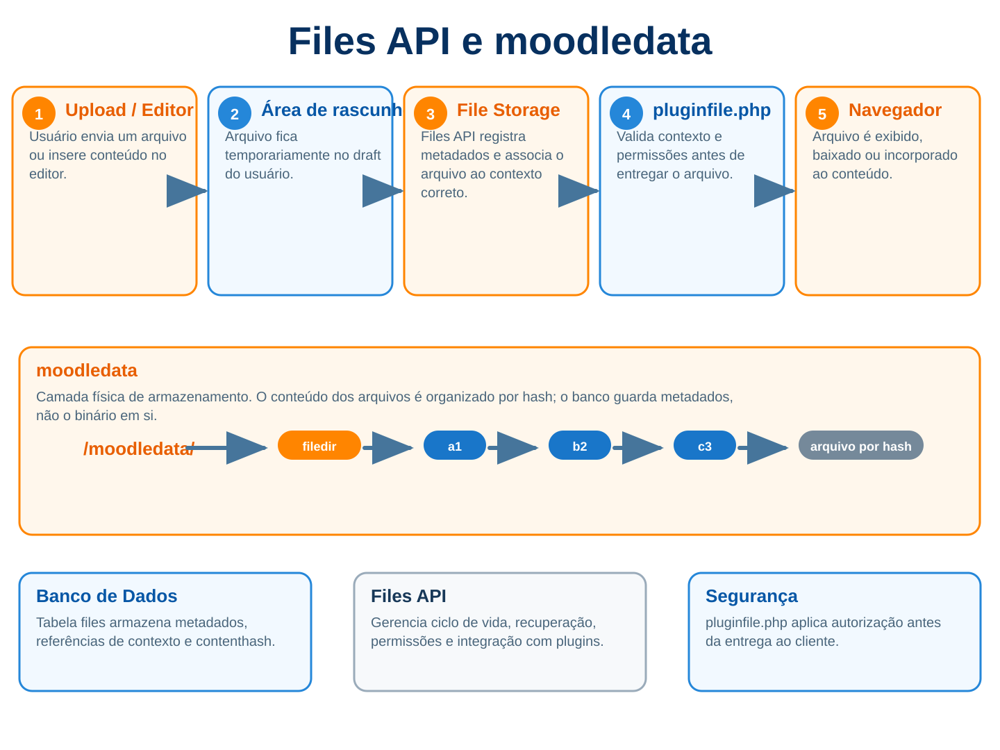



# 9. Files API e Moodledata



Se você abrir o moodledata de uma instalação e entrar em filedir esperando encontrar uma estrutura parecida com cursos, atividades, usuários e nomes de arquivos, a primeira impressão costuma ser que alguma coisa deu errado. Em vez de pastas com nomes compreensíveis aparecem diretórios como 08/13 e, dentro deles, arquivos chamados 081371cb102fa559e81993fddc230c79205232ce. Não existe relatorio-final.pdf, foto-do-perfil.jpg nem material-aula-3.zip. Existe uma coleção de hashes que, olhando apenas para o disco, parece não ter relação nenhuma com o que o usuário vê no Moodle.

Isso não é desorganização e muito menos uma escolha estética estranha. É justamente o contrário. O Moodle separa a identidade lógica de um arquivo da forma física como o conteúdo é armazenado, e essa separação permite deduplicação, controle de acesso por componente, backup e restore consistentes, nomes Unicode, armazenamento alternativo e até object storage sem obrigar cada plugin a conhecer a infraestrutura onde os bytes realmente estão. Quando você entende essa arquitetura, Files API deixa de parecer uma camada burocrática em volta de file_put_contents() e passa a fazer bastante sentido.

O erro clássico de quem chega ao Moodle vindo de uma aplicação PHP mais simples é pensar em arquivos como caminhos. O código recebe um upload, escolhe uma pasta e grava alguma coisa em /uploads/usuario/arquivo.pdf. Funciona até o dia em que aparecem permissões, renomeações, cópias, backup de curso, cluster com mais de um servidor, deduplicação, restore em outro site, armazenamento em S3 e a necessidade de saber se aquele arquivo pertence ao fórum 14, ao usuário 32 ou ao material do curso 7. O Files API existe para tirar essa responsabilidade de cada plugin e centralizar a relação entre conteúdo, metadados e acesso.

Neste capítulo eu vou usar um exemplo recorrente chamado mod_biblioteca, uma atividade fictícia que possui documentos privados por registro. O nome é irrelevante, mas o problema é real porque precisamos criar arquivos, listar arquivos, permitir edição, trabalhar com draft areas, gerar URLs e impedir que um aluno altere o endereço e baixe o documento de outro registro. Quando esse fluxo estiver claro, praticamente todo o restante do Files API fica muito mais previsível.

## 9.1 Moodledata - retomada do Capítulo 1

No Capítulo 1 nós já vimos que `$CFG->dataroot` aponta para o diretório de dados da instalação e que esse diretório não pode ser publicado diretamente pelo servidor web. Aqui precisamos ir além, porque moodledata não é simplesmente "a pasta onde ficam os uploads". Ele reúne áreas com naturezas completamente diferentes, algumas permanentes e outras descartáveis, algumas compartilhadas em cluster e outras adequadas para armazenamento local por nó.

O diretório `filedir` guarda o conteúdo dos arquivos controlados pelo Files API quando o Moodle usa o filesystem padrão. Já `temp`, `cache`, `localcache`, `sessions`, `trashdir` e outras áreas possuem finalidades específicas e não seguem exatamente a mesma lógica. Isso importa porque colocar tudo no mesmo pacote mental chamado "arquivos do Moodle" leva a decisões ruins, como sincronizar `localcache` entre servidores ou tratar `temp` como se fosse conteúdo permanente.

Outro detalhe importante é que o Files API não gerencia absolutamente tudo dentro de `$CFG->dataroot`. A documentação interna do Moodle separa claramente o conteúdo do site, que passa pelo File Storage e pelo File System, de diretórios internos usados pelo próprio sistema. Em outras palavras, `moodledata/filedir` é parte da arquitetura do Files API, enquanto várias outras pastas do dataroot existem para cache, sessão, processamento temporário ou componentes internos.

## 9.2 filedir

`filedir` é o pool físico padrão onde o Moodle guarda os bytes dos arquivos permanentes controlados pelo Files API. A palavra pool é útil porque um mesmo conteúdo pode ser utilizado em vários lugares do Moodle sem precisar existir várias vezes no disco. O que diferencia esses usos não é uma segunda cópia física, mas registros distintos na tabela `files`.

Se o hash de conteúdo de um arquivo for `081371cb102fa559e81993fddc230c79205232ce`, o backend padrão usa os primeiros quatro caracteres para distribuir o arquivo em diretórios e chega a algo parecido com `moodledata/filedir/08/13/081371cb102fa559e81993fddc230c79205232ce`. Isso evita despejar milhões de objetos em uma única pasta e mantém o nome físico diretamente relacionado ao conteúdo.

A partir desse ponto surge uma regra que vale repetir várias vezes neste capítulo: o nome que o usuário vê não é o nome físico do objeto no `filedir`. O nome visível está nos metadados do Files API, enquanto o conteúdo físico é identificado pelo `contenthash`. Se você tentar encontrar `trabalho-final.pdf` usando `find` dentro de `filedir`, está procurando a coisa certa no lugar errado.

## 9.3 Por que não alterar manualmente filedir

Entrar em `moodledata/filedir`, copiar um arquivo para lá e esperar que ele apareça no Moodle não funciona porque o File System guarda bytes, mas quem dá identidade lógica ao arquivo é o File Storage. Sem o registro correspondente em `{files}`, o Moodle não sabe o contexto, componente, filearea, itemid, caminho virtual, nome, MIME type, autor nem a relação daquele conteúdo com o restante do sistema.

O caminho inverso é ainda pior. Se você localizar um hash em `filedir` e simplesmente apagá-lo, pode quebrar vários usos de uma vez, pois o mesmo `contenthash` pode estar referenciado por diversos registros. A deduplicação que economiza espaço também significa que o arquivo físico não pertence exclusivamente à linha que você estava olhando.

E editar o conteúdo no lugar é uma ideia particularmente ruim. O nome físico é o SHA1 do conteúdo, então trocar os bytes sem mudar o nome quebra a própria invariável do storage. Agora o banco continua dizendo que aquele arquivo possui determinado `contenthash`, mas o conteúdo já não corresponde ao hash. A documentação do core inclusive mostra que, no backend padrão, você pode usar `sha1sum` para validar corrupção comparando o hash calculado com o nome físico. Se você editar o arquivo manualmente, acabou de fabricar uma corrupção.

## 9.4 A tabela files e o famoso mdl_files

Em instalações com o prefixo padrão você verá a tabela como `mdl_files`, mas dentro do código do plugin não escreva esse nome. O correto continua sendo `{files}`, permitindo que a DML API aplique o prefixo configurado na instalação. Eu uso `mdl_files` aqui apenas porque é assim que muita gente encontra a tabela quando abre o banco pela primeira vez.

A tabela `files` possui uma linha para cada uso lógico de um arquivo. Essa frase é importante. Não é uma linha para cada conteúdo físico armazenado e também não é uma tabela que apenas aponta para uma pasta. Uma mesma imagem utilizada como avatar e também dentro de um post pode produzir dois registros distintos, com `contextid`, `component`, `filearea`, `itemid`, `filepath` e `filename` diferentes, enquanto os dois registros compartilham o mesmo `contenthash` e, consequentemente, o mesmo conteúdo físico.

Isso explica por que consultar apenas `contenthash` para descobrir "de quem é o arquivo" não faz sentido. O contenthash responde qual é o conteúdo, não qual é o uso. A identidade lógica está no conjunto de campos que localiza o arquivo dentro de uma file area.

## 9.5 O que realmente existe em files

Quando você olha a tabela `files`, encontra campos relacionados à identidade lógica, ao conteúdo e a metadados auxiliares. Os que mais aparecem no desenvolvimento de plugins são `contextid`, `component`, `filearea`, `itemid`, `filepath`, `filename`, `contenthash`, `pathnamehash`, `filesize`, `mimetype`, `timecreated`, `timemodified`, `userid`, `author`, `license`, `source`, `sortorder` e informações relacionadas a referências externas.

Não significa que seu plugin deva montar INSERT manual nessa tabela. Quase sempre isso é um erro. O Files API calcula hashes, normaliza caminhos, cria entradas de diretório, trata referências e conversa com o backend físico. O fato de entendermos a tabela é importante para diagnosticar e compreender a arquitetura, não para ignorar `file_storage` e escrever diretamente no banco.

Uma regra prática boa é esta: consultar `{files}` para diagnóstico pode ser útil, mas criar, mover, copiar ou excluir arquivos deve passar pelas APIs próprias. Se você se pega escrevendo `INSERT INTO {files}`, pare e procure primeiro o método correspondente em `file_storage`.

## 9.6 contenthash

`contenthash` identifica o conteúdo do arquivo. No filesystem padrão, o Moodle calcula SHA1 sobre os bytes e usa esse valor como chave física do objeto. Dois arquivos com exatamente o mesmo conteúdo produzem o mesmo `contenthash`, mesmo que tenham nomes diferentes, pertençam a usuários diferentes e estejam em fileareas completamente distintas.

É daí que vem a deduplicação. Se professor A envia `apostila.pdf` e professor B envia `material.pdf`, mas os dois arquivos possuem bytes idênticos, o File Storage pode criar dois registros lógicos enquanto o File System mantém uma única cópia do conteúdo. Para a aplicação existem dois arquivos, para o storage existe um objeto físico compartilhado.

Não confunda isso com uma função de autorização. Saber o hash não concede direito de acesso e não substitui contexto, capability ou as regras do callback `pluginfile()`. O contenthash é uma identidade do conteúdo dentro da camada de storage, não um token secreto.

## 9.7 pathnamehash

Se `contenthash` responde "qual conteúdo é este?", `pathnamehash` responde "qual arquivo lógico é este?". O core calcula SHA1 sobre uma string construída a partir de `contextid`, `component`, `filearea`, `itemid`, `filepath` e `filename`. Na implementação atual, a forma é equivalente a `sha1("/$contextid/$component/$filearea/$itemid" . $filepath . $filename)`.

Isso torna o `pathnamehash` uma forma eficiente de localizar uma identidade completa sem precisar comparar cada coluna separadamente. O método `file_storage::get_file()` recebe os campos legíveis, calcula o pathnamehash e internamente consegue localizar o registro correspondente.

Também explica por que alterar manualmente `component`, `filearea`, `filepath` ou `filename` no banco e esquecer de recalcular `pathnamehash` quebra a consistência. Mais uma vez, é exatamente o tipo de problema que desaparece quando você usa a API em vez de editar `{files}` diretamente.

## 9.8 Deduplicação

A deduplicação do Moodle acontece por conteúdo, não por nome. Essa escolha é muito mais poderosa do que parece porque nomes são metadados de apresentação e podem mudar sem exigir uma nova cópia dos bytes. O professor pode renomear `aula.pdf` para `material-semana-1.pdf` e o `contenthash` continuar exatamente o mesmo.

Na prática isso reduz bastante o custo de cópias internas. Operações como duplicação de conteúdo, áreas de rascunho e reutilização podem criar novas referências lógicas sem necessariamente duplicar os bytes em armazenamento. Em ambientes grandes essa diferença deixa de ser detalhe arquitetural e começa a representar disco, tráfego e tempo de processamento.

Mas deduplicação também é um motivo adicional para nunca tratar o objeto de `filedir` como propriedade exclusiva do seu plugin. Seu registro pode desaparecer e o conteúdo físico permanecer porque outra referência continua usando o mesmo hash, ou o conteúdo físico pode ser removido somente quando nenhuma referência válida continuar dependendo dele.

## 9.9 contextid

`contextid` conecta o arquivo ao modelo de contextos do Moodle. Uma imagem de perfil normalmente vive em um contexto de usuário, um arquivo de Activity Module costuma viver em `context_module`, enquanto arquivos associados a uma configuração global podem estar em `context_system`. Essa escolha não deve ser feita apenas pelo lugar onde fica mais fácil obter um número, porque contexto influencia autorização, backup, restore e o ciclo de vida daquele conteúdo.

No nosso `mod_biblioteca`, documentos pertencentes a uma instância específica da atividade deveriam normalmente usar o contexto do módulo. Isso significa que, ao duplicar ou restaurar a atividade, o Moodle possui informação suficiente para relacionar aqueles arquivos ao componente correto. Guardar tudo no contexto de sistema porque "fica mais simples" é o equivalente em Files API a usar `context_system` para todas as capabilities: funciona até começar a colidir com o restante da arquitetura.

## 9.10 component

`component` é o Frankenstyle do componente dono da filearea, por exemplo `mod_biblioteca`, `local_meuplugin`, `block_exemplo` ou `user`. A documentação atual reforça que um componente deve acessar suas próprias fileareas e, se precisar trabalhar com arquivos de outro componente, deve usar a API oferecida por ele em vez de vasculhar diretamente o storage alheio.

Essa regra evita acoplamento invisível. Se `local_relatorio` começa a buscar diretamente arquivos internos de `mod_assign` usando component e filearea que observou no banco, o código passa a depender de detalhes de implementação do Assignment. Pode funcionar hoje e quebrar quando o outro componente alterar sua organização ou suas regras de autorização.

## 9.11 filearea

`filearea` separa finalidades diferentes dentro do mesmo componente. Um plugin pode ter, por exemplo, `attachment`, `content`, `certificate`, `evidence` e `thumbnail`, cada uma representando um contrato funcional próprio. O nome não é apenas uma pasta bonita e não existe uma tabela separada cadastrando todas as áreas possíveis. Elas surgem implicitamente pelos registros existentes e pelos callbacks que o plugin implementa.

Prefira nomes simples e estáveis, porque filearea costuma aparecer em backup, restore, `pluginfile()`, forms e URLs. Trocar o nome depois de o plugin estar em produção exige migração real dos registros e possivelmente atualização de conteúdo que referencia `@@PLUGINFILE@@`. É uma decisão pequena que ganha peso com o tempo.

## 9.12 itemid

`itemid` permite que uma mesma filearea tenha subconjuntos independentes. Se o plugin possui um documento por registro da tabela `biblioteca_item`, o `itemid` pode ser o id desse registro. Assim todos os arquivos continuam no mesmo contexto, component e filearea, mas cada objeto da regra de negócio ganha seu próprio recipiente lógico.

Quando existe apenas um conjunto de arquivos por contexto e filearea, usar `0` é comum. Não existe mérito em inventar itemid diferente sem necessidade, mas também não use `0` quando você realmente precisa separar objetos. Se dezenas de registros compartilham a mesma área sem distinção, fica muito mais difícil apagar arquivos de um único registro ou validar propriedade no `pluginfile()`.

## 9.13 filepath

`filepath` é um caminho virtual e deve começar e terminar com `/`. O caminho raiz é simplesmente `/`, enquanto um arquivo dentro de uma estrutura lógica pode usar algo como `/2026/documentos/`. Isso não quer dizer que exista uma pasta física `2026/documentos` dentro de `filedir`. O caminho pertence à identidade lógica do arquivo.

Diretórios também são representados dentro do Files API, e registros cujo `filename` é `.` representam diretórios. Normalmente você não precisa criar esses registros manualmente, pois o storage cuida disso conforme os arquivos são adicionados.

## 9.14 filename

`filename` é o nome que faz sentido para a aplicação e para o usuário, não o nome do objeto físico. Ele pode conter Unicode e ser completamente diferente do hash usado no storage. Essa abstração permite que o File System continue simples e previsível enquanto a camada lógica mantém nomes amigáveis.

Ao receber nomes externos, continue usando as APIs e validações apropriadas. Não pegue um filename de request e concatene em caminho de disco, porque aí você abandona justamente as garantias que o Files API oferece e reabre problemas de path traversal e inconsistência entre metadados e conteúdo.

## 9.15 File areas

Uma file area pode ser entendida como um bucket virtual identificado principalmente por `contextid`, `component`, `filearea` e `itemid`. Dentro desse bucket existem `filepath` e `filename`, formando a estrutura que o usuário percebe. Essa imagem mental é muito melhor do que pensar em diretórios físicos, porque continua válida mesmo quando não existe disco local algum.

No `mod_biblioteca`, por exemplo, poderíamos ter `contextid=381`, `component=mod_biblioteca`, `filearea=document`, `itemid=72`, `filepath=/` e `filename=contrato.pdf`. O arquivo físico pode estar em `moodledata/filedir`, S3, DigitalOcean Spaces ou outro backend. Para o plugin, a identidade continua a mesma.

## 9.16 get_file_storage()

`get_file_storage()` entrega a instância de `file_storage`, que é a porta de entrada para a maior parte das operações de baixo nível. Você usa esse objeto para criar arquivos, localizar arquivos, listar áreas, copiar conteúdos e remover registros sem conhecer onde os bytes estão guardados.

É exatamente por isso que vale desconfiar de código que pula essa camada. Se o objetivo é manipular um arquivo que pertence ao conteúdo do Moodle e a primeira coisa que aparece é `$CFG->dataroot . '/filedir/'`, normalmente a arquitetura já começou errada.

```php
$fs = get_file_storage();

$file = $fs->get_file(
    $context->id,
    'mod_biblioteca',
    'document',
    $item->id,
    '/',
    'contrato.pdf'
);
```

## 9.17 stored_file

Os métodos de leitura do File Storage devolvem objetos `stored_file`. Pense nele como a representação de um arquivo lógico já conhecido pelo Moodle. O objeto expõe metadados como filename, filepath, mimetype, tamanho, contextid, component, filearea, itemid, contenthash e também operações como leitura de conteúdo, cópia, exclusão e obtenção de handles.

O `stored_file` é uma abstração especialmente importante em backend alternativo. Seu código pode chamar `$file->get_content()` ou entregar o objeto para `send_stored_file()` sem saber se o backend está lendo um arquivo local, recuperando um objeto remoto ou utilizando outra estratégia. Essa ignorância é uma qualidade arquitetural, não uma limitação.

## 9.18 create_file_from_string()

Quando o conteúdo nasce dentro do próprio plugin, `create_file_from_string()` é uma forma natural de colocá-lo no File Storage. Um relatório gerado em CSV, um JSON de exportação ou um texto produzido pelo sistema podem ser salvos sem criar primeiro um arquivo temporário só para depois importá-lo.

O ponto importante é preparar corretamente o `filerecord`. Os campos que identificam a filearea não são detalhes decorativos. Eles determinam onde o arquivo existirá logicamente e como será recuperado depois.

```php
$fs = get_file_storage();

$filerecord = [
    'contextid' => $context->id,
    'component' => 'mod_biblioteca',
    'filearea' => 'export',
    'itemid' => $item->id,
    'filepath' => '/',
    'filename' => 'exportacao.csv',
];

$file = $fs->create_file_from_string($filerecord, $csv);
```

## 9.19 create_file_from_pathname()

`create_file_from_pathname()` é útil quando o conteúdo já existe em um arquivo real, normalmente temporário, criado por outra etapa de processamento. O Files API lê esse pathname, calcula os metadados necessários e incorpora o conteúdo ao storage.

O pathname de origem pode desaparecer depois, porque o arquivo permanente agora pertence ao File Storage. Não use esse método como desculpa para criar uma segunda árvore permanente paralela ao Files API. A pasta temporária é uma etapa de processamento, não o novo lar definitivo do arquivo.

```php
$file = $fs->create_file_from_pathname(
    $filerecord,
    $CFG->tempdir . '/biblioteca/relatorio.pdf'
);
```

## 9.20 create_file_from_storedfile()

Quando a origem já é outro `stored_file`, use `create_file_from_storedfile()`. Esse método é especialmente interessante porque pode criar uma nova identidade lógica apontando para o mesmo conteúdo sem obrigar seu código a baixar e regravar bytes desnecessariamente.

É comum em cópias internas, clonagem de registros e movimentação entre áreas. Em vez de `$origem->get_content()` seguido de `create_file_from_string()`, deixe o File Storage fazer a operação no nível correto.

```php
$novo = $fs->create_file_from_storedfile(
    [
        'contextid' => $context->id,
        'component' => 'mod_biblioteca',
        'filearea' => 'archive',
        'itemid' => $item->id,
        'filepath' => '/',
        'filename' => $origem->get_filename(),
    ],
    $origem
);
```

## 9.21 get_file()

`get_file()` é a busca direta pela identidade lógica completa. Você informa contexto, componente, filearea, itemid, filepath e filename, e recebe um `stored_file` ou `false`. É o método que normalmente aparece dentro de callbacks `pluginfile()` depois que o plugin já validou qual registro o usuário pode acessar.

Repare que essa API obriga o código a ser explícito. Isso é bom. Uma consulta que só recebe filename seria ambígua demais, enquanto o conjunto completo liga o arquivo ao objeto correto e reduz a chance de servir conteúdo de outra área por acidente.

## 9.22 get_area_files()

`get_area_files()` devolve os arquivos de uma filearea e pode limitar pelo itemid. É útil quando você precisa montar uma listagem, verificar se determinada área possui conteúdo ou processar os arquivos de um registro.

Existe um detalhe que costuma pegar quem está começando: o método pode incluir registros de diretório, portanto em vários casos você vai passar `false` em `includedirs` quando deseja somente arquivos. Também pense em volume. Buscar milhares de `stored_file` de uma vez só para descobrir se existe pelo menos um é desperdício. Use a API mais adequada para a pergunta que você realmente precisa responder.

```php
$files = $fs->get_area_files(
    $context->id,
    'mod_biblioteca',
    'document',
    $item->id,
    'filename ASC',
    false
);
```

## 9.23 Diretórios virtuais

Pastas apresentadas no filemanager não correspondem necessariamente a diretórios físicos. Elas fazem parte do namespace lógico definido por `filepath`. Isso permite que a mesma organização continue funcionando em um backend que nem sequer possui conceito de pasta da mesma maneira que um filesystem POSIX.

Essa é outra razão para não chamar `is_dir()` ou `scandir()` em `filedir`. Você estaria olhando a organização física do pool, que foi criada para o storage, enquanto o usuário e o plugin trabalham com uma hierarquia lógica completamente diferente.

## 9.24 Filepicker

O `filepicker` é adequado quando o formulário precisa receber um arquivo de forma pontual. Ele integra a seleção com os repositories disponíveis no Moodle e coloca o arquivo na draft area do usuário. O arquivo ainda não está na filearea permanente do seu plugin nesse momento.

Essa diferença entre selecionar e salvar é fundamental. O componente de formulário cuida da experiência de upload, mas a sua regra de negócio continua responsável por mover ou salvar o conteúdo da draft area para o destino definitivo no momento certo.

## 9.25 Filemanager

O `filemanager` trabalha melhor quando o usuário precisa administrar um conjunto de arquivos, inclusive adicionando, removendo e reorganizando conteúdo. Assim como no filepicker, a edição acontece sobre uma draft area e só depois é consolidada na área permanente.

No Capítulo 7 vimos os elementos de formulário. Aqui a parte importante é entender o que existe por trás deles. Quando você abre um registro já salvo para edição, o Moodle não entrega a filearea permanente diretamente para o navegador modificar. Ele prepara uma cópia lógica em uma área de rascunho do usuário, o usuário trabalha ali e, no submit, o conjunto resultante é sincronizado de volta.

## 9.26 Draft areas

Draft area é uma filearea temporária no componente `user`, normalmente no contexto do usuário, usada enquanto ele está editando conteúdo. Cada rascunho recebe um `itemid` que identifica aquele conjunto temporário. Isso resolve problemas importantes porque o usuário pode adicionar e remover arquivos antes de confirmar a alteração sem mexer imediatamente no conteúdo oficial.

Também melhora segurança e isolamento. Um arquivo enviado durante a edição não deveria aparecer automaticamente para outros usuários antes de o registro ser salvo e antes de as regras de negócio validarem a operação. Enquanto está em draft, o conteúdo pertence ao fluxo de edição daquele usuário.

Não trate draft como armazenamento permanente. Áreas temporárias são limpas pelo Moodle e fazem parte de um ciclo de edição. Se o seu plugin salva apenas o draftitemid no banco e nunca chama a etapa de consolidação, mais cedo ou mais tarde você vai descobrir que persistiu uma referência para algo que não era permanente.

## 9.27 file_prepare_draft_area()

Ao editar um registro existente, você normalmente precisa copiar os arquivos permanentes para uma draft area. `file_prepare_draft_area()` faz esse trabalho e também participa da reescrita de URLs quando estamos lidando com conteúdo de editor.

O fluxo típico começa obtendo um draftitemid, preparando a área com os arquivos existentes e colocando esse id no campo que será usado pelo form. O usuário vê uma cópia editável do estado atual, não o storage permanente sendo manipulado diretamente.

```php
$draftitemid = file_get_submitted_draft_itemid('documents');

file_prepare_draft_area(
    $draftitemid,
    $context->id,
    'mod_biblioteca',
    'document',
    $item->id,
    [
        'subdirs' => false,
        'maxfiles' => 20,
    ]
);

$item->documents = $draftitemid;
```

## 9.28 file_save_draft_area_files()

Depois do submit validado, `file_save_draft_area_files()` leva o conjunto final da draft area para a filearea permanente. Isso inclui arquivos novos, arquivos removidos e alterações feitas pelo usuário dentro das regras configuradas para aquela área.

A ordem da sua regra de negócio importa. Em muitos casos você precisa primeiro inserir o registro no banco para descobrir o `itemid` permanente e só então salvar os arquivos. É por isso que formulários com filemanager frequentemente possuem uma pequena diferença entre fluxo de criação e fluxo de edição.

```php
file_save_draft_area_files(
    $data->documents,
    $context->id,
    'mod_biblioteca',
    'document',
    $item->id,
    [
        'subdirs' => false,
        'maxfiles' => 20,
    ]
);
```

## 9.29 Editor e @@PLUGINFILE@@

Editor HTML traz um problema a mais porque o texto salvo no banco pode conter imagens e outros arquivos embutidos. Guardar a URL absoluta completa do site seria péssimo para backup, restore, mudança de domínio e cópia entre ambientes. O Moodle resolve isso armazenando referências relativas que começam com `@@PLUGINFILE@@`.

Imagine que o professor insere uma imagem dentro da descrição. Durante a edição ele precisa de uma URL real de `draftfile.php` para enxergar a imagem, mas quando o conteúdo é persistido o endereço é transformado em algo como `@@PLUGINFILE@@/diagramas/fluxo.png`. Esse texto pode viajar para outro domínio sem carregar o hostname antigo junto.

Quando o conteúdo será exibido, o placeholder volta a ser uma URL servível de `pluginfile.php`. Essa ida e volta parece trabalhosa até você pensar no que aconteceria se milhares de conteúdos guardassem URLs absolutas e o site mudasse de endereço.

## 9.30 file_rewrite_pluginfile_urls()

`file_rewrite_pluginfile_urls()` transforma os placeholders de conteúdo armazenado em URLs reais que o navegador pode requisitar. Para isso você informa a base de serviço, o contexto, component, filearea e itemid correspondentes.

Não faça `str_replace('@@PLUGINFILE@@', ...)` manual. O helper conhece as regras de codificação e os formatos de URL utilizados pelo Moodle, além de manter seu código alinhado com o restante do sistema.

```php
$text = file_rewrite_pluginfile_urls(
    $item->description,
    'pluginfile.php',
    $context->id,
    'mod_biblioteca',
    'description',
    $item->id
);
```

## 9.31 pluginfile.php

`pluginfile.php` é um dos pontos centrais do Files API porque ele impede que arquivos protegidos precisem ficar publicamente acessíveis no web root. O navegador requisita uma URL controlada pelo Moodle, o core interpreta contexto, componente, filearea e argumentos e então delega ao componente responsável a decisão final de servir ou negar o arquivo.

A grande consequência é que o bucket ou disco onde os bytes estão guardados não define sozinho quem pode ler o conteúdo. A autorização pertence à aplicação. Um arquivo privado pode continuar privado porque o callback verifica login, contexto, capability, propriedade, grupos, visibilidade e qualquer regra específica antes de chamar `send_stored_file()`.

## 9.32 Callback [component]_pluginfile()

Para fileareas próprias de um plugin, o componente normalmente implementa `[component]_pluginfile()` em `lib.php`. Esse é um daqueles callbacks que continuam legitimamente em `lib.php`, porque o core precisa localizá-lo por convenção. O fato de defendermos `lib.php` pequeno no Capítulo 3 não significa esconder callbacks obrigatórios em classes onde o Moodle não vai encontrá-los.

O callback recebe contexto, filearea, argumentos do caminho e outras informações, mas não deve confiar nesses valores apenas porque foram montados por `moodle_url::make_pluginfile_url()`. URL é controlável pelo cliente. Você precisa reconstruir a relação com o registro real e validar acesso de novo.

## 9.33 Controle de acesso no pluginfile()

O erro mais perigoso em `pluginfile()` é usar a existência do arquivo como autorização. Encontrar um registro em `file_storage` prova que o arquivo existe, não que o usuário atual pode vê-lo. O callback precisa responder primeiro se aquela pessoa pode acessar o objeto da regra de negócio ao qual o itemid se refere.

No nosso exemplo, não basta receber `itemid=72` e buscar a área document 72. Primeiro carregamos o registro 72 do plugin, confirmamos que ele pertence àquela instância da atividade, aplicamos `require_login()` no curso e cm correspondentes e verificamos a capability ou a regra de visibilidade. Só depois buscamos o arquivo.

```php
function mod_biblioteca_pluginfile(
    $course,
    $cm,
    $context,
    string $filearea,
    array $args,
    bool $forcedownload,
    array $options = []
): bool {
    global $DB;

    if ($context->contextlevel !== CONTEXT_MODULE) {
        return false;
    }

    if ($filearea !== 'document') {
        return false;
    }

    require_login($course, true, $cm);
    require_capability('mod/biblioteca:view', $context);

    $itemid = (int) array_shift($args);
    $item = $DB->get_record('biblioteca_item', ['id' => $itemid], '*', MUST_EXIST);

    if ((int) $item->bibliotecaid !== (int) $cm->instance) {
        return false;
    }

    $filename = array_pop($args);
    $filepath = empty($args) ? '/' : '/' . implode('/', $args) . '/';

    $fs = get_file_storage();
    $file = $fs->get_file(
        $context->id,
        'mod_biblioteca',
        'document',
        $itemid,
        $filepath,
        $filename
    );

    if (!$file || $file->is_directory()) {
        return false;
    }

    send_stored_file($file, DAY_SECS, 0, true, $options);
}
```

## 9.34 send_stored_file()

Depois de todas as verificações, `send_stored_file()` cuida da entrega do conteúdo e de detalhes relacionados a cache, range requests e headers. Evite reinventar streaming com `readfile()` se o arquivo está no Files API. Além de duplicar trabalho do core, você pode quebrar backends alternativos que não possuem pathname local disponível do jeito que seu código imagina.

O parâmetro de forcedownload merece decisão consciente. Conteúdo confiável que precisa ser exibido inline, como uma imagem gerenciada pelo plugin, pode usar comportamento diferente de arquivo enviado por estudante que não deveria ser interpretado pelo navegador no mesmo contexto do site. Segurança de conteúdo não termina quando a capability passou.

## 9.35 URLs de arquivo

A URL de um arquivo Moodle representa a identidade lógica necessária para chegar ao callback. Por isso você verá contextid, component, filearea, itemid e caminho incorporados na rota de `pluginfile.php`. Isso não significa que a URL revele o caminho físico do objeto, porque essa informação simplesmente não faz parte do contrato público.

Também não confunda URL difícil de adivinhar com autorização. Mesmo que o itemid seja grande ou o filename seja incomum, o callback continua precisando validar o usuário. Segurança por obscuridade em URL protegida costuma durar até alguém abrir o Network do navegador.

## 9.36 moodle_url::make_pluginfile_url()

Use `moodle_url::make_pluginfile_url()` quando você possui um `stored_file` ou conhece os campos que identificam o arquivo. O helper monta a URL de acordo com as convenções do Moodle e evita concatenação manual com barra, encode e itemid.

Existe inclusive a possibilidade de omitir itemid usando `null` em áreas que não precisam dele, mas essa decisão precisa ser consistente com a forma como o callback interpreta os argumentos. Não altere a estrutura da URL de um lado e espere que o outro adivinhe.

```php
$url = moodle_url::make_pluginfile_url(
    $file->get_contextid(),
    $file->get_component(),
    $file->get_filearea(),
    $file->get_itemid(),
    $file->get_filepath(),
    $file->get_filename(),
    true
);
```

## 9.37 Arquivos temporários

Nem todo arquivo que aparece durante um processamento precisa entrar no File Storage. Se você está convertendo vídeo, gerando PDF, descompactando um pacote ou preparando uma importação, pode existir uma fase temporária em disco. O importante é não confundir esse artefato intermediário com o arquivo final pertencente ao conteúdo do Moodle.

Use diretórios temporários apropriados, nomes imprevisíveis e limpeza garantida, depois entregue o resultado definitivo ao Files API quando ele realmente fizer parte do conteúdo do site. Em cluster, lembre que `$CFG->tempdir` pode precisar ser compartilhado dependendo do fluxo, enquanto diretórios locais só funcionam quando o mesmo processo ou nó conclui toda a operação.

## 9.38 trashdir

Quando arquivos deixam de ser referenciados, o Moodle pode movê-los para uma área de lixeira antes da remoção definitiva, de acordo com o funcionamento do filesystem e das tarefas de limpeza. `trashdir` não é uma filearea do seu plugin e não deve ser usado como mecanismo de recuperação de negócio.

Se sua aplicação precisa de lixeira funcional, versionamento ou restauração de documentos pelo usuário, modele isso na regra de negócio. Confiar na existência temporária de conteúdo dentro de `trashdir` é depender de detalhe operacional que pode ser limpo sem considerar a semântica do seu plugin.

## 9.39 Alternative File Systems

A arquitetura do File System permite trocar a camada física por outra implementação. O plugin continua vendo `file_storage` e `stored_file`, enquanto o backend pode buscar e gravar conteúdo em armazenamento remoto. Essa é uma das melhores provas de que acessar `filedir` diretamente é erro arquitetural: `filedir` pode deixar de ser o lugar onde o conteúdo está.

O mecanismo é configurado antes do bootstrap por meio de `$CFG->alternative_file_system_class`. A classe escolhida implementa a estratégia de storage usada pelo core. A partir desse momento, código bem escrito continua funcionando sem alteração porque nunca assumiu que `stored_file` correspondia a um pathname local.

## 9.40 Armazenamento local versus object storage

Disco local é simples, rápido e barato em instalações pequenas, principalmente quando existe um único servidor e o volume cabe confortavelmente no storage da máquina. O problema aparece quando o site cresce, entra em cluster ou começa a carregar centenas de gigabytes ou terabytes de conteúdo. Aumentar disco de VM, replicar storage entre nós e planejar recuperação passa a fazer parte da rotina operacional.

Object storage como S3, DigitalOcean Spaces e serviços compatíveis separa capacidade de armazenamento da vida útil do servidor web. Isso facilita escalar espaço, reconstruir nós, usar políticas de durabilidade e, em algumas arquiteturas, entregar determinados conteúdos por CDN ou URLs assinadas. Não é automaticamente mais rápido em qualquer cenário, porque latência, custo de requests e padrões de acesso importam, mas muda completamente a forma de operar uma instalação grande.

Também existe uma diferença entre mover o `dataroot` inteiro para um filesystem de rede e usar um Alternative File System especificamente para o conteúdo do Files API. `cache`, `localcache`, `temp`, sessões e outros diretórios possuem características diferentes e não deveriam ser empurrados todos para object storage como se fossem equivalentes a `filedir`.

## 9.41 Um exemplo real com local_alternative_file_system

Um exemplo concreto dessa arquitetura é o `local_alternative_file_system`, disponível em https://github.com/EduardoKrausME/moodle-local_alternative_file_system. O objetivo do plugin é substituir a implementação física usada pelo Files API sem obrigar os demais componentes do Moodle a conhecerem S3, DigitalOcean Spaces ou qualquer outro backend remoto. Isso é muito diferente de criar um plugin que intercepta uploads de uma atividade específica. Aqui a troca acontece no nível do File System do Moodle, por baixo de `file_storage` e `stored_file`, portanto o restante da aplicação continua trabalhando com as mesmas APIs que já utilizava.

Essa diferença é importante porque o plugin não tenta criar uma segunda infraestrutura paralela ao `filedir`. Ele implementa a abstração que o próprio Moodle oferece para trocar o backend físico e é ativado por `$CFG->alternative_file_system_class`. Na prática, um `mod_assign`, um `mod_forum`, um plugin local ou o próprio core continuam pedindo para o Files API criar, ler ou servir um arquivo, enquanto a classe `external_file_system` decide se aquele conteúdo será manipulado no backend local ou no storage configurado. Para o componente consumidor, essa decisão deveria ser invisível.

### 9.41.1 O ponto mais importante é que o plugin trabalha abaixo do File Storage

Quando um plugin comum chama `get_file_storage()` e depois `create_file_from_pathname()`, ele não deveria saber em que storage o conteúdo terminará. O `local_alternative_file_system` aproveita exatamente essa fronteira. A classe principal estende `file_system`, recebe as operações que o core faria sobre `file_system_filedir` e delega para a implementação correspondente ao destino configurado. Isso preserva a arquitetura do Moodle em vez de contorná-la.

Na prática, métodos como `add_file_from_path()`, `add_file_from_string()`, `copy_content_from_storedfile()`, `readfile()`, `get_remote_path_from_hash()` e `remove_file()` continuam existindo no contrato do File System. O componente que criou o arquivo não precisa ser alterado para chamar uma SDK do S3, não precisa descobrir bucket e não precisa armazenar URL remota em sua própria tabela. O plugin de storage assume esse problema em um único lugar.

Essa centralização tem uma consequência importante para manutenção. Se amanhã a instituição trocar DigitalOcean Spaces por um serviço compatível com S3, o trabalho fica concentrado no backend de armazenamento e nas configurações, não em todos os plugins que usam arquivo. Essa é a diferença entre usar uma abstração e simplesmente trocar `file_put_contents()` por uma chamada de SDK espalhada pelo código.

### 9.41.2 Como o Alternative File System é ativado

A ativação precisa acontecer no `config.php`, antes de `lib/setup.php`, porque o File System é uma dependência estrutural inicializada durante o bootstrap. Depois que o Moodle terminou o setup, já é tarde para tentar substituir esse backend como se fosse uma configuração visual qualquer.

```php
$CFG->alternative_file_system_class =
    '\\local_alternative_file_system\\external_file_system';

require_once(__DIR__ . '/lib/setup.php');
```

Esse detalhe também explica por que não basta instalar o plugin e marcar uma caixa na administração. O código precisa existir antes do bootstrap completar e o core precisa saber qual classe utilizar quando criar a camada de filesystem. A página de configurações então cuida do destino, região, credenciais, bucket e caminho, mas a escolha da implementação acontece em `config.php`.

### 9.41.3 Destinos suportados e compatibilidade S3

O README documenta AWS S3 e DigitalOcean Spaces como destinos principais. No código atual também existe uma opção `s3generic`, com endpoint configurável e escolha entre URL virtual-hosted, path-style ou detecção automática, o que permite trabalhar com serviços que implementam a API S3 sem serem necessariamente AWS. Essa possibilidade é interessante para provedores regionais, appliances privados e ambientes que já possuem object storage compatível com S3.

A implementação separa configuração e backend, portanto região, access key, secret, bucket e prefixo podem ser alterados sem mudar o código dos componentes que usam Files API. No caso de Spaces, o comportamento continua baseado em protocolo compatível com S3, mas a configuração de endpoint e região pertence ao backend, e não ao plugin Moodle que salvou o documento.

Eu evitaria vender isso como "qualquer S3 funciona automaticamente" porque implementações compatíveis podem possuir diferenças de assinatura, path-style, headers ou comportamento em edge cases, mas arquiteturalmente o plugin já oferece o ponto certo para lidar com essas diferenças sem contaminar o restante do Moodle.

### 9.41.4 Migração do moodledata/filedir para a nuvem

Uma das partes mais úteis do plugin é não exigir que o administrador comece com um Moodle vazio. O fluxo de migração percorre os `contenthash` existentes em `{files}`, identifica quais conteúdos ainda não foram enviados ao destino configurado e copia o objeto físico correspondente do `moodledata/filedir` para o storage remoto. Isso aproveita a própria deduplicação do Moodle, porque a migração trabalha por `contenthash`, não por cada linha lógica da tabela `files`.

Se o mesmo conteúdo estiver referenciado vinte vezes em diferentes fileareas, o objeto físico precisa ser enviado uma vez. Essa é uma diferença operacional importante em instalações grandes porque a quantidade de registros em `{files}` pode ser muito maior do que a quantidade de conteúdos distintos que realmente precisam viajar pela rede.

O plugin mantém uma tabela própria de rastreamento dos hashes enviados por destino e calcula quantos conteúdos ainda faltam. A tela de configuração consegue comparar o total esperado com o total já enviado e avisar quando a migração ainda não terminou. Isso é muito melhor do que iniciar um `aws s3 sync` externo e depois simplesmente torcer para que o Moodle e o bucket tenham terminado com o mesmo conjunto de objetos.

### 9.41.5 A migração não precisa ser um salto sem volta

O repositório também possui o caminho inverso, trazendo arquivos do storage remoto de volta para o `filedir` local. Essa possibilidade é relevante porque migração de storage é uma mudança de infraestrutura séria e deveria possuir estratégia de retorno. Se latência, custo, política institucional ou qualquer outro fator tornar o backend remoto inadequado, existe uma forma de reconstruir o pool local a partir dos `contenthash` conhecidos pelo Moodle.

Ter um caminho de retorno não elimina a necessidade de backup, teste e janela de manutenção, mas muda bastante o risco operacional. A adoção não precisa ser tratada como uma conversão destrutiva em que os únicos bytes válidos passam a existir em uma tecnologia da qual você não consegue sair sem escrever um segundo projeto de migração.

### 9.41.6 Migração a partir do tool_objectfs

Outro cenário previsto explicitamente no README é a migração de instalações que já utilizavam `tool_objectfs`. Enquanto a classe alternativa antiga ainda está ativa, a administração do `local_alternative_file_system` consegue detectar aquela configuração, aplicar os dados ao novo plugin e executar os testes necessários. Depois da validação, o administrador troca `$CFG->alternative_file_system_class` para a classe do novo backend.

Isso é uma vantagem prática porque o problema de storage normalmente aparece em Moodles grandes, e Moodle grande raramente começa do zero. A capacidade de migrar de uma solução já existente reduz o custo de adoção e evita que a instituição tenha de voltar todos os arquivos para disco local apenas para depois enviá-los novamente para o mesmo bucket ou para outro destino.

### 9.41.7 O plugin preserva a lógica de contenthash do Moodle

O caminho remoto continua derivado do `contenthash`, inclusive mantendo a distribuição em níveis semelhante ao `filedir`, com os primeiros caracteres formando partes do caminho e o hash completo identificando o objeto. Essa escolha é simples e extremamente coerente com o Files API, porque o backend remoto passa a guardar o mesmo conceito que o filesystem padrão já guardava: conteúdo identificado por hash.

Isso significa que o bucket não precisa conhecer `courseid`, `userid`, `component`, `filearea` ou `filename`. Esses metadados continuam no banco do Moodle, onde pertencem. O storage remoto recebe o conteúdo, enquanto a identidade lógica continua em `{files}`. Não duplicar toda a árvore lógica dentro do bucket é uma vantagem porque evita transformar S3 em uma segunda base de metadados que precisaria permanecer sincronizada com o Moodle.

### 9.41.8 Leitura remota e URLs autenticadas

No backend S3, a implementação consegue gerar URL autenticada temporária para um objeto. Isso permite que determinadas leituras utilizem um recurso remoto sem tornar o bucket público. A duração da URL e a forma exata de consumo pertencem à implementação do filesystem, enquanto os componentes Moodle continuam trabalhando com `stored_file`.

Esse modelo é interessante porque o bucket pode permanecer privado e ainda assim fornecer acesso controlado ao conteúdo. É muito diferente de simplesmente marcar todos os objetos como públicos e colocar a URL definitiva no banco do plugin. A autorização Moodle continua existindo no fluxo que decide qual arquivo o usuário pode solicitar, e a camada de storage pode usar credenciais temporárias para recuperar o objeto quando necessário.

### 9.41.9 Compatibilidade com código que precisa de arquivo local e seekable

Object storage não se comporta como um disco POSIX e algumas APIs do Moodle ou bibliotecas PHP ainda esperam um handle em que `fseek()` funcione. Isso aparece especialmente em range requests, streaming e alguns fluxos utilizados pelo aplicativo móvel. O plugin trata esse caso materializando uma cópia temporária da requisição quando o consumidor precisa de um arquivo local seekable, em vez de obrigar toda a instalação a manter permanentemente o conteúdo em `filedir`.

Na implementação atual, arquivos maiores podem ser copiados para um diretório temporário da própria requisição e reutilizados durante aquele ciclo por um cache local em memória. Esse detalhe é importante porque mostra uma arquitetura mais realista do que a ideia simplista de que "se está em S3 nunca toca no disco". Algumas operações precisam de staging local, e o lugar correto para isso é uma cópia temporária controlada, não uma dependência permanente do `filedir`.

### 9.41.10 Por que isso é melhor do que cada plugin falar com S3 diretamente

É tecnicamente possível escrever `mod_meuvideo` com uma SDK da AWS, `local_documentos` com outra biblioteca para Spaces e `block_arquivos` com uma terceira implementação, mas isso cria três sistemas de autenticação, três estratégias de retry, três formatos de URL, três políticas de remoção e, pior, três formas diferentes de ignorar o Files API. O primeiro upload funciona rápido e a conta chega quando backup, restore, privacy, cópia de atividade e controle de acesso começam a depender desses arquivos.

Com um Alternative File System, o plugin de negócio continua usando a API nativa. Essa é talvez a maior vantagem arquitetural do `local_alternative_file_system`: ele move a decisão de infraestrutura para a camada onde essa decisão pertence. O módulo de Assignment não deveria saber que existe um bucket, da mesma forma que não deveria saber se o banco é PostgreSQL ou MariaDB.

## 9.42 Vantagens e limites do armazenamento remoto

Falar apenas que object storage "economiza disco" é reduzir demais o problema. O ganho mais interessante aparece quando storage deixa de ser uma propriedade física do servidor Moodle e vira um serviço independente, com capacidade, durabilidade e ciclo de vida próprios. Isso muda deployment, cluster, recuperação, expansão e até a forma como você substitui um servidor web que morreu às três da manhã.

### 9.42.1 O disco do servidor deixa de definir o tamanho máximo do Moodle

Em instalação local, crescimento de `filedir` costuma obrigar aumento do volume da VM, migração para disco maior ou adoção de filesystem compartilhado. Em object storage, capacidade cresce independentemente do nó web, então a expansão de arquivos deixa de exigir a mesma intervenção sobre o servidor que executa PHP. Para ambientes que armazenam muito vídeo, PDF, SCORM, H5P e anexos, essa separação operacional é enorme.

Isso também reduz o acoplamento entre CPU e storage. Você pode precisar dobrar capacidade de processamento sem duplicar centenas de gigabytes de disco em cada servidor novo, ou pode crescer storage sem trocar a máquina que executa Moodle. São recursos diferentes e passam a escalar de forma mais independente.

### 9.42.2 Cluster fica muito mais simples

Em cluster, todos os nós precisam enxergar o mesmo conteúdo permanente. A solução tradicional é NFS, Ceph, Gluster, volume compartilhado do provedor ou outra camada POSIX comum. Cada uma funciona, mas adiciona disponibilidade, latência, locking, tuning e operação próprios. Quando `filedir` usa object storage por meio do File System do Moodle, os nós web deixam de depender de uma cópia local completa do conteúdo e passam a consultar o mesmo backend remoto.

Isso não elimina todos os diretórios compartilhados do Moodle nem transforma `moodledata` inteiro em S3. `sessions`, `temp`, `cache` e `localcache` continuam com necessidades próprias. A vantagem é retirar justamente o maior consumidor de espaço permanente, `filedir`, da obrigação de estar preso ao disco de cada nó.

### 9.42.3 Substituir ou recriar servidor fica menos traumático

Quando aplicação e conteúdo permanente estão no mesmo disco, perder ou recriar o servidor significa restaurar também uma quantidade potencialmente enorme de arquivos. Separando `filedir`, o nó web fica muito mais descartável. Você pode reconstruir a máquina, reinstalar código, apontar para banco, caches e storage compartilhados e voltar a operar sem copiar todo o pool de arquivos para aquele servidor.

Isso combina muito melhor com infraestrutura imutável, autoscaling e imagens de servidor. O servidor deixa de ser o lugar onde está o patrimônio digital da instituição e passa a ser principalmente um executor da aplicação.

### 9.42.4 Durabilidade e disponibilidade do conteúdo

Serviços como S3 e Spaces são construídos para armazenar objetos com mecanismos próprios de replicação e durabilidade. Isso reduz a dependência de um único volume local e evita que a falha física do disco do servidor Moodle seja também a falha física do acervo. Evidentemente isso não elimina backup nem política de disaster recovery, mas muda bastante o perfil de risco.

Também facilita trabalhar com versionamento de bucket, replicação entre regiões e lifecycle quando o provedor oferece esses recursos, embora cada organização precise decidir se e como essas funções entram na sua estratégia. O plugin não deveria prometer que object storage substitui backup, porque não substitui. Ele oferece uma camada de armazenamento mais adequada a escala, enquanto backup continua sendo outra responsabilidade.

### 9.42.5 Menos pressão de I/O no servidor Moodle

Uploads e leituras de arquivos deixam de depender exclusivamente do volume local que também pode estar atendendo logs, temporários, caches e outras operações do sistema. Dependendo do fluxo, parte do trabalho de leitura e escrita pode ser deslocada para o backend remoto, reduzindo pressão sobre o disco da aplicação.

Isso não significa que CPU e rede do Moodle magicamente deixam de participar. Alguns downloads continuam passando pelo PHP e algumas operações materializam arquivos temporariamente, portanto a vantagem precisa ser medida no fluxo real. Ainda assim, separar o pool permanente evita que o crescimento do acervo transforme o filesystem local no gargalo inevitável da instalação.

### 9.42.6 CDN e distribuição geográfica quando a arquitetura permite

Object storage costuma integrar com CDN de forma muito mais natural do que um diretório privado em uma VM. Em cenários onde a política de acesso e a implementação permitem entregar conteúdo por URL autenticada ou camada de distribuição, usuários distantes do datacenter podem receber o arquivo de um ponto geograficamente mais próximo, reduzindo latência e tráfego direto sobre o servidor Moodle.

Mas aqui é importante não vender milagre. Se todo download continuar obrigatoriamente sendo lido pelo PHP e retransmitido pelo servidor Moodle, o bucket remoto não elimina esse tráfego. A vantagem de CDN aparece quando o desenho de entrega realmente permite que parte do caminho seja descarregado para a camada apropriada, mantendo controle de acesso e URLs temporárias quando necessário.

### 9.42.7 Segurança e separação de responsabilidades

O bucket pode permanecer privado, com credenciais restritas ao backend e políticas específicas de leitura e escrita. O servidor web não precisa expor `filedir` e os plugins de negócio não precisam conhecer access key, secret ou endpoint. As credenciais ficam concentradas no componente de storage e podem ser tratadas pela operação da infraestrutura.

Essa separação reduz a quantidade de lugares onde um segredo de cloud aparece e evita que cada plugin invente sua própria forma de assinar URLs. Segurança continua dependendo de `pluginfile()`, capabilities e regras de acesso da aplicação, mas a infraestrutura fica menos espalhada.

### 9.42.8 Migração gradual e verificável

O `local_alternative_file_system` possui uma vantagem prática importante em relação a uma migração feita apenas com ferramentas externas: ele conhece os `contenthash` que o Moodle realmente referencia e consegue informar quantos objetos ainda faltam no destino. Isso permite acompanhar migração progressiva e verificar cobertura do pool de arquivos em vez de comparar apenas quantidade de diretórios ou bytes.

Para instalações muito grandes, essa característica ajuda a executar migração em etapas e reduz a necessidade de uma interrupção gigantesca apenas para copiar todo o acervo de uma vez. A estratégia exata ainda depende de volume, rede e janela de mudança, mas o plugin já possui conhecimento do modelo de dados que uma ferramenta genérica de sync não possui.

### 9.42.9 Compatibilidade com o ecossistema Moodle

Talvez a vantagem mais importante para quem desenvolve plugins seja a transparência. Se seu componente usa `stored_file`, `get_file_storage()`, fileareas, `pluginfile()` e as APIs oficiais, ele não precisa ganhar um `if ($uses3)` em nenhum lugar. O backend muda e o código continua o mesmo.

Isso também serve como teste de arquitetura. Se ativar um Alternative File System quebra seu plugin, provavelmente existe alguma dependência indevida de pathname físico. Em vez de tratar isso como incompatibilidade do storage, vale investigar onde o componente escapou da abstração do Moodle.

### 9.42.10 Custos e limites que precisam ser considerados

Object storage também cobra sua conta. Há latência de rede, custo por operação, eventual cobrança de egress, dependência do provedor e diferença de comportamento em relação a um filesystem local. Muitos arquivos pequenos podem gerar enorme quantidade de requests, enquanto fluxos que fazem várias leituras aleatórias do mesmo arquivo podem sofrer mais do que em SSD local.

Por isso a decisão não deveria ser "cloud é melhor" e sim "qual problema operacional eu estou tentando resolver?". Um Moodle pequeno em um único servidor com 40 GB de conteúdo pode funcionar perfeitamente em disco local por anos. Já uma instalação com múltiplos nós, centenas de gigabytes ou crescimento imprevisível começa a se beneficiar muito mais da separação entre compute e storage.

Outra limitação é que object storage não deve ser tratado como substituto direto para todo o `moodledata`. O ganho do plugin está justamente em integrar o pool de arquivos do Files API ao backend remoto. `temp`, `localcache`, sessões e caches possuem semânticas diferentes e precisam de desenho próprio.

## 9.43 Por que o plugin não deve assumir que o arquivo físico está no disco local

Às vezes a dependência de disco local aparece de maneira disfarçada. O desenvolvedor obtém um `stored_file`, chama alguma função que retorna pathname temporário e passa esse caminho para uma biblioteca externa, ou pior, tenta reconstruir `filedir/aa/bb/hash` manualmente porque conhece a organização padrão. O código funciona no notebook e em um servidor tradicional, então passa despercebido até o primeiro ambiente com Alternative File System.

Quando uma biblioteca exige pathname real, trate isso como uma fronteira de integração. Materialize uma cópia temporária controlada, processe o arquivo e remova o temporário depois. Não transforme uma exigência da biblioteca externa em uma suposição permanente de que o storage inteiro é local.

Esse cuidado também ajuda testes. Um serviço que recebe `stored_file` ou conteúdo abstrato é muito mais fácil de testar do que uma classe cheia de caminhos montados com `$CFG->dataroot`.

## 9.44 Files API, backup e restore

A ligação entre contexto, component, filearea e itemid é uma das razões pelas quais o Moodle consegue participar de backup e restore de forma consistente. No Capítulo 24 nós veremos a anotação de fileareas em detalhes, mas vale guardar desde já que arquivos não vivem isolados da estrutura do componente.

Se você inventa uma pasta própria fora do Files API para guardar documentos de uma atividade, o backup padrão não sabe automaticamente o que fazer com ela. Agora você precisa escrever mecanismos paralelos de cópia, restore, limpeza e migração. A gambiarra de cinco linhas na hora do upload vira dívida em todos os ciclos de vida seguintes.

## 9.45 Files API e segurança

O Files API não substitui autorização, mas fornece o lugar correto para aplicá-la. O arquivo fica fora do web root, a URL passa por `pluginfile.php` e o componente recebe a oportunidade de decidir se o usuário pode acessar aquele recurso. É uma arquitetura muito melhor do que colocar conteúdo em `/uploads` e tentar proteger com nome aleatório.

Por outro lado, um `pluginfile()` mal implementado destrói essa vantagem. Se o callback apenas monta `get_file()` com argumentos recebidos e envia o resultado, ele pode criar IDOR de arquivos mesmo que a filearea esteja perfeitamente organizada. Contexto e capability precisam ser relacionados ao registro real, exatamente como vimos no Capítulo 8.

## 9.46 Erros que aparecem em produção

Alguns erros se repetem com tanta frequência que vale reconhecê-los pelo cheiro. O primeiro é gravar upload em pasta própria dentro de moodledata. O segundo é guardar pathname físico no banco. O terceiro é consultar `{files}` e manipular linhas diretamente. O quarto é deixar draftitemid como referência permanente. O quinto é gerar URL de arquivo por concatenação. O sexto é implementar `pluginfile()` sem validar o objeto ao qual o itemid pertence.

Existe ainda um sétimo erro mais traiçoeiro: escrever tudo certo no Files API, mas depois, em uma integração específica, assumir que `$file->get_contenthash()` pode ser transformado em pathname de `filedir`. Esse detalhe acopla o plugin ao backend padrão e normalmente só é descoberto na migração para object storage, quando a instalação já está grande demais para uma correção tranquila.

## 9.47 Exercício - biblioteca privada de arquivos com controle de acesso

Para fechar o capítulo, crie uma biblioteca privada dentro de um plugin em que cada registro pertença a um curso e possua vários documentos. O formulário deve usar filemanager, preparar arquivos existentes em draft durante a edição e salvar o conjunto definitivo após o submit. Cada registro deve usar seu próprio id como `itemid`, e a filearea pode se chamar `document`.

Depois implemente a listagem usando `get_area_files()` e gere URLs com `moodle_url::make_pluginfile_url()`. O callback `pluginfile()` deve validar o contexto do módulo, login no curso, capability de visualização e, principalmente, confirmar que o itemid recebido pertence à instância atual antes de localizar o `stored_file`. Tente alterar manualmente itemid e filename na URL e confirme que o acesso indevido falha.

Por último, revise o código procurando qualquer referência a `moodledata/filedir`, qualquer pathname salvo no banco e qualquer uso de `file_get_contents()` sobre caminho físico permanente. O exercício só está concluído quando o plugin continua arquiteturalmente correto mesmo que amanhã `$CFG->alternative_file_system_class` passe a apontar para um backend S3.

## 9.48 O modelo mental que precisa ficar

Depois de trabalhar com Files API por algum tempo, o modelo mental mais útil é simples. O arquivo do Moodle não é um pathname. Ele é uma identidade lógica formada por contexto, componente, área, item, caminho e nome, ligada a um conteúdo identificado por hash e armazenado por um backend que o plugin não precisa conhecer. Quando você pensa assim, `filedir`, S3 e Spaces viram detalhes da infraestrutura, enquanto o código continua operando sobre `file_storage` e `stored_file`.

Essa separação é o que permite ao Moodle deduplicar conteúdo, proteger downloads, mover dados entre ambientes, participar de backup e restore e trocar o backend físico sem reescrever cada plugin. Pode parecer mais trabalhoso do que `move_uploaded_file()` nas primeiras cinquenta linhas, mas é muito menos trabalhoso do que manter durante anos uma segunda infraestrutura de arquivos inventada dentro do seu componente.

Se eu pudesse resumir este capítulo em uma única regra seria esta: quando o arquivo faz parte do conteúdo do Moodle, deixe o Moodle ser dono dele. Use o Files API, descreva corretamente onde aquele arquivo pertence e mantenha seu plugin longe do caminho físico. O dia em que a instalação sair de um servidor único para um cluster ou trocar disco local por object storage é quando essa decisão deixa de parecer preciosismo e começa a parecer óbvia.

## Referências técnicas consultadas

* Moodle Developer Resources. File API, versão 5.2. Disponível em moodledev.io/docs/5.2/apis/subsystems/files.
* Moodle Developer Resources. File API internals, versão 5.2. Disponível em moodledev.io/docs/5.2/apis/subsystems/files/internals.
* Moodle Developer Resources. Files in Forms. Documentação do fluxo de draft areas, filemanager e editor.
* Moodle core. `public/lib/filestorage/file_storage.php`, implementação atual de `get_pathname_hash()` e File Storage.
* EduardoKrausME. `moodle-local_alternative_file_system`. Implementação de Alternative File System para Moodle, com AWS S3, DigitalOcean Spaces, endpoint S3 compatível, migração do filedir, migração a partir do tool_objectfs e retorno para armazenamento local. Disponível em https://github.com/EduardoKrausME/moodle-local_alternative_file_system.


