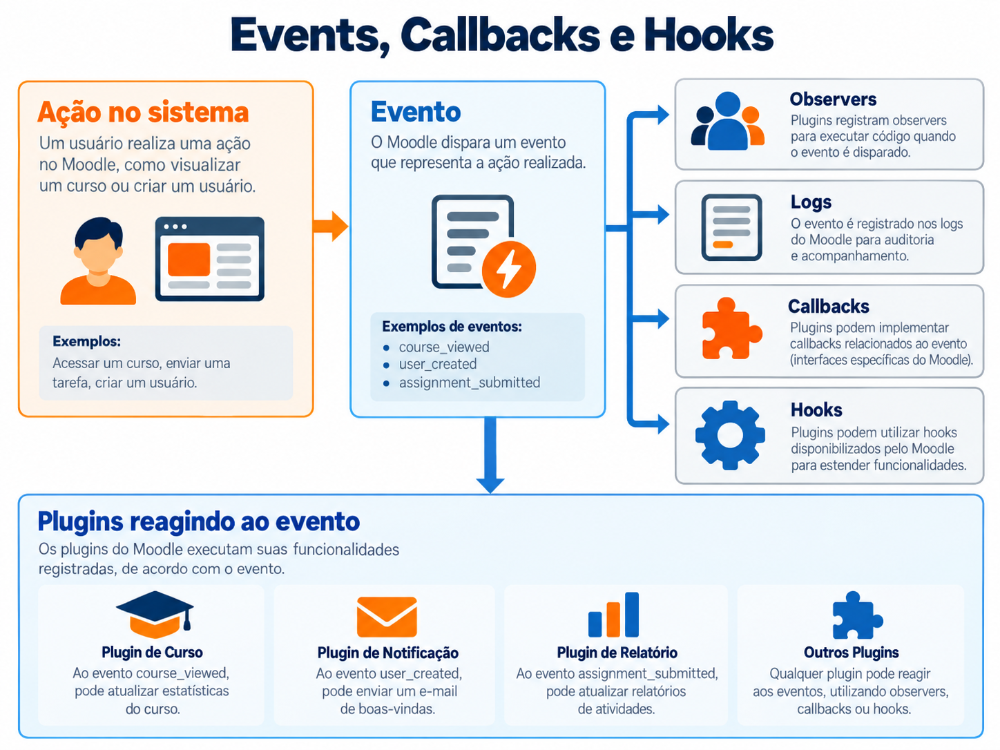
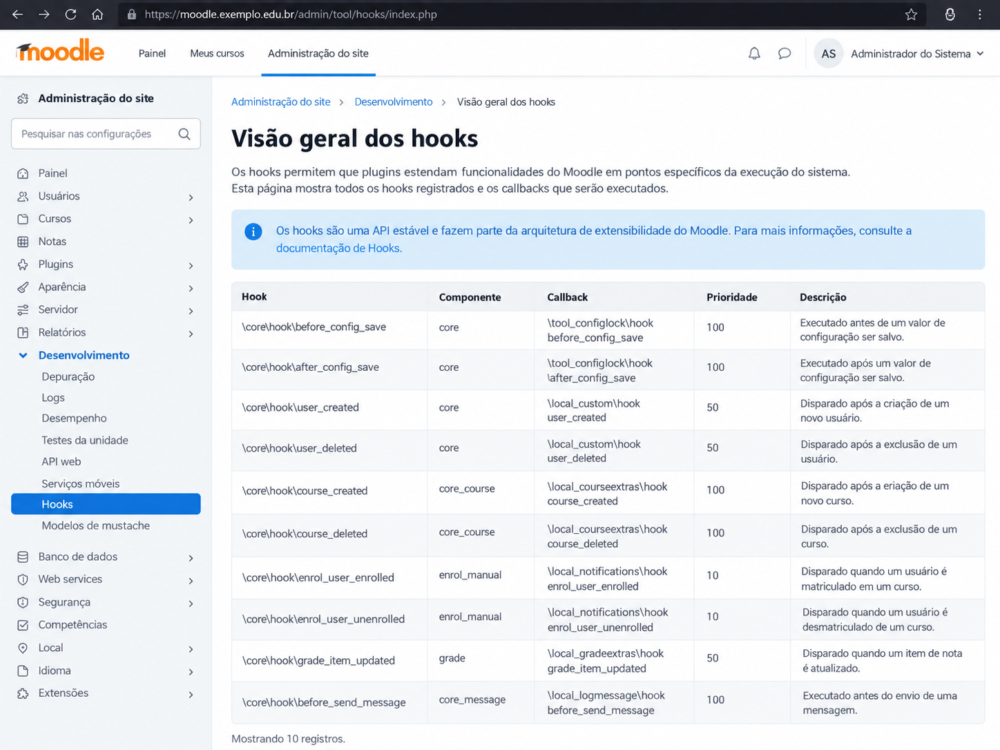



# 10. Events, callbacks e Hooks



Se você trabalha com Moodle há algum tempo, provavelmente já abriu um `lib.php` procurando uma função com nome enorme, encontrou um `db/events.php` registrando um observer e, em uma branch mais nova, apareceu um `db/hooks.php` apontando para uma classe que recebe um objeto de Hook. Os três mecanismos existem para permitir que uma parte do Moodle reaja ao que outra parte está fazendo, mas eles nasceram em momentos diferentes, resolvem problemas diferentes e, quando são tratados como sinônimos, o código fica confuso muito rápido.

O erro mais comum é reduzir tudo a uma pergunta do tipo 'qual deles executa meu código quando alguma coisa acontece?'. Os três podem executar código em resposta a alguma coisa, mas isso não significa que possuam a mesma semântica. Um Event normalmente descreve algo que já aconteceu, registra esse fato e permite que observers reajam. Um Hook abre um ponto de extensão deliberado dentro de um fluxo e pode permitir que outros componentes acrescentem, alterem ou até interrompam alguma coisa, dependendo do contrato daquele Hook. Um callback legado é uma convenção histórica em que o core procura uma função conhecida dentro dos plugins e a chama quando chega naquele ponto.

A diferença parece pequena enquanto o plugin possui cinquenta linhas e ninguém depende dele, mas em produção muda completamente a forma como você pensa a arquitetura. Se você usa Event para pedir que outro plugin modifique dados antes de uma operação, está tentando transformar um registro de fato em mecanismo de customização. Se usa Hook apenas para registrar que algo aconteceu, pode estar ignorando o sistema de Events, logging e observabilidade já construído pelo Moodle. E se cria hoje um callback novo em `lib.php` porque viu um exemplo de 2014, você está adicionando dívida técnica em um lugar onde o Moodle já criou uma alternativa moderna.

## 10.1 Diferença entre Event, Hook e callback

Uma forma prática de separar os três é pensar em intenção. Event responde melhor à frase 'isso aconteceu'. Hook responde melhor à frase 'estou neste ponto do processo e permito que outros componentes participem'. Callback responde à frase 'o Moodle sabe que alguns plugins podem implementar esta função e, se ela existir, vai chamá-la'. Essa diferença de intenção é mais importante do que a diferença sintática entre `trigger()`, `dispatch()` e uma função em `lib.php`.

Imagine que uma atividade terminou de salvar uma tentativa. Disparar um Event informando que a tentativa foi submetida faz sentido porque o fato aconteceu e outros componentes podem registrar auditoria, sincronizar um sistema externo ou atualizar uma integração. Agora imagine que, antes de montar um conjunto de botões na interface, você quer permitir que plugins acrescentem ações. Isso é muito mais próximo de Hook, pois existe um ponto deliberado de customização e o dado ainda está sendo preparado. Já um callback histórico como `extend_navigation()` existe porque o Moodle adotou durante muitos anos a convenção de procurar funções conhecidas nos plugins.

Outra diferença que ajuda bastante é pensar em mutabilidade. O Event deve ser tratado como representação de um fato e o observer não deve alterar o Event para tentar mudar o que aconteceu. Hook, por outro lado, pode ser projetado justamente para transportar um objeto que será enriquecido ou modificado pelos callbacks. Callback depende do contrato específico e por isso é o mais irregular dos três, porque alguns apenas notificam, outros recebem parâmetros por referência e outros retornam valores que o core combina.

## 10.2 O que é um callback Moodle

Callback no Moodle não é uma classe especial e nem uma interface única. Historicamente é uma função ou método que o core sabe procurar pelo nome e chamar em determinado momento. Em muitos casos antigos a convenção é `frankenstyle_callbackname()`, como uma função de um módulo ou plugin local colocada em `lib.php`. O ponto importante é que quem define o contrato é o código que chama o callback, não o plugin que o implementa.

Isso significa que você não inventa `local_meuplugin_quando_eu_quiser()` e espera que o Moodle descubra magicamente. Precisa existir no core ou em outro componente um ponto que procure exatamente aquele callback, geralmente por APIs como `get_plugins_with_function()`, `plugin_callback()` ou `component_callback()`. Quando a função é encontrada, o Moodle chama com os parâmetros definidos pelo contrato daquele ponto de extensão.

Callbacks continuam existindo porque fazem parte de APIs antigas e alguns tipos de plugin ainda dependem de callbacks obrigatórios, especialmente Activity Modules. Então a mensagem deste capítulo não é 'callback é proibido'. A mensagem é outra. Não crie callback novo por hábito quando existe uma API moderna adequada, e quando estiver consumindo um ponto de extensão antigo verifique se já existe Hook substituto.

## 10.3 Callbacks históricos em lib.php

Durante muitos anos, `lib.php` virou a central de extensão de plugins Moodle. Se o core precisava permitir que plugins participassem de um processo, criava uma convenção de função, procurava essa função nos componentes e executava. Isso funcionou e permitiu uma quantidade enorme de extensibilidade antes de existir uma Hooks API formal, mas também criou um arquivo que em plugins antigos facilmente vira uma coleção de funções globais sem relação clara entre si.

É por isso que você ainda encontra plugins com centenas ou milhares de linhas em `lib.php`. Ali aparecem callbacks de navegação, renderização, curso, módulo, usuário, arquivo, cron legado e integrações específicas, tudo misturado porque cada API histórica foi adicionando sua própria função conhecida. O problema não é apenas estética. Funções globais são mais difíceis de organizar, testar e tipar, além de aumentarem o custo de carregar um arquivo que possui importância especial no ciclo de execução do Moodle.

Em código novo, `lib.php` deve ser visto como ponto de compatibilidade e contrato, não como o lugar onde toda lógica do plugin mora. Se um callback antigo é obrigatório, mantenha a função fina e encaminhe o trabalho para uma classe. Se o callback já possui Hook substituto e sua branch mínima permite usar esse Hook, prefira a API moderna.

## 10.4 Por que lib.php deve ficar pequeno

No Capítulo 3 eu já tratei `lib.php` como um arquivo que não deveria virar depósito de regra de negócio, e aqui aparece um motivo ainda mais concreto. Callbacks podem ser descobertos e executados em muitos fluxos diferentes, então uma função pesada em `lib.php` costuma esconder custo de banco, chamada externa ou preparação de dados em um ponto que ninguém imagina olhando para a página atual.

Uma função de callback com dez linhas que valida parâmetros e chama `\local_meuplugin\service\alguma_coisa` é muito mais fácil de entender do que trezentas linhas de regra procedural. A classe chamada pode receber dependências, ser testada isoladamente e evoluir sem transformar `lib.php` em um mapa arqueológico das últimas dez versões do plugin.

Também existe compatibilidade. Se amanhã o callback for substituído por Hook, você não quer portar trezentas linhas de lógica. Você quer criar uma nova entrada que chama a mesma classe já existente. Essa separação transforma migração de API em troca de adaptador, não em reescrita do componente.

## 10.5 Events API

A Events API moderna do Moodle ganhou papel central a partir da geração 2.x e foi consolidada quando os eventos do core foram convertidos para a nova API no Moodle 2.7. Hoje ela serve tanto para comunicação entre componentes quanto para sustentar o sistema moderno de logs. Isso é importante porque um Event bem desenhado não é apenas um 'callback com classe', ele entra em uma infraestrutura que sabe registrar o que aconteceu, associar contexto, usuário, objeto e produzir informação auditável.

O uso mais natural de Event aparece depois de uma ação significativa. Um registro foi criado, uma tentativa foi enviada, um arquivo foi atualizado, um curso foi visualizado, uma matrícula mudou. Você representa esse fato com uma classe de evento, cria a instância com os dados necessários e chama `trigger()`. A partir daí o Moodle registra o evento conforme sua infraestrutura de logging e chama observers interessados.

Por isso eu evitaria usar Events como mecanismo para alterar o fluxo principal. A própria política de desenvolvimento do Moodle deixa claro que observers são notificados do que ocorreu e podem agir sobre a informação recebida, mas não devem modificar o dado do evento nem impedir a ação original. Se você precisa oferecer customização antes da decisão ser finalizada, Hooks são uma ferramenta muito mais adequada.

## 10.6 O que é um evento

Um evento é um objeto que representa algo relevante que aconteceu no sistema. Ele carrega identidade do tipo de evento, contexto, usuário, curso quando aplicável, objeto relacionado, nível educacional, natureza CRUD e dados adicionais. Essa estrutura permite que o Moodle não dependa de textos soltos para entender o que ocorreu.

Pense em `\core\event\course_viewed`. A classe informa que um curso foi visualizado, define `crud` como leitura e usa contexto de curso. O log consegue registrar quem visualizou, qual curso estava envolvido, em qual contexto ocorreu e ainda produzir uma descrição legível. Um plugin pode observar esse evento sem precisar alterar o código que renderiza o curso.

O ponto forte é o desacoplamento. Quem dispara o evento não precisa saber quem vai reagir. Quem observa conhece o contrato público daquele evento e recebe uma instância tipada. Isso permite integrações sem enfiar `require_once()` de um plugin dentro de outro e sem editar core.

## 10.7 Diretório classes/event

Eventos próprios do plugin ficam normalmente em `classes/event/`, respeitando autoload e namespace do componente. Um plugin `local_integracao` pode ter `classes/event/processamento_concluido.php`, cuja classe será `\local_integracao\event\processamento_concluido`. O nome da classe descreve o fato, normalmente no passado, porque o evento representa algo que aconteceu e não um comando para alguém executar.

Essa convenção ajuda tanto leitura quanto descoberta. Ao abrir um plugin e encontrar `classes/event/`, você sabe que ali estão fatos publicados por aquele componente. Não misture observers nessa mesma pasta apenas porque ambos tratam de eventos. A classe do Event define o contrato do fato, enquanto o código observer pode ficar em uma classe de callback ou observer organizada conforme a arquitetura do plugin.

## 10.8 Criando um evento

Uma classe de Event normalmente estende `\core\event\base` e implementa `init()` para configurar características fundamentais. Em código novo, você deve definir pelo menos a natureza CRUD adequada e o nível educacional quando fizer sentido, além de `objecttable` quando o `objectid` aponta para uma tabela específica. Depois implemente `get_name()` e `get_description()` e, quando houver URL natural para o fato, `get_url()`.

Evite transformar o Event em DTO genérico com vinte campos aleatórios dentro de `other`. O desenho do evento deve ser estável e semanticamente claro, porque outros plugins podem passar a observar esse contrato. Se amanhã você muda a estrutura arbitrariamente, cria dependência quebrada fora do seu próprio componente.

```php
<?php
namespace local_integracao\event;

final class registro_processado extends \core\event\base {
    protected function init(): void {
        $this->data['crud'] = 'u';
        $this->data['edulevel'] = self::LEVEL_OTHER;
        $this->data['objecttable'] = 'local_integracao_item';
    }

    public static function get_name(): string {
        return get_string('eventregistroprocessado', 'local_integracao');
    }

    public function get_description(): string {
        return "The user with id '{$this->userid}' processed the record " .
            "with id '{$this->objectid}'.";
    }
}
```

## 10.9 create()

Você não instancia um Event do Moodle com `new` e começa a preencher propriedades manualmente. O padrão é usar o método estático `create()` herdado da classe base e fornecer os dados do evento em um array. Esse método valida e prepara a estrutura interna necessária para o funcionamento consistente da API.

O mínimo quase sempre inclui `context`. Dependendo do evento, entram `objectid`, `relateduserid` e `other`. O contexto merece atenção especial porque ele não é decoração para o log. Ele posiciona o fato dentro da árvore de contextos do Moodle e influencia informações derivadas como curso e nível de contexto.

```php
$event = \local_integracao\event\registro_processado::create([
    'context' => $context,
    'objectid' => $record->id,
    'relateduserid' => $record->userid,
    'other' => [
        'source' => 'import',
    ],
]);
```

## 10.10 trigger()

Depois de criar o Event e terminar a ação que ele representa, chame `trigger()`. A ordem importa. Se o evento se chama `registro_processado`, não faz sentido dispará-lo antes de concluir o processamento e depois descobrir que a operação falhou. Event não deveria anunciar uma realidade que ainda pode ser revertida por uma validação comum do próprio fluxo.

Também evite disparar o mesmo evento em três camadas diferentes apenas porque todas passam pelo mesmo código. Escolha o ponto em que o fato realmente se torna verdadeiro. Eventos duplicados poluem logs, fazem observers executar duas vezes e criam bugs que parecem concorrência quando na verdade o problema é desenho do trigger.

```php
// A operação principal foi concluída.
$DB->update_record('local_integracao_item', $record);

$event->trigger();
```

## 10.11 Contexto do evento

O contexto responde onde aquela ação aconteceu do ponto de vista de autorização e organização do Moodle. Um evento de atividade normalmente usa `context_module`, um evento de curso usa `context_course`, enquanto eventos globais podem usar `context_system`. Colocar tudo em contexto de sistema porque é mais fácil empobrece o log e pode quebrar suposições de observers.

Se o evento pertence a um registro associado a uma atividade, não escolha contexto pelo lugar onde seu código está executando, escolha pelo objeto do domínio. Uma task pode estar rodando via CLI e ainda assim disparar evento cujo contexto correto é o módulo relacionado ao registro processado. O ambiente de execução e o contexto semântico são coisas diferentes.

## 10.12 Object ID

`objectid` identifica o objeto principal ao qual o evento se refere. Quando sua classe define `objecttable`, esse id ganha uma relação clara com a tabela indicada. Em um evento `registro_processado`, por exemplo, o `objectid` pode apontar para a linha de `{local_integracao_item}` que foi processada.

Não use `objectid` para guardar qualquer número conveniente. Se o evento se refere a um registro A e você coloca o id de B porque estava mais fácil no momento do trigger, observers e relatórios passam a interpretar o contrato de forma errada. Event é API pública e consistência semântica vale mais do que economizar duas linhas.

## 10.13 Related user

`relateduserid` existe para situações em que existe outro usuário relevante além de quem executou a ação. Imagine um administrador suspendendo uma matrícula de um aluno. O `userid` do Event pode ser o administrador que realizou a operação, enquanto `relateduserid` aponta para o aluno afetado. Essa distinção é importante para logs, privacy e observers.

Um erro comum é sobrescrever mentalmente `userid` com 'usuário sobre quem estou falando'. Nem sempre. `userid` normalmente representa o ator do evento, enquanto `relateduserid` permite registrar a pessoa relacionada ao fato. Antes de preencher, leia a semântica do evento e pergunte quem fez e quem foi afetado.

## 10.14 Other data

`other` serve para dados adicionais que pertencem ao contrato do Event e não cabem nos campos padronizados. Isso não significa jogar ali um dump do registro inteiro. Tudo que entra em `other` aumenta a superfície pública do evento e pode aparecer em logs ou ser consumido por observers, então escolha informações estáveis, necessárias e sem exposição desnecessária de dados sensíveis.

Documente a estrutura em PHPDoc e valide quando necessário. Se o observer depende de `other['source']`, esse campo precisa ter significado previsível. Trocar silenciosamente `source` por `origin` em uma versão futura é quebra de API para quem observa o evento.

## 10.15 CRUD events

Eventos carregam uma classificação CRUD com valores de criação, leitura, atualização e exclusão. Não é um detalhe cosmético. Essa informação permite classificar a natureza da operação e ajuda ferramentas que analisam eventos. Um curso visualizado é leitura, um registro criado é criação e uma preferência modificada é atualização.

Nem todo evento encaixa perfeitamente em uma tabela mental simplista, mas isso não é motivo para escolher qualquer letra. Pense no efeito principal que o evento representa sobre o recurso e consulte eventos semelhantes do core quando houver dúvida. A consistência com o ecossistema vale mais do que uma interpretação criativa local.

## 10.16 Snapshots e estado anterior

Em alguns eventos, especialmente quando um objeto será alterado ou removido, pode ser útil adicionar snapshot do registro para que o evento preserve informação relevante mesmo depois que a linha original mudou ou deixou de existir. A Events API possui suporte para snapshots exatamente porque observers e logs podem precisar entender o objeto em um momento específico.

Não confunda snapshot com desculpa para carregar tudo sempre. Grandes objetos copiados em todo Event aumentam custo e podem levar dados desnecessários ao sistema de logging. Use quando o contrato realmente precisa preservar estado e prefira o mínimo necessário para explicar o fato.

## 10.17 Observers

Observer é o código que reage a um Event. Ele não precisa estar no componente que criou o Event e essa é justamente a utilidade do mecanismo. Um plugin local pode observar evento de curso, um módulo pode observar evento de outro subsistema quando existe justificativa arquitetural e uma integração pode escutar criação de usuário sem editar o código do cadastro.

O método observer recebe a instância do evento. A partir dela você acessa contexto, usuário, objectid, relateduserid e outros dados públicos. Se precisar buscar o registro relacionado, faça isso explicitamente e valide suas premissas, porque o Event não promete que toda entidade ainda exista para sempre, especialmente eventos de exclusão.

## 10.18 db/events.php

Os observers são registrados em `db/events.php`. Esse arquivo declara qual classe de Event será observada e qual callable deve ser executado. O registro é cacheado, então durante desenvolvimento uma mudança pode exigir purge de caches ou incremento de versão conforme o caso. Não tente registrar observer dinamicamente em cada request, porque você estaria contornando a infraestrutura de descoberta do Moodle.

Mantenha o arquivo declarativo. Ele não é lugar para consulta no banco, chamada de API ou lógica condicional complexa. Assim como outros arquivos de `db/`, descreve configuração que o Moodle lê e cacheia.

```php
<?php
$observers = [
    [
        'eventname' => \core\event\course_viewed::class,
        'callback' => '\\local_integracao\\observer::course_viewed',
    ],
];
<?php
namespace local_integracao;

final class observer {
    public static function course_viewed(\core\event\course_viewed $event): void {
        $courseid = $event->courseid;
        // Encaminhe a regra para uma classe própria quando houver trabalho real.
    }
}
```

## 10.19 Observer não é um before hook

Este ponto merece ser escrito em letras grandes no raciocínio, mesmo que não precise virar banner no livro. Observer de Event não é o lugar para dizer 'antes de salvar, altere este valor'. Quando o observer recebe o Event, a semântica é de algo que aconteceu e a política do Moodle reforça que observers não devem modificar os dados do evento nem impedir a ação original.

É possível escrever código que tenta contornar isso, por exemplo observando um evento, fazendo outro update no registro e produzindo um efeito equivalente a modificar o resultado. Tecnicamente pode até funcionar em um caso, mas você está criando uma disputa entre o fluxo principal e uma reação posterior. Se a necessidade real é permitir customização antes da conclusão, procure Hook ou uma API específica para aquele ponto.

## 10.20 Performance e falhas em observers

Observers são executados no fluxo do Event e, portanto, trabalho pesado merece cuidado. Se cada visualização de curso dispara uma integração HTTP síncrona de dois segundos, você acabou de transformar uma página rápida em uma página dependente da latência de outro sistema. A solução normalmente é o observer registrar ou enfileirar o trabalho mínimo e delegar processamento pesado a uma adhoc task, assunto do Capítulo 11.

Também trate idempotência. Eventos podem ser disparados novamente em fluxos legítimos e sua integração não deveria criar duplicações porque presumiu que aquele observer rodaria uma única vez na história do universo. Se a operação externa possui chave natural, id próprio ou possibilidade de retry, modele isso desde o começo.

## 10.21 Comunicação entre componentes

Events são uma ótima forma de comunicação quando o componente A quer anunciar um fato sem conhecer o componente B. Essa independência reduz acoplamento direto e permite instalar ou remover observers sem alterar quem dispara. É muito melhor do que `if (file_exists($CFG->dirroot . '/local/outroplugin/...')) require_once(...)`, que cria dependência implícita e espalha conhecimento entre componentes.

Mas desacoplamento não significa ausência de contrato. Se B depende semanticamente de um Event publicado por A, existe uma dependência de API mesmo sem `require_once`. Você precisa considerar estabilidade do evento, versão mínima e o que acontece quando A não está instalado. Arquitetura desacoplada não é arquitetura sem responsabilidade.

## 10.22 Dependências entre plugins

Quando um plugin só enriquece comportamento se outro estiver presente, um observer pode ser opcional e simplesmente nunca receber nada quando o componente emissor não existe. Quando o plugin não funciona sem esse outro componente, declare dependência em `version.php` e não esconda uma dependência obrigatória atrás de um Event.

Outro cuidado aparece na ordem de instalação e upgrade. Código reativo não deve presumir que todas as tabelas e configurações já existem em qualquer instante de setup. Esse problema fica ainda mais evidente em Hooks, porque alguns podem ser disparados durante instalação e upgrade, enquanto callbacks legados equivalentes historicamente não eram chamados nesses momentos.

## 10.23 Hooks API

A Hooks API entrou no Moodle 4.3 como uma substituição moderna para parte dos callbacks one to many baseados em `lib.php`, construída com alinhamento ao PSR-14. Isso não significa que Events desapareceram. Hooks e Events convivem porque resolvem intenções diferentes, e esse é um dos pontos mais importantes para não ler a palavra 'hook' de forma genérica como acontecia em documentação antiga.

O cenário típico de Hook é o core ou um plugin chegar a um ponto em que deseja oferecer extensão deliberada. Em vez de procurar uma função global pelo nome em todos os plugins, cria um objeto Hook, despacha pelo manager e deixa callbacks registrados reagirem. O objeto pode apenas informar, pode carregar dados mutáveis e pode implementar comportamento stoppable quando o contrato exigir.

## 10.24 Por que Hooks foram criados

Callbacks históricos funcionaram, mas cresceram sem um modelo único. Cada callback precisava de convenção própria, descoberta própria e frequentemente uma função global em `lib.php`. Hooks trazem um modelo baseado em classes, callbacks registrados declarativamente, prioridade explícita, descoberta centralizada e integração com Dependency Injection nas versões modernas.

O ganho não é apenas trocar função por objeto. Um Hook consegue documentar seu próprio contrato com atributos, transportar dados por uma classe dedicada e ser descoberto na página de overview. Além disso, existe uma estratégia oficial de migração que permite declarar que um Hook substitui callbacks antigos e manter compatibilidade entre branches sem chamar duas vezes o mesmo plugin.

## 10.25 PSR-14

O Moodle mapeia sua Hooks API para conceitos do PSR-14. O objeto Hook corresponde ao Event do padrão PSR-14, o callback corresponde ao listener, o código que despacha é o emitter e o Hook manager cumpre o papel de dispatcher e provider. O nome 'Event' do PSR-14 pode confundir porque o Moodle já possui uma Events API com outra semântica, então dentro do Moodle a documentação usa Hook para evitar misturar os dois mundos.

Não precisa decorar a tabela do padrão para usar a API, mas entender o desenho ajuda a perceber por que o Hook é um objeto e por que o dispatcher não deveria conhecer os callbacks concretos. Essa separação deixa o emissor focado no ponto de extensão e o manager responsável por descobrir, ordenar e chamar consumidores.

## 10.26 Hook versus Event

Se você precisa de uma regra curta para escolher, use esta como ponto de partida. Event descreve um fato concluído e é ótimo para logging, auditoria e reação desacoplada. Hook descreve um ponto de extensão e é apropriado quando outros componentes podem participar do fluxo, influenciar dados ou complementar comportamento. Existem casos de fronteira, mas essa distinção resolve a maioria das decisões.

Um exemplo concreto ajuda. Depois de excluir um bloco, você pode disparar ou já existir um Event indicando exclusão. Mas imediatamente antes da exclusão, se plugins precisam inspecionar o objeto ou participar do fluxo, um Hook `block_delete_pre` faz sentido. O próprio core usa esse exemplo ao documentar a migração do callback legado `pre_block_delete`.

## 10.27 Hook que permite alterar dados

Como o Hook é um objeto PHP arbitrário, ele pode expor propriedades ou métodos que permitam aos callbacks alterar o resultado que será usado pelo emissor. Isso resolve um problema que Events não deveriam resolver. Você pode, por exemplo, construir uma coleção de ações, despachar Hook e depois continuar renderizando com a coleção já enriquecida pelos consumidores.

Mas mutabilidade precisa ser desenhada, não liberada sem critério. Se qualquer callback pode sobrescrever qualquer propriedade pública sem regra clara, a ordem dos callbacks vira uma loteria arquitetural. Prefira métodos específicos como `add_action()`, `set_value()` ou coleções controladas quando o contrato exigir alteração, e documente como conflitos devem ser tratados.

## 10.28 Hook stoppable

Alguns Hooks podem permitir interrupção da propagação para callbacks seguintes, usando `Psr\EventDispatcher\StoppableEventInterface`. O objeto precisa responder se a propagação foi interrompida e oferecer o mecanismo apropriado para mudar esse estado. O manager deixa de chamar callbacks posteriores quando o Hook informa que deve parar.

Stoppable não deveria ser ativado porque parece poderoso. Se o contrato não possui uma razão clara para apenas um consumidor vencer ou para interromper processamento posterior, não crie essa competição. Quanto mais callbacks podem bloquear uns aos outros, mais importante fica documentar prioridade e efeito da interrupção.

## 10.29 Criando um Hook

Um Hook normalmente vive no namespace `[component]\hook\*` e a documentação atual recomenda classes finais. O construtor recebe os dados necessários para aquele ponto de extensão, preferencialmente com propriedades readonly quando os callbacks apenas precisam consultar. Quando os consumidores podem alterar algo, exponha uma API explícita para essa alteração.

O nome deve descrever o ponto. A partir do Moodle 4.4, Hooks novos que usam ideia temporal seguem convenção com `before` e `after` como prefixo, como `before_form_validation` e `after_form_validation`. Isso parece detalhe de nomenclatura, mas torna o catálogo de Hooks muito mais previsível.

```php
<?php
namespace local_integracao\hook;

#[\core\attribute\label('Hook dispatched before an integration payload is sent')]
#[\core\attribute\tags('integration', 'payload')]
final class before_payload_sent {
    public function __construct(
        public readonly int $recordid,
        private array $payload,
    ) {
    }

    public function get_payload(): array {
        return $this->payload;
    }

    public function replace_payload(array $payload): void {
        $this->payload = $payload;
    }
}
```

## 10.30 label e tags

Hooks podem se descrever com atributos como `\core\attribute\label` e `\core\attribute\tags`. Isso ajuda a descoberta e a página de overview, além de colocar documentação essencial perto da própria classe. O label deve explicar o que o Hook representa em inglês e as tags ajudam agrupamento e busca.

Existe também a alternativa de implementar a interface de descrição prevista pela API, mas em código moderno os atributos deixam o contrato bastante legível. O importante é não criar Hook mudo que só faz sentido depois de abrir o emissor e ler cinquenta linhas de contexto.

## 10.31 Dispatch de um Hook

Depois de construir o objeto, o componente emissor chama o Hook manager. Desde Moodle 4.4 a recomendação é obter o manager pelo sistema de Dependency Injection com `\core\di::get()` e chamar `dispatch()`. Essa forma facilita testes porque o manager pode ser substituído por implementação de fixture durante PHPUnit.

O dispatch deve acontecer exatamente no ponto semântico que o nome promete. Um `before_payload_sent` disparado depois da requisição HTTP é mentira arquitetural, mesmo que o código compile. Nome, momento e dados transportados precisam contar a mesma história.

```php
$hook = new \local_integracao\hook\before_payload_sent(
    recordid: $record->id,
    payload: $payload,
);

\core\di::get(\core\hook\manager::class)->dispatch($hook);
$payload = $hook->get_payload();
```

## 10.32 Consumindo Hook

O consumidor cria um método, normalmente estático, que recebe o tipo exato do Hook. Dentro dele aplica apenas a responsabilidade daquele callback e deixa regra maior em classes próprias. Tipagem aqui ajuda muito, porque o contrato já informa exatamente qual objeto chega ao método e quais operações estão disponíveis.

Não faça um callback universal com `object $hook` e dezenas de `instanceof` só para colocar tudo em uma classe. Isso recria a desorganização de `lib.php` dentro de um arquivo moderno. Uma classe de callbacks pode agrupar métodos relacionados, mas cada método deve continuar específico para um Hook.

## 10.33 db/hooks.php

O registro fica em `db/hooks.php`. Cada entrada informa a classe do Hook, o callable e, opcionalmente, prioridade. Assim como `db/events.php`, esse arquivo deve permanecer declarativo e é cacheado. Mudou registro durante desenvolvimento e nada aconteceu? Antes de reescrever metade do plugin, limpe caches e verifique se a branch suporta a notação que você utilizou.

Desde Moodle 4.4 callbacks podem ser declarados em notação de array. Se o plugin ainda suporta Moodle 4.3, use a notação em string compatível com aquela versão. Esse é um exemplo simples de como a versão mínima suportada muda até detalhes aparentemente pequenos da implementação.

```php
<?php
$callbacks = [
    [
        'hook' => \local_integracao\hook\before_payload_sent::class,
        'callback' => [\local_outroplugin\hook_callbacks::class, 'before_payload_sent'],
        'priority' => 500,
    ],
];
```

## 10.34 Callback class

Eu gosto de manter a classe que recebe Hooks pequena, quase como adaptador. Ela recebe o Hook, extrai o que precisa e chama uma classe de domínio ou serviço do plugin. Isso mantém a integração com a API do Moodle separada da regra principal e facilita testar a regra sem precisar simular o dispatcher inteiro.

Uma classe chamada `hook_callbacks` ou similar faz sentido porque descreve o papel técnico daquela camada. O que eu evitaria é colocar ali vinte queries, chamada HTTP, montagem de PDF e envio de mensagem. O nome 'callback' não transforma qualquer lógica em boa arquitetura.

```php
<?php
namespace local_outroplugin;

final class hook_callbacks {
    public static function before_payload_sent(
        \local_integracao\hook\before_payload_sent $hook,
    ): void {
        $payload = $hook->get_payload();
        $payload['institution'] = get_config('local_outroplugin', 'institution');
        $hook->replace_payload($payload);
    }
}
```

## 10.35 Prioridade

Callbacks de Hook são ordenados por prioridade do maior para o menor. Isso é útil quando a ordem realmente faz parte do contrato, mas não use prioridade para esconder dependências implícitas entre plugins. Se plugin B só funciona porque plugin A sempre executa primeiro e modifica uma estrutura não documentada, você criou acoplamento disfarçado de número.

Quando a ordem importa, documente a razão e mantenha o comportamento previsível. Prioridade deve resolver coordenação prevista pela API, não uma corrida silenciosa entre customizações que ninguém consegue entender seis meses depois.

## 10.36 Hooks Overview



Uma vantagem prática da Hooks API é a página de overview disponível para administradores e desenvolvedores. Ela lista Hooks descobertos e callbacks registrados, permitindo enxergar quem está reagindo a determinado ponto sem sair procurando nomes de função em todos os `lib.php` da instalação.

Essa visibilidade muda bastante suporte em ambientes grandes. Quando uma customização interfere no fluxo, você consegue começar pelo Hook, ver consumidores e prioridades, em vez de depender apenas de grep no código. Hooks dentro do namespace padrão `*[component]\hook\*` são descobertos automaticamente, enquanto localizações não padronizadas exigem discovery agent.

## 10.37 Desabilitando callbacks

Em casos especiais o Moodle permite sobrescrever callbacks de Hook via configuração, inclusive desabilitar um callback específico. Isso é poderoso em diagnóstico e em ambientes onde uma integração precisa ser temporariamente neutralizada sem editar o plugin, mas não deveria virar mecanismo cotidiano de feature flag improvisada.

Se seu próprio plugin precisa habilitar e desabilitar comportamento como parte do produto, crie configuração do plugin e trate isso dentro do callback. O override global de Hooks é ferramenta administrativa e de exceção, não substituto para modelagem funcional.

```php
$CFG->hooks_callback_overrides = [
    \local_integracao\hook\before_payload_sent::class => [
        'local_outroplugin\\hook_callbacks::before_payload_sent' => [
            'disabled' => true,
        ],
    ],
];
```

## 10.38 Descobrindo Hooks disponíveis

Antes de inventar callback novo ou editar core, procure os Hooks já disponíveis. Comece pela página Hooks overview da instalação e depois pesquise no código por namespaces `hook`, por `dispatch(` e pelos atributos de descrição. A documentação oficial também lista a API, mas o código da branch que você realmente suporta continua sendo a fonte final quando existe diferença de versão.

Esse cuidado evita duas gambiarras comuns. A primeira é observar um Event depois do fato só porque você não percebeu que existe um before Hook adequado. A segunda é criar override de renderer, core hack ou patch em arquivo central quando já existe um ponto de extensão desenhado exatamente para aquele fluxo.

## 10.39 replaces_callbacks

O atributo \core\attribute\hook
eplaces_callbacks registra que um Hook substitui um ou mais callbacks legados. Isso é valioso porque documenta a migração diretamente na classe e permite que as ferramentas de descoberta mostrem a relação entre o mecanismo novo e o antigo.

Quando você encontra um callback histórico no seu plugin, procure esse tipo de metadado no Hook correspondente. Não tente adivinhar pela semelhança do nome. Um Hook substituto precisa oferecer semântica equivalente suficiente para a migração e a própria classe pode declarar explicitamente quais callbacks antigos substitui.

## 10.40 deprecated_callback_replacement

Além do atributo, a API possui suporte específico para depreciação de callbacks legados por meio de `\core\hook\deprecated_callback_replacement`. O Hook pode listar os callbacks antigos que substitui e o manager consegue emitir mensagens de debugging quando encontra plugins que ainda não migraram.

A parte interessante é que isso não força todos os plugins da comunidade a abandonar branches antigas no mesmo dia. O mecanismo foi desenhado para permitir uma janela de compatibilidade, em que o callback legado continua existindo enquanto o Hook moderno é adotado progressivamente.

## 10.41 Callbacks one to many antigos

Os Hooks substituem principalmente a categoria de callbacks one to many em que um ponto do core procura implementações em vários plugins e chama todas. Esses callbacks foram uma espécie de Hooks antes de existir uma Hooks API formal, mas dependiam de convenção de funções e infraestrutura específica para descoberta.

Não confunda isso com todo callback existente no Moodle. Alguns callbacks são contratos fundamentais de tipos de plugin, como funções obrigatórias de Activity Modules, e não devem ser migrados simplesmente porque 'Hook é novo'. A documentação fala em substituição de parte dos callbacks one to many, não em extinção universal de `lib.php`.

## 10.42 get_plugins_with_function()

`get_plugins_with_function()` é uma das funções históricas usadas para localizar plugins que implementam determinado callback em `lib.php`. O core informa o nome do callback, recebe as funções encontradas e as chama. Ao ler código antigo, esse padrão é um sinal forte de ponto de extensão one to many que pode ter ou vir a ter substituição por Hook.

Você não precisa reimplementar esse mecanismo no seu plugin novo. Se sua necessidade é criar um novo ponto de extensão moderno, crie Hook. Reproduzir hoje `get_plugins_with_function()` para descobrir funções customizadas é escolher manualmente a infraestrutura antiga apesar de já existir uma API dedicada.

## 10.43 plugin_callback() e component_callback()

`plugin_callback()` e `component_callback()` aparecem em mecanismos históricos de comunicação e permitem chamar callbacks conhecidos em componentes. Eles ainda podem existir em APIs antigas e por isso você precisa saber reconhecê-los, mas não são a primeira escolha para desenhar uma extensão moderna entre plugins.

Quando encontrar um desses em core ou em plugin antigo, descubra primeiro o contrato e veja se existe substituto documentado. Migrar só a chamada sem entender quem consome, quais parâmetros circulam e em que momento do ciclo ela acontece é a forma mais rápida de produzir um Hook com semântica errada.

## 10.44 Como descobrir que um callback já possui Hook substituto

Existem três caminhos práticos. Primeiro pesquise a documentação da Hooks API e a página de overview. Depois procure no código pelo nome do callback dentro de `replaces_callbacks`. Por fim, veja se a classe do Hook implementa `deprecated_callback_replacement` ou declara os callbacks substituídos por atributo.

Essa busca precisa ser feita na branch que o plugin suporta. Um callback pode não ter substituto no Moodle 4.3 e ter no 5.2. Se seu plugin suporta várias branches, a resposta arquitetural pode ser manter as duas entradas chamando a mesma implementação interna até que a branch mínima avance.

## 10.45 after_config e o Hook correspondente

`after_config` é um exemplo didático da estratégia de migração. Historicamente plugins podiam implementar o callback chamado ao final de `lib/setup.php`. A Hooks API introduziu `\core\hook\after_config`, descrito como Hook disparado no final do setup e marcado como substituto do callback legado.

Para um plugin que suporta somente branches modernas onde esse Hook existe, registrar o Hook é a direção natural. Para um plugin que ainda precisa rodar em branches anteriores, você pode manter o callback legado e o registro de Hook apontando para a mesma lógica interna. O objetivo é compatibilidade sem duplicar comportamento.

## 10.46 pre_block_delete e core hook block_delete_pre

Outro exemplo oficial é `pre_block_delete`, substituído por `\core\hook\block_delete_pre`. O Hook carrega a instância do bloco e declara explicitamente que substitui o callback antigo. Esse exemplo mostra bem por que Hooks são mais expressivos, pois existe uma classe tipada para o ponto de extensão em vez de uma função global descoberta por nome.

Ao migrar um plugin que implementava `meuplugin_pre_block_delete($instance)`, a ideia não é copiar todo o corpo para outra função. Coloque a regra numa classe e faça tanto o legado quanto o Hook chamarem essa implementação durante a janela de compatibilidade.

## 10.47 Preferir Hook quando existe substituto moderno

Se sua versão mínima do Moodle já oferece um Hook oficial que substitui o callback one to many que você usaria, prefira o Hook. Ele tem melhor descoberta, contrato por classe, prioridade, integração com a infraestrutura moderna e caminho de manutenção mais alinhado ao core.

Isso não significa sair removendo callbacks obrigatórios de Activity Module ou APIs que nunca receberam Hook. A regra é mais específica. Quando o próprio Moodle diz que determinado Hook substitui aquele callback antigo e sua matriz de versões permite usar o Hook, não escolha voluntariamente a camada legada.

## 10.48 Manter callback antigo e Hook quando o plugin suporta branches antigas

Compatibilidade de plugin é onde decisões absolutas costumam quebrar. Se você suporta Moodle 4.1, 4.5 e 5.2, pode precisar manter uma entrada antiga porque a branch mais velha não conhece o Hook, ao mesmo tempo em que registra o Hook para branches novas. O segredo é não manter duas implementações independentes.

Faça o callback legado e o callback de Hook convergirem para a mesma classe de serviço. Assim uma correção de regra acontece uma vez só e a diferença entre branches fica limitada à camada de adaptação. Quando a versão mínima subir e o legado deixar de ser necessário, você remove o adaptador antigo sem tocar no domínio.

## 10.49 Como o Moodle evita chamada dupla na migração

A documentação da Hooks API prevê explicitamente que um plugin pode conter tanto callback legado quanto callback de Hook durante a transição. Quando o Hook equivalente está registrado, o callback legado correspondente pode ser ignorado pela infraestrutura de migração, evitando que o mesmo plugin processe a ação duas vezes.

Isso é fundamental, porque compatibilidade sem esse cuidado produziria efeitos duplicados, como dois registros, duas notificações ou duas chamadas externas. Mesmo assim, teste sua matriz de versões. Migração de callback é o tipo de mudança em que um teste simples de contagem costuma detectar rapidamente execução dupla.

## 10.50 Hooks durante instalação e upgrade

Existe uma diferença de comportamento que merece muita atenção. Hooks podem ser disparados durante instalação e upgrade, inclusive em momentos em que o banco ainda não está completamente disponível ou o seu plugin ainda não terminou de instalar. A documentação chama isso explicitamente porque callbacks legados equivalentes nem sempre eram executados nesses momentos.

Então um callback de Hook não deve presumir que pode consultar qualquer tabela sempre. Dependendo do Hook, verifique `during_initial_install()`, existência da versão do plugin em config e estado de upgrade antes de acessar estruturas que talvez ainda não existam. Uma migração mecanicamente correta no código pode quebrar a tela de instalação se ignorar o ciclo de vida.

## 10.51 Não migrar cegamente callbacks que ainda não possuem Hook

Nem todo callback antigo possui substituto moderno. Se você inventa um Hook dentro do seu plugin para 'substituir' um callback que o core ainda chama diretamente, nada mudou do ponto de vista do Moodle. O core continuará esperando a função antiga. Seu Hook interno pode até organizar código, mas não substitui o contrato externo.

Antes de remover qualquer função de `lib.php`, confirme que existe ponto moderno oficial e que ele está disponível na sua branch mínima. A pior migração é aquela que deixa o código bonito e simplesmente faz o Moodle parar de chamar seu plugin.

## 10.52 Evitando hacks no core com Hooks

Um dos melhores efeitos dos Hooks é reduzir a justificativa para editar core. Quando você encontra um ponto adequado, pode customizar comportamento mantendo o código do Moodle intacto e deixando sua regra num plugin instalável. Isso melhora upgrade, revisão de segurança e capacidade de comparar sua instalação com upstream.

Mas Hook não é desculpa para implementar qualquer política em qualquer lugar. Se o ponto não oferece os dados ou a mutabilidade necessária, talvez a arquitetura correta seja outro tipo de plugin, uma API diferente ou até propor um novo Hook ao core. Forçar um Hook inadequado pode ser tão frágil quanto o hack que você queria evitar.

## 10.53 Um exemplo completo de decisão

Imagine que sua instituição precisa mandar uma mensagem para um ERP sempre que uma matrícula for criada e também precisa acrescentar um campo a um payload antes de uma integração própria enviá-lo. São dois problemas diferentes. Para a matrícula criada, observar um Event faz sentido porque o fato já ocorreu e sua integração apenas reage. Para o payload ainda em preparação, um before Hook faz sentido porque outro componente precisa participar antes da ação externa.

Agora imagine que você encontrou um callback antigo em `lib.php` que era usado exatamente para enriquecer esse payload e a versão nova do componente declara um Hook com `replaces_callbacks`. A migração correta é registrar o Hook, manter adaptador legado apenas enquanto necessário para branches antigas e mover a regra compartilhada para uma classe. O que você não deveria fazer é observar um Event depois do envio e tentar corrigir o payload tarde demais.

## 10.54 Como escolher em código novo

Pergunte primeiro se você está anunciando um fato ou abrindo um ponto de extensão. Se é fato concluído, Event é candidato forte. Se outros componentes precisam participar do fluxo atual e talvez alterar dados, Hook é candidato forte. Se a documentação de um tipo de plugin exige callback específico, implemente o callback porque aquilo faz parte do contrato. Se encontrou callback histórico one to many, procure substituto moderno antes de escrever função nova.

Depois pergunte sobre acoplamento e custo. Observer pesado provavelmente deveria apenas enfileirar task. Hook com dados mutáveis precisa de contrato claro. Callback obrigatório deveria encaminhar para classe. E qualquer solução que começa com editar arquivo do core precisa justificar por que nenhum ponto oficial atende, porque na maioria das vezes existe uma alternativa melhor ou um caminho para criar uma.

## 10.55 Exercício - migrando um callback legado

Crie um plugin fictício que inicialmente usa um callback legado `after_config` para registrar uma inicialização simples. Mantenha a lógica real em `classes/service/bootstrap.php` e faça o callback de `lib.php` apenas chamar essa classe. Em seguida registre o Hook `\core\hook\after_config` em `db/hooks.php`, apontando para uma classe de callbacks que chama o mesmo serviço.

Teste em uma branch onde o Hook existe e confirme que a lógica executa uma única vez. Depois adicione uma proteção para instalação inicial e simule upgrade, garantindo que o callback moderno não tente acessar uma tabela ainda inexistente. Por fim remova temporariamente o registro de Hook e observe o comportamento do callback legado, entendendo na prática como a estratégia de compatibilidade funciona.

Como segunda parte, observe um Event do core, por exemplo visualização de curso, mas não faça trabalho pesado dentro do observer. Grave apenas uma marca mínima ou enfileire uma adhoc task fictícia. Compare mentalmente os dois casos e explique por que um é Event e o outro é Hook. Se a resposta for apenas 'porque a documentação mandou', volte ao começo do capítulo.

## 10.56 O modelo mental que precisa ficar

Events, Hooks e callbacks são mecanismos de extensão, mas não são três nomes para a mesma coisa. Event representa algo que aconteceu e se encaixa no sistema de logging e observação. Hook cria um ponto deliberado de participação entre componentes e pode permitir alteração ou interrupção conforme seu contrato. Callback é a convenção histórica que ainda sustenta partes importantes do Moodle e que precisa ser respeitada onde continua sendo API oficial.

Quando você separa essas intenções, o código fica muito mais previsível. O Event deixa de ser usado como gambiarra de before action, o Hook deixa de virar log improvisado e `lib.php` para de receber função global a cada nova necessidade. Além disso, migrações ficam menores porque a regra real mora em classes e as APIs do Moodle funcionam como adaptadores ao redor dela.

Se eu pudesse resumir este capítulo numa regra prática seria esta. Não escolha o mecanismo pela quantidade de exemplos encontrados no Google. Descubra o que você quer comunicar, em que momento do fluxo isso acontece e se o consumidor pode ou não influenciar a operação. Depois escolha a API que expressa essa intenção. Em Moodle antigo muita coisa era callback porque não havia alternativa melhor. Em Moodle moderno, continuar fazendo tudo assim já é uma escolha, não uma necessidade.

## Referências técnicas consultadas

* Moodle Developer Resources. Hooks API, versão 5.2. Documentação da API introduzida no Moodle 4.3, registro em `db/hooks.php`, prioridades, Hooks stoppable, atributos e migração de callbacks legados.
* Moodle Developer Resources. Development policies, seção Events. Observers recebem informação sobre eventos ocorridos e não devem modificar o dado do evento nem impedir a ação original.
* Moodle Developer Resources. Moodle 2.7 release notes. Conversão dos eventos do core para a nova Events API e depreciação de APIs antigas de logging.
* Moodle core. `public/lib/classes/event/course_viewed.php`, exemplo atual de Event com `init()`, CRUD, nível educacional, descrição, URL e validação de contexto.
* Moodle Developer Resources. Hooks API 4.5 e 5.x. Estratégia de compatibilidade entre callbacks legados e Hooks, incluindo `after_config`, `pre_block_delete`, `replaces_callbacks` e `deprecated_callback_replacement`.


