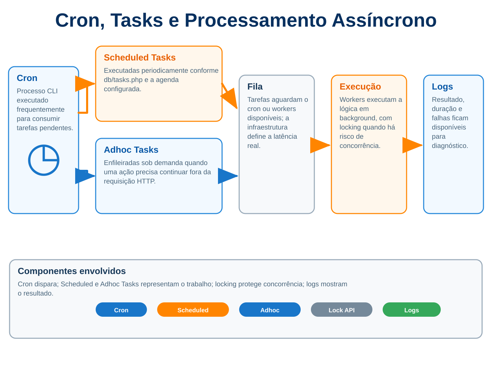



# 11. Cron, Tasks e processamento assíncrono



Quando uma página demora vinte segundos para responder, o problema nem sempre está na consulta SQL ou no servidor. Muitas vezes o código simplesmente está fazendo no lugar errado um trabalho que nunca deveria ter acontecido dentro da requisição do usuário. Importar dez mil registros, converter arquivos, sincronizar matrículas, chamar uma API externa para centenas de usuários, gerar relatórios pesados ou enviar milhares de mensagens pode até funcionar dentro de um `view.php`, mas funcionar uma vez em ambiente de desenvolvimento não transforma isso numa arquitetura aceitável.

Esse é um daqueles pontos em que o Moodle obriga você a mudar a forma de pensar. O usuário faz uma ação, o plugin valida o pedido, registra o que precisa ser feito e devolve a página rapidamente. O trabalho pesado fica para outro processo, fora da requisição HTTP, e é exatamente aí que entram cron, Scheduled Tasks, Adhoc Tasks e a Lock API.

A palavra "assíncrono" também precisa ser usada com algum cuidado. Quando você enfileira uma tarefa, ela não começa magicamente em outra thread no mesmo instante. Você colocou trabalho numa fila e algum processo de cron precisa consumi-la. Se o cron roda uma vez por hora, sua fila pode esperar quase uma hora. Se roda a cada minuto e há workers suficientes, o comportamento é muito diferente. A API resolve a arquitetura do processamento, mas não corrige uma infraestrutura mal configurada.

## 11.1 Como funciona o cron

O cron do Moodle é o processo que mantém uma quantidade enorme de coisas funcionando sem depender de alguém abrir uma página. Limpeza de dados antigos, envio de mensagens, cálculo de estatísticas, sincronizações, notificações, processamento de filas, tarefas de plugins e diversas rotinas do core passam por ele. Em uma instalação pequena isso pode ficar invisível durante meses, justamente porque muita coisa continua parecendo funcionar mesmo com cron mal configurado, mas em produção os sintomas aparecem como e-mails atrasados, filas acumuladas, tarefas que nunca executam e integrações que parecem intermitentes.

No servidor, normalmente existe um agendador do sistema operacional chamando o cron do Moodle pela CLI. Em Linux, por exemplo, é comum configurar algo equivalente a uma execução por minuto. O comando exato depende de onde o Moodle está instalado, mas a ideia é esta.

```
* * * * * /usr/bin/php /var/www/moodle/admin/cli/cron.php >/dev/null
```

Esse processo não executa apenas uma função enorme chamada "cron" e termina. O Moodle consulta o sistema de tarefas, identifica o que está pronto para rodar, executa Scheduled Tasks e Adhoc Tasks conforme disponibilidade e registra o resultado das execuções. Em instalações maiores, múltiplos processos podem participar do processamento, por isso o código precisa ser escrito assumindo que concorrência existe.

Nas versões modernas, a arquitetura correta é Task API. O cron legado baseado em arquivos `cron.php` de plugins ou callbacks como `[modname]_cron()` foi removido no Moodle 4.3. Se você encontrar um tutorial antigo mandando criar uma função `meuplugin_cron()` em `lib.php`, não está vendo uma alternativa equivalente, está vendo um modelo antigo que já deveria ter sido migrado.

## 11.2 Por que o cron deve rodar frequentemente

A documentação do Moodle recomenda que o cron execute pelo menos uma vez por minuto, e isso não é preciosismo. Uma Adhoc Task que você enfileira agora só poderá ser consumida quando houver um processo de cron trabalhando, então rodar cron de quinze em quinze minutos significa aceitar deliberadamente até quinze minutos de latência antes mesmo de o trabalho começar.

Pense numa integração de matrícula. O pagamento foi aprovado às 14h02, o plugin enfileirou a matrícula corretamente e respondeu ao webhook em poucos milissegundos. Se o cron executa às 14h15, para o usuário parece que a integração demorou treze minutos, mas o problema não estava no código de matrícula, estava na infraestrutura de execução da fila.

Existe ainda outro detalhe. Rodar cron frequentemente não significa obrigatoriamente executar tudo serialmente num único processo. Instalações maiores podem ter workers dedicados, nós separados e estratégias diferentes para processamento, enquanto a Task API oferece a abstração necessária para o plugin não precisar saber em qual servidor o trabalho será executado. Essa independência é uma das razões para não colocar regra de negócio dentro do script de cron em si.

## 11.3 Scheduled Tasks

Scheduled Task é a escolha quando o trabalho precisa acontecer de forma recorrente e sua existência não depende de uma ação específica de usuário. Sincronizar matrículas a cada dez minutos, limpar registros expirados durante a madrugada, consultar periodicamente um serviço externo ou reconstruir algum dado derivado são exemplos típicos.

A pergunta prática é simples. Se ninguém clicar em nada hoje, esse trabalho ainda precisa acontecer? Se a resposta for sim e existe uma periodicidade natural, Scheduled Task provavelmente faz sentido.

O erro comum é usar Scheduled Task como uma fila improvisada. O plugin grava registros pendentes numa tabela e cria uma tarefa agendada a cada minuto para procurar tudo que ainda não foi processado. Isso pode funcionar e existem cenários em que é proposital, principalmente quando você quer um consumidor centralizado, mas muitas vezes uma Adhoc Task por unidade de trabalho ou por lote expressa melhor a intenção e evita varrer tabela sem necessidade.

## 11.4 `db/tasks.php`

A configuração inicial das Scheduled Tasks fica em `db/tasks.php`. Esse arquivo declara quais tarefas recorrentes pertencem ao plugin e qual é a agenda padrão delas.

```php
<?php

defined('MOODLE_INTERNAL') || die();

$tasks = [
    [
        'classname' => '\\local_meuplugin\\task\\sync_users',
        'blocking' => 0,
        'minute' => '*/10',
        'hour' => '*',
        'day' => '*',
        'month' => '*',
        'dayofweek' => '*',
    ],
];
```

O detalhe importante não é decorar a sintaxe do cron, mas entender que esse arquivo define o padrão inicial. O administrador pode alterar a frequência na interface do Moodle e, se ele personalizou aquela tarefa, uma mudança posterior no `db/tasks.php` não deve simplesmente apagar a decisão administrativa. Isso evita uma atualização do plugin redefinir silenciosamente uma agenda que a equipe de infraestrutura ajustou por necessidade local.

O campo `blocking` aparece em muito código antigo e ainda pode aparecer em documentação de branches anteriores, mas suporte para tarefas que bloqueiam todas as outras foi removido no Moodle 4.4. Não construa arquitetura nova dependendo disso. Se duas execuções não podem acontecer juntas, o problema deve ser resolvido com desenho de fila, idempotência e Lock API, não parando o sistema inteiro para uma tarefa passar.

## 11.5 Diretório `classes/task/`

As classes de Task pertencem ao diretório autoloaded `classes/task/`. Isso parece apenas convenção de organização, mas ajuda bastante quando o plugin cresce porque separa pontos de entrada do sistema de tarefas das classes que realmente implementam a regra de negócio.

Uma classe de Task não deveria virar um monstro de mil linhas só porque roda em background. O ideal é que ela carregue o mínimo necessário, faça o controle de execução, registre progresso e delegue o trabalho para serviços do plugin.

```php
namespace local_meuplugin\task;

class sync_users extends \core\task\scheduled_task {
    public function get_name(): string {
        return get_string('tasksyncusers', 'local_meuplugin');
    }

    public function execute(): void {
        $service = new \local_meuplugin\service\user_sync();
        $service->execute();
    }
}
```

Quando a lógica fica em `service\user_sync`, ela pode ser testada diretamente, reutilizada por CLI e chamada por outra Task se necessário. A Task fica responsável pelo contexto de execução, não por ser o lugar onde todo o plugin mora.

## 11.6 `scheduled_task`

Toda Scheduled Task estende `\core\task\scheduled_task`. A classe base integra sua implementação ao gerenciador de tarefas, fornece informações de agendamento e participa do ciclo de execução do cron.

Você normalmente implementa `get_name()` e `execute()`. Não é preciso construir um mini framework em volta disso. Se a tarefa precisa de vinte métodos privados para conseguir funcionar, talvez parte importante da lógica esteja na classe errada.

Também não assuma que `execute()` roda no contexto de uma requisição normal. Não existe navegador esperando resposta, não existe formulário aberto e o usuário efetivo da execução pode ser o usuário de cron. Isso muda decisões de capability, mensagens, URLs relativas, sessão e qualquer código que dependa implicitamente do usuário atual.

## 11.7 `get_name()`

`get_name()` devolve o nome legível da tarefa, normalmente com `get_string()`. Parece detalhe cosmético até você abrir a tela administrativa com dezenas de tasks falhando e descobrir que nomes claros fazem diferença.

```php
public function get_name(): string {
    return get_string('tasksyncexternalusers', 'local_meuplugin');
}
```

Evite nomes vagos como "Process task" ou "Run job". A pessoa que administra o site precisa entender o que aquela tarefa faz sem abrir seu código-fonte. "Sincronizar usuários com ERP" é muito mais útil do que "Executar sincronização".

## 11.8 `execute()`

`execute()` é chamado quando o gerenciador decide executar a tarefa. É aqui que muita implementação fica perigosa porque o desenvolvedor pensa "agora posso fazer qualquer coisa, estou fora da página" e coloca uma operação sem limite processando milhões de registros.

Sair da requisição HTTP resolve timeout do navegador, mas não transforma memória e tempo de CPU em recursos infinitos. Uma tarefa que carrega 500 mil registros de uma só vez com `get_records()` pode matar o worker da mesma maneira que mataria uma página, apenas sem um usuário olhando a tela.

O desenho correto normalmente usa lotes, cursores, recordsets ou algum marcador de progresso, e isso permite que a tarefa processe uma quantidade controlada de dados, libere recursos e continue depois quando necessário.

## 11.9 Configuração administrativa da frequência

Scheduled Tasks aparecem na administração do Moodle e o administrador pode alterar agenda, desabilitar execução e observar informações relacionadas à tarefa. Isso é importante porque plugin não conhece toda a infraestrutura onde será instalado.

Talvez você ache razoável sincronizar um ERP a cada minuto, mas o endpoint do cliente aceite apenas cem chamadas por hora. Talvez uma limpeza noturna seja barata num ambiente e pesada em outro. Permitir ajuste administrativo faz parte da arquitetura da Task API.

Por isso eu evitaria implementar dentro de `execute()` uma condição fixa do tipo `if (date('H') !== '03') return;`. Se a periodicidade é agenda, coloque na agenda. Código deve decidir o que fazer, não esconder um segundo sistema de cron dentro da própria task.

## 11.10 Adhoc Tasks

Adhoc Task representa trabalho enfileirado sob demanda. Alguma coisa aconteceu agora e você quer executar determinada operação fora da requisição atual.

Um professor envia um arquivo grande para importação, o plugin valida o upload, cria um registro de importação e enfileira uma Adhoc Task. O navegador recebe uma confirmação rapidamente, enquanto o processamento real acontece depois. Esse é um cenário muito mais natural do que manter o professor esperando a planilha inteira ser analisada.

A mesma classe pode ser enfileirada várias vezes com dados diferentes. Você pode ter cem instâncias da mesma Adhoc Task processando cem importações distintas, o que é completamente diferente de uma Scheduled Task única executada segundo uma agenda fixa.

## 11.11 `adhoc_task`

A classe estende `\core\task\adhoc_task` e normalmente precisa apenas de `execute()`, embora em código moderno seja bastante útil criar um método factory para construir a task de forma consistente.

```php
namespace local_meuplugin\task;

class import_file extends \core\task\adhoc_task {
    public static function instance(int $importid, int $userid): self {
        $task = new self();
        $task->set_custom_data((object) [
            'importid' => $importid,
        ]);
        $task->set_userid($userid);
        return $task;
    }

    public function execute(): void {
        $data = $this->get_custom_data();
        $importid = (int) $data->importid;
        $service = new \local_meuplugin\service\importer($importid);
        $service->execute();
    }
}
```

Depois, o código que recebeu a solicitação apenas enfileira.

```php
$importid = $import->id;
$userid = $USER->id;
$task = \local_meuplugin\task\import_file::instance($importid, $userid);
\core\task\manager::queue_adhoc_task($task);
```

O método factory evita espalhar pelo plugin detalhes como formato de `customdata`, usuário da execução e opções de retry. Se amanhã você acrescentar um novo campo obrigatório, existe um lugar central para ajustar a criação da task.

## 11.12 `set_custom_data()`

`set_custom_data()` permite armazenar os dados específicos daquela execução. É tentador colocar ali o objeto inteiro que você já tem em memória, mas normalmente é melhor passar identificadores e reconstruir o estado quando a task rodar.

```php
$task->set_custom_data((object) [
    'importid' => $import->id,
    'courseid' => $course->id,
]);
```

Quando a task executar talvez tenham passado segundos, minutos ou horas. Se você serializou uma fotografia enorme do estado antigo, pode estar processando dados obsoletos. Se passou `importid`, pode reler o registro atual e tomar decisão baseada no estado real.

Isso também reduz tamanho da fila, facilita debugging e evita carregar informações desnecessárias dentro da task.

## 11.13 Serialização dos dados

Os dados personalizados precisam ser serializáveis em JSON. Isso elimina objetos arbitrários com recursos internos, closures, conexões e outras coisas que não fazem sentido atravessar o limite entre a requisição que enfileira e o processo de cron que executa.

Mesmo quando um objeto parece serializável, não transforme `customdata` em uma segunda tabela de banco. Se a operação precisa de cinquenta campos, talvez esses dados sejam uma entidade de domínio que deveria ter registro próprio e a task deveria receber apenas o ID.

Outro benefício de passar IDs aparece no retry. A primeira tentativa pode ter alterado parcialmente o estado antes de falhar. Quando a task roda de novo, ela precisa descobrir o que já aconteceu, não repetir cegamente uma fotografia de antes da primeira tentativa.

## 11.14 Quando usar Adhoc Task

Use Adhoc Task quando existe uma unidade de trabalho desencadeada por uma ação e ela pode acontecer depois. Importação de arquivo, envio pesado, geração de pacote, processamento de vídeo, chamada em lote para serviço externo, cálculo demorado e integração pós-evento são exemplos naturais.

Também é excelente quando um observer precisa reagir a um Event, mas o trabalho real é pesado. O observer deve ser curto, recolher os identificadores necessários e enfileirar a task. Isso evita transformar o disparo de um Event aparentemente simples numa operação de vinte segundos para todo mundo que acioná-lo.

## 11.15 Quando NÃO usar Adhoc Task

Não use fila para esconder código mal projetado. Se a operação leva 50 milissegundos, depende da resposta imediata e faz parte da transação que o usuário espera concluir, colocá-la em Adhoc Task pode piorar consistência e experiência.

Também não use Adhoc Task quando a regra exige retorno síncrono. Imagine validar se um cupom ainda é válido antes de concluir uma compra. Você não pode responder "compra concluída" e descobrir dois minutos depois que a validação falhou.

Outro erro é enfileirar milhares de tasks minúsculas sem avaliar custo. Se você precisa atualizar dez milhões de linhas, talvez uma task por linha seja pior do que lotes bem dimensionados. Fila tem overhead, banco tem overhead e cada processo precisa inicializar Moodle. Assíncrono não significa grátis.

## 11.16 Fila de processamento

Uma fila bem desenhada possui estado observável. Você precisa saber o que está pendente, processando, concluído ou com erro, principalmente quando o trabalho é importante para o negócio.

A Task API mantém sua própria fila, mas muitas funcionalidades também se beneficiam de uma tabela de domínio que registra o processo. Uma importação, por exemplo, pode ter `status`, `totalitems`, `processeditems`, `lasterror`, `timecreated` e `timecompleted`. A task continua sendo mecanismo de execução, enquanto a tabela descreve o estado funcional que a interface precisa mostrar.

Não confunda as duas coisas. Consultar diretamente tabelas internas de tasks para montar a tela do seu plugin cria acoplamento desnecessário. Sua aplicação deve ter seu próprio estado quando isso for relevante ao usuário.

## 11.17 Dividir trabalho pesado

Se uma operação pode levar uma hora, eu evitaria escrever uma única task que promete ficar viva por uma hora. Quanto maior a execução, maior a chance de rede cair, processo reiniciar, deploy interromper, memória crescer e retry repetir coisa demais.

Dividir o trabalho reduz o raio de falha. Uma importação de 100 mil registros pode ser quebrada em lotes de mil, e cada execução sabe qual faixa precisa processar. Se o lote 47 falhar, você não precisa repetir os primeiros 46.

O tamanho ideal depende do custo de cada item. Mil updates simples podem ser baratos, enquanto dez conversões de vídeo podem ser pesadas. Por isso batch size deve ser consequência de medição, não de um número mágico copiado de outro plugin.

## 11.18 Batch processing

Um padrão simples é guardar cursor ou último ID processado. A task busca os próximos N registros, processa, atualiza o checkpoint e, se ainda houver trabalho, enfileira continuação.

```php
$records = $DB->get_records_select(
    'local_meuplugin_queue',
    'id > :lastid AND status = :status',
    ['lastid' => $lastid, 'status' => 'pending'],
    'id ASC',
    '*',
    0,
    500
);
```

Depois de concluir o lote, você grava o novo ponto e agenda a próxima execução. Esse desenho também ajuda a respeitar rate limits externos, porque o lote pode controlar quantas chamadas são feitas antes de devolver o worker para a fila.

Só tome cuidado para não confundir paginação por offset com checkpoint estável. Se registros mudam de status enquanto você processa, `LIMIT 500 OFFSET 500` pode pular ou repetir itens. Em filas mutáveis, avançar por chave estável costuma ser mais previsível.

## 11.19 Retomar processamento

Processamento robusto assume que interrupção vai acontecer. Servidor reinicia, API externa responde 500, banco fica indisponível, deploy mata worker, arquivo desaparece ou um único registro inesperado lança exceção.

A pergunta não é "como impedir qualquer falha?", porque isso não existe. A pergunta é "quando falhar, de onde eu continuo?".

Checkpoint, status por item e idempotência formam a resposta. Se a task consegue reler o estado e descobrir que itens 1 a 4.500 já foram concluídos, continuar do 4.501 é simples. Se ela guarda tudo apenas em variáveis de memória, qualquer interrupção transforma progresso em fumaça.

## 11.20 Idempotência

Idempotência significa que repetir uma operação não produz efeitos duplicados indesejados. Em fila isso não é luxo, porque retry existe justamente para repetir execução depois de falha.

Imagine uma task que cria cobrança no gateway e depois grava o ID retornado no Moodle. O gateway cria a cobrança, mas a conexão cai antes de seu banco receber o ID. A task falha e tenta de novo. Se a integração não usa chave idempotente nem consegue consultar a operação anterior, você pode criar duas cobranças.

No banco local, a mesma ideia aparece com inserts. Em vez de assumir "se executei, ainda não existe", use uma chave única coerente com a regra de negócio, consulte estado e desenhe a operação para poder ser repetida com segurança.

Uma task que só funciona se executar exatamente uma vez em condições perfeitas não é robusta. Ela apenas ainda não encontrou a falha certa.

## 11.21 Retry

O sistema de tasks trata falhas e pode reagendar execução automaticamente. A documentação atual descreve aumento progressivo do intervalo entre tentativas, começando curto e podendo chegar a intervalos longos quando a falha persiste.

Em Adhoc Tasks modernas também existe controle de tentativas disponíveis por meio de `set_attempts_available()`, introduzido no Moodle 4.4, além da possibilidade de alterar comportamento com `retry_until_success()`.

```php
$task = \local_meuplugin\task\send_batch::instance($batchid);
$task->set_attempts_available(3);
\core\task\manager::queue_adhoc_task($task);
```

Retry faz sentido para falhas transitórias como timeout, DNS, serviço externo indisponível ou lock ocupado. Não adianta tentar doze vezes um CPF inválido ou um arquivo cujo formato nunca será aceito. Nesse caso a falha é funcional e você precisa registrar erro definitivo, não torturar o cron durante horas.

## 11.22 Falhas

Uma Task pode simplesmente lançar exceção e deixar o gerenciador registrar a falha e aplicar a estratégia de retry. Isso é melhor do que engolir toda exceção e terminar com status de sucesso quando metade do trabalho falhou.

Existe uma nuance quando você processa muitos itens independentes. Se o item 20 falha, talvez não faça sentido impedir o 21 ao 500 de continuar. Você pode capturar a exceção por item, registrar o erro e seguir, mas a partir desse momento a responsabilidade pelo diagnóstico é sua.

```php
try {
    $this->process_item($item);
} catch (\Throwable $e) {
    mtrace_exception($e);
    $haserrors = true;
}
```

No fim, dependendo da regra, você pode lançar uma exceção para que a execução geral seja marcada como falha ou concluir e manter os erros registrados por item. O importante é não produzir aquele pior cenário em que o cron diz "sucesso" e o usuário descobre depois que 30% dos dados não foram processados.

## 11.23 Logs

Tasks precisam deixar rastros úteis. Não é para despejar dados sensíveis nem imprimir cada linha processada, mas você deve conseguir responder perguntas básicas quando algo quebra. Qual task executou? Qual lote? Qual registro? Quantos itens foram processados? Quanto tempo levou? Qual exceção ocorreu?

O Moodle possui visualização de logs de tasks e ferramentas administrativas para acompanhar execuções, mas seu plugin pode precisar também de estado funcional. Uma sincronização com ERP que falhou em 17 usuários pode precisar registrar esses 17 erros numa tabela própria, porque o administrador quer corrigir e reprocessar depois.

Evite logar tokens, senhas, payloads completos contendo dados pessoais ou cabeçalhos de autenticação. Debugging útil não exige transformar logs em vazamento de credenciais.

## 11.24 `mtrace()`

`mtrace()` é a forma clássica de produzir saída textual apropriada para cron e CLI. Use mensagens que ajudem alguém a entender o andamento sem precisar abrir o código.

```
mtrace('Starting ERP user synchronization');
mtrace('Batch 12: 500 records loaded');
mtrace('Batch 12: 497 processed, 3 failed');
mtrace('ERP user synchronization finished');
```

"Starting task" e "Finished task" em todas as classes ajudam pouco quando existem dezenas de tasks. Prefira mensagens que tragam contexto operacional.

Para exceções capturadas, `mtrace_exception()` ajuda a registrar detalhes de forma coerente. Se você capturou a exceção, o gerenciador não consegue adivinhar que houve problema, então não esconda justamente a informação que seria necessária para investigar.

## 11.25 Tasks duplicadas

Fila duplicada é uma das fontes mais silenciosas de problema. O usuário clica duas vezes, o webhook é entregue novamente, dois observers recebem o mesmo gatilho ou dois processos verificam a mesma condição ao mesmo tempo e ambos enfileiram trabalho equivalente.

Dependendo do caso, duplicidade pode ser aceitável porque a operação é idempotente, mas em outros você quer impedir duas tasks equivalentes na fila. A Task API possui mecanismos para enfileirar ou reagendar Adhoc Tasks considerando identidade de classe, componente, custom data e usuário, e isso pode ser útil quando uma única execução representa o estado atual de um recurso.

Mesmo assim, não trate prevenção de fila duplicada como substituto de idempotência. Entre verificar e executar muita coisa pode mudar, e uma task antiga pode já estar rodando quando a nova é criada. O processamento em si precisa continuar seguro.

## 11.26 Concorrência

Se seu código só funciona quando existe um único cron rodando no planeta, ele está frágil. Moodle pode executar tarefas em paralelo, especialmente em instalações maiores, e duas execuções podem chegar ao mesmo recurso quase simultaneamente.

O exemplo clássico é uma fila em tabela. Worker A busca o primeiro registro pendente. Antes de A atualizar o status, Worker B faz a mesma consulta e recebe o mesmo registro. Os dois processam e agora você tem envio duplicado, cobrança duplicada ou importação duplicada.

Transação pode resolver parte dos casos, índice único resolve outros e Lock API resolve acesso exclusivo a um recurso. A escolha depende da operação. O que não funciona é torcer para os processos não coincidirem.

## 11.27 Lock API

A Lock API existe para impedir que múltiplos processos acessem simultaneamente um recurso que precisa de exclusividade, inclusive em cluster. Isso é importante porque `flock()` num arquivo local não resolve o problema se você tem três nós diferentes executando cron.

O fluxo é obter uma factory configurada para o site, pedir o lock de um recurso e liberar quando terminar.

```php
$lockfactory = \core\lock\lock_config::get_lock_factory('local_meuplugin_sync');
$lock = $lockfactory->get_lock('course:' . $courseid, 10);

if (!$lock) {
    throw new \moodle_exception('locktimeout', 'local_meuplugin');
}

try {
    $service->sync_course($courseid);
} finally {
    $lock->release();
}
```

O `finally` é importante. Lock esquecido durante exceção pode deixar o recurso indisponível até o backend considerar aquele lock expirado ou o processo morrer de forma que o mecanismo libere corretamente.

A própria documentação alerta que locking não foi feito para ser uma operação baratíssima chamada milhares de vezes por request. A prioridade é correção entre processos e até entre nós diferentes, então use quando existe recurso realmente compartilhado que precisa de exclusividade.

## 11.28 Named locks

Quando falamos em named lock no contexto do Moodle, a ideia prática é construir uma identidade estável para aquilo que está sendo protegido. A Lock API trabalha com um tipo de lock, que deve ser namespaced pelo componente, e uma chave de recurso.

```php
$locktype = 'local_meuplugin_import';
$resource = 'import:' . $importid;
```

Não use uma chave genérica como `lock` para tudo. Isso serializaria trabalhos que poderiam executar em paralelo. Se duas importações independentes podem rodar juntas, cada uma deve ter um recurso diferente. Se a regra exige uma única sincronização global do ERP, aí uma chave única como `erp-sync` pode fazer sentido.

Granularidade de lock é arquitetura. Lock amplo demais mata paralelismo, lock estreito demais não protege o recurso real.

## 11.29 Evitando dois workers processarem o mesmo registro

Um desenho comum é adquirir lock por ID antes de processar o registro. O worker que conseguir o lock continua e o outro ignora ou tenta depois.

```php
$resource = 'queueitem:' . $item->id;
$lock = $lockfactory->get_lock($resource, 0);

if (!$lock) {
    return;
}

try {
    $params = ['id' => $item->id];
    $fresh = $DB->get_record(
        'local_meuplugin_queue',
        $params,
        '*',
        MUST_EXIST
    );

    if ($fresh->status !== 'pending') {
        return;
    }

    $this->process($fresh);
} finally {
    $lock->release();
}
```

Repare que eu releio o registro depois do lock. Antes do lock, o estado era apenas uma observação que podia ter envelhecido. Depois que adquiro exclusividade, verifico novamente se o item continua pendente.

Em outros casos, uma atualização atômica no banco com condição de status pode ser melhor do que lock explícito. Não existe uma única receita, mas existe uma regra consistente. A decisão de "quem é dono deste item agora" precisa ser atômica de alguma maneira.

## 11.30 Execução como usuário específico

Tasks normalmente rodam no contexto do usuário de cron, e isso pode ser errado quando a operação representa uma ação de usuário e precisa respeitar permissões daquele usuário.

Adhoc Task permite definir `userid` com `set_userid()`. Isso não significa que você deve confiar cegamente em capability calculada horas antes. A task precisa validar o contexto atual e o estado atual quando executa, principalmente se permissões podem ter mudado.

Para Scheduled Tasks o cenário é diferente porque não existe um usuário natural que disparou a operação. Quando uma checagem precisa acontecer em nome de alguém, você deve assumir explicitamente esse usuário ou informar o usuário relevante nas verificações, em vez de depender de `$USER` ser magicamente a pessoa certa.

## 11.31 `set_next_run_time()`

Adhoc Task pode ser programada para não executar antes de um timestamp usando `set_next_run_time()`. Isso é útil para digest, processamento diferido, tentativa após janela de rate limit e ações que só devem começar depois de determinado momento.

```php
$task->set_next_run_time(time() + HOURSECS);
\core\task\manager::queue_adhoc_task($task);
```

Isso não é um relógio de precisão. A task não executará antes daquele horário, mas o momento efetivo depende de cron, fila e disponibilidade de workers. Se você precisa que algo aconteça exatamente às 10h00min00s com garantia de tempo real, Task API não deve ser tratada como sistema hard real-time.

## 11.32 Limpeza de caches em tarefas longas

Tarefas muito longas podem alterar grande quantidade de dados enquanto APIs do Moodle mantêm caches estáticos no mesmo processo. Depois de muitas alterações, continuar executando outras tasks no mesmo processo pode carregar pressupostos que já não refletem o estado atual.

A Task API oferece `\core\task\manager::clear_static_caches()` para sinalizar que caches estáticos devem ser limpos antes de trabalho subsequente. Isso é especialmente relevante depois de rotinas que modificam muita coisa.

Não saia chamando isso a cada item. O objetivo não é substituir MUC nem limpar cache como superstição, mas evitar efeitos de estado acumulado em processos longos quando houve mudanças substanciais.

## 11.33 O que aconteceu com blocking tasks

Durante anos Scheduled Tasks puderam declarar `blocking`, fazendo uma tarefa impedir a execução de outras enquanto estivesse ativa. Parece atraente porque transforma concorrência em "ninguém roda até eu terminar", mas o custo global é enorme.

O suporte foi removido no Moodle 4.4. A própria documentação aponta problemas sérios de performance e bugs nesse modelo. Se um plugin ainda depende de task blocking em branch antiga, vale tratar como dívida técnica e migrar para lock granular, filas separadas e operações idempotentes.

Bloquear o cron inteiro porque um recurso específico não pode ser processado por dois workers é como fechar a rodovia inteira porque duas pessoas querem estacionar na mesma vaga.

## 11.34 O fim do cron legado

Outro pedaço importante de história é o cron legado. Plugins antigos podiam implementar callbacks e arquivos próprios que o cron varria periodicamente, e durante muitos anos isso conviveu com Task API.

A Task API entrou no Moodle 2.7 e passou a ser a arquitetura recomendada para trabalho em background. No Moodle 4.3, suporte ao cron legado foi removido. Isso importa porque você ainda encontra exemplos antigos em fóruns, snippets e plugins abandonados.

Se o objetivo é manter código atual, Scheduled Task e Adhoc Task são o caminho. Não recrie mecanismo removido só porque um tutorial de 2012 aparece bem posicionado no buscador.

## 11.35 Execução CLI

Às vezes você quer executar um serviço manualmente para manutenção, diagnóstico ou operação controlada. Isso não significa chamar método protegido da task por gambiarra nem copiar a lógica para outro lugar. Se a regra de negócio está em uma classe de serviço, Task e CLI podem compartilhar o mesmo código.

```php
require(__DIR__ . '/../../../config.php');

if (PHP_SAPI !== 'cli') {
    die('CLI only');
}

$service = new \local_meuplugin\service\user_sync();
$service->execute();
```

O Moodle também oferece ferramentas CLI para executar cron e tarefas em contextos administrativos, dependendo do objetivo e da versão. Para desenvolvimento, poder disparar manualmente uma tarefa ajuda muito a reproduzir falhas sem ficar esperando o próximo ciclo normal.

Mesmo em CLI, mantenha logs claros, códigos de saída coerentes e não assuma recursos ilimitados. Script manual também pode derrubar banco se fizer a mesma consulta ruim cinquenta milhões de vezes.

## 11.36 Não transforme task em request sem navegador

Um erro conceitual comum é escrever a task como se fosse uma página web sem HTML. Ela acessa globais sem necessidade, monta redirect, chama `require_login()`, depende de sessão e lê `optional_param()` como se parâmetros HTTP ainda existissem.

Task deveria receber estado pela fila ou buscar no banco. Se precisa de `courseid`, passe esse ID no `customdata` ou use a entidade que representa o processo. Se precisa executar em nome de usuário, defina o usuário corretamente. Não tente reconstruir uma requisição dentro do cron.

Essa separação melhora testes e também deixa claro que qualquer coisa colocada na fila pode executar em outro processo, outro servidor e muito depois da página que a criou já ter terminado.

## 11.37 Scheduled Task ou Adhoc Task

Uma regra prática funciona bem. Scheduled Task representa obrigação recorrente do sistema. Adhoc Task representa trabalho específico que entrou na fila.

"Todos os dias às 02h revisar matrículas expiradas" é Scheduled Task. "Processar esta importação que o professor acabou de enviar" é Adhoc Task. "A cada cinco minutos consultar se existem arquivos num FTP externo" pode ser Scheduled Task. "Converter o arquivo 9182" é Adhoc Task.

Em alguns projetos os dois trabalham juntos. Uma Scheduled Task consulta fonte externa e descobre 3.000 itens novos, então cria lotes e enfileira Adhoc Tasks para processamento paralelo. Isso é muito melhor do que deixar a tarefa agendada presa processando tudo durante horas se os lotes puderem ser independentes.

## 11.38 Rate limit e APIs externas

Integrações externas são candidatas naturais a Tasks, mas a fila não elimina limite do fornecedor. Se a API permite cem requisições por minuto e você sobe vinte workers, pode transformar processamento assíncrono em ataque distribuído contra o próprio fornecedor.

Controle de batch, backoff, `set_next_run_time()` e estado de retry precisam considerar `429 Too Many Requests`, janelas de quota e indisponibilidade temporária. Quando o serviço fornece `Retry-After`, respeitar essa informação é melhor do que martelar endpoint a cada execução.

Outra regra importante é timeout explícito. Task em background não significa chamada HTTP sem limite de tempo. Uma conexão externa pendurada pode ocupar worker por muito tempo e atrasar toda a fila.

## 11.39 Memória e tarefas longas

PHP termina processo e libera memória, mas enquanto a task está viva qualquer crescimento continua existindo. Um `foreach` que acumula objetos num array de histórico pode consumir gigabytes mesmo que cada consulta isolada seja pequena.

Recordsets, processamento por lote e liberação de referências ajudam. Em tarefas que atravessam grande volume, monitore memória e duração em ambiente semelhante ao de produção. "No meu notebook rodou" não diz nada sobre tabela com cinquenta milhões de linhas.

Também pense em caches internos de bibliotecas, clientes HTTP e objetos de domínio. O gargalo nem sempre está no `$DB`.

## 11.40 Uma fila não substitui transação

Task resolve quando executar, não garante atomicidade do que acontece dentro dela. Se você atualiza três tabelas que precisam mudar juntas, continua precisando de transação adequada.

Da mesma forma, transação não substitui fila. Abrir uma transação e executar chamada HTTP de dois minutos dentro dela é excelente maneira de segurar locks de banco por tempo demais. Em integrações, muitas vezes o desenho correto separa persistência local, commit e operação externa com estado intermediário e idempotência.

O Capítulo 5 tratou transações no banco. Aqui a lembrança importante é que background processing não suspende regras de consistência, ele apenas muda o processo que executa o código.

## 11.41 Monitoramento operacional

Quando Tasks passam a sustentar matrícula, pagamento, certificados ou integrações, a fila vira parte crítica da operação. Não basta desenvolver e esquecer.

A administração do Moodle oferece Task logs, configuração de Scheduled Tasks e visualização de tarefas em execução. Em ambientes maiores vale monitorar atraso de fila, quantidade de tasks falhando, duração média, crescimento de tabelas relacionadas e disponibilidade dos workers.

Um cron que "está rodando" pode continuar doente. Se cada minuto entram dez mil trabalhos e a infraestrutura processa apenas cinco mil, a fila cresce continuamente. O problema é capacidade, não disponibilidade binária.

## 11.42 Exercício - importar milhares de registros sem travar uma requisição HTTP

Crie um plugin fictício que recebe um CSV com pelo menos 50 mil linhas. O formulário deve apenas validar o upload, salvar o arquivo usando Files API, criar um registro de importação e enfileirar uma Adhoc Task. A resposta HTTP precisa terminar rapidamente e a página deve mostrar que a importação ficou pendente.

A Adhoc Task não pode carregar o arquivo inteiro em memória nem processar 50 mil linhas numa única execução sem checkpoint. Trabalhe em lotes, atualize `processeditems`, registre quantidade de erros e enfileire continuação enquanto houver registros pendentes. Se uma linha já foi importada, repetir o lote não pode criar duplicidade.

Adicione um lock por importação para impedir dois workers de processarem o mesmo arquivo ao mesmo tempo, mas não use lock global que impeça duas importações diferentes de executar em paralelo. Simule falha no lote 20 e confirme que o processamento retoma sem repetir os 19 lotes anteriores.

Depois execute o mesmo cenário com cron parado por alguns minutos. Observe que o upload continua respondendo rápido, mas nada é processado. Ligue o cron novamente e veja a fila andar. Esse teste simples deixa muito claro que Task API organiza o trabalho, enquanto a infraestrutura de cron determina quando ele realmente será executado.

## 11.43 O modelo mental que precisa ficar

Cron é a infraestrutura que dá oportunidade para o Moodle executar trabalho fora das requisições normais. Scheduled Task representa trabalho recorrente. Adhoc Task representa trabalho enfileirado sob demanda. Lock API resolve exclusividade quando múltiplos processos podem disputar o mesmo recurso. Idempotência garante que retry e duplicidade não destruam consistência.

Se eu pudesse resumir este capítulo numa regra prática seria esta. Nunca coloque uma operação pesada dentro da página só porque ela funciona no seu ambiente de teste, mas também não jogue qualquer coisa numa Adhoc Task apenas para poder dizer que ficou assíncrono. Primeiro defina qual é a unidade de trabalho, como ela será retomada, o que acontece se repetir, quem pode executá-la e como dois workers deixam de processar o mesmo recurso.

Quando essas respostas existem, Task API deixa de ser um truque para fugir de timeout e passa a ser parte real da arquitetura do plugin.

## Referências técnicas consultadas

* Moodle Developer Resources. Task API, versões 4.5, 5.0 e documentação atual. Conceitos de Scheduled Tasks, Adhoc Tasks, cron por minuto, retries, execução como usuário, logs e limpeza de caches estáticos.
* Moodle Developer Resources. Scheduled Tasks e `db/tasks.php`. Estrutura das classes, configuração inicial de agenda e comportamento quando administradores personalizam a frequência.
* Moodle Developer Resources. Adhoc Tasks. `set_custom_data()`, métodos factory, `set_userid()`, `set_next_run_time()`, controle de tentativas e mecanismos de enfileiramento.
* Moodle Developer Resources. Lock API, versão 5.2. Lock factory, chaves de recurso, exclusividade entre processos e suporte a ambientes com múltiplos nós.
* Moodle Developer Resources. Moodle 2.7 release notes. Introdução da Task API e recomendação de migração do cron legado.
* Moodle Developer Resources. Task API. Remoção do cron legado no Moodle 4.3 e remoção de blocking tasks no Moodle 4.4.


