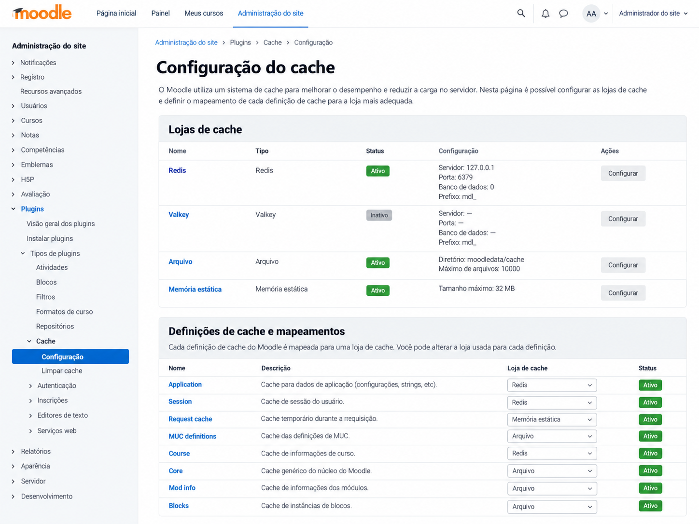



# 12. Cache e performance

Performance no Moodle é um assunto que costuma começar errado. A página está lenta, alguém abre a administração de cache, vê Redis disponível e conclui que o problema está resolvido assim que tudo for jogado para memória. Às vezes melhora mesmo, principalmente quando a instalação ainda usa filesystem lento para caches de aplicação, mas essa melhora pode esconder consulta ruim, callback executado em toda página, observer fazendo trabalho pesado, `get_records()` trazendo meio milhão de linhas ou uma sequência de chamadas N+1 que continuará existindo, apenas um pouco mais silenciosa.

Cache não corrige arquitetura ruim, ele troca trabalho repetido por complexidade de consistência. Em vez de calcular ou buscar uma informação toda vez, você guarda o resultado em algum lugar e o reutiliza, mas a partir desse momento aparece uma pergunta que não existia antes: quando esse resultado deixa de ser válido? Se essa resposta não estiver clara, o cache pode fazer a página ficar mais rápida e o sistema ficar errado, o que é uma troca particularmente ruim em ambiente educacional, financeiro ou acadêmico.

O Moodle tem uma camada própria para esse problema, a Moodle Universal Cache, normalmente chamada de MUC. Ela existe para que o plugin declare que tipo de dado quer armazenar e quais garantias precisa, enquanto a instalação decide qual store atende aquela definição. Isso permite que o mesmo código rode numa máquina de desenvolvimento com cache em arquivo, num servidor com APCu ou num cluster usando Redis, sem o plugin conhecer IP, porta, senha ou tecnologia de armazenamento.

Neste capítulo a ideia não é transformar cache numa lista de métodos `get()` e `set()`, mas entender custo de requisição, invalidação, desenho de chave, distribuição entre nós, consultas ao banco, profiling e medição. Se você terminar o capítulo achando que performance é sinônimo de Redis, alguma coisa ficou faltando.

## 12.1 O que custa caro em uma requisição Moodle

Antes de otimizar uma página, você precisa descobrir onde o tempo está indo. Parece óbvio, mas muita otimização ruim nasce da decisão inversa, primeiro alguém escolhe a tecnologia e depois procura um problema que justifique a escolha.

Uma requisição Moodle já começa com um bootstrap considerável. `config.php` carrega `lib/setup.php`, configuração é lida, subsistemas são preparados, sessão pode ser inicializada, usuário é reconstruído, contexto e permissões podem ser consultados, strings entram em cena e diversos caches internos são utilizados. Isso não significa que o Moodle seja inerentemente lento, significa apenas que adicionar trabalho a uma página que já possui um ciclo de vida completo precisa ser feito com algum respeito pelo custo acumulado.

Banco de dados costuma ser um dos primeiros lugares para olhar, mas não apenas pela quantidade de consultas. Uma consulta que usa índice e devolve cinco linhas pode custar quase nada, enquanto uma única consulta com `LIKE '%texto%'`, `JOIN` mal planejado, ordenação sem índice e milhões de registros pode dominar a requisição inteira. O número bruto de queries é um sinal, não um diagnóstico.

Filesystem também pesa. Ler muitos arquivos pequenos em armazenamento compartilhado, varrer diretórios, carregar arquivos que não deveriam ser carregados ou depender de NFS lento pode transformar uma operação simples em gargalo. Em cluster, latência de rede entre frontend, banco, armazenamento e cache entra na conta mesmo quando cada componente isoladamente parece rápido.

Chamadas externas são ainda mais fáceis de perceber. Se a página chama três APIs e cada uma leva 800 milissegundos, você já perdeu mais de dois segundos antes de renderizar qualquer coisa. Colocar resultado em cache pode ajudar, mas talvez a decisão correta seja mover o trabalho para Task API, especialmente quando o usuário não precisa daquele dado atualizado em tempo real.

Outro custo comum é volume em memória. Buscar cinquenta mil objetos do banco, montar estruturas enormes em PHP, serializar tudo para JSON e depois mandar uma pequena parte para o template é desperdício em várias camadas. A página pode estar lenta porque faz trabalho que nunca será exibido.

Por isso a primeira pergunta de performance não é "qual cache eu uso?", mas "o que esta requisição está fazendo e quanto custa cada parte?".

## 12.2 Moodle Universal Cache

A Moodle Universal Cache foi introduzida para criar uma camada comum de cache no Moodle e evitar que cada componente inventasse sua própria pasta, tabela, array global ou integração direta com Memcached e Redis. A ideia central é simples: o código do plugin trabalha com uma definição de cache, não com a tecnologia física que guarda os dados.

Imagine um plugin que precisa mostrar uma configuração externa calculada a partir de várias tabelas. Você pode declarar um cache chamado `courseconfig` e depois obter uma instância com `cache::make()`.

```php
$cache = cache::make('local_meuplugin', 'courseconfig');

$data = $cache->get($courseid);
if ($data === false) {
    $data = $service->build_course_config($courseid);
    $cache->set($courseid, $data);
}
```

Esse código não sabe se o valor terminou num arquivo, numa região local de memória ou num Redis compartilhado. Essa ignorância é intencional e é uma das melhores características da API.

Também é importante perceber que MUC não é um cache único. A mesma instalação pode ter várias stores configuradas, diferentes definições mapeadas para backends distintos e múltiplas camadas de cache. Dados pequenos e muito acessados podem ficar em memória local, enquanto estruturas maiores podem usar armazenamento diferente. O plugin descreve necessidades, e a administração decide a infraestrutura.

Essa separação é especialmente importante para plugins distribuídos para terceiros. Se você hardcodeia Redis porque no seu servidor ele existe, transferiu para o plugin uma decisão que deveria pertencer à instalação.

## 12.3 db/caches.php

Caches declarados pelo plugin ficam em `db/caches.php`. É ali que você informa ao Moodle o nome da definição, o modo e, quando necessário, características adicionais.

Um exemplo simples seria este.

```php
$definitions = [
    'courseconfig' => [
        'mode' => cache_store::MODE_APPLICATION,
        'simplekeys' => true,
    ],
];
```

O nome `courseconfig` é a área do cache dentro do componente. O componente é inferido pelo local do arquivo, então o par efetivo será algo como `local_meuplugin/courseconfig`.

Depois de adicionar ou alterar definições, atualize a versão do plugin para que o processo de upgrade releia essa configuração. Criar `db/caches.php`, abrir uma página e esperar que a definição apareça sem upgrade é uma boa forma de perder alguns minutos procurando erro que não existe.

A documentação também espera uma string de idioma para a definição, usando o prefixo `cachedef_`.

```
$string['cachedef_courseconfig'] = 'Configuração calculada dos cursos';
```

Isso ajuda a administração do site a entender o que aquela definição representa quando estiver configurando mappings e stores.

## 12.4 Cache definitions

Uma definição de cache não deveria ser tratada como um conjunto de opções para marcar aleatoriamente. Cada propriedade comunica uma expectativa do código para a infraestrutura.

`simplekeys`, por exemplo, informa que suas chaves usam apenas um conjunto simples de caracteres e não precisam ser transformadas pelo cache antes de chegar à store. `simpledata` informa que os valores são escalares ou arrays de escalares e permite evitar parte do custo de serialização. Marcar ambos como `true` porque "parece mais rápido" quando você guarda objetos ou chaves complexas é exatamente o tipo de otimização que compra bug em troca de microganho.

Existem ainda requisitos de identificadores, garantias de persistência, locking, tamanho, TTL, datasource, aceleração estática e possibilidade de store local. Alguns são bastante avançados e deveriam aparecer apenas quando existe uma necessidade concreta.

Um bom começo é declarar o mínimo necessário, medir e evoluir a definição quando o comportamento da aplicação realmente exigir.

## 12.5 Request cache

Request cache vive apenas durante a requisição atual. Quando o PHP termina aquela execução, o cache pode desaparecer, e isso é exatamente o comportamento esperado.

Ele é útil quando uma informação cara pode ser pedida várias vezes dentro da mesma página, mas não faz sentido ou não é seguro reutilizá-la em requisições futuras. Pense numa função chamada por cinco componentes diferentes da página, todos pedindo a mesma estrutura derivada. Sem cache, você calcula cinco vezes. Com request cache, calcula uma vez e reaproveita durante aquele request.

Na definição, o modo é `cache_store::MODE_REQUEST`.

```php
$definitions = [
    'permissionsummary' => [
        'mode' => cache_store::MODE_REQUEST,
    ],
];
```

Conceitualmente ele se parece com cache estático em PHP, mas passa pela infraestrutura de cache do Moodle e pode oferecer recursos adicionais. Mais adiante vamos comparar os dois.

Request cache é também um bom lembrete de que nem todo cache precisa de Redis. Mandar pela rede uma informação que só será reutilizada dentro da mesma requisição pode ser mais caro do que mantê-la localmente.

## 12.6 Session cache

Session cache tem escopo de sessão de usuário. O dado pertence àquela sessão e pode sobreviver entre requisições enquanto a sessão estiver ativa.

Isso serve para informação temporária relacionada à experiência daquele usuário, mas que não deveria ser compartilhada globalmente. O modo é `cache_store::MODE_SESSION`.

```php
$definitions = [
    'wizardstate' => [
        'mode' => cache_store::MODE_SESSION,
    ],
];
```

Não confunda Session cache com o backend de sessão do Moodle. Você pode usar Redis para sessões e também Redis para MUC, mas são responsabilidades distintas. O fato de ambos poderem terminar no mesmo produto não torna as duas APIs equivalentes.

Também não use Session cache para esconder dado funcional importante. Se a continuidade de um processo precisa sobreviver a logout, expiração da sessão, troca de navegador ou retomada no dia seguinte, provavelmente você precisa persistir estado no banco, não tratá-lo como cache.

## 12.7 Application cache

Application cache é compartilhado no escopo da aplicação, portanto diferentes usuários e requisições podem aproveitar os mesmos valores. É o modo mais intuitivo quando pensamos em cache de configuração, metadados, estruturas calculadas ou dados relativamente estáveis.

A definição usa `cache_store::MODE_APPLICATION`.

```php
$definitions = [
    'catalog' => [
        'mode' => cache_store::MODE_APPLICATION,
        'simplekeys' => true,
    ],
];
```

Aqui a estratégia de invalidação fica ainda mais importante. Se um professor altera uma configuração e você deixa uma cópia antiga no cache de aplicação, outros usuários podem continuar vendo o estado anterior por tempo indefinido.

Application cache é poderoso justamente porque atravessa requisições, mas isso significa que erro de invalidação também atravessa requisições.

## 12.8 Modes

Request, Session e Application não são apenas opções de armazenamento, são contratos de escopo.

Request significa "vale para esta execução". Session significa "vale para esta sessão de usuário". Application significa "pode ser compartilhado por toda a aplicação". Escolher modo errado pode produzir desde desperdício de performance até vazamento de estado entre usuários.

Se você coloca dado dependente do usuário em Application cache e esquece de colocar o usuário na chave, acabou de criar uma forma muito eficiente de entregar a informação de uma pessoa para outra. Se coloca dado global em Session cache, terá cópias repetidas para milhares de usuários e praticamente nenhum reaproveitamento.

A pergunta correta é sempre "quem pode reutilizar este valor e até quando ele continua correto?". A resposta normalmente aponta o modo.

## 12.9 Keys

Chave de cache parece detalhe até você precisar invalidar uma entrada específica ou descobrir por que duas informações diferentes estão colidindo.

Uma chave precisa representar todas as dimensões que fazem o valor variar. Se o resultado depende de `courseid` e `lang`, uma chave que usa apenas `courseid` está incompleta. Se depende de versão de configuração, grupo e papel do usuário, isso precisa aparecer de alguma forma no desenho.

Não significa concatenar qualquer coisa sem pensar.

```php
$key = $courseid . ':' . $USER->id . ':' . time();
```

Colocar `time()` na chave, por exemplo, praticamente elimina qualquer chance de hit e transforma o cache em depósito de lixo. Chave não serve para garantir "sempre novo", serve para identificar uma versão reutilizável de um valor.

Também cuide de cardinalidade. Um cache global com uma entrada enorme por usuário, curso, grupo, idioma e dia pode gerar milhões de chaves. O backend pode até suportar, mas custo de memória, purge e aquecimento muda completamente.

## 12.10 Cache stores



Store é a implementação física que guarda os valores. Moodle possui tipos de plugin específicos para isso, como `cachestore`, e a instalação pode ter diferentes stores configuradas e mapeadas para definições distintas.

O desenvolvedor do plugin não deveria escolher a store em código normal. Seu trabalho é descrever o cache. O administrador conhece topologia, memória disponível, cluster, latência e requisitos operacionais, portanto ele está em posição melhor para decidir onde cada definição deve morar.

Essa separação também permite que uma instalação pequena continue simples. Não faz sentido exigir Redis para um plugin que guarda vinte chaves de configuração por dia. Da mesma forma, uma instalação com muitos frontends pode precisar de uma store compartilhada porque cache em arquivo local não seria coerente entre nós.

Cache API é a fronteira entre essas duas responsabilidades.

## 12.11 Redis

Redis é uma escolha comum para MUC porque oferece acesso em memória, compartilhamento entre múltiplos frontends e baixa latência quando está bem posicionado na arquitetura. Moodle possui store própria para Redis, então o caminho normal é configurar a infraestrutura na administração e mapear definições para ela.

No plugin, nada muda.

```php
$cache = cache::make('local_meuplugin', 'catalog');
```

Se amanhã o administrador trocar Redis por outra store compatível, seu código continua funcionando.

Também não confunda "Redis está em memória" com "Redis é sempre mais rápido". Se o frontend está na mesma máquina de um SSD local e o Redis está do outro lado de uma rede lenta, determinadas cargas podem ter resultado diferente do esperado. Em instalações grandes, latência de rede, número de conexões, tamanho dos objetos, serialização e política de eviction precisam ser medidos.

Outro detalhe é que cache não deveria disputar espaço com sessão sem planejamento operacional. Sessão perdida derruba experiência de usuário; cache perdido deveria apenas causar miss e reconstrução. Mesmo quando ambos usam Redis, vale pensar em isolamento por instância, database, prefixo ou política de infraestrutura conforme o cenário.

## 12.12 Valkey

Valkey apareceu como continuação open source compatível com Redis OSS 7.2 e mantém o protocolo RESP utilizado por clientes Redis. Na prática, isso faz com que muitos clientes existentes consigam conversar com Valkey sem mudança de código, e por isso ele passou a aparecer em ambientes onde antes havia Redis.

Para o plugin Moodle, a regra continua exatamente a mesma: não escreva integração específica com Valkey para cache. Use MUC.

Hoje o Moodle não possui um modo de cache chamado `VALKEY_APPLICATION` nem uma API paralela. O caminho normalmente passa pela store Redis e pelo cliente PHP compatível, e por isso a compatibilidade real depende das versões de Moodle, extensão `phpredis`, comandos utilizados e versão do servidor Valkey. Como Valkey mantém compatibilidade de protocolo com Redis OSS 7.2, muitos cenários funcionam de forma transparente, mas isso precisa ser validado na infraestrutura onde será usado.

Esse é outro motivo para o plugin não conhecer backend. Se você encapsulou cache corretamente, a troca entre Redis e uma alternativa compatível é problema operacional, não refatoração de regra de negócio.

## 12.13 Cache invalidation

A parte difícil de cache não é salvar valor, é saber quando ele ficou velho.

Imagine um plugin que calcula o total de inscrições ativas de um curso e guarda o resultado. O primeiro acesso faz a consulta, recebe 812, grava no cache e todos os acessos seguintes ficam rápidos. Até aí ótimo. Depois alguém matricula o usuário 813.

Se nada invalidar a entrada, seu cache continua respondendo 812 com enorme eficiência.

Por isso a estratégia de invalidação precisa nascer junto com o cache. Se o dado muda numa única função controlada pelo seu plugin, essa função pode apagar ou atualizar a entrada. Se pode mudar por várias rotas, talvez um Event ou Hook ofereça um ponto de invalidação melhor. Se depende de configuração versionada, uma chave com revisão pode evitar a necessidade de sair caçando cópias antigas.

Cache correto não é o que tem mais hits, é o que só devolve dado antigo quando isso foi deliberadamente aceito.

## 12.14 Purge

Purge remove conteúdo de cache e força reconstrução. Moodle permite purge em diferentes níveis, desde uma entrada específica até limpeza ampla.

O problema é transformar "purge all caches" em solução padrão. Quando o plugin só precisa invalidar o curso 42, limpar todos os caches do site é como reiniciar o servidor para atualizar uma variável.

Prefira operações específicas.

```php
$cache->delete($courseid);
```

Se a mudança invalida a definição inteira, `purge()` pode fazer sentido.

```php
$cache->purge();
```

Moodle também possui mecanismos de invalidação por evento de cache com `cache_helper::purge_by_event()`, que são anteriores à Events API e permitem que várias definições declarem dependência de uma mesma sinalização. Não confunda isso com eventos de domínio discutidos no Capítulo 10.

Purge amplo tem custo de reconstrução. Em site grande, apagar tudo pode provocar uma tempestade de misses logo depois, exatamente quando todos os usuários começam a recalcular os mesmos dados.

## 12.15 Por que cachear sem estratégia de invalidação causa bugs

Cache sem invalidação cria um tipo particularmente desagradável de bug porque ele não aparece sempre. O registro está certo no banco, a interface mostra valor antigo, limpar caches corrige temporariamente e alguém conclui que "o Moodle estava bugado".

Na verdade a aplicação passou a ter duas fontes de verdade, o dado original e uma cópia sem ciclo de vida definido.

Esses bugs também são difíceis de reproduzir. No ambiente de desenvolvimento você limpa caches constantemente, altera código e reinicia processos, então tudo parece correto. Em produção a entrada pode sobreviver durante horas ou dias e só alguns usuários atingem a combinação exata de estado antigo.

Quando alguém diz "se der problema manda limpar cache", normalmente está descrevendo uma ausência de arquitetura, não uma estratégia de cache.

## 12.16 TTL não deveria ser sua primeira solução

TTL define por quanto tempo uma entrada pode permanecer válida antes de expirar. É tentador porque evita pensar em invalidação: "vou guardar por cinco minutos e pronto".

A própria documentação do MUC desencoraja usar TTL como primeira escolha e recomenda preferir invalidação orientada a mudanças sempre que possível. Nem todas as stores tratam TTL da mesma forma e, quando o backend não possui suporte nativo adequado, o custo pode ser maior.

Além disso, TTL responde "quando vou jogar fora", não "quando deixou de ser correto". Se uma matrícula foi cancelada um segundo depois do cache ser criado e o TTL é de uma hora, você deliberadamente aceitou até 59 minutos e 59 segundos de dado velho.

Às vezes isso é perfeitamente aceitável. Cotação externa, ranking não crítico, conteúdo de dashboard e dados analíticos podem tolerar atraso. A diferença é tomar a decisão conscientemente.

## 12.17 Versioned caches

Nas versões modernas, MUC oferece operações versionadas como `set_versioned()` e `get_versioned()`, especialmente úteis em caches distribuídos e com múltiplas camadas.

A ideia é associar o valor a uma versão conhecida do dado. Se a versão armazenada é antiga, o cache não é aceito como atual. Isso ajuda a evitar parte dos problemas de invalidação entre frontends localizados, porque mudar a revisão faz a próxima leitura procurar a versão correta em vez de confiar numa chave antiga.

Esse mecanismo é particularmente interessante para estruturas grandes e caras, porque permite trabalhar com uma única versão relevante em vez de acumular chaves antigas apenas para representar revisões.

Não use versão aleatória. Ela precisa avançar quando a dependência muda e ser compartilhada pelos processos que precisam concordar sobre o estado atual.

## 12.18 Static cache

Static cache é o velho e útil padrão de guardar resultado numa variável estática durante a execução PHP.

```php
function get_expensive_data(int $courseid): array {
    static $cache = [];

    if (!array_key_exists($courseid, $cache)) {
        $cache[$courseid] = build_expensive_data($courseid);
    }

    return $cache[$courseid];
}
```

Isso pode ser ótimo quando a função é chamada muitas vezes na mesma requisição e o valor nunca precisa atravessar requests. O custo é quase zero e não existe ida a store externa.

O problema aparece quando a função passa a depender de mais coisas e a chave continua sendo apenas `courseid`, ou quando um processo longo altera o dado no meio da execução e a variável estática continua devolvendo a fotografia antiga.

Static cache é simples, mas simplicidade não elimina necessidade de pensar em validade.

## 12.19 MUC versus static variables

Não existe vencedor universal entre MUC e variável estática. Eles resolvem escopos diferentes.

Se o valor só precisa ser reaproveitado dentro da requisição atual, uma variável estática ou Request cache pode ser suficiente. Se precisa atravessar requisições ou ser compartilhado entre frontends, MUC é a abstração adequada.

MUC também oferece administração, mapeamento para stores, invalidação, múltiplos níveis e contratos que uma variável estática não oferece. Por outro lado, passar por uma store compartilhada para evitar uma função de 20 microssegundos pode custar mais que recalcular.

A pergunta não é "qual API é mais moderna?", mas "qual é o escopo de reutilização e qual é o custo que estou evitando?".

## 12.20 Static acceleration

MUC pode usar `staticacceleration` para manter dentro da própria requisição uma cópia dos itens já lidos ou escritos numa definição. Isso evita repetir acessos à store quando o mesmo item é solicitado várias vezes no request.

```php
$definitions = [
    'catalog' => [
        'mode' => cache_store::MODE_APPLICATION,
        'staticacceleration' => true,
        'staticaccelerationsize' => 100,
    ],
];
```

É uma otimização interessante, mas usa memória. Se você acessa milhares de chaves enormes numa requisição, acelerar tudo estaticamente pode transformar ganho de latência em pressão de RAM.

Mais uma vez, não marque opção porque "parece melhor". Meça o padrão de acesso.

## 12.21 cachedir, localcachedir e caches localizados

Em instalações com vários frontends, diferença entre cache compartilhado e cache local ao nó deixa de ser detalhe.

```php
$CFG->cachedir deve ser compartilhado quando o cluster depende daquele conteúdo comum, enquanto $CFG->localcachedir foi pensado para dados que podem ficar locais em cada frontend. Na Cache API existe ainda canuselocalstore, que informa que determinada definição pode funcionar com store local sem comprometer correção.
```

Isso pode reduzir latência de rede, mas cria um problema clássico: como um nó sabe que outro nó mudou o dado? A documentação moderna do MUC discute caches localizados, chaves versionadas e camadas local + compartilhada justamente por causa dessa dificuldade.

Em escala maior, um único cache central pode virar gargalo. Em escala menor, distribuir cache sem necessidade pode aumentar complexidade. Arquitetura boa é a que corresponde ao tamanho real do problema.

## 12.22 Cache em múltiplas camadas

Uma estratégia eficiente em cluster é combinar cache local rápido com cache compartilhado. Se o item existe localmente, a leitura é muito barata. Se não existe, a camada compartilhada pode fornecer o valor sem obrigar cada frontend a recalcular sozinho.

A documentação do MUC usa exemplos como APCu local combinado com Redis compartilhado para dados muito acessados e relativamente pequenos. Esse desenho reduz latência e evita que novos frontends recém-subidos ataquem banco e filesystem simultaneamente durante aquecimento.

Mas a vantagem só aparece se a definição aceitar localização com segurança. Colocar dado que precisa de invalidação imediata em caches independentes sem versão ou estratégia de coerência é fabricar inconsistência distribuída.

## 12.23 Cache stampede

Cache stampede acontece quando uma entrada cara expira ou é purgada e muitos processos percebem o miss ao mesmo tempo. Todos começam a reconstruir o mesmo valor e, durante alguns segundos, o cache que deveria proteger o banco faz o oposto: concentra dezenas de consultas pesadas simultâneas.

MUC possui opções relacionadas a locking para cenários em que a computação é realmente cara, mas a própria documentação recomenda cuidado porque locking adiciona custo e complexidade. Quando utilizado, o processo que consegue o lock deve verificar novamente se outro worker já preencheu o cache antes de recalcular.

Outra estratégia é versionamento, pré-aquecimento controlado ou renovação assíncrona quando o domínio permite servir dado levemente antigo por algum tempo.

Não existe uma receita única, mas existe um sintoma comum: tudo fica lento logo depois de purge ou deploy.

## 12.24 N+1 queries

N+1 é um dos gargalos mais comuns em código que parece perfeitamente razoável quando lido linha por linha.

```php
$courses = $DB->get_records('course', ['visible' => 1]);

foreach ($courses as $course) {
    $course->teachers = $DB->get_records_sql(
        'SELECT ... WHERE courseid = ?',
        [$course->id]
    );
}
```

Uma consulta carrega cursos e depois uma nova consulta acontece para cada curso. Com dez cursos talvez ninguém perceba. Com dois mil, a página executa duas mil e uma queries.

Cache pode reduzir parte disso, mas normalmente a correção está em desenhar consulta, agrupamento ou pré-carregamento melhor. Se cada item precisa de dado relacionado, busque conjuntos em lote e organize em memória.

Cachear N+1 é parecido com colocar turbo num carro com freio de mão puxado. Talvez ande mais rápido, mas o problema principal continua ali.

## 12.25 Recordsets - retomada do Capítulo 5

Quando você precisa percorrer muitos registros, recordset evita carregar tudo de uma vez em memória. Isso não faz a consulta magicamente barata, mas muda o perfil de consumo.

```php
$rs = $DB->get_recordset_sql($sql, $params);

foreach ($rs as $record) {
    process_record($record);
}

$rs->close();
```

Para relatórios, tarefas e rotinas de manutenção, essa diferença é enorme. `$DB->get_records_sql()` precisa materializar o conjunto inteiro em array, enquanto recordset permite processar progressivamente.

Mesmo assim, cuidado com N+1 dentro do `foreach`. Trocar `get_records()` por recordset e depois fazer três queries por linha apenas mudou o lugar do problema.

## 12.26 Paginação

Se a interface mostra cinquenta registros, buscar cinquenta mil para depois recortar em PHP é desperdício. A DML API permite limitar quantidade e offset, e a consulta deveria trazer somente o que a página realmente precisa.

Paginação melhora tempo de banco, transferência, memória PHP, serialização e renderização. É uma das otimizações mais simples e mais ignoradas.

Também pense no custo do `COUNT(*)` quando o dataset é enorme e os filtros são complexos. Algumas telas precisam do total exato, outras só precisam saber se existe próxima página. Interface pode influenciar profundamente custo de backend.

Quando você controla produto e arquitetura, não trate UX e performance como equipes que nunca conversam.

## 12.27 Índices - retomada do Capítulo 5

Índice existe para evitar que banco precise examinar uma quantidade absurda de linhas para responder consultas frequentes. Isso não significa criar índice para todo campo que aparece num `WHERE`.

Ordem das colunas em índice composto importa, seletividade importa e operações como funções sobre coluna podem impedir uso eficiente. Um índice que ajuda leitura também custa espaço e trabalho em `INSERT`, `UPDATE` e `DELETE`.

Use `EXPLAIN`, observe plano real e alinhe índice às consultas críticas. "Coloquei índice e parece mais rápido" é uma conclusão fraca para um sistema que você pretende manter por anos.

Em plugin Moodle distribuído, lembre ainda que schema precisa funcionar nos bancos suportados. Não introduza otimização específica de um banco sem avaliar compatibilidade.

## 12.28 Evitando get_records() gigantes

`get_records()` é confortável e justamente por isso aparece em código que traz muito mais dados do que deveria.

```php
$all = $DB->get_records('meuplugin_log');
```

Em tabela pequena funciona. Em tabela com vinte milhões de registros, isso pode estourar memória antes de você chegar ao segundo `foreach`.

Pergunte primeiro se precisa de todos. Normalmente a resposta é não. Filtre por curso, usuário, período, status ou lote. Se realmente precisa atravessar o conjunto inteiro, use recordset e processamento incremental.

Outro ponto é selecionar apenas colunas necessárias. Buscar campos grandes de texto e blobs quando a tela usa apenas `id`, `status` e `timemodified` desperdiça I/O e memória.

## 12.29 Carregamento preguiçoso

Lazy loading significa adiar trabalho até o momento em que ele realmente é necessário. É uma técnica útil quando uma página possui caminhos que nem sempre são usados.

Imagine uma classe que, no construtor, carrega curso, usuários, grupos, arquivos e configuração externa, mesmo que alguns métodos precisem apenas do `courseid`. Cada instância paga o custo completo.

Um desenho mais cuidadoso pode carregar dependências caras somente quando o método correspondente for chamado, e depois guardar o resultado localmente durante a vida do objeto.

Lazy loading não deveria virar desculpa para esconder query em qualquer getter. Se você percorre mil objetos e cada `get_teacher()` dispara SQL, acabou de criar N+1 elegante e orientado a objetos.

## 12.30 settings.php e lazy loading

`settings.php` merece atenção especial porque ele pode ser carregado durante construção da árvore administrativa, e consultas ou chamadas externas colocadas ali podem custar caro em páginas que nem têm relação direta com a configuração do plugin.

Evite montar selects gigantes consultando tabela inteira toda vez que o arquivo é processado. Evite chamar API externa para descobrir opções. Evite fazer trabalho apenas porque o administrador talvez abra uma configuração.

Quando possível, use páginas próprias, callbacks sob demanda, autocomplete e carregamento dinâmico. Configuração administrativa não precisa trazer dez mil cursos para um `<select>` no carregamento inicial.

Esse é um ótimo exemplo de performance que cache não deveria mascarar. O problema pode estar em fazer a operação cedo demais.

## 12.31 Performance de callbacks

Callbacks globais podem executar muito mais vezes do que você imagina. Um callback de navegação, por exemplo, pode ser chamado em várias páginas e para muitos usuários. Colocar consulta pesada ali transforma um recurso pequeno do plugin em imposto sobre o site inteiro.

Antes de fazer trabalho, verifique contexto e condições baratas que permitam sair cedo.

```php
if (!$PAGE->course || $PAGE->course->id == SITEID) {
    return;
}
```

Depois disso, só consulte o que realmente precisa. E se o resultado for repetido e estável, considere cache adequado.

O melhor callback é frequentemente aquele que retorna rápido quando não tem nada para fazer.

## 12.32 Performance de lib.php

No Capítulo 3 vimos por que `lib.php` deve permanecer pequeno. Performance é mais uma razão.

Esse arquivo pode ser incluído pelo Moodle em diversos fluxos para descobrir callbacks do componente. Se você executa lógica no escopo global de `lib.php`, ela pode rodar apenas porque o Moodle precisou saber se determinada função existe.

Nada de consulta ao banco fora de função, inicialização de cliente HTTP, leitura pesada de configuração ou montagem de objetos no topo do arquivo.

`lib.php` deve declarar callbacks que o tipo de plugin realmente exige. Regra de negócio fica em classes e só executa quando algum fluxo a chama intencionalmente.

## 12.33 Performance de observers

Observer de Event precisa ser rápido. Evento acontece dentro de um fluxo já em andamento e o observer faz parte do custo percebido por quem disparou aquela ação.

Se um observer de `course_module_created` chama API externa, processa arquivos e recalcula centenas de registros, criar uma atividade pode levar segundos ou falhar porque um fornecedor externo está fora do ar.

A solução normalmente é recolher identificadores, registrar estado mínimo e enfileirar Adhoc Task, como vimos no Capítulo 11.

Também tenha cuidado com observer muito genérico. Escutar evento frequente e depois descobrir, após cinco queries, que não havia nada a fazer é uma excelente maneira de degradar o site inteiro.

## 12.34 Performance de Hooks

Hooks podem estar ainda mais próximos de caminhos críticos porque alguns existem justamente para permitir interferência antes ou durante determinada operação. Isso significa que callback lento pode bloquear a operação principal.

Use as mesmas regras: condições baratas primeiro, nenhuma chamada externa síncrona sem necessidade, nada de consultas repetidas por item e atenção a Hooks que disparam em listagens ou ciclos internos.

Hook é ponto de extensão, não licença para transformar toda requisição em pipeline do seu plugin.

## 12.35 APIs externas e cache

Dados vindos de API externa são candidatos comuns a cache porque rede é cara e instável. Mesmo assim, existem três perguntas importantes.

Primeiro, quanto tempo o dado pode ficar velho? Segundo, o usuário precisa esperar a API ou podemos atualizar em background? Terceiro, o cache contém informação global ou específica de usuário e autorização?

Se uma tabela de moedas pode ficar cinco minutos atrasada, cache com política de atualização faz sentido. Se o dado é saldo financeiro do usuário, talvez você precise consistência muito maior. Se o endpoint demora cinco segundos mas não é necessário para concluir a ação, Task API pode ser melhor do que cachear resposta síncrona.

Não deixe uma decisão de performance degradar regras de negócio.

## 12.36 Session locking é diferente de Lock API

No Capítulo 11 usamos Lock API para impedir que dois workers executem a mesma regra de negócio ao mesmo tempo. Session locking resolve outro problema: enquanto uma requisição autenticada mantém a sessão aberta para escrita, outra requisição da mesma sessão pode precisar esperar o lock ser liberado. Isso evita duas requisições gravando estado de sessão simultaneamente, mas também pode transformar chamadas que pareciam paralelas em uma fila invisível.

O efeito aparece bastante em AJAX. A tela dispara três requisições ao mesmo tempo, a primeira entra em uma operação lenta mantendo a sessão bloqueada e as outras duas ficam paradas antes mesmo de chegar ao código que você está medindo. No navegador parece que a API B levou cinco segundos, mas na prática quatro segundos e meio foram apenas espera pelo lock da sessão criado pela API A.

## 12.37 Requisição longa segurando sessão vira gargalo global daquele usuário

Chamadas externas, geração de arquivos, relatórios grandes e downloads preparados em PHP são especialmente perigosos quando continuam segurando a sessão sem precisar alterá-la. O banco pode estar rápido, o cache pode estar quente e ainda assim a interface parece travada porque todas as outras requisições autenticadas daquele usuário aguardam a requisição longa terminar.

Isso também explica por que dois usuários podem perceber comportamentos completamente diferentes no mesmo minuto. O lock é da sessão, não uma trava geral do site, portanto um usuário preso em uma requisição lenta pode sentir a interface congelada enquanto outro continua navegando normalmente.

## 12.38 Liberando a sessão quando não haverá mais escrita

Quando o código já terminou tudo o que precisava alterar na sessão e vai executar uma etapa longa que não depende mais dela, \core\session\manager::write_close() grava o estado pendente e libera o lock para que outras requisições da mesma sessão possam prosseguir.

```php
\core\session\manager::write_close();

// A partir daqui, execute processamento longo que não precisa mais alterar a sessão.
$report = $service->generate_large_report();
```

Não chame write_close() no início de qualquer página como otimização automática. Depois de liberar a sessão, alterações posteriores em $SESSION não devem ser tratadas como se ainda fossem persistidas normalmente, e código chamado mais adiante pode legitimamente precisar desse estado. A decisão precisa acontecer quando você conhece o fluxo e sabe que a parte restante é independente da escrita de sessão.

Session locking também não substitui Lock API. Fechar a sessão permite concorrência entre requisições do mesmo usuário; não impede dois usuários, duas tasks ou dois workers de processarem o mesmo registro. Quando o recurso compartilhado é do domínio do plugin, continue usando Lock API ou outra garantia transacional apropriada.

## 12.39 Profiling

Quando a página continua lenta e a causa não é óbvia, profiling permite descobrir onde PHP realmente está gastando tempo e memória.

Moodle possui integração com ferramentas do padrão XHProf e documentação específica de profiling. Esse tipo de ferramenta mostra quantidade de chamadas, tempo inclusivo e exclusivo de funções, memória e hierarquia de execução.

É muito melhor descobrir que uma função foi chamada 18 mil vezes do que passar uma tarde "otimizando" template que representa 1% do tempo total.

Xdebug também possui recursos de profiling, mas normalmente tem custo maior e não é recomendado para produção. Ferramenta precisa combinar com ambiente e objetivo.

## 12.40 Debug performance info

Durante desenvolvimento, informações de performance exibidas pelo próprio Moodle ajudam a enxergar tempo de geração, memória e quantidade de consultas ao banco. Não substituem profiler, mas são excelentes para perceber regressões rapidamente.

Se uma mudança simples transforma uma página de 80 para 900 queries, você não precisa de análise forense para saber que algo deu errado.

Use DEBUG_DEVELOPER e informações de performance em ambiente apropriado, não exponha detalhes internos a usuários em produção. Debug é ferramenta de desenvolvimento, não decoração de rodapé.

Também compare cenários equivalentes. Primeira requisição depois de purge naturalmente pode ser mais cara por causa do aquecimento de caches.

## 12.41 EXPLAIN no banco

`EXPLAIN` mostra como o banco pretende executar uma consulta. Ele ajuda a identificar table scan, índice utilizado, ordem de joins, estimativa de linhas e operações caras.

Pegue a SQL real gerada pela página lenta, substitua parâmetros com cuidado num ambiente de teste e analise o plano. Em PostgreSQL, `EXPLAIN ANALYZE` executa a consulta e mostra tempos reais, portanto use com responsabilidade principalmente em comandos que alteram dados ou queries pesadas. MySQL e MariaDB possuem recursos equivalentes de análise de plano.

O objetivo não é decorar todos os campos do plano, mas responder perguntas concretas. O banco está usando o índice que eu esperava? Está lendo milhões de linhas para devolver vinte? A ordenação está criando operação cara? O join começa pela tabela errada?

Índice sem leitura do plano vira tentativa e erro.

## 12.42 Medindo hit e miss

Cache só faz sentido se houver reutilização suficiente para pagar seu custo. Um cache que recebe um milhão de `set()` e quase nenhum `get()` bem-sucedido está consumindo memória e I/O sem benefício proporcional.

Em infraestrutura com Redis ou Valkey, métricas de hit, memória, eviction, conexões e latência ajudam a entender comportamento. Dentro do Moodle, a configuração de cache e ferramentas administrativas mostram stores e mappings, enquanto observabilidade externa pode completar a visão.

Não analise apenas percentual de hit global. Uma definição crítica pode ter comportamento ruim escondido por outra definição muito acessada.

E lembre que hit alto também não prova correção. Um cache incorreto pode ter 99,9% de hit enquanto entrega dado velho com eficiência impressionante.

## 12.43 Serialização também custa

Quando você guarda objeto grande em cache, ele precisa ser transformado em representação armazenável e depois reconstruído. Dependendo da store e da definição, serialização e transferência podem custar mais do que recalcular um valor simples.

Isso aparece especialmente quando alguém decide cachear um objeto enorme "para evitar uma query" que devolvia cinco colunas em microssegundos.

`simpledata` existe justamente para permitir otimizações quando os valores são simples, mas a regra mais importante é reduzir dado. Cacheie a informação necessária, não um grafo inteiro de objetos por conveniência.

Menos bytes significam menos memória, menos rede, menos serialização e purge mais barato.

## 12.44 Cache não substitui índice

É comum ver consulta de três segundos "resolvida" por cache. O primeiro usuário continua pagando três segundos, qualquer purge devolve o problema e mudanças frequentes fazem a página oscilar entre rápida e lenta.

Se a consulta é intrinsecamente ruim, corrija a consulta. Depois avalie se cache ainda traz benefício.

Cache é excelente para evitar repetir trabalho correto e caro. Não deveria ser curativo para SQL que lê tabela inteira porque faltou índice composto.

## 12.45 Cache não substitui Task API

Outro erro é cachear resultado de operação que deveria ser pré-processada em background. Um relatório que leva dois minutos para calcular e muda uma vez por noite talvez devesse ser gerado por Scheduled Task e servido pronto, em vez de depender do primeiro usuário da manhã para aquecer cache.

Da mesma forma, uma integração externa pesada pode atualizar estado local de tempos em tempos, permitindo que páginas consultem banco rapidamente.

Cache reduz repetição. Task muda o momento da execução. São ferramentas diferentes e muitas arquiteturas boas usam as duas juntas.

## 12.46 Medir antes de otimizar

Otimização sem medição produz muito código estranho para ganhos que ninguém consegue provar.

Antes de mudar, capture tempo, queries, memória, volume e cenário. Depois aplique uma alteração e compare exatamente o mesmo fluxo.

Se você trocou três coisas ao mesmo tempo, não sabe qual ajudou. Se mediu com caches quentes antes e caches frios depois, a comparação não vale. Se testou com dez registros e produção tem dez milhões, o resultado pode ser completamente diferente.

Performance é engenharia experimental. Hipótese, medição, mudança, nova medição.

E existe um detalhe que pouca gente gosta de ouvir: às vezes a página de 400 ms já está boa. Gastar três dias para chegar em 360 ms pode ser tecnicamente divertido e economicamente inútil.

## 12.47 Uma metodologia prática para página lenta

Quando eu pego uma página lenta, começo tentando separar o tempo em categorias.

Primeiro olho quantidade e duração de queries. Se existe N+1 ou consulta claramente cara, resolvo isso antes de pensar em Redis. Depois observo memória e tamanho dos conjuntos carregados. Em seguida procuro chamadas externas, filesystem, callbacks, observers e Hooks que executam naquele fluxo.

Só depois pergunto se existe trabalho repetido que realmente merece cache. Quando merece, defino escopo, chave, invalidação e tolerância a dado antigo antes de escrever `cache::make()`.

Se ainda não ficou claro, profiler entra em cena. E se SQL é suspeita, `EXPLAIN` deixa de ser opcional.

Esse processo parece mais lento do que instalar Redis, mas normalmente economiza tempo porque você corrige o gargalo verdadeiro.

## 12.48 Exercício - receber uma página lenta e identificar os gargalos

Crie ou receba um plugin fictício com uma página de relatório propositalmente ruim. Ela deve carregar todos os cursos com `get_records()`, executar uma consulta adicional por curso para contar usuários, buscar uma configuração externa por HTTP dentro do loop, montar uma lista completa e só depois mostrar os primeiros cinquenta itens.

Adicione ainda um callback de navegação que executa consulta desnecessária em todas as páginas e um cache de Application mal desenhado que usa apenas `courseid` como chave, embora o resultado também varie por idioma.

Primeiro meça o cenário sem corrigir nada. Registre tempo total, número de queries, memória e quantidade de chamadas externas. Depois ataque um gargalo por vez.

Substitua N+1 por consulta em lote ou agregação adequada. Implemente paginação no banco. Se houver processamento de conjunto grande, avalie recordset. Revise índices com `EXPLAIN`. Tire chamada externa do loop e decida se ela deve ser cacheada ou processada por Task. Faça o callback retornar cedo quando não for aplicável.

Depois corrija o cache. Defina modo adequado, chave que represente todas as dimensões do valor e estratégia de invalidação. Compare resultado com cache frio e quente, porque olhar apenas o segundo acesso produz uma visão incompleta.

Como etapa final, configure uma store Redis numa instalação de teste e repita os números. A pergunta não é "Redis deixou mais rápido?", mas "qual parte ficou mais rápida e o gargalo principal mudou de lugar?".

Se você conseguir responder isso com números, o exercício cumpriu o objetivo.

## 12.49 O modelo mental que precisa ficar

Performance em Moodle é resultado da soma de banco, PHP, filesystem, rede, cache, volume de dados e pontos de extensão executados ao longo da requisição. MUC resolve reutilização de dados calculados, não todos esses problemas.

Request cache serve ao request. Session cache serve à sessão. Application cache compartilha estado reutilizável pela aplicação. Store é infraestrutura e deveria ser escolhida pela instalação, não hardcodeada pelo plugin. Redis e Valkey podem participar da arquitetura, mas continuam sendo backend, não API de negócio.

N+1 se corrige pensando em acesso a dados. Conjunto grande se resolve com filtros, paginação e recordsets. Consulta lenta pede índice e `EXPLAIN`. Observer pesado pode pedir Task. Callback global precisa retornar cedo. Cache exige invalidação. E qualquer otimização precisa de medição antes e depois.

Se eu tivesse que deixar uma única regra seria esta: não cacheie porque algo está lento, descubra por que está lento e só use cache quando reutilizar o resultado for realmente parte da solução.

## Referências técnicas consultadas

* Moodle PHP Documentation. core\session\manager::write_close(), Moodle 5.0. https://phpdoc.moodledev.io/5.0/
* Moodle Developer Resources. Cache API, documentação atual das versões 5.0 e 5.2. Conceitos de MUC, `db/caches.php`, modos Request, Session e Application, definições, stores, `staticacceleration`, `canuselocalstore`, TTL, locking, caches localizados e caches versionados.
* Moodle `config-dist.php`. Configuração de `cachedir`, `localcachedir`, diretórios compartilhados em cluster, cache configuration path e exemplos atuais de sessão Redis.
* Moodle Developer Resources. Profiling PHP. Integração com ferramentas do padrão XHProf e orientação sobre Xdebug em ambientes de produção.
* Valkey Documentation. RESP e guia de migração a partir de Redis OSS. Compatibilidade de protocolo e comportamento de clientes Redis com Valkey em versões compatíveis.


